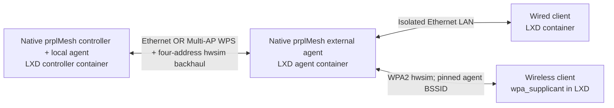

# Controller–standard-agent baseline

This experiment runs the pinned native prplMesh controller and a normal native
prplMesh agent, without EMOSA or OpenSync in their protocol/data path. It is an
observed interoperability baseline for these builds, not certification or an
assertion that every EasyMesh device always works.

The [retained report](../../doc/evaluation/peer-baseline.md) records 14 selected functional
passes per backhaul mode under acceptance version 2. Earlier traffic checks
missed an agent reset loop; the final selections use the native HAL fix and
stricter operational/stability checks described below. Preliminary passes and
failed attempts remain in the history. Native shutdown still aborts.

For the separate candidate HAL experiment and a wired sole-fronthaul policy,
follow [native compatibility](../../doc/guides/native-compatibility.md). It uses
isolated build directories and temporary libraries with restoration. The pinned
baseline artifacts and the default two-BSS policy remain the reference above.

## Acceptance scope

Both Ethernet and mac80211_hwsim wireless backhaul must pass:

1. Fresh agent discovery and provisioning, captured independently at the
   endpoints. The initial agent SSID/key must differ from the controller's
   policy. Verify the resulting controller device/radio/BSS inventory and
   hostapd/driver configuration, not merely a process-ready message.
2. For wireless, obtain backhaul credentials using Multi-AP WPS with an initially
   empty wpa_supplicant configuration. Verify the backhaul association and
   four-address link. Distinguish this WPS bootstrap from IEEE 1905 WSC radio
   provisioning. No management Ethernet path may reach the controller.
3. A wired client behind the agent and a separate wireless wpa_supplicant client
   must both reach an endpoint behind the controller. Pin the wireless client
   to the agent BSSID. Check authentication, interface-bound ping and a fresh
   application response. Test wrong-key rejection separately.
4. Per backhaul mode, retain five clean-start attempts, three agent restarts,
   three controller restarts and three temporary backhaul interruptions. Report
   every attempt, including failures, with a 120-second onboarding/recovery
   budget and 30-second client-association budget. Never discard a failed attempt
   because a subsequent retry passed. Retain native shutdown results separately.

Acceptance version 2 requires current `OPERATIONAL` state from both native agent
roots and their fronthauls. After the client checks, require 30 continuous seconds
of healthy state, live APs, exact inventory and backhaul, then fresh client probes
again. A regression during this observation fails the attempt immediately.
Outage recovery also requires 30 continuous healthy seconds inside its
120-second readiness limit. This prevents a brief traffic/inventory recovery
from passing before delayed topology updates settle.

The dedicated `emosa-lab` VM owns four new unprivileged containers:
`em-baseline-controller`, `em-baseline-agent`, `em-baseline-wired` and
`em-baseline-wifi`. Existing EMOSA and native OpenSync containers remain stopped.
All setup Ethernet is removed before measured runs. A separate isolated bridge
connects the wired client to the agent's LAN; it has no link to the controller.
The host and physical pods are not used as test endpoints.

Use only synthetic lab credentials. Native debug logs and packet captures can
contain them; retain raw execution artifacts privately under `.lab/peer-baseline`
and review before publication. The final report must identify package/image,
kernel, native binary and harness revisions. Clean process exit is a separate
result: this native build repeatedly aborts on SIGTERM, even when functional
restart recovery succeeds. Missing IEEE documents continue to
gate EMOSA wire implementation and normative validation, not this existing-peer
behavioral experiment.

References: [pinned prplMesh peer](../peer/prplmesh.reference.json),
[Linux hwsim documentation](https://wireless.docs.kernel.org/en/latest/en/users/drivers/mac80211_hwsim.html),
and the pinned hostap source's `hostapd/README-MULTI-AP` for its WPS/backhaul API.

## Topology



Three hwsim PHYs belong to the controller, external agent and wireless client.
The agent shares one PHY between AP and backhaul STA. The application endpoint
binds to `192.0.2.1:8080` on the controller's data bridge; each client binds its
socket and ping to its own data interface. There is no management default route.
LXD exec is used to orchestrate processes and collect evidence, never to carry
client probe traffic. This measures connectivity, not throughput or RF range.

## Prepare and install

Use the dedicated VM from [deployment](../README.md), its existing `em-mgmt`
installation network, `default` storage pool and the pinned container image.
Do not run another hwsim harness concurrently. Setup refuses existing owned names
or a loaded hwsim module; retain/stop the previous experiment before assigning
radios. Existing unrelated containers and physical pods remain untouched.

Copy this directory's Python files, `reference.json`, `build-hostap.sh` and
`build-bwl.sh` to
`/opt/emosa-baseline/` in the VM. Copy the patch there as
`0001-hostapd-fixed-bss-file-update.patch`. Copy the second patch as
`0002-prplmesh-primary-bss-identity.patch` and the `bwl-overlay/` directory there.
Copy
`../peer/prplmesh.reference.json` there too. Stage the three original archives
listed in `reference.json` in `/opt/peer-artifacts/`. The companion repository
and exact build revision are recorded in the peer reference; binaries are not
included in EMOSA's Python distribution.

Acquire the pinned hostap source on a machine with Git access:

```sh
git clone https://chromium.googlesource.com/external/w1.fi/cgit/hostap hostap-source
git -C hostap-source archive --format=tar.gz --prefix=hostap/ \
  cff80b4f7d3c0a47c052e8187d671710f48939e4 > hostap-source.tar.gz
```

Copy that archive to `/opt/peer-artifacts/` in the VM. Its expected SHA-256 is
in `reference.json`; the builder verifies it before extraction. Install build
and observation prerequisites **inside the VM**:

```sh
apt-get update
apt-get install -y python3 iw iproute2 ethtool kmod tcpdump tshark build-essential \
  libssl-dev libnl-3-dev libnl-genl-3-dev libnl-route-3-dev pkg-config patch cmake
# The running guest kernel also needs its matching mac80211_hwsim module.
python3 /opt/emosa-baseline/setup.py
bash /opt/emosa-baseline/build-hostap.sh
bash /opt/emosa-baseline/build-bwl.sh
python3 /opt/emosa-baseline/manage.py install
```

Setup installs runtime packages in four new unprivileged containers, assigns
whole PHYs, and removes setup Ethernet. `--finish-setup` only completes the
recorded package-installed/pre-radio-assignment state after interruption.
Other partially completed states require inspection. Keep these containers
running while radios are assigned; container/VM reboot requires fresh radio
qualification and assignment, not reuse of an old successful report.

The hostap builder enables WPS, WNM, file logging and VHT parser support. The
latter is needed because the native agent writes VHT fields even for the selected
2.4 GHz/20 MHz profile. IEEE 802.11ac operation remains disabled in that profile.
`--resume` resumes the same verified build tree; it does not discard failed build
logs. Package versions and complete compiler configurations are retained.

`manage.py install` refuses active owned processes and checks the selected
runtime archive and installed executable hashes. Toolchain/package differences
can change build bytes. Qualify and record any new build explicitly; do not
replace the expected digest merely to bypass a mismatch.

The HAL builder also needs `prplmesh-patched-source.tar.gz`: the pinned upstream
source with the companion build's 22 patches applied, before the new primary-BSS
patch. Its exact archive digest is recorded in `reference.json`; retain this
input with the private runtime bundle. Reconstructed archives can have different
metadata/bytes and require explicit provenance review. The builder applies the
additional patch, reuses the upstream BWL CMake target, and rebuilds only
`libbwl.so.6.0.0` against the original artifact's exported headers/libraries.
Its compile commands must select NL80211 and contain no dummy backend sources.
The installed ELF uses `$ORIGIN` for its dependency path. Preserve the prplMesh
source's BSD+Patent license with any redistributed source/runtime bundle.

## Run and retain

From VM root, with a new label for every invocation (the example labels must be
changed if those runs already exist):

```sh
python3 /opt/emosa-baseline/run.py --mode wired --label wired-stable-suite-01 --suite
python3 /opt/emosa-baseline/negative.py --mode wired --label wired-stable-suite-negatives-01
python3 /opt/emosa-baseline/run.py --mode wireless --label wireless-stable-suite-01 --suite
python3 /opt/emosa-baseline/negative.py --mode wireless --label wireless-stable-suite-negatives-01
python3 /opt/emosa-baseline/manage.py stop --label final-stop-01
```

Omit `--suite` for one clean start. `--kind agent-restart`,
`--kind controller-restart` or `--kind backhaul-loss` measures one recovery from
a currently provisioned baseline. A suite stops at its first failed attempt and
records planned/executed counts. Later invocations preserve that failed suite.
Restarts act on the named native process; they are not container reboot tests.
The managed controller restart pauses its existing IEEE 1905 transport, restarts
the controller and its colocated local-agent helper, restores its declared BSS
policy through native BML, and resumes
transport in a `finally` block. This readiness barrier is part of the tested lab
profile. An earlier unguarded restart cleared the controller AP SSIDs and failed
wireless recovery within 120 seconds; it remains a failed attempt. The barrier
does not alter agent binaries or hold client data traffic. A second earlier
variant that restarted only the controller preserved AP configuration but
failed to repopulate the parent BSS inventory on its third repetition; this
failure is also retained. The helper restart is part of the final tested scope. Wireless clean starts obtain credentials using WPS before the agent's
IEEE 1905 discovery; no backhaul PSK is inserted by the launcher. After WPS,
the learned profile is pinned to the controller BSSID for an unambiguous lab path.

Raw results are stored under `/opt/emosa-baseline/runs/LABEL/` in the VM. Native
logs are archived in each owned container under `/opt/emosa-baseline/archive/`.
Copy both to private host storage before retiring the VM. Every measured attempt
retains phase timings, inventory, daemon/driver observations, radio/Ethernet
captures, independently decoded protocol fields and fresh client results.
Shutdown results are recorded before failed units are reset. An abnormal shutdown
is never converted to a clean exit just because the next start works.

The 120-second bounds apply separately to controller AP readiness, wireless WPS
bootstrap, and external-agent onboarding/recovery; client observation has a
30-second bound per client. Total elapsed time includes preparation and collection.
Outage tests hold the link unavailable for ten seconds, verify both clients lose
reachability, restore it and measure recovery. Negative controls require an
explicit wrong-key event and reconnection with the correct key. They also require
malformed and unsupported hostapd updates to fail without changing live AP state.

## Hostap compatibility and limits

The pinned native NL80211 HAL rewrites hostapd's configuration file then sends
`UPDATE `. Stock hostapd does not implement that command; `RELOAD` only reloads
its in-memory configuration. The recorded patch supplies a file reload for a
fixed radio/BSS layout and rejects changed BSS identities, bridge, channel and
selected PHY properties before disturbing stations. This is a **lab compatibility
patch**, not a generic hostapd reconfiguration API. Unsupported capabilities
outside the selected profile still require separate qualification.

The native controller and agent executables retain the companion build's
existing 22 patches. A separate `libbwl` overlay fixes primary BSS identity during
credential updates: `interface=` supplies the primary name, `bss=` supplies
secondary names. The old library erased the primary name and then failed real
station disconnect events, causing a fronthaul reset loop. The new patch retains
that identity; it does not filter events or synthesize success. Original and
replacement library digests are recorded and checked at installation/startup. This
baseline therefore proves behavior of that named patched prplMesh peer tuple,
not unmodified upstream, cross-vendor interoperability, EasyMesh certification,
all capability/telemetry fields, or universal onboarding. The native HAL reports
some synthetic capability fields; the acceptance checks cover the selected
agent/radio/BSS identities, roles, link type, security and observed traffic.

After copying the private `runs/` bundle to the host, use the curator to select
complete version 2 suites and retain all earlier failures and preliminary passes:

```sh
python3 scripts/curate-peer-baseline.py \
  --private-root .lab/peer-baseline/runs \
  --output doc/evidence/peer-baseline/summary.json \
  --wired-suite wired-stable-suite-01 \
  --wireless-suite wireless-stable-suite-01 \
  --wired-negative wired-stable-suite-negatives-01 \
  --wireless-negative wireless-stable-suite-negatives-01
```

The retained 2026-09-16 report selects the first eleven wired cases from
`wired-stable-suite-01` and the three later `wired-settled-loss-01` through `03`
outages. Add `--wired-outage-prefix wired-settled-loss-` when curating that history.
The original suite's second outage failed its post-client stability check and
remains failed; the new outage cases measure a continuous healthy interval
within the original recovery limit. Fresh reproductions use the complete suite
with this settled-readiness rule already enabled.

The curator rejects running, missing or weakly validated selections. It retains
raw artifact hashes and reviewed synthetic observations. The published report
also includes reviewed representative synthetic captures; the complete captures,
configuration files and native logs stay in private storage. Inspect all public
artifacts before adding their hashes to `doc/evidence/manifest.json`.

Hostap source licensing and the patch's retained upstream code are covered by
[LICENSE.hostap](LICENSE.hostap). Preserve that notice with any distributed
source or binary bundle. Open-source packet decoding cross-checks observed
behavior; it does not replace the pending IEEE specifications.
