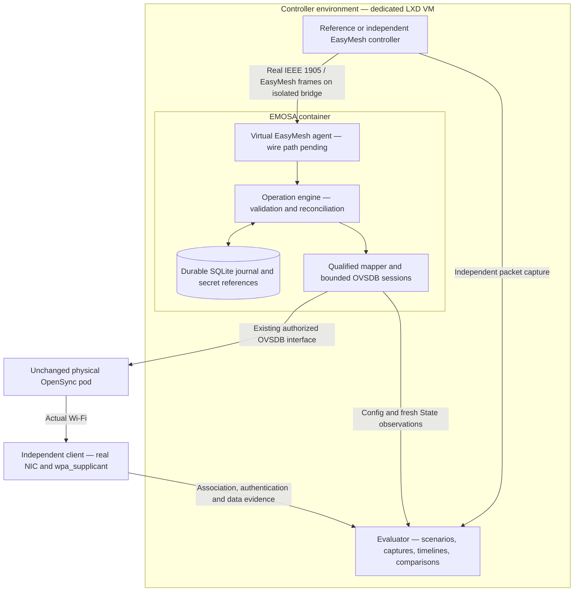
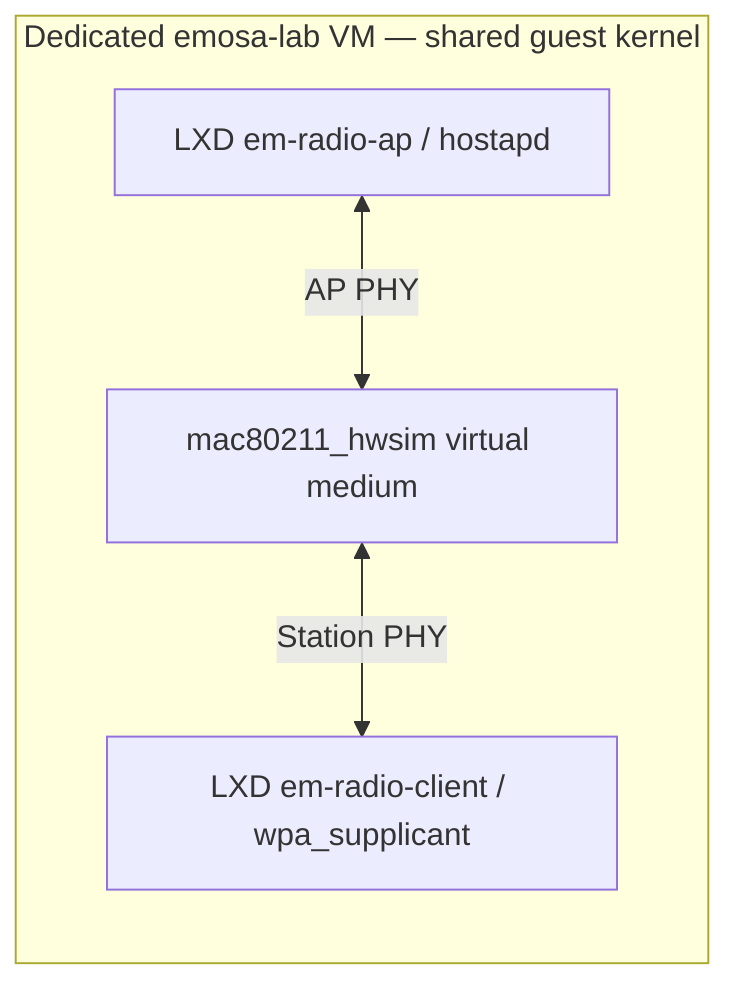

# EMOSA architecture

**EMOSA = EasyMesh to OpenSync Adapter.** OVSDB is its current OpenSync management
interface; it is one building block within the adapter.

The target is a controller-side adapter that lets a real EasyMesh controller
manage an unchanged OpenSync pod through its existing OVSDB interface. New code
runs outside the pod. The controller must discover and onboard the OpenSync
extender as an EasyMesh agent represented by EMOSA. The pod remains an OpenSync
device; its agent/radio/BSS identities and advertised capabilities must be backed
by the actual qualified pod mapping. Qualification and evidence determine which
procedures work.

EMOSA is the complete Python adapter. A virtual agent is one pod's
controller-facing representation within that service. The OpenSync mapper and
OVSDB session implement its southbound side; the virtual-agent directory currently
exposes local diagnostics, while the full EasyMesh wire endpoint remains pending.
See [manual §2.5](../guides/team-manual.md#25-languages-and-upstream-reuse) for the
code/process map, language ownership, native artifact provenance and the difference
between the prplMesh baseline and the EMOSA adaptation path.

The initial deployment design is one adapter service per controller domain/site,
with separate identity, session, inventory and operation state for each configured
pod. Current configuration supports multiple entries; automatic physical enrollment,
production capacity, multi-agent wire identity and distributed ownership remain
unqualified. See [manual §2.6](../guides/team-manual.md#26-one-adapter-service-several-represented-pods).

The [connection-flow comparison](connection-flows.svg) shows existing OpenSync
and gateway-controller EasyMesh side by side, then the proposed EMOSA scheme.
[Manual §2.7](../guides/team-manual.md#27-compare-cloud-easymesh-and-emosa-connection-flows)
explains root-pod ownership, control versus telemetry and the route to ODH, the
data lake in the network center. Telemetry ingestion/export is separate pending
integration work; the OVSDB component results do not establish it.

[Open the interactive explorer](https://boardfarmdevs.github.io/emosa-lab/#architecture)
or [download the standalone diagram](../../site/architecture.svg).

The diagram describes the intended acceptance path. The semantic operation
engine, journal, OVSDB simulator and evaluation tools are implemented. The real
wire agent, physical mapping and independent-controller path remain gated.

The [connecting-pod demonstration](../guides/connecting-pod.md) implements the local
diagnostic representation: a simulated extender dials EMOSA, supplies observed
identity/radio/BSS data, and appears in `emosa agents`. Its configured AL address
survives reconnect and adapter restart. It does not yet advertise that identity
in EasyMesh frames or populate a real controller's agent inventory.

| Building block | Responsibility | Current evidence |
| --- | --- | --- |
| Reference controller / independent peer | Originate actual protocol messages | Candidate discovery baseline captured; EMOSA exchanges and clean recovery pending |
| Virtual agent | Terminate selected EasyMesh procedures and bind the complete request | Local directory and restricted packet components tested; synthetic Ethernet WSC drives hwsim clients; native discovery/profile admission pending |
| Operation engine | Validate, guard, serialize, track deadlines and reconcile | Model and OVSDB component tests |
| Journal / secret mechanism | Preserve operations and attribution through restart | SQLite and private-secret tests |
| OVSDB mapper / session | Schema, resource bindings, guarded Config patches, fresh State | Real server and separate manager simulator |
| Existing pod managers and radio | Apply configuration without added pod software | Actual M0 qualification pending |
| Independent client | Observe authentication, connectivity and recovery | Standalone smoke and integrated OVSDB/hwsim client checks passed; physical client pending |
| Evaluator | Preserve inputs, outcomes, failures, comparisons and artifact hashes | Retained component runs |

## Optional native manager reference

The [native R0 container](../../deploy/native/README.md) runs pinned OpenSync
OWM/OW/OSW against a disposable OVSDB server and a C dummy driver. It has exercised
the Config → native manager → simulated feedback → native State path, and exposed
a database-recovery failure. This separate test service needs no radio and remains
disabled as an application backend until N01–N04 qualification is complete.

## Optional radio lab

The two-container radio harness is a standalone Linux Wi-Fi smoke test. The
separate [OVSDB/hwsim integration](../evaluation/radio-manager.md) now connects semantic EMOSA
requests through real OVSDB to an independent hostapd/nl80211 manager. It reuses
the native baseline's four containers with native peer services stopped. State
comes from actual daemon/driver observations, while wired and wpa_supplicant
clients independently check the data path. Three retained runs passed 13 cases
each. EasyMesh initiation, native OpenSync firmware and physical RF remain outside
that integration's evidence. See the [team manual](../guides/team-manual.md#11-run-emosa-through-ovsdb-to-hwsim-and-real-clients)
for preparation, commands and demo interpretation.

The later [Ethernet WSC exercise](../protocol/wsc-wire-radio.md) uses the same
radio boundary with an authenticated packet-driven operation. Its synthetic
hostap payload peer, receipt, Config/State separation and independent clients
form one observed run. It runs no native controller or OpenSync firmware and
does not establish complete onboarding.

For physical pods, the station needs a real Wi-Fi NIC reachable through the
dedicated VM/container (or a separate independent client). hwsim simulates
radios; it cannot associate over RF with the pod. No firmware or new software is
installed on the physical pod. See the [radio manual](../../deploy/hwsim/README.md).

The layout follows the project's
[architecture requirements](requirements.md).
Radio behavior is grounded in the kernel's
[mac80211_hwsim documentation](https://wireless.docs.kernel.org/en/latest/en/users/drivers/mac80211_hwsim.html)
and the upstream [wpa_supplicant documentation](https://w1.fi/wpa_supplicant/).
