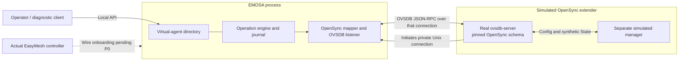

# A simulated OpenSync extender connects to EMOSA

This demonstration runs a real `ovsdb-server` with the pinned OpenSync schema,
a separate simulated manager, and the EMOSA service. The database **initiates**
its connection to an EMOSA listener. EMOSA reads the identity and radio/VIF
inventory, checks the configured binding, and exposes a virtual-agent record
through its local diagnostic northbound API: `emosa agents`.

After this Unix-socket lesson, continue with [secure fleet and repeated recovery](secure-fleet.md)
for explicit TLS authentication, several real sessions and an installed-runtime
reproduction. The [learning sequence](learning-path.md) explains the checkpoints.

This is a working local representation of a synthetic extender. A real EasyMesh
controller cannot yet discover or onboard it: IEEE 1905/EasyMesh framing and
exchange validation remain pending P0. `em-controller agents` remains gated.
The simulated pod does not run OpenSync firmware or emulate vendor cloud
bootstrap, certificates, redirects, or every OpenSync manager.

The [reviewed verification summary](../evidence/connecting-pod/qualification-summary.json)
records a passing automated lifecycle and interactive CLI walkthrough, together
with 183 unit and 20 OVSDB checks, pinned schema/source hashes and the initial
listener startup failure that was corrected. Physical pods and LXD were unchanged.

## Architecture and connection direction



The transport initiator and application roles differ: the pod database dials;
EMOSA remains the OVSDB management client. It sends `get_schema`, establishes a
`monitor`, consumes the initial snapshot and subsequent updates, and submits
guarded transactions for supported changes. This fixture uses a private Unix
stream to avoid network exposure and port allocation races. The existing OVSDB
test suite also exercises database-initiated loopback TCP.

## 1. Prepare the development host

All commands below run on **HOST**, from your chosen checkout. A sibling training
checkout is suitable. No LXD VM, container, radio, `wpa_supplicant`, physical pod,
root privileges, or cloud credentials are needed for this demonstration.

Follow [manual chapter 3](team-manual.md#3-set-up-a-developer-checkout)
for uv/CPython and [chapter 5](team-manual.md#5-build-and-exercise-the-real-ovsdb-simulator)
for the isolated database build prerequisites, then run:

```sh
uv sync --frozen
bash scripts/build-ovsdb.sh
```

The build installs no host service. Database and listener sockets live in a
temporary private directory. Run directories must be **new**; choose a different
name for each attempt. Retain failed attempts when comparing results.

## 2. Run the automated demonstration

```sh
uv run python -m emosa.simulation.connecting_pod \
  --directory .lab/connecting-pod-01 --verify
```

The command starts the database, manager and a separate `emosa serve` process;
it drives the service through the same Unix API used by the CLI. It exits after
verification and shuts down its own processes. Success prints `Verified: True`.

Inspect the evidence:

```sh
python3 -m json.tool .lab/connecting-pod-01/report.json
```

| Stage | Required observation |
| --- | --- |
| `before_connection` | One configured candidate, `pending`, no observed inventory |
| `connected` | `ready`, matching `AWLAN_Node.serial_number`, monitored radio/BSS inventory |
| `configuration_applied` | Semantic request through EMOSA reaches `OBSERVED_APPLIED` after the separate manager updates State |
| `updated_inventory` | Fresh BSS State reports `emosa-virtual-agent-demo` |
| `disconnected` | Agent remains identifiable but becomes `unavailable`, `fresh=false` |
| `reconnected` | Same AL address, one record, a newer connection generation and a fresh snapshot |
| `adapter_restarted` | New adapter instance ID, same configured AL address, inventory synchronized again |

The report contains explicit `controller_onboarding_proven=false`,
`physical_pod_proven=false`, and `radio_behavior_proven=false`. It is a standalone
component demonstration report, not an `emosa-lab` scenario/run ID. Keep the run
directory private: it also contains generated **synthetic** credentials, service
configuration, journal and logs. `report.json` excludes plaintext Wi-Fi keys.
There is no packet capture in this Unix-stream demonstration.

## 3. Operate the demonstration interactively

Use three HOST terminals in the same checkout. These commands use the new path
`.lab/connecting-pod-live-01`; do not reuse the automated run directory.

**Terminal A — start the simulated pod and independent manager:**

```sh
uv run python -m emosa.simulation.connecting_pod \
  --directory .lab/connecting-pod-live-01
```

Wait for `Fixture ready`. The database retries its connection until EMOSA starts.

**Terminal B — start EMOSA using the generated configuration:**

```sh
uv run emosa serve --config .lab/connecting-pod-live-01/adapter.json
```

**Terminal C — examine its northbound representation:**

```sh
uv run emosa --socket .lab/connecting-pod-live-01/control.sock agents --json
uv run emosa --socket .lab/connecting-pod-live-01/control.sock pod pod-1 radios
uv run emosa --socket .lab/connecting-pod-live-01/control.sock pod pod-1 bsses
```

Allow several seconds for connection and synchronization. Expect one agent with
AL address `02:00:00:00:30:01`, `state=ready`, `fresh=true`, one designated radio,
and one BSS with SSID `initial-network`. The record's interface is
`local-diagnostic`, with `easymesh_wire_state=blocked_P0`.

**Terminal C — plan and apply a supported semantic change:**

```sh
uv run emosa --socket .lab/connecting-pod-live-01/control.sock plan \
  --intent-file .lab/connecting-pod-live-01/intent.json
uv run emosa --socket .lab/connecting-pod-live-01/control.sock component-submit \
  --intent-file .lab/connecting-pod-live-01/intent.json \
  --idempotency-key connecting-demo-1 --run-id connecting-demo --wait 10
uv run emosa --socket .lab/connecting-pod-live-01/control.sock agents --json
```

Expect `OBSERVED_APPLIED`; the fresh BSS inventory changes to
`emosa-virtual-agent-demo`. A database commit alone is insufficient: Terminal A's
separate manager must observe Config and produce matching synthetic State.
The initiating request is semantic, not an EasyMesh provisioning message.

**Terminal C — disconnect and reconnect:**

```sh
touch .lab/connecting-pod-live-01/disconnect
sleep 3
uv run emosa --socket .lab/connecting-pod-live-01/control.sock agents --json
rm .lab/connecting-pod-live-01/disconnect
sleep 3
uv run emosa --socket .lab/connecting-pod-live-01/control.sock agents --json
```

Disconnection makes the record unavailable. Reconnection retains its AL address
and refreshes inventory with a newer session generation. Retry the last read if
connection backoff has not finished. To demonstrate adapter restart, stop only
Terminal B with Ctrl-C, restart its command, and query again. The adapter
instance ID changes; session generations are scoped to that instance.

Creating `.lab/connecting-pod-live-01/withhold` pauses manager application;
removing it resumes application. Submit a **different** intent/idempotency key
to test this, because reusing an already applied request will not demonstrate
withheld application. [Manual §6.6](team-manual.md#66-demonstrate-caller-timeout-application-timeout-and-late-evidence)
explains timeout interpretation.

Stop Terminal B and then Terminal A with Ctrl-C. They clean up their own sockets
and processes. The private run directory remains for inspection; the temporary
database is removed, so the generated configuration cannot reconnect after
Terminal A has exited. Use a new run directory for a new fixture.

## Identity, readiness and limitations

An optional per-pod `virtual_agent` configuration supplies a unique lowercase,
locally administered unicast `al_mac` and unique `expected_serial`. Only the
`ovsdb-sim` backend accepts this diagnostic binding. Existing configurations
without the binding remain valid and produce no agent directory entries.

Readiness requires exactly one matching monitored AWLAN_Node identity and a
complete designated radio/VIF binding with State. Missing, mismatched or
ambiguous identities cannot supply a ready inventory or authorize a Config
operation. The complete serial-number row set is also guarded atomically in the
write transaction, covering identity changes after planning. Identity matching
on a private local simulation transport is **not device authentication**.

The directory reports a two-second observation freshness limit. It expires
cached readiness if refresh stalls, and marks failures unavailable as soon as
they are observed. This is a local monitor freshness bound, not evidence that
a real radio or manager is alive. Last-known inventory is retained with
`ready=false` and `fresh=false`. Initial pending records are configured candidates,
not discovered/onboarded agents. No unknown-pod enrollment is implemented.

The radio IDs and BSS IDs are explicit logical mappings; the AL address is
configured for the lab and persists through restart via the configuration file.
It has not yet been advertised in an IEEE 1905 frame. The API's `agents` method
accepts optional `offset` and `limit` pagination (maximum 100); the CLI lists
all configured agents within the current maximum of 32 pods.

Tests include the real service lifecycle, missing/wrong identities, the pinned
schema's rejection of duplicate identity rows, identity update/recreation racing
a Config transaction, freshness expiration,
duplicate mappings, and invalid AL addresses:

```sh
uv run pytest tests/test_agents.py tests/test_connecting_pod.py
```

For actual Wi-Fi/client behavior, use the separate [radio integration](../evaluation/radio-manager.md),
which already exercises hwsim and a containerized `wpa_supplicant` client. The
connecting-pod demonstration has not yet been combined with that radio harness.
The final acceptance path remains **real EasyMesh messages → EMOSA → unchanged
physical pod → independently observed behavior**. Physical access/profile and
specification-dependent wire validation remain pending.
