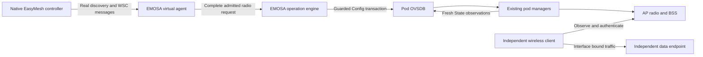

# Establish the first complete controller-to-pod experiment

This is the acceptance contract for the next integration, and a checklist for
handing it to another developer. **The complete experiment is not runnable yet.**
The IEEE 1905 inputs are obtained and the [bounded envelope/packet components](../protocol/ieee1905-envelope.md)
are implemented. Complete procedure/profile audit and exchange integration remain pending. The existing native-peer and semantic-service exercises test the two
sides separately. Their successes must not be combined into a wire-onboarding
verdict.

The next [discovery/WSC component](../protocol/autoconfiguration.md) now checks
selected complete messages, peer/link generation, radio binding, authenticated
M2 scope and replay lifetime. It returns a secret candidate without creating an
operation; full profile admission and the running coordinator remain pending.
[Restricted Early/Topology reports](../protocol/reports.md) now add complete
message construction and isolated Ethernet delivery. Their synthetic receiver
inventory does not satisfy this experiment’s native-controller inventory step.
The [read-only report coordinator](../protocol/report-coordinator.md) now handles
Query/Ack/retry with a real database source in isolation. Discovery/profile
admission into the complete lifecycle remain unfinished. The separate
[WSC provisioning component](../protocol/wsc-provisioning.md) now turns
authenticated M2 into a durable operation and real simulated Config change,
with duplicate/uncertainty/crash tests. Its synthetic payload peer and in-memory
Ethernet do not satisfy controller inventory or radio/client acceptance.
The follow-on [Ethernet WSC/radio experiment](../protocol/wsc-wire-radio.md) now
joins that handoff to actual packet sockets, hwsim and independent clients in one
run. Normal and lost-reply cases pass with a synthetic hostap peer; compatible
native admission and complete controller-owned radio/BSS inventory remain absent.

EMOSA means **EasyMesh to OpenSync Adapter**. Its virtual agent is the EasyMesh
representation it presents to the controller. The OpenSync extender connects to
EMOSA through its existing management interface and keeps its own managers.

## 1. Follow one causal path



Read the arrows as evidence obligations. Complete matching controller agent,
radio and BSS inventory supports membership; a device placeholder alone can
appear during Search before WSC. A database reply establishes a transaction result. Fresh State and a
client observation establish different aspects of application. Neither a local
API request nor a manually inserted controller entry is an acceptable substitute
for the first arrow.

For simulation, the pod database is a real `ovsdb-server`; the separate radio
manager uses hostapd and mac80211_hwsim. The client uses wpa_supplicant in its own
LXD container. For physical acceptance, replace that database/manager/radio with
the unchanged pod and use an independently controlled physical Wi-Fi client.
The adapter and controller remain outside the pod.

## 2. Declare the bounded target before running

| Item | Initial experiment contract |
| --- | --- |
| Management | Wired, isolated and independent of the BSS being changed |
| Cardinality | One represented pod, one radio, exactly one existing enabled AP BSS |
| Identity | Explicit stable AL/RUID/BSSID bindings; synthetic AL `02:00:00:00:30:01` belongs only to the connecting-pod fixture |
| Configuration | One pure fronthaul WPA2-PSK/CCMP network; printable PSK supplied through a private local secret reference |
| Controller policy | One matching fronthaul BSS for the represented agent; no backhaul BSS or backhaul-STA reconfiguration in this request |
| Complete request | Exactly the supported one-M2 radio scope; reject extra M2s, M8, teardown, unsupported roles/security or unknown mandatory fields before any Config write |
| Existing scope | `sole-fronthaul-radio` admission, fresh complete Config/State graph, one supported credential layout and guarded membership at commit |
| Capabilities | Evidence-bound actual behavior; complete required message contents, not merely a working Basic or Wi-Fi 6 value diagnostic |
| Radio for simulation | Dedicated hwsim PHY, selected 2.4 GHz channel 6/20 MHz fixture; no production RF or performance claim |
| Observer | Separate wired and wireless client containers; Wi-Fi association pinned to the intended BSSID; no setup-Ethernet/default-route shortcut |
| Budgets | Declare per-stage budgets in the run. Current native fixture uses 120 s onboarding, 30 s client checks and a 30 s healthy observation window. These are lab budgets, not normative protocol timers |
| Result | One bounded controller/build/adapter/backend tuple; no full-profile, universal compatibility or physical claim from simulation |

A deliberately non-HE simulated implementation can reduce the first trial's
capability obligations. It still needs an explicit feature contract and observed
manager/AP behavior consistent with that contract. Do not change an unknown or
HE-capable physical pod's input to `he: false` to bypass the HE review. If HE is
declared, both HE `0x88` and Wi-Fi 6 `0xAA` obligations remain. The `0x88` MCS
ordering issue is recorded in the [procedure audit](../protocol/procedure-audit.md).

The current prplMesh controller advertises Profile 1 while the selected native
agent sends Profile 2. A single-BSS policy does not repair that discovery mismatch.
Native profile configuration and mandatory behavior must be reconciled before
selecting an EMOSA-facing interoperable profile; simply echoing a profile number
or stripping mandatory TLVs is not a resolution.

The later [native discovery probe](native-discovery.md) tests EMOSA's actual
Profile-1 Search: the pinned controller answers with Profile 1 and creates a
device entry, with zero radios/BSSs. Thus the earlier Profile-2/1 mismatch is not
reproduced by this particular Search. Missing KiB/MiB and security capability
fields still prevent full admission; the new entry does not establish onboarding.
The [isolated controller candidate](controller-counter-candidate.md) corrects
the KiB/MiB advertisement and restores the pinned controller after measurement.
It does not activate the complete procedure. Security-capability applicability
must use §13.1 and §18's unsupported-feature omission rule in the selected
non-DPP contract; the absence diagnostic alone is not a direction to add `0xA9`.

## 3. Complete the available preparation exercises

Use separate, new result directories. Read the linked guide before running each
exercise: the first two run on HOST, while radio/native work uses the dedicated
VM and its owned containers.

1. Run the [connecting-pod service](connecting-pod.md). Establish the
   pod-initiated OVSDB connection, stable local diagnostic identity and stale/
   disconnected behavior. Its local `agents` result is not controller inventory.
2. Run [radio capability inputs](radio-capabilities.md),
   [technology/inventory](technology-inventory.md) and, where applicable,
   [Wi-Fi 6 inputs](wifi6-inputs.md). Explain every blocked section. An input
   hash or codec success does not qualify a physical radio feature.
3. Run [service integration](service-integration.md) in the owned radio lab.
   Retain scope admission, Config/State separation, client traffic, withholding
   and process-crash recovery. The current trigger remains the semantic API.
4. Run the [isolated native compatibility trial](native-compatibility.md).
   Inspect the entire selected controller provisioning message and the observed
   agent/BSS inventory. This uses a standard native agent, without EMOSA.
5. Run the [Ethernet WSC/radio component](../protocol/wsc-wire-radio.md) to connect
   packet-driven operations to independent client evidence. Preserve its synthetic
   peer scope; no semantic submission supplies the change.
6. Review the [profile audit](../protocol/profile-readiness.md) and
   [single acquisition checklist](../protocol/specification-acquisition.md).
   Supply missing authorized document paths outside Git when available.

The blocked wire scenario is already executable as a **gate check** on HOST:

```bash
uv run emosa-lab --state-dir .lab/first-wire-gate \
  run scenarios/provision-one-bss.json --backend ovsdb-sim
```

Expect exit **5**, `blocked`, a P0 prerequisite and zero operations. It must not
fall back to the semantic implementation or synthesize successful traffic. Use
the printed run ID with `emosa-lab --state-dir .lab/first-wire-gate report RUN_ID`
to inspect that result. Repeating the command creates another run; it does not
overwrite the first one.

## 4. Implement and run the missing wire boundary after P0

This is the implementation sequence. The envelope component has runnable commands
in the linked guide; later complete procedures remain unfinished:

1. Both IEEE PDFs are hashed and selected envelope/base-discovery clauses reviewed.
   Continue reconciling the selected
   EasyMesh/WPS rules and dependencies, profile conditions, field lengths,
   addressing, reassembly, retransmission and timers in the protocol matrix.
2. Extend the tested read-only report coordinator with the implemented discovery
   component and qualified trusted-link admission. Supply qualified fresh facts and
   complete full AP Capability/profile/ACK/retry obligations. Independent vectors
   and isolated Ethernet checks exist; native controller acceptance remains pending.
3. Bind genuine WSC exchanges to the authenticated peer, exchange and represented
   radio. Validate the complete request, cryptographic authentication and supported
   scope before creating an operation. Preserve one operation across legitimate
   retransmissions; apply the selected rules for invalid/replayed messages.
4. Join that operation to the existing guarded OVSDB engine. Capture the controller
   request, operation ID, Config transaction, fresh State and client observations
   in the same run. Do not issue a second semantic request to make the demo work.
5. Compare controller inventory before discovery, after onboarding/provisioning
   and after reconnect. Require the expected agent, radio, BSSID and SSID, with
   current observations rather than stale database entries.
6. Exercise invalid authentication, unsupported complete scope, wrong client key,
   duplicate request, lost database reply, withheld application and adapter
   restart. Each has a declared expected outcome. A late observation must not
   rewrite a timed-out operation into an on-time success.

Retain at least two clean runs before calling the selected simulation tuple
repeatable. Then repeat recovery cases and use another named controller/build
before any independent interoperability claim.

## 5. Qualify and substitute the physical pod

No private pod connection file or authentication material has been supplied.
The [qualification guide](pod-qualification.md) describes the implemented loader
and the credentials-free examples: dialing/listening mutual TLS, an existing private Unix
socket, or an independently established authenticated tunnel.

On the machine running EMOSA, the operator places the populated file at an
absolute private path such as
`/home/rev/.config/emosa/pods/pod-1/connection.json`, with a private directory and
local secret files outside the repository. Only its absolute path needs to be
shared with the coding agent. Do not put a real password, key, certificate or
endpoint into a public example or chat.

Run the existing **read-only** collector using that path and a new private output
directory. It retrieves schema and selected inventory and produces a **draft**
profile. It never authorizes a write. Review the actual schema, firmware/model,
radio/VIF references, credential representation, cloud/local writers, management
direction/trust, recovery path and physical client before qualifying a mapping.

Once wire simulation and that qualification pass, repeat the declared wired
management experiment against the unchanged pod. Its existing managers must
apply the request, and the independent physical station must observe,
authenticate and exchange traffic. Wireless management is a subsequent experiment
because changing the serving BSS can interrupt the adapter's own connection.

## 6. Read the five-step completion status

| Work item | Current disposition |
| --- | --- |
| Isolated peer compatibility | Candidate HAL length fix and live policy experiment; retained results and remaining native findings are in the [compatibility guide](native-compatibility.md) |
| First complete experiment definition | This contract defines target, admission, causal evidence, negative controls and physical substitution |
| Complete capability requirements | Selected value/mapping components tested; `0x88` ordering, mandatory report dependencies and full profile applicability remain pending |
| Complete wire exchange | IEEE access complete; envelope/packet and bounded discovery/WSC components tested; owned Ethernet WSC-to-operation/hwsim/client integration tested with a synthetic peer; full I3/I4 coordinator and profile admission pending; the existing gate rejects execution |
| Physical qualification and proof | Collector/examples available; actual private connection, qualification and physical run remain pending |

The final acceptance path remains **real EasyMesh messages → EMOSA → unchanged
physical pod → independently observed behavior**. Missing external inputs cannot
be replaced by another simulator pass.
