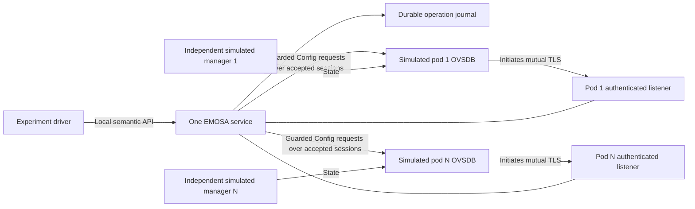

# Secure connecting pods, fleet measurements and repeated recovery

[Learning sequence](learning-path.md) · [Team manual](team-manual.md)

This exercise runs **one actual Python EMOSA service** with several real
`ovsdb-server` processes using the pinned OpenSync schema. Each database initiates
a mutually authenticated TLS connection. Separate simulated managers consume
Config and publish State. You can learn and test the management boundary without
a radio, physical pod or EasyMesh wire implementation.

## 1. Understand what the experiment connects



“Initiates” describes the socket direction. The pod still hosts the database;
EMOSA remains the management client. Accepting TLS does not create a second
authoritative database at the controller. One configured listener and certificate
pin are assigned to each pod. This implementation tests explicit enrollment,
not automatic discovery, a shared-port certificate router or dynamic registration.

The OVS Python library still frames, parses and processes JSON-RPC. Its pinned
4.0.0 passive listener supports TCP/Unix, so EMOSA adds a small stdlib TLS accept
boundary that hands an authenticated stream to that upstream implementation.
It does not replace OVSDB with a custom protocol stack. The listener uses a
per-session SSL context; it does not overwrite the upstream process-global
outgoing certificate settings used by the separate read-only dialing collector.

The service's writable TLS configuration is deliberately restricted to
`ovsdb-sim`, loopback IPv4 and explicit virtual-agent bindings. Actual pod writes
remain disabled. The read-only collector can separately use an authorized
listening TLS endpoint; see [physical-pod qualification](pod-qualification.md).
Automatic certificate enrollment/rotation, revocation policy and shared-port
routing remain deployment work. The synthetic test PKI does not provision a pod's
existing cloud trust or establish that its native TLS client will accept EMOSA.

## 2. Authenticate before admitting JSON-RPC

**HOST, checkout root.** Complete manual chapters 3–5 first. If your old simulator
binary was built with TLS disabled, rebuild it; installing Python `ovs` alone
does not add SSL support to `ovsdb-server`.

```sh
sudo apt-get install -y build-essential pkg-config libssl-dev curl
bash scripts/build-ovsdb.sh
uv run pytest tests/test_tls_listener.py -q
uv run python -m emosa_lab.simulation.reliability \
  --directory .cache/reliability/lesson-two --pods 2 --cycles 1
```

The test command checks a real database initiating TLS and reconnecting; missing
client certificates, a wrong CA and a trusted but wrong certificate pin; bounded
incomplete handshakes; and read-only collection without Config/State changes.
The two-pod command additionally tests the database serial binding and recovery
through the service's public local API. Each command stops its owned processes.

The harness creates a private `0700` output directory and `0600` synthetic trust
files. The temporary CA key stays in memory; generated leaf certificates expire
after one day. Never reuse these credentials for a physical pod or subsequent
deployment. Start a fresh exercise to get fresh trust.

| Input or check | Purpose | What it does not establish |
| --- | --- | --- |
| CA file | Require a certificate chain trusted by this listener | Which configured pod a certificate represents |
| Adapter certificate/private key | Let the simulated pod authenticate the TLS endpoint | A qualified cloud-to-gateway redirection on physical hardware |
| Pod certificate SHA-256 pin | Bind the accepted leaf certificate to this pod's listener | Radio or firmware identity by itself |
| Expected `AWLAN_Node` serial | Bind observed database identity to the configured representation | Hardware attestation; the simulator controls these synthetic records |
| AL MAC | Give the local virtual-agent representation a stable explicit identity | Membership in a real EasyMesh controller inventory |

The listener requires TLS 1.2 or newer and a client certificate. It allows four
pending handshakes per pod, each with a three-second budget. Missing, invalid and
wrong-pin certificates are rejected **before** an upstream OVS session can replace
an existing authenticated connection. Idle TCP clients consume only those bounded
handshake slots and expire. A successful authenticated reconnect invalidates the
old monitor generation and requires fresh synchronization.

Inspect the generated `adapter.json` locally to learn the configuration. A pod
entry contains `endpoint: "pssl:PORT:127.0.0.1"`, `virtual_agent` and `tls`.
The `tls` object has `certificate_ref`, `private_key_ref`, `ca_ref` and
`peer_certificate_sha256`; file references are basenames below `secret_directory`.
Duplicate certificate pins across pod entries are refused. Files must be private,
owned and regular; secret values never belong in JSON or source control.

## 3. Measure 4, 8, 16 and 32 real database sessions

**HOST, checkout root.** Run the counts sequentially so they do not contend with
one another. Each invocation creates a new service, journal, trust set and fleet.
Do not run another benchmark at the same time if comparing timing results.

```sh
for count in 4 8 16 32; do
  uv run python -m emosa_lab.simulation.reliability \
    --directory ".cache/reliability/lesson-${count}" --pods "$count" --cycles 1
done
```

The workload submits one initial change concurrently to every pod. Each target
gets a distinct SSID and PSK. The observer reads each actual database to verify
the right values, retries the same per-pod idempotency key and checks exactly one
attempt. It also checks disjoint histories and stable AL addresses. Subsequent
fault work targets pod 1 while pod 2 demonstrates independent progress; the other
pods remain connected and must be ready at each fleet readiness check.

Inspect a result without opening any credential file:

```sh
uv run python -c 'import json; r=json.load(open(".cache/reliability/lesson-32/report.json")); print(json.dumps({k:r[k] for k in ("passed","pods","checks","operation_latency_seconds","adapter_peaks","elapsed_seconds","cleanup_passed")}, indent=2))'
```

| Report field | How to read it |
| --- | --- |
| `passed` / `cleanup_passed` | Every declared assertion completed and owned fixtures were stopped |
| `checks` | Admission, per-pod writes/replay, identity rejection, conflict persistence and history checks actually completed |
| `connection_seconds` | Time from experiment start through setup and all-pod readiness; includes fixture startup |
| `operation_latency_seconds` | Nearest-rank p50/p95/max from submission to independent simulated State observation; includes polling and both concurrent initial and peer-progress changes |
| `resource_samples` | Adapter PID, elapsed time, RSS, thread count, FD count and cumulative CPU seconds, sampled every 0.5 seconds |
| `adapter_peaks` | Highest sampled adapter RSS/threads/FDs; sampling may miss shorter spikes |
| `service_lifecycle` | Actual process starts, instance identities, requested kills, exits and any forced shutdown escalation |
| `cycles` | Individually completed fault cycles and their durations |

Resources describe the **adapter process**, excluding database servers, simulated
managers and the experiment driver. CPU counters reset on each new PID; compare
deltas within one PID. RSS is resident memory in KiB, not a whole-machine memory
budget. The report does not assert a fixed latency SLO or leak-free lifetime.
The maximum of 32 configured pods is the current configuration limit, not a
production capacity qualification. Record the machine and competing load with
any comparison. Linux `/proc` is required for these measurements.

## 4. Repeat recovery and interpret failures

**HOST, checkout root.** This run performs twelve cycles with a five-second
interval after each, rather than extrapolating from one recovery. It usually
takes several minutes; read the final report for the actual elapsed duration.

```sh
uv run python -m emosa_lab.simulation.reliability \
  --directory .cache/reliability/lesson-soak --pods 4 --cycles 12 --interval 5
```

Each cycle performs these checks in order:

1. Withhold pod 1's State after Config commits. Pod 2 must complete a separate
   operation while pod 1 remains incomplete.
2. Kill the actual adapter process. Restart it against the same private journal,
   wait for all TLS sessions to recover, then publish pod 1's State. The original
   operation must complete with one transaction attempt.
3. Remove pod 1's simulated manager connection. Its diagnostic identity must
   become unavailable while pod 2 progresses. Reconnect and require a newer
   session generation.
4. Stop and restart pod 1's database server. Again observe unavailability, peer
   progress and a newer generation before a new change succeeds. The separate
   test observer and simulated State publisher start fresh fixture sessions after
   adapter recovery is verified. Their fixture lifecycle is separate from the
   continuously running adapter's recovery under test.
5. Give a change a one-second application deadline and withhold State. Observe
   `TIMED_OUT`, then publish State. The late resolution must be
   `applied_after_deadline` while the original state remains `TIMED_OUT`.

After the cycles, a simulated competing writer changes the owned SSID. EMOSA
must latch `OWNERSHIP_CONFLICT`, refuse another write without an attempt, allow
pod 2 to progress, and retain the refusal after another process kill/restart.
The harness intentionally does not clear that ownership record. “Ready” describes
fresh inventory; an ownership conflict independently prevents modifying it.

An assertion or timeout makes the command fail and the report retain
`passed: false` and a failure type. Inspect the private adapter log, report and
journal before changing the workload. Do not lengthen deadlines simply to hide
an unexplained failure. The budgets are declared experiment bounds, not values
taken from IEEE specifications. A bind race, expired synthetic certificate, TLS-
disabled database binary or insufficient machine resources should be corrected
and recorded as a new run in a new directory.

## 5. Reproduce and retain the result

Continue with the [clean LXD workflow](../../deploy/reliability/README.md). It
repeats TLS negatives, all four fleet sizes and the twelve-cycle run using an
installed wheel in a fresh unprivileged container. The runtime image is created
before any experiment generates certificates, private databases or journals.

Review and publish only reports, test results, version/package inventories and
hashes. Keep generated trust files, `adapter.json`, private database/journal files
and raw logs in the private run directory. A successful report is deliberately
labelled `controller_onboarding_proven: false`, `physical_pod_proven: false` and
`radio_behavior_proven: false`. These remain unchanged until the corresponding
real observations exist. See the [retained results](../evidence/reliability/README.md)
and [first wire experiment](first-wire-experiment.md) for the next acceptance path.
