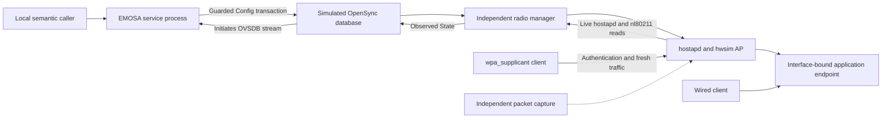

# Service integration: multiple pods, real radio behavior and controller preparation

These exercises advance three different boundaries. Run them in order. The first
needs only the development host; the others reuse the dedicated `emosa-lab` VM
and the four containers prepared in chapter 10 of the [team manual](team-manual.md).
After the first two-pod lesson, use [secure fleet and recovery](secure-fleet.md)
for authenticated connections, 4/8/16/32-session measurements and clean runtime
reproduction. The [learning sequence](learning-path.md) puts these steps before
optional radio work; the historical two-pod report below keeps its original scope.

| Exercise | What it establishes | What it does not establish |
| --- | --- | --- |
| Two connecting pods | One actual adapter process manages two explicitly configured synthetic identities; writes, histories and disconnects remain separate; pending work survives process death | Automatic enrollment, tenant security, measured production capacity or EasyMesh onboarding |
| Service plus radio | A pod-initiated OVSDB stream reaches the running adapter; semantic configuration drives an independent hostapd/hwsim manager and clients; a real process crash recovers pending work | Controller-originated configuration or physical OpenSync behavior |
| Live controller preparation | Pinned native controller and its local agent run beside the adapter/connecting-pod exercise; native inventory and independent capture are retained | A ready entry in `emosa agents` does not become a native controller inventory entry |

The final acceptance chain remains **real EasyMesh messages → EMOSA → unchanged
physical OpenSync pod → independently observed behavior**. The missing IEEE
1905.1-2013 and 1905.1a-2014 documents still block specification-dependent wire
execution. Read the [available procedure audit](../protocol/procedure-audit.md)
and [acquisition checklist](../protocol/specification-acquisition.md) for exact
remaining inputs.

## 1. Exercise two pods through one service on HOST

Start in your checkout on the development host, with the selected `uv`, Python
and Open vSwitch database tools from manual chapters 3 and 5. No VM, radio,
physical endpoint or credentials are used by this exercise.

```bash
emosa_fleet_parent=$(mktemp -d /tmp/emosa-fleet-XXXXXX)
uv run python -m emosa.simulation.connecting_fleet \
  --directory "$emosa_fleet_parent/run"
python3 -m json.tool "$emosa_fleet_parent/run/report.json"
```

`mktemp` creates a private parent with a short path. The fixture creates the new
`run` directory itself; giving it an existing directory is an error. Short paths
also avoid the operating system's Unix socket pathname limit. Keep the printed
path for investigation; `/tmp` is temporary storage, so copy a needed run into
your private evidence directory before reboot or cleanup.

The command starts two real `ovsdb-server` processes using the pinned OpenSync
schema, two separate simulated manager processes, and one `emosa serve` process.
Each database initiates a connection to its configured private Unix listener.
EMOSA remains the OVSDB management client on each accepted stream. The configured
AL address and expected synthetic serial bind each local virtual agent to one
database. This is an explicit allowlist, not certificate-based device enrollment.

Read `report.json` in this order:

1. `before_connection` contains two pending entries. `connected` contains two
   fresh entries with different serials and AL addresses.
2. `independent_operations` contains distinct operation IDs even though both
   submissions use the same idempotency key. Its scope includes the pod ID.
   The fixture directly checks each database received its intended SSID/key.
3. `withheld` remains `CONFIG_COMMITTED` while `other_pod_progress` becomes
   `OBSERVED_APPLIED`. A manager that has not applied one pod's Config must not
   block the other pod.
4. `service_lifecycle` shows a child process stopped by `SIGKILL` (`returncode`
   `-9`), followed by a new instance. `recovered_operation` retains the original
   operation ID and exactly one transaction attempt after application resumes.
5. `one_disconnected` contains one unavailable entry and one ready entry.
   `other_pod_while_offline` proves the connected pod can still change.
6. `wrong_identity_operation` is rejected with zero attempts after the connected
   database's synthetic identity changes. The Config row remains unchanged.
   `restored` returns to the two intended identities.
7. `history` has separate operation IDs for the two run IDs. `passed: true`
   requires these checks; the controller/physical/radio proof fields remain false.

The service runs under one trusted local owner with a shared private vault and
distinct secret references. This test does not establish tenant isolation or
authorization between separate customers. Two measured pods are not a claim
about the configuration schema's maximum pod count or production scale.

All child processes stop on exit; disposable databases are removed. The journal,
configuration, vault and report remain private in the run directory. Publish only
reviewed summaries, never that entire directory. The regression test runs with
`uv run pytest -m ovsdb`; it needs the real database tools.

## 2. Restore owned radios only if the VM rebooted

The kernel creates hwsim radios at runtime. They disappear on reboot, although
LXD container definitions and an old `ownership.json` survive. A saved
`hwsim_loaded: true` is therefore historical evidence, not a current radio check.
The restoration command handles this particular situation without recreating
containers, installing packages or rewriting that old ownership record.

First, stage from HOST while all native and radio experiment services are idle:

```bash
python3 deploy/radio-manager/stage.py
```

If the VM rebooted and its radios are missing, inspect the restoration preflight:

```bash
lxc --force-local --project default exec emosa-lab -- env \
  PYTHONPATH=/opt/emosa-radio-manager/source \
  EMOSA_OVS_BIN=/opt/emosa-radio-manager/ovsdb \
  /opt/emosa/.venv/bin/python /opt/emosa-radio-manager/restore.py
```

This command checks the dedicated VM, owners, base image, running container PIDs,
isolated networks, idle services, absence of existing radios and available kernel
module. It loads no module without `--apply`. If it reports that hwsim is already
loaded, inspect the existing assignment and continue with the prepared topology;
do not unload another experiment's radios to make this command succeed.

After a successful missing-radio preflight, restore them:

```bash
lxc --force-local --project default exec emosa-lab -- env \
  PYTHONPATH=/opt/emosa-radio-manager/source \
  EMOSA_OVS_BIN=/opt/emosa-radio-manager/ovsdb \
  /opt/emosa/.venv/bin/python /opt/emosa-radio-manager/restore.py --apply
```

It creates three hwsim PHYs, assigns one each to the controller, AP-side container
and wireless client, verifies the driver, and creates missing owned `br-lan`
bridges. It retains `restore-BOOT_ID.json` in `/opt/emosa-radio-manager` on VM.
A partial failure stays visible and requires inspection; it is not automatically
undone or retried. This is a topology repair, not a native onboarding verdict.

## 3. Run the actual adapter service with hwsim

The older thirteen-case harness embeds the operation engine in its runner. Keep
using it for its broader fault coverage. This additional harness uses only the
service's local API for adapter operations and deliberately kills the whole
adapter process while an independently observed Config change is still pending.

Reuse manual chapter 11's VM prerequisites: owned containers, assigned radios,
idle native services, pinned hostap runtime, `/opt/emosa/.venv` and the two
Open vSwitch 4.0.0 database binaries. Run from HOST after staging:

```bash
emosa_service_label="svc-$(date -u +%Y%m%d-%H%M%S)"
lxc --force-local --project default exec emosa-lab -- env \
  PYTHONPATH=/opt/emosa-radio-manager/source \
  EMOSA_OVS_BIN=/opt/emosa-radio-manager/ovsdb \
  /opt/emosa/.venv/bin/python /opt/emosa-radio-manager/run-service.py \
  --label "$emosa_service_label"
lxc --force-local --project default exec emosa-lab -- cat \
  "/opt/emosa-radio-manager/runs/$emosa_service_label/result.json"
```

Use a new label, limited to 24 lowercase letters, digits or hyphens. The command
runs inside VM; it does not load a radio on HOST. The synthetic pod's management
connection is a private Unix stream. Client traffic uses the owned LXD bridges
and hwsim interfaces; this is a wired-backhaul experiment.

The process chain is:



Find these checkpoints in the result and accompanying files:

- `before_connection` / `pod_connected`: pending-to-ready identity and inventory.
- `radio_scope`: the fresh complete Config/State graph satisfies the stricter
  synthetic sole-BSS policy. Both physical qualification and wire admission stay
  false. Read [the scope walkthrough](onboarding-readiness.md) for its blockers
  and atomic transaction guards. Current runs have 15 checkpoints; the earlier
  retained service runs have 14.
- `configuration_applied` and `clients-changed.json`: one acknowledged change,
  then independent wireless authentication, ping and fresh HTTP nonce from both
  clients. Repeating the request retains one operation and one attempt.
- `committed_before_crash` / `clients-withheld.json`: new Config while the live
  AP and clients still use the previous SSID. A fresh manager log entry confirms
  the withholding policy was active before submission.
- `service_lifecycle`, `pending_after_restart`, `applied_after_restart`: actual
  `SIGKILL`, new service instance, same operation and exactly one write attempt.
- `clients-restarted.json`: independent clients pass with the new configuration.
- `pod_disconnected`, `clients-disconnected.json`, `pod_reconnected`: inventory
  becomes unavailable when management disconnects, existing client traffic still
  works, and reconnection gets a new session generation with the same AL identity.
- `packet-observations.json`: observed SSID beacons and WPA handshake frames from
  `radio.pcap`, decoded separately by tshark. This is not EasyMesh WSC traffic.

`state_provenance` in the generated adapter configuration declares the expected
simulation State producer. The external manager log, radio capture and client
records corroborate it; setting that string alone is not a qualification check.

The final `passed` verdict requires successful capture validation and cleanup.
AP, client, database, manager, adapter and capture processes stop; containers and
PHYs remain available. Private logs, database, configuration, journal and secrets
remain under VM `/opt/emosa-radio-manager/runs/LABEL/`. Preserve a failed run and
inspect its `result.json` before starting another.

## 4. Prepare the live controller trial and understand its blocked result

This command starts the pinned native controller and **its own colocated local
agent** in `em-baseline-controller`. It does not start a native agent in the
extender container. It installs a synthetic BSS policy in the controller, runs
the connecting-pod service exercise beside it, and reads controller inventory
before and after. An independent capture observes the controller's owned link.

Run after the radio experiment has stopped its services:

```bash
emosa_trial_label="ctl-$(date -u +%Y%m%d-%H%M%S)"
lxc --force-local --project default exec emosa-lab -- env \
  PYTHONPATH=/opt/emosa-radio-manager/source \
  EMOSA_OVS_BIN=/opt/emosa-radio-manager/ovsdb \
  /opt/emosa/.venv/bin/python \
  /opt/emosa-radio-manager/peer-baseline/controller-trial.py \
  --label "$emosa_trial_label"
lxc --force-local --project default exec emosa-lab -- cat \
  "/opt/emosa-baseline/controller-trials/$emosa_trial_label/result.json"
```

Expected result: **`prepared_wire_blocked`**, with
`preparation_checks_passed: true` and `controller_onboarding_proven: false`.
This is a successful preparation, not a successful onboarding run. The local
directory contains the virtual AL, while native controller inventory does not.
The controller's local root entry is not the extender's virtual-agent entry.

Read `controller-before.json`, `controller-after.json`, `controller-link.pcap`,
`controller-frames.tsv`, the connecting-pod `report.json`, and `result.json`.
The preparation window may contain zero IEEE frames, as in the first retained
runs. An empty capture proves no exchange; do not present it as discovery evidence.
Even a nonempty capture would not establish causality between controller traffic
and the operation explicitly submitted through the local semantic API.

The harness retains native shutdown results, including the known controller/local
agent aborts. `native_shutdown_abnormal` is separate from preparation readiness;
a preparation result does not qualify native recovery. It archives previous
native logs before preparation and stops/collects its controller services afterward.
It leaves the containers running and does not enable EMOSA's wire gate.

## 5. What the next developer should connect

The service, manager, controller inventory observer and client observer now have
executable preparation paths. The missing connection is an actual, authenticated,
admitted EasyMesh procedure reaching the operation engine. Finish the normative
contract and exchange binding before replacing the explicit semantic caller.
Retain the same virtual AL, radio scope, operation ID, Config delta, State and
client observations for one causal request. Only then repeat against a qualified,
unchanged physical pod.

A root-pod JSON-RPC capture and ODH ingestion contract are still external inputs.
Capture analysis and telemetry design remain follow-up work; neither is required
to rerun the three exercises above. ODH is the data lake in the network center;
no transport or production delivery behavior has been selected for it.
