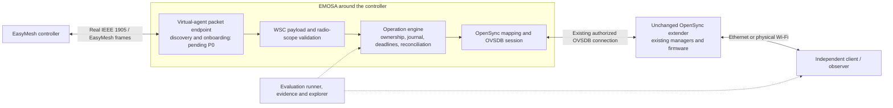
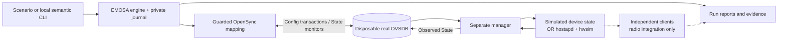
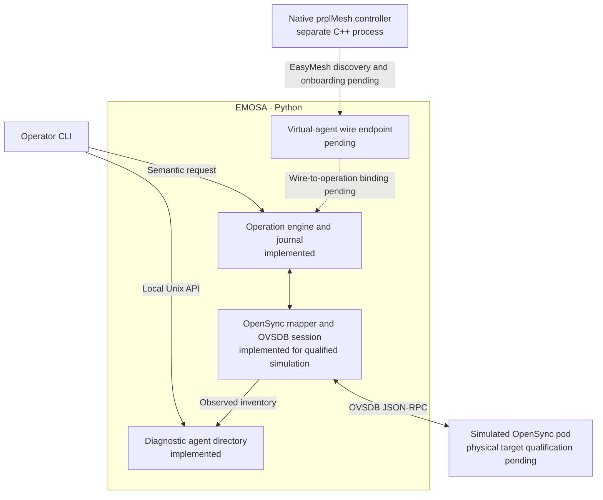
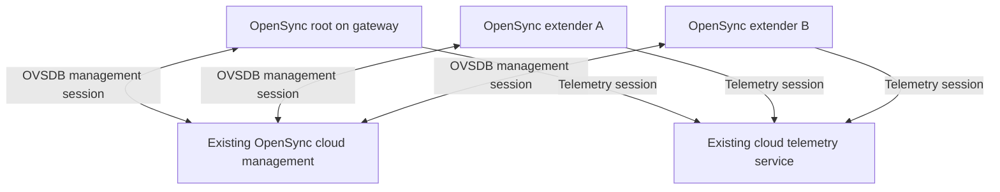
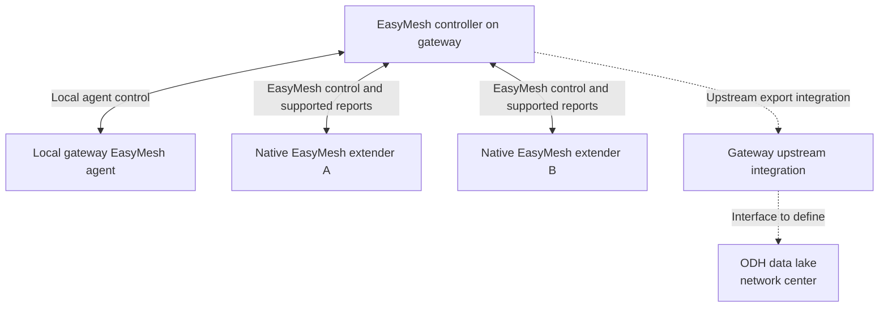
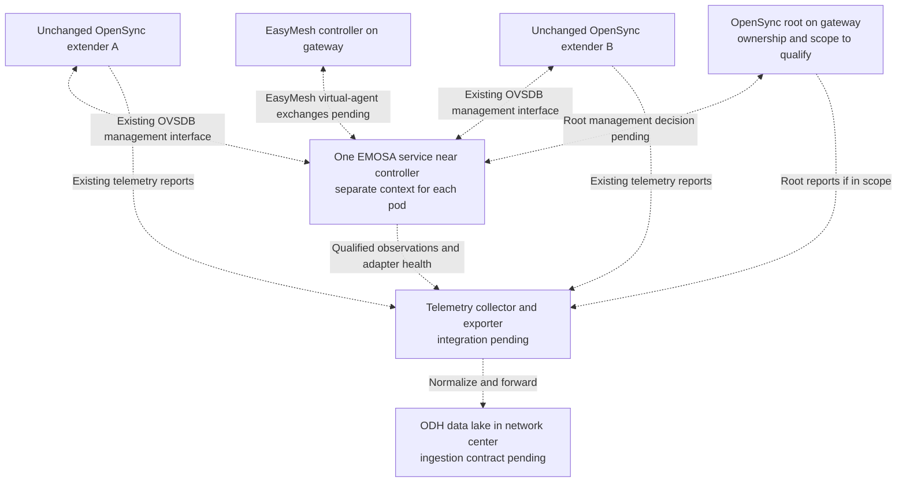
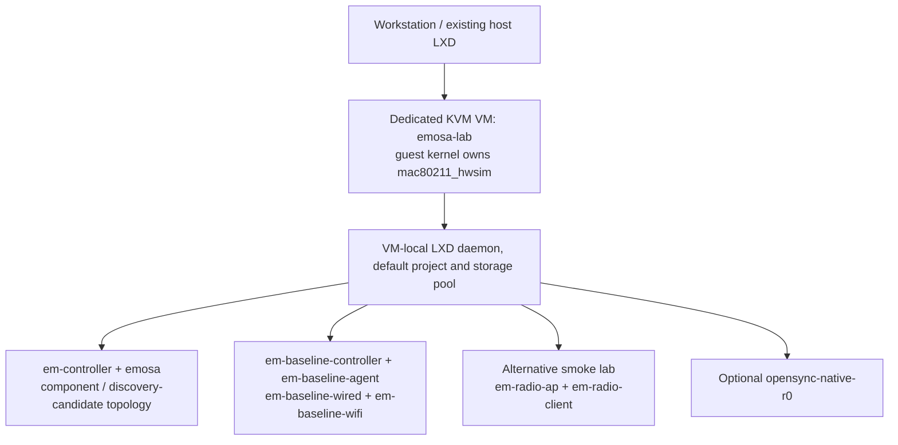

# EMOSA Lab: the beginner’s guide to setup, operation and demonstration

**Audience:** new developers, test engineers, lab operators and demo presenters.

**Reference date:** 2026-09-16. Commands describe the implementation in this checkout.

**Start here:** complete chapters 1–6 before using a shared radio lab.

EMOSA means **EasyMesh to OpenSync Adapter**. OVSDB is the current OpenSync
management interface used by the adapter. EMOSA Lab is the platform for developing
and evaluating that adapter. The objective is for an EasyMesh controller to
discover and onboard an **unchanged OpenSync extender**, represented as an
EasyMesh agent by EMOSA running around the controller. The final proof requires:

**Real EasyMesh messages → EMOSA adapter → unchanged physical OpenSync pod →
independently observed behavior.**

That complete path is still pending. This manual teaches the working components,
the available experiments and the exact boundaries of their evidence. Running
every available component successfully does not automatically complete that path.

You do not need prior EasyMesh, OpenSync, OVSDB or LXD experience to begin.
You should be able to open a terminal, change directories and edit a text file.
The guide introduces the networking concepts when they become relevant. Chapters
1–7 can be learned on a development machine; later chapters describe separate
lab experiments and specialist work, rather than one installation script to run
from beginning to end.

For each exercise, establish four things before pasting commands: **where the
command runs, what it starts or changes, what result to inspect, and how to stop
it**. Read the explanation after a command block before running the next block.
A printed JSON object is a structured result: inspect its named fields, rather
than assuming that any output or a zero shell exit code means provisioning worked.

The intended learning sequence is to understand one successful change, understand
one deliberately unsuccessful change, and then repeat those ideas across a more
realistic interface. For example, a timeout in a software model is easier to
understand before diagnosing a timeout involving a database and wireless clients.
Keep your own run IDs and notes; they are the basis for a useful team handover.

The [new guided learning sequence](learning-path.md) turns this into explicit
checkpoints: architecture → installation → model outcomes → real OVSDB → one
persistent service → authenticated pod connections → 4/8/16/32-pod measurements
→ repeated recovery → clean installed-runtime reproduction. It then branches
into radio/client work, native peer baselines and the remaining wire/physical
proof. Use it as your first-week checklist and return here for detailed commands.

## Contents

1. [Choose a learning path](#1-choose-a-learning-path)
2. [Understand the architecture and vocabulary](#2-understand-the-architecture-and-vocabulary)
3. [Set up a developer checkout](#3-set-up-a-developer-checkout)
4. [Run the model and learn to read a result](#4-run-the-model-and-learn-to-read-a-result)
5. [Build and exercise the real OVSDB simulator](#5-build-and-exercise-the-real-ovsdb-simulator)
6. [Use the long-running adapter and every local CLI operation](#6-use-the-long-running-adapter-and-every-local-cli-operation)
7. [Explore evidence and the GitHub Pages manual](#7-explore-evidence-and-the-github-pages-manual)
8. [Establish the dedicated LXD environment](#8-establish-the-dedicated-lxd-environment)
9. [Run the standalone wireless smoke test](#9-run-the-standalone-wireless-smoke-test)
10. [Prepare and run native controller–agent onboarding](#10-prepare-and-run-native-controlleragent-onboarding)
11. [Run EMOSA through OVSDB to hwsim and real clients](#11-run-emosa-through-ovsdb-to-hwsim-and-real-clients)
12. [Use the controller discovery candidate](#12-use-the-controller-discovery-candidate)
13. [Exercise WSC components and native OpenSync research](#13-exercise-wsc-components-and-native-opensync-research)
14. [Prepare an unchanged physical pod for read-only qualification](#14-prepare-an-unchanged-physical-pod-for-read-only-qualification)
15. [Deliver a demonstration](#15-deliver-a-demonstration)
16. [Troubleshoot, recover and retain evidence](#16-troubleshoot-recover-and-retain-evidence)
17. [Develop, validate and publish changes](#17-develop-validate-and-publish-changes)
18. [Complete onboarding and advance the proof](#18-complete-onboarding-and-advance-the-proof)

Architecture shortcuts: [adapter implementation and virtual agents](#25-languages-and-upstream-reuse),
[one service managing several pods](#26-one-adapter-service-several-represented-pods),
[visual cloud/EasyMesh/EMOSA/ODH comparison](#27-compare-cloud-easymesh-and-emosa-connection-flows).

## 1. Choose a learning path

Start by choosing the question you want to answer. EMOSA Lab contains several
experiments because no single experiment can cheaply establish every part of
the final system. A model tests decisions; a database experiment tests the
management interface; a radio experiment tests observable wireless behavior;
a native-peer experiment establishes a controller baseline. Their results have
different meanings even when they all print a passing verdict.

For your first session, take the **local learning path**: chapters 2–6, followed
by the browser tour in chapter 7. Leave VM creation and physical-pod access until
you have a reason to use those facilities. For a presentation without installing
software, start with chapter 7 and Demo A in chapter 15. An assigned lab operator
should first complete the local path, then inspect the existing lab in chapter 8.

### 1.1 What you can run today

A **backend** is the component the operation engine asks to inspect and change a
pod. Selecting `model` substitutes a small in-memory implementation; selecting
`ovsdb-sim` uses the real database interface against a disposable simulation.
This choice determines what the experiment can observe and therefore what its
result can establish. It is not a switch that makes the same test progressively
certified. Some larger experiments have their own harness, a program that prepares
the experiment, runs its checks, collects evidence and cleans up owned processes.

| Capability | Where to run | What a successful result establishes | What remains outside that result |
| --- | --- | --- | --- |
| Deterministic model scenarios | Linux development checkout | Operation lifecycle, fault expectations, journal and evaluator behavior | Actual OVSDB, Wi-Fi, EasyMesh and pods |
| Real OVSDB simulator | Same checkout; local C build | Real upstream database protocol, schema monitoring, guarded Config changes and separately simulated State | Radio actuation and EasyMesh |
| Long-running adapter/local API | Same checkout plus teaching fixture | Inventory, planning, semantic submission, idempotency, waiting, quiescing and service restart | A live EasyMesh controller |
| Secure TLS fleet and repeated recovery | HOST, TLS-enabled OVSDB build | Authenticated pod-initiated sessions, actual service with 4/8/16/32 pods, identity isolation, sampled resources and fault recovery | Production capacity, radio behavior or wire onboarding |
| Clean installed-runtime reproduction | Separate owned VM and nested containers | Same TLS/fleet/fault behavior from an installed wheel and retained image outside a checkout | Full wire/physical application deployment |
| Static explorer | Browser, or local HTTP server | Inspection of retained, reviewed evidence | Live execution; the website has no lab connection |
| Standalone hwsim smoke | Dedicated VM and two nested containers | Linux WPA2 association and interface-bound traffic | EMOSA or OVSDB actuation |
| Native controller–agent baseline | Dedicated VM and four nested containers | Wired/wireless onboarding and recovery for the named patched prplMesh tuple | EMOSA, OpenSync, universal onboarding or certification |
| EMOSA/OVSDB/radio integration | Prepared four-container lab | Semantic changes cause independently observed hostapd/hwsim behavior and client outcomes | EasyMesh initiation, native OpenSync firmware or physical RF |
| Controller discovery candidate | Separate prepared peer topology | Native controller discovery frames reach the EMOSA container | An EMOSA response or controller-visible virtual agent |
| WSC crypto/M1/M2/radio admission components | Development checkout | Bounded authenticated payload processing and admission checks | Complete IEEE 1905 framing, exchange binding or write authorization |
| Native OpenSync R0 investigation | Separate VM container | Native manager consumes Config and emits State with dummy-driver feedback | Qualified application backend; database-restart recovery currently fails |
| Read-only pod collector | Machine with private authorized pod access | Actual schema and available identity/inventory facts in a draft profile | Permission to write, mapping qualification or physical acceptance |

There is no `hwsim` backend option to `emosa-lab run`. Chapter 11 uses a separate
integration harness. The advertised `hardware` and `opensync-native` CLI choices
produce blocked runs until their qualification gates are implemented and satisfied.
The `--target` argument is currently a placeholder; it does not load a qualified
pod profile or grant access.

### 1.2 Suggested first week

| Session | Work | Deliverable |
| --- | --- | --- |
| First hour | Chapters 2–4 and browser tour in chapter 7 | Explain the architecture; produce and interpret a model run |
| First half day | Chapters 5–6 | OVSDB baseline/fault results; show a planned and observed operation through the service |
| Secure service and fleet | [§6.15](#615-authenticate-pods-measure-a-fleet-and-reproduce-recovery) and [learning steps 6–9](learning-path.md#6-authenticate-the-connecting-pod--host-priority-1) | Explain trust, run 4/8/16/32 pods, inspect repeated faults and reproduce the installed runtime |
| Lab orientation | Chapter 8 and one of 9–11 with the lab owner | Draw the actual topology and locate independent client evidence |
| Protocol/development orientation | Chapters 12–14 and 17 | Identify P0/M0/R0/X1 and trace one feature from contract to evidence |
| Demo rehearsal | Chapter 15 | Deliver a scoped demo and explain one failure without concealing it |
| Handover | Chapter 18 | Completed competency checklist and a reviewed next task |

Model/OVSDB work needs no LXD, host networking changes or physical pod. Reserve
the dedicated radio lab with its operator before changing its experiment mode.

### 1.3 Command conventions

Commands use **Bash on Linux**. `HOST` means the development/LXD host; `VM` means
root inside the dedicated `emosa-lab` VM; `CONTAINER` means the named inner LXD
container. Unless a paragraph says otherwise, run commands from the repository
root on HOST. Do not paste VM package/network commands into the workstation shell.

Use three terminals for chapter 6, all in the same checkout. Shell variables
belong to the terminal that set them; repeat the stated initialization in a new
terminal. Replace `RUN_ID`, `OPERATION_ID`, `RUN_A`, `RUN_B` and `LABEL` only where
the instructions explicitly use placeholders. Run IDs are generated by the tool;
lab labels must be unique. Never overwrite a failed trial to make a rerun pass.

A trailing `\` continues one shell command onto the next line; paste the whole
command and do not add spaces after that backslash. Lines beginning with `#`
are comments. `>` saves stdout and replaces an existing file at that path, so
use the supplied fresh run directories and do not redirect over evidence you
need to retain. `Ctrl-C` interrupts the foreground program; `exit` leaves the
current shell, which may return you from a container to VM or from VM to HOST.

JSON uses double-quoted field names/strings and lowercase `true`/`false`.
Examples containing `RUN_ID` or an absolute-path placeholder are templates until
you replace those values. Shell variables such as `$emosa_model_run` expand in
Bash, but `$HOME` written inside a JSON file is just literal text. When reading
JSON, distinguish the command's top-level status from the nested operation state.

You can inspect a command's shell exit code with `echo $?` immediately after it;
an intervening command replaces that value. The code tells you whether that CLI
invocation succeeded according to its contract. Chapter 16 explains why a
successfully retrieved failed operation can still give shell exit code zero.

## 2. Understand the architecture and vocabulary

A typical extender provides a Wi-Fi network for clients and a connection back
toward the rest of the network. A management system tells it which settings to
use. Here the controller speaks EasyMesh, while the target extender is managed
through OpenSync. EMOSA must represent the extender in the controller's protocol
and translate supported requests into settings the existing extender understands.

Read the diagrams as two different views: §2.1 is the system we intend to prove;
§2.2 is a component path we can already exercise. A box in a target diagram is
an architectural responsibility, not a declaration that every interface is ready.
The labels and accompanying limitations tell you which parts are implemented.

### 2.1 The intended system



The OpenSync extender does not gain an EasyMesh daemon or new firmware. EMOSA
must represent its actual qualified resources to the controller and translate
only supported requests into existing OpenSync configuration. A controller
inventory entry and an OVSDB acknowledgement alone are insufficient: the
represented radio/BSS and independently observed behavior must agree.

### 2.2 The working component path



The regular OVSDB simulator manager publishes **synthetic** State. The separate
radio integration manager reads live hostapd and nl80211 before publishing State.
Both are test infrastructure. Neither is the firmware in an actual OpenSync pod.

### 2.3 Terms you will see

Keep two paths separate in your reasoning. The **management path** carries
instructions and status between controller, adapter and pod. The **data path**
carries a client's traffic through the extender. Management can remain reachable
while client forwarding is broken, and an AP can be enabled while its backhaul
is down. This is why the lab observes both settings and independent clients.

The word **northbound** means toward the controller or operator; **southbound**
means toward the managed OpenSync pod. They describe direction in the architecture,
not a physical port. JSON-RPC is a way to exchange structured requests and replies;
OVSDB uses it to read, monitor and transact database contents. An OpenSync manager
then interprets those database settings and applies them to its platform.

| Term | Meaning in this repository |
| --- | --- |
| EMOSA adapter | The complete Python service: agent representation, operation engine, journal and OpenSync mapping/communication |
| Reference controller | The native prplMesh controller used as an independent lab peer; separate from the Python `em-controller` scaffold |
| Native baseline agent | The prplMesh agent used to test that controller without EMOSA or OpenSync in the protocol path |
| Virtual agent | One OpenSync pod's representation inside EMOSA; the local diagnostic directory works, while its full EasyMesh wire endpoint remains pending |
| AL MAC | IEEE 1905 abstraction-layer identity; distinct from individual interface/BSSID identities |
| Radio / PHY | Wireless hardware or a kernel hwsim radio; may host several interfaces |
| VIF / BSS / BSSID | Virtual interface / wireless network instance / its MAC identity; an SSID is its network name |
| Fronthaul / backhaul | Client-facing service / connection from an extender toward the controller network |
| WPS / WSC | WPS includes wireless enrollment; WSC M1/M2 AP settings also appear within EasyMesh radio provisioning. These are separate exchanges in the native wireless experiment |
| OVSDB Config / State | Desired manager input / manager-reported observation. A Config commit does not establish application |
| Semantic interface | Direct structured intent into EMOSA, bypassing EasyMesh frames; useful for component testing |
| Attribution | Evidence about whether our transaction committed; matching current State cannot identify its writer after a lost reply |
| Freshness / generation | Whether observations are usable and which synchronized OVSDB session they belong to |
| Independent client | A separate traffic probe with a bound data interface and fresh response checks; neither Config nor State is client evidence |
| P0 / M0 / R0 / X1 | Wire/specification readiness / physical mapping qualification / optional native backend qualification / independent-peer acceptance |

A concrete vocabulary example: one radio can host an AP interface offering an
SSID such as `emosa-lab`. That AP's BSSID identifies the particular BSS; several
APs can advertise the same SSID. A logical name such as `pod-1` or `radio-1` in
EMOSA configuration is a mapping key, not automatically a discovered hardware
identity. Qualification must bind those names to the intended actual resources.

### 2.4 Source map

Read the [architecture overview](../architecture/overview.md) after this section.
The actual adapter is assembled in `src/emosa/app.py`; it spans several modules.
The same Python package also contains separate simulation and evaluation tools.
For hands-on work:

| Location | Responsibility |
| --- | --- |
| `src/emosa/reconcile.py`, `model.py`, `store.py` | Durable operations, lifecycle, recovery and per-pod serialization |
| `src/emosa/opensync/` | Upstream OVS session, schema decoding and narrow existing-BSS mapping |
| `src/emosa/simulation/` | Disposable databases, separate synthetic manager and radio manager component |
| `src/emosa/app.py`, `cli.py`, `local_api.py` | Adapter service and local Unix-socket commands |
| `src/emosa/evaluation/` | Scenarios, gates, reports, comparisons and LXD routing |
| `src/emosa/wsc*.py` | Bounded payload and radio-request components |
| `schemas/`, `scenarios/`, `tests/` | Versioned contracts, runnable experiments and checks |
| `deploy/` | Dedicated VM, peer, radio, native-manager and qualification workflows |
| `doc/evidence/`, `site/`, `scripts/build-site.py` | Reviewed evidence and static explorer |
| `doc/project/EMOSA-CODING-HANDOFF.md`, `doc/project/traceability.json` | Requirements/handoff and implementation/evidence mapping |

### 2.5 Languages and upstream reuse

**The actual adapter is EMOSA, implemented in Python under `src/emosa/`.**
A **virtual agent is the controller-facing representation of one OpenSync pod
within that adapter**. These names describe different levels of the system:
EMOSA is the complete service; the virtual agent is one of its responsibilities.
EMOSA Lab is the surrounding development and evaluation platform.

#### 2.5.1 Locate the adapter in the code and at runtime

There is no single C adapter binary or single Python file containing the entire
adapter. `emosa serve` starts the Python service assembled by `Application` in
`app.py`. Its configuration binds pod IDs to management endpoints and existing
radio/BSS resources, and selects journal, secret and local API locations.

| Adapter part | Source | What it does |
| --- | --- | --- |
| Service assembly | [app.py](../../src/emosa/app.py), `Application` and `serve()` | Creates per-pod backends, the operation engine, journal, local API and diagnostic directory; refreshes observations |
| Operator entry points | [cli.py](../../src/emosa/cli.py) and [local_api.py](../../src/emosa/local_api.py) | Starts the service or sends short-lived diagnostic/semantic requests over its private Unix socket |
| Virtual-agent directory | [agents.py](../../src/emosa/agents.py), `AgentDirectory` | Reports configured synthetic AL identities with observed inventory and freshness; currently a local diagnostic view |
| Operation engine | [reconcile.py](../../src/emosa/reconcile.py), `Engine` | Validates and serializes requests, tracks deadlines, distinguishes commit from application, and reconciles recovery |
| Durable state and credentials | [store.py](../../src/emosa/store.py) and [secrets.py](../../src/emosa/secrets.py) | Journals operations and evidence; resolves protected local secret references |
| OpenSync mapping | [opensync/mapping.py](../../src/emosa/opensync/mapping.py), `OpenSyncBackend` | Binds designated resources and translates supported intent into guarded Config updates and State predicates |
| OVSDB communication | [opensync/session.py](../../src/emosa/opensync/session.py), `OvsSession` | Uses upstream OVS JSON-RPC/stream code for schema retrieval, monitoring, transactions and reconnect |
| WSC components | [wsc.py](../../src/emosa/wsc.py), [wsc_messages.py](../../src/emosa/wsc_messages.py), [wsc_radio.py](../../src/emosa/wsc_radio.py) | Build/check bounded provisioning payloads; these components are not yet connected to a complete wire procedure or authorized pod-write path |

The OpenSync mapper is the **southbound part** of EMOSA. Calling that mapper the
entire adapter would omit the controller-facing role, operation lifecycle,
identity binding and recovery. The name EMOSA means EasyMesh to OpenSync Adapter;
OVSDB is its current OpenSync management interface.

For local simulator work, the service runs on HOST from the checkout. A dedicated
deployment can place it in the `emosa` application container, as described in
chapter 8. In either case it runs outside the OpenSync pod. Merely having an LXD
container named `emosa` does not mean the adapter service is running.

To see the actual process boundary, follow the
[connecting-pod interactive exercise](connecting-pod.md#3-operate-the-demonstration-interactively):
Terminal A starts the simulated pod and manager; Terminal B runs `emosa serve`
with the generated configuration; Terminal C sends CLI requests to that service.
The automated `--verify` exercise also starts a separate adapter process. The
`emosa-lab` scenario runner can exercise the engine/backend directly, so a
successful scenario does not establish that a persistent adapter service was
started or that EasyMesh packets were exchanged.

#### 2.5.2 Understand what the virtual agent represents

The intended controller-facing identity belongs to a represented OpenSync pod.
EMOSA must expose the appropriate agent, radio and BSS identities and translate
supported controller procedures into that pod's existing management interface.
The controller would communicate with EMOSA's EasyMesh endpoint; the represented
pod would continue running its existing OpenSync firmware and managers.

A virtual agent is therefore neither the physical pod nor the native prplMesh
baseline agent. It is also not necessarily a separate process: the service's
current diagnostic directory can contain entries for multiple configured pods.
That capability does not establish multiple on-wire EasyMesh agents.



The two northbound interfaces in this diagram have different meanings:

| Interface | Consumer | Current behavior |
| --- | --- | --- |
| Local diagnostic/semantic API | Operator CLI and component test tooling | Works through a private Unix socket; exposes inventory, operations and `emosa agents` |
| IEEE 1905/EasyMesh wire endpoint | A real EasyMesh controller | Complete discovery/onboarding, procedure state and binding to operations remain pending |

`agents.py` implements the first interface's directory, **not a complete
IEEE 1905/EasyMesh agent stack**. The filename does not imply that a native
controller can already discover its entries. A reported `state=ready` means
the configured simulated identity and resource inventory are currently usable
under the diagnostic freshness rules. It does not mean the controller completed
onboarding. The response explicitly includes `interface=local-diagnostic`,
`easymesh_wire_state=blocked_P0` and `controller_onboarding_proven=false`.

The operation engine currently admits semantic initiation and rejects a wire
request with `P0 wire binding is not implemented`. WSC payload tests are useful
components toward that endpoint; they do not remove this gate. Keep this
distinction visible when explaining or demonstrating a virtual agent.

#### 2.5.3 Follow a working configuration change through the adapter

In the connecting-pod demo, changing the existing BSS SSID illustrates exactly
which part is implemented:

1. The simulated pod's real `ovsdb-server` initiates a connection to EMOSA's
   private listener. EMOSA remains the OVSDB management client even though it
   accepted the underlying connection.
2. `OvsSession` retrieves the schema and establishes monitoring. The mapper
   checks the expected synthetic serial and designated radio/VIF relationships.
   `Application` publishes the resulting inventory in the diagnostic directory.
3. The operator invokes `emosa component-submit` with an intent and a local
   secret reference. This enters through the local API, rather than an EasyMesh
   controller sending a provisioning message.
4. The engine records the operation, checks its scope and plans the change.
   `OpenSyncBackend` submits guarded updates for the existing SSID and designated
   key. EMOSA does not turn a database commit acknowledgement into proof of
   application.
5. The separate Python simulator manager observes Config and writes synthetic
   State. EMOSA consumes that observation; it does not manufacture its own
   successful State result.
6. Reconciliation compares fresh State with the requested condition. A matching
   result can become `OBSERVED_APPLIED`, and the updated SSID appears in the
   directory. Disconnect makes the directory unavailable until synchronization
   recovers; the configured virtual AL identity remains stable.

Withheld State can produce a timeout even after Config committed. In the separate
radio integration, the manager instead derives State from hostapd/nl80211 and
independent clients test traffic. In the eventual physical path, the pod's
existing managers must apply configuration and independent observations must
confirm behavior. These are different evidence levels, not interchangeable
implementations of the same successful test.

#### 2.5.4 Separate our Python implementation from native reuse

Native C/C++ programs provide the database, reference managers, protocol peers
and radio stack around the adapter. Some of the repository's Python code is
also lab tooling rather than part of the long-running adapter service.

| Component | Language | Implemented here or reused? |
| --- | --- | --- |
| **EMOSA adapter**: service, local API, diagnostic agent directory, operation engine, journal and OpenSync mapping | **Python** | Implemented here across the modules listed in §2.5.1 |
| Evaluation runner, reports, scenarios and read-only qualification command | Python | Implemented here as lab/operator tools; distinct from the adapter's runtime responsibilities |
| OVSDB session wrapper | Python | Our bounded wrapper around upstream Open vSwitch `ovs==4.0.0`; JSON-RPC/stream/reconnect/schema primitives are reused |
| Regular simulated manager, connecting-pod fixture and hwsim manager/observers | Python | Our test infrastructure; not full OpenSync firmware |
| WSC payload construction, validation and radio-scope admission | Python | Implemented here using `cryptography` and standard-library primitives; complete wire onboarding remains pending |
| `ovsdb-server` and `ovsdb-tool` | C | Upstream Open vSwitch 4.0.0, built separately |
| OpenSync OWM/OW/OSW native managers and dummy-driver facilities | C | Pinned upstream OpenSync, used only in the optional R0 experiment |
| Native dummy-driver glue | C | Our `deploy/native/driver.c`, calling OpenSync's existing dummy-driver API |
| Independent WSC reference harnesses | C | Our two `tests/fixtures/protocol/*/reference.c` harnesses call upstream hostap 2.11 functions; they do not link EMOSA |
| hostapd / wpa_supplicant | C | Upstream hostap; native peer baseline uses the recorded 2.10 build and explicit lab patch, separately from the 2.11 vector reference |
| Reference EasyMesh controller and native baseline agent | Primarily C++ | Pinned prplMesh 6.0.0/companion build, plus documented lab patches; separate executables |
| mac80211_hwsim and Linux wireless stack | C | Existing Linux kernel code, configured by lab scripts |
| Pages explorer and build | JavaScript, HTML, CSS; Python builder | Implemented in `site/` and `scripts/build-site.py` |
| OpenSync schema | JSON | Unmodified upstream `interfaces/opensync.ovsschema` at the pinned commit; an upstream reference, not an actual-pod profile |

EMOSA does not import, link or package prplMesh. Its Python package also does not
contain the complete OpenSync source tree. The connecting-pod demonstration uses
the upstream C database server and our Python manager; the optional native R0
path substitutes selected real OpenSync managers and remains unqualified because
of its recorded recovery failure. Physical pods retain their existing firmware.

#### 2.5.5 Know where the native controller and agent binaries come from

The native prplMesh controller and native baseline agent **retain their required
prplMesh libraries and runtime dependencies**. They have not been extracted into
independent dependency-free agent/controller implementations. EMOSA's lack of
a prplMesh build/runtime dependency applies to the Python adapter itself.

| Artifact | How this lab obtains it |
| --- | --- |
| `beerocks_controller`, `beerocks_agent`, `ieee1905_transport` and the original supporting libraries | Prebuilt archives from the pinned `boardfarmdevs/prplmesh-lab` companion build |
| `libbwl.so.6.0.0` overlay | Rebuilt by this repository's native-baseline workflow with the primary-BSS identity patch, using the pinned source and companion headers/libraries |
| Native baseline hostapd/wpa_supplicant | Built by this repository's workflow from pinned hostap source with the documented lab patch |
| EMOSA Python adapter | Installed from this repository using its locked Python dependencies |

The [peer manifest](../../deploy/peer/prplmesh.reference.json) records prplMesh
6.0.0, upstream commit `2e153c7e00cbcab6b8ee35082f494a364e23f018`, companion build
commit `fcb0b97910e0e9d164578565b970c130d766e88e`, archive hashes and executable
hashes. The [native-baseline manifest](../../deploy/peer-baseline/reference.json)
records the additional library/hostap builds and patches. The full controller
and agent executables are not rebuilt by `emosa-lab`'s current workflow.

The runtime archives are **not checked into this Git repository or included in
the Python wheel**. The prepared lab stages them under `/opt/peer-artifacts/`
inside the dedicated VM and installs them into the relevant containers. That
existing lab installation is separate from the files obtained by cloning Git.
On another machine, obtain the matching reviewed archives from the lab operator
or build them using the recorded companion-project revision. `uv sync` does not
download or reconstruct these native peer artifacts.

Do not infer a required fresh native build from every use of EMOSA Lab:

| Experiment | Native prplMesh artifacts required? |
| --- | --- |
| Model scenarios, evaluator and reports | No |
| Ordinary OVSDB simulator and connecting-pod diagnostic demo | No; compatible Open vSwitch database tools are required separately |
| TLS fleet/recovery and clean installed-runtime reproduction | No; TLS-enabled OVSDB tools are required; the clean runtime builds them |
| Standalone two-container hwsim smoke | No; it uses the Linux wireless stack and hostap tools |
| Native controller–agent baseline | Yes; reuse matching prebuilt artifacts or produce them with the companion build |
| Current four-container EMOSA/OVSDB/radio integration | Uses the prepared native-baseline lab and retained runtime inputs; its run stops the native peer services and initiates EMOSA semantically |
| Eventual real-controller EMOSA proof | Requires an actual compatible controller; prplMesh is the selected reference peer, not a library dependency of EMOSA |

Chapter 10 lists the exact archive and build prerequisites for a fresh native
baseline. Chapter 11 explains the prepared-lab dependency of the radio integration.

#### 2.5.6 Distinguish command names, processes and experiments

| Name | Meaning |
| --- | --- |
| `emosa serve` | The actual Python adapter service, started with a validated configuration |
| `emosa agents`, `emosa pod`, `emosa component-submit` | Short-lived clients of that service's local API; commands need the correct `--socket` |
| `emosa-lab` | The Python evaluation CLI; runs scenarios and inspects evidence |
| `em-controller` | This package's Python controller scaffold; status reports the wire gate and other controller actions remain blocked. It is not a launcher for prplMesh |
| `beerocks_controller` / `beerocks_agent` | Native prplMesh executables started through the dedicated peer harnesses |
| `em-baseline-controller` / `em-baseline-agent` | LXD container names in the native baseline, not Python entry points |
| Simulated pod manager | A separate test process that applies Config to synthetic State; it is not a native EasyMesh agent |

There are three paths to keep distinct when demonstrating the system:

1. **Native baseline:** prplMesh controller ↔ native prplMesh agent. This checks
   the named reference peers, their wired/wireless bootstrap and client behavior.
   EMOSA and OpenSync are absent from that protocol path.
2. **Working adapter component demo:** local semantic client ↔ EMOSA ↔ simulated
   OpenSync pod. This checks our adapter logic, OVSDB boundary, identity directory
   and recovery. No real controller onboards the diagnostic agent.
3. **Target acceptance:** real EasyMesh controller ↔ EMOSA virtual-agent endpoint
   and adaptation engine ↔ unchanged OpenSync pod, with independent observations.
   This remains pending full wire implementation and physical qualification.

To present the working component accurately, say: “This is the EMOSA adapter
managing a simulated OpenSync pod. Its local virtual-agent record is ready.
Discovery and onboarding by a real EasyMesh controller are the next protocol
boundary to complete.” Use the [connecting-pod guide](connecting-pod.md) for the
runnable demonstration and [viability roadmap](../project/viability-roadmap.md)
for the remaining proof steps.

Reuse is recorded in [dependency qualification](../evaluation/dependency-qualification.md),
[third-party notices](../project/THIRD-PARTY-NOTICES.md), per-fixture provenance files and
native lab reference manifests. Open-source behavior cross-checks do not replace
the normative IEEE/Wi-Fi Alliance specification requirements.

### 2.6 One adapter service, several represented pods

The intended starting deployment is **one EMOSA service per controller domain
or site, managing several OpenSync pods**. It does not require starting a new
adapter process whenever an extender appears. Within that service, each admitted
pod needs its own bound identity, database session, inventory/freshness, operation
history and ownership state. Its virtual-agent representation is a logical
protocol role, not inherently a process or container.

For example, three extenders A, B and C would have three independently tracked
pod contexts inside one service. A request for B must reach B's mapped resources
only. If A disconnects, A's observations become unavailable; work for B and C
should continue within the service's resource limits. In the target wire design,
the controller must distinguish the represented devices and their radios/BSSs.
The exact multi-agent address, topology and packet-demultiplexing behavior still
needs implementation and validation against the selected protocol profile.

The current code already has useful parts of this structure:

| Item | Implemented behavior | Remaining production work |
| --- | --- | --- |
| `pods[]` configuration | Declares 1–32 pod entries; 4/8/16/32 real TLS database sessions are exercised through one service | The limit and bounded measurements do not establish production sizing |
| Resource and request binding | Pod IDs select configured resources and scope idempotency/ownership; virtual-agent entries bind configured AL identities and expected serials | Authenticated physical identity, complete radio scope and multi-agent wire representation |
| Concurrency | One modifying operation per pod; concurrent fleet writes and peer progress during a selected pod's failure are measured, with sampled CPU/RSS/FDs | Fairness/SLOs, sustained load and production resource policies |
| Enrollment | Explicit entries with per-listener CA, certificate pin and expected serial; bounded TLS admission and negative tests | Physical trust enrollment, shared-port routing, dynamic add/remove and lifecycle policy |
| Recovery | Journaled operations and repeated service-kill/database-restart/reconnect/late-State/conflict checks | Long-duration qualification, deployment failover, exclusive ownership transfer and multi-instance recovery |

A connection from an unknown device is therefore **not currently automatic
onboarding**. Configuration is loaded when the service starts; there is no
production “new pod connected, create and authorize its agent” enrollment service.
The [two-pod service exercise](service-integration.md) now measures separate
requests, histories, disconnects and crash recovery through two explicitly
configured simulation listeners. It does not establish a shared network listener
that authenticates and dispatches a fleet of physical devices.
The [secure-fleet extension](secure-fleet.md) adds explicit TLS bindings, four
measured fleet sizes, repeated faults and a clean installed-runtime reproduction.
It retains the same distinction between configured synthetic admission and
automatic onboarding of physical devices.

Multiple adapter instances may become useful for fault isolation, separate
sites or measured capacity limits. That is a deployment/scaling choice. It
requires a clear owner for each pod and stable identity/state across reassignment;
two independent instances must not both believe they may configure the same pod.
The current single-process journal/lock is not a distributed ownership or
high-availability mechanism. Creating one process per pod would not by itself
solve enrollment, telemetry routing or controller topology correctness.

### 2.7 Compare cloud, EasyMesh and EMOSA connection flows

Start with this comparison: the two existing arrangements are side by side at
the top, followed by the proposed combined scheme below. Blue arrows are
management/control relationships; purple arrows are telemetry. Dashed connections
need implementation, an integration contract or physical qualification. The
per-flow diagrams and walkthroughs below explain each view in more detail.


[Open the full-size flow comparison](../architecture/connection-flows.svg).
The image describes logical application relationships; it does not draw every
Ethernet, Wi-Fi, routing or Internet hop. User traffic continues on the normal
network data path rather than flowing through the adapter or data lake.

This section describes the deployment we want to build. The OpenSync starting
point is the team's cloud-managed installation, including an OpenSync root pod
on the gateway. The EasyMesh target places its controller on the gateway.
These are the deployment roles for this project; the diagram does not require
every possible EasyMesh product to place its controller on the same hardware.

Separate **who terminates a management session** from **where its packets travel**.
An extender may open its own session to a cloud service even though the packets
cross another extender, the root gateway and the Internet. The gateway forwarding
those packets is not thereby the application-level manager. Similarly, a locally
hosted adapter can terminate management while user traffic continues through the
ordinary AP/bridge/router path.

#### 2.7.1 Existing OpenSync flow: each pod talks to cloud services

In the deployment described by the team, the root/gateway pod and each extender
establish their own cloud-facing connections. Extenders do not become EasyMesh
agents merely because their network traffic passes through a gateway.

OpenSync's official documentation distinguishes OVSDB management from MQTT
statistics/events. Our pinned schema also contains `AWLAN_Node.mqtt_settings`,
`mqtt_topics` and `mqtt_headers`. Thus an OVSDB connection alone must not be
assumed to carry every telemetry report. Confirm the actual pod build's endpoints
and enabled reporting services during qualification. Sources:
[OpenSync FAQ: cloud connections and MQTT](https://opensync.atlassian.net/wiki/spaces/OCC/pages/39920140758),
[pinned schema](../../tests/fixtures/opensync/opensync.ovsschema).



The arrows show logical service relationships, not direct physical links. A
pod-initiated connection can carry management requests in the opposite direction:
the cloud issues database operations and the pod returns replies/updates over
that connection. Session initiation is not configuration authority, and it does
not change the pod's role as the database endpoint.

#### 2.7.2 Native EasyMesh flow: the gateway controller manages agents

For the selected target deployment, the gateway controller discovers and manages
native EasyMesh agents over the local network. The agents implement the EasyMesh
side themselves. The gateway may also host a local agent for its own radios,
as the selected native baseline does. An OpenSync root process and that local
EasyMesh agent are different roles, even when located on the same gateway.



EasyMesh defines the controller/agent interaction; it does not make the chosen
ODH service an automatic recipient. Getting controller data to ODH needs a
specified upstream integration with device identities and report semantics.
This diagram's dotted export arrows describe work to define, not an implemented
telemetry service or a claim about a mandatory cloud interface.

#### 2.7.3 Target EMOSA flow: retain OpenSync pods, adapt their control locally

We want the gateway's EasyMesh controller to manage each unchanged OpenSync
extender as a represented EasyMesh agent. The pods keep their existing OpenSync
managers and supported management protocol. EMOSA supplies the missing
controller-facing agent behavior and translates admitted requests into the
qualified pod configuration representation.



This is a **target integration diagram**: the dashed connections require further
implementation or qualification. The OVSDB interface has already been exercised
in simulation, but controller-facing wire behavior, physical endpoint use and
telemetry export remain pending. The telemetry collector/exporter may ultimately be a component
of EMOSA or a cooperating service; the functional responsibility exists either
way and is not implemented by the current OVSDB session wrapper.

For control, the eventual sequence must be:

1. Establish an authorized, supported pod management connection and bind its
   authenticated device identity to a site, pod context and qualified resources.
2. Expose the correct virtual-agent/radio/BSS identities to the local controller
   and complete the required discovery/onboarding exchanges.
3. Bind a controller request to that pod, validate its complete scope and submit
   a guarded change through the pod's existing management interface.
4. Observe what its existing managers apply, report only supported results to
   the controller, and independently test the resulting client behavior.

The pod's management destination and the existing cloud writer's authority must
be resolved explicitly. Forwarding IP traffic through a gateway does not redirect
an application session; changing only a simulator endpoint does not qualify a
physical pod's bootstrap, certificates or reconnect behavior. Our “unchanged pod”
objective means no added agent/firmware/software. Any necessary endpoint or
writer-control arrangement must use an already supported mechanism and be
separately qualified and authorized. At present, no physical configuration is
being changed; chapter 14 remains read-only.

Adapting the selected Wi-Fi control procedures is not a replacement for every
service of an OpenSync cloud platform. Features such as firmware lifecycle or
other cloud analytics need their own ownership, interfaces and scope decisions.
Only the qualified subset can be advertised as working through EMOSA.

The root pod needs its own decision. If its radios are already controlled by a
local native EasyMesh agent, EMOSA must not independently claim those same
resources as another writable pod. If OpenSync continues owning the root's
radios, representing them requires a separate qualified mapping and controller
identity/topology decision. Successful extender adaptation does not automatically
migrate root routing, WAN services or root telemetry.

#### 2.7.4 Telemetry has a separate path to ODH

**Telemetry** is measured status, counters and events used to understand operation
over time. Some status is available through OVSDB observations; other OpenSync
reports use a separate telemetry connection. Redirecting or replacing the OVSDB
management relationship therefore does not automatically deliver all pod data
to ODH. Here **ODH is the data lake in the network center**, as confirmed by the team.
Its ingestion protocol, payload contract and deployment interface have not yet
been supplied; naming that destination does not determine those interfaces.

The target must account for three categories:

| Data | Proposed treatment | Required verification |
| --- | --- | --- |
| Observations needed for admitted EasyMesh procedures | Map qualified pod observations into the selected controller-facing reports | Exact meanings, source freshness and controller/radio/client identities |
| OpenSync telemetry not represented by that EasyMesh subset | Preserve/translate through a supported telemetry ingress and exporter toward ODH | Actual transport, payload/schema version, topic/routing, units and identity contract |
| EMOSA health and operation events | Export adapter-originated records as such | Keep adapter diagnostics distinguishable from pod measurements and client observations |

A telemetry record must retain which site, physical pod, radio/BSS/client and
observation time it refers to, where those fields are available. A virtual-agent
AL identity is a mapped protocol identity, not permission to discard the original
device identity. Define missing/stale data explicitly, and decide how reconnect,
buffering, backpressure, duplicates and out-of-order reports are handled. ODH
unavailability must have a defined effect on local control rather than silently
blocking all pods or reporting stale values as current.

Two concrete integration arrangements need evaluation once ODH's interface is
known. Pods might publish through an existing supported telemetry endpoint to
a local collector that exports to ODH; alternatively, an authorized existing
broker/backend integration might relay the reports. EasyMesh-supported reports
may additionally reach ODH through the gateway controller's own upstream path.
Select ownership and duplicate-handling rules for those paths before enabling
them. Do not assume that every OpenSync report fits in an EasyMesh message or
that MQTT payloads can be sent unchanged to an unspecified ODH API.

Today's code provides OVSDB monitoring for the admitted mapping and local
operation/diagnostic evidence. It does **not** implement a general OpenSync
telemetry broker, full metrics translation, controller telemetry reporting or an
ODH exporter. The `detailed-metrics` capability is explicitly unknown. None of
the simulator, native-peer or radio passes demonstrates delivery into ODH.

#### 2.7.5 What success must show for these flows

The first adapter viability proof remains a captured controller request causing
an admitted change on an unchanged pod and independently observed behavior.
Deployment completeness also requires the selected telemetry route to be proved:
create or identify a known pod observation, retain its source identity/time,
follow any conversion and show its receipt at ODH. Repeat with two pods so
misattribution is detectable, then test reconnect and upstream outage behavior.

The additional inputs are the root-resource ownership decision, supported pod
management/telemetry bootstrap and trust, ODH ingress contract and device/site
identity mapping. These decisions are part of the architecture to qualify; this
manual does not pretend they are supplied by a successful OVSDB transaction.

## 3. Set up a developer checkout

**Goal:** create a reproducible local Python environment and confirm that the
commands work. Nothing in this chapter starts a radio, contacts a pod or needs
the dedicated VM. Run it as your normal user on HOST, in the checkout you intend
to use for learning or development.

Git provides the source and its revision history. `uv` installs the selected
Python version and the project's dependencies. The `.venv` directory is a virtual
environment belonging to this checkout; `uv run` executes a command using it.
`uv.lock` records dependency versions so teammates can reproduce the same starting
point. `--frozen` uses that lock without silently resolving a different set.

Use a separate learning clone if you want to edit scenarios and rehearse without
mixing those edits with development work. Using an existing clean development
checkout is also supported: runtime output normally belongs in ignored `.lab/`
and `.cache/`. A second clone isolates files, but it does not give you a second
VM or exclusive ownership of the shared radio lab.

### 3.1 Prerequisites and versions

Use a Linux account with Git, curl and a Bash shell. The recorded development
host is Ubuntu 22.04; CI and the dedicated VM use Ubuntu 24.04. Native Windows,
macOS, WSL networking and other architectures are not qualified lab deployments.
A browser is sufficient for retained-evidence demonstrations.

The repository pins CPython **3.13.7**, uv **0.11.17** in CI and Open vSwitch
**4.0.0** for the database tools. Python dependencies come from `uv.lock`.
The OpenSync schema is `interfaces/opensync.ovsschema` from
`plume-design/opensync` commit
`78d8a7194d5e77635877cc456231e7be5cf03d68`, already retained under
`tests/fixtures/opensync/` with provenance and license. No OpenSync checkout is
needed for model/OVSDB work. This schema is an upstream simulation reference,
not a qualified profile of our physical pods.

### 3.2 Install the selected uv and clone (HOST)

Begin in the parent directory where you want the new `emosa-lab` checkout to
appear. After `cd emosa-lab`, all subsequent relative paths refer to its root.
Use `pwd` and `git status --short --branch` if you are unsure which copy you are
in. An absolute path starts with `/`; a relative path such as `scenarios/...`
starts from your current directory.

The installer sets up `uv`; it does not clone EMOSA or create the project's
Python environment. Those are separate steps below. The `export PATH=...` line
makes the installed command available in this shell; repeat it in another shell
if that shell cannot find `uv`.

If uv is absent, use the versioned official installer. It installs into your
account; it does not install system Python. You may inspect the downloaded
script before executing it. See [Astral's installation instructions](https://docs.astral.sh/uv/getting-started/installation/).

```bash
curl --fail --location https://astral.sh/uv/0.11.17/install.sh -o /tmp/emosa-uv-install.sh
sh /tmp/emosa-uv-install.sh
export PATH="$HOME/.local/bin:$PATH"
uv --version
git clone https://github.com/boardfarmdevs/emosa-lab.git
cd emosa-lab
git rev-parse HEAD
uv python install 3.13.7
uv sync --frozen
uv run python --version
```

Expected: uv 0.11.17, Python 3.13.7 and a project `.venv`. If the checkout already
exists, enter it and inspect `git status --short`; do not clone over it. Do not
regenerate the lockfile to work around a failed download. Resolve the dependency
or network error first. Internet is needed for initial downloads; offline use
requires the selected dependencies and source artifacts to be retained locally.

### 3.3 Verify the basic installation (HOST)

Run these checks before making a change so you know whether a later failure is
new. The `--help` commands establish that the installed entry points load.
`em-controller status` describes the Python scaffold's implemented state; it does
not contact a native controller. Ruff checks source conventions and formatting.
The unit suite checks isolated behavior with fixtures rather than real radios.

```bash
uv run emosa --help
uv run emosa-lab --help
uv run em-controller status --json
uv run ruff check .
uv run ruff format --check .
uv run pytest -m unit
```

`em-controller status` should report `protocol_state: blocked`, gate `P0`, and
empty `wire_procedures`/`virtual_agents`. That is the implemented status, not an
installation failure. Test counts depend on the checkout revision, and suite
selections can overlap.
Compare results with CI for your revision; adding suite counts does not produce
a count of independent interoperability or physical acceptance cases.

### 3.4 Create a private local workspace

An experiment needs somewhere to write reports, journals and synthetic credentials.
Create that workspace separately from tracked source. `umask 077` makes newly
created files/directories private by default in this shell; `chmod 700` explicitly
restricts the directory to its owner. These settings are useful even for simulated
credentials because later exercises use the same evidence-handling habits.

```bash
umask 077
mkdir -p .lab/team-manual
chmod 700 .lab/team-manual
```

`.lab/` and `.cache/` are ignored. Keep raw runs private anyway: ignored files
can still be exposed by copying a directory or serving it over HTTP. Real pod
configuration and secrets belong **outside** the checkout; chapter 14 gives the
paths. Never serve the repository root as a demo website.

## 4. Run the model and learn to read a result

**Running the model means running a software-only experiment against a simplified
simulated pod.** The evaluator uses EMOSA's actual operation engine and journal,
but replaces the OpenSync mapper, OVSDB connection and device with
[ModelBackend](../../src/emosa/backends/mock.py). The pod's configuration and
observed state are ordinary Python values in memory. No OpenSync firmware,
EasyMesh controller, database server or Wi-Fi network is started.

Run this chapter on HOST after chapter 3. It is deliberately the first exercise:
you can learn EMOSA's decisions and result format without also diagnosing network
namespaces, native processes or authentication. The evaluator advances a controlled
model clock, so a simulated deadline does not measure real device performance.
Reports remain on disk after the in-memory pod is disposed.

The model keeps **desired configuration** separate from **observed application**.
For example, it can accept an SSID change while continuing to report the old SSID.
EMOSA must keep waiting or eventually time out; accepting the request alone must
not produce an applied result. The evaluator explicitly advances device behavior
between those steps, or withholds it to exercise a failure.

```text
Scenario file → actual EMOSA operation engine → in-memory pod model
                            ↑                         │
                            └── synthetic observation ┘
                            │
                            └── journal, events and report
```

### What this first experiment does

The scenario requests a change to one existing simulated BSS, the AP network
instance. It names `pod-1`, `radio-1` and `bss-1`, asks for SSID `emosa-lab`, and
refers to a locally generated synthetic credential. These are test identities.
The initial SSID is `initial-network`. The expected result is that the model
accepts the new configuration, later reports it applied, and EMOSA recognizes
that matching observation before the application deadline.

A **scenario** contains the request, prerequisites, any injected fault and the
expected outcome. A **run** is one execution of it, with its own generated run
ID and evidence directory. An **operation** is a particular requested change
inside the run. A multi-pod run can contain several operations. Keeping these
identities separate makes reports and later troubleshooting much easier to read.

### 4.1 Your first run

The first command below selects the scenario and `model` backend. The global
`--state-dir` option chooses the evidence root; it must precede `run`. The `>`
operator saves stdout to a file. It does not suppress stderr, which is why the
run announcement can still appear in the terminal. The small Python command
extracts the generated ID rather than making you copy it by hand. The final
command reads the saved result; it does not execute the experiment again.

```bash
uv run emosa-lab --state-dir .lab/team-manual run \
  scenarios/component-bss-change.json --backend model \
  > .lab/team-manual/model-start.json
cat .lab/team-manual/model-start.json
emosa_model_run=$(uv run python -c \
  'import json; print(json.load(open(".lab/team-manual/model-start.json"))["run_id"])')
uv run emosa-lab --state-dir .lab/team-manual report "$emosa_model_run" --format json
```

The `Started run-...` notice goes to stderr. Stdout contains the result summary.
Expect `execution_status: completed`, `verdict: pass`, and
`interoperability_verdict: not_evaluated`. The operation should finish
`OBSERVED_APPLIED`. Its observation provenance remains a synthetic device model.
The model clock is deterministic; its timing is not a measured device latency.

Before continuing, find the three different conclusions in the output:
`execution_status: completed` says the experiment finished; `verdict: pass` says
its expectations matched; `OBSERVED_APPLIED` says this operation matched a
synthetic observation. `interoperability_verdict: not_evaluated` is expected
because no real controller or pod participated. There is no on-air SSID to scan
for in this exercise, even though the requested name is `emosa-lab`.

### 4.2 Inspect reports, operations and events

The report is a summary, events are the ordered explanation of how the result
was reached, and observations are the values used to judge application. Start
with a report, then inspect a single operation when you need its submission
attempts, commit attribution or deadline details. Different report formats show
the same retained experiment; generating an HTML report does not rerun the test.

```bash
uv run emosa-lab --state-dir .lab/team-manual report "$emosa_model_run" \
  --format markdown > .lab/team-manual/model-report.md
uv run emosa-lab --state-dir .lab/team-manual report "$emosa_model_run" \
  --format html > .lab/team-manual/model-report.html
uv run emosa-lab --state-dir .lab/team-manual watch "$emosa_model_run" --once
emosa_model_op=$(uv run python -c \
  'import json,sys; print(json.load(open(sys.argv[1]))["operations"][0]["operation_id"])' \
  ".lab/team-manual/runs/$emosa_model_run/run.json")
uv run emosa-lab --state-dir .lab/team-manual inspect "$emosa_model_run" \
  --operation "$emosa_model_op"
```

Open the HTML report locally in a browser. `report` prints a representation; it
does not open a browser. `inspect` returns the selected operation, related timeline
and artifact references. A run ID from another state directory is not found;
always use the same `--state-dir`, placed **before** the subcommand.

For a live view, start a run in terminal A, copy its immediately printed run ID
and use terminal B:

```bash
uv run emosa-lab --state-dir .lab/team-manual watch RUN_ID --timeout 60
```

This emits JSON events/status until the run completes or the watch deadline
expires. A watch timeout does not cancel the experiment. Finished short runs are
still inspectable. JSON output may comprise multiple objects for `watch` or
`--repeat`; do not feed that stream to a single `json.load()`.

### 4.3 Understand operation and experiment outcomes

An **operation state** tells you what happened to a requested change. A **run
verdict** tells you whether the experiment observed what its scenario expected.
They answer different questions. If we deliberately prevent application, an
operation ending `TIMED_OUT` can be the correct behavior and produce a passing
run. A report that always called a commit successful would miss that defect.

The commit state has backend-specific evidence: in the model it is a synthetic
acknowledgement; in the OVSDB experiment it comes from a real database transaction.
Likewise, `OBSERVED_APPLIED` is only as strong as its recorded observation source.
A model result and a physical-client result must not be given the same meaning.

| Field/state | How to explain it |
| --- | --- |
| `REQUESTED`, `VALIDATED`, `SUBMITTED` | Intent recorded, admitted, then handed to a backend; not yet proof of application |
| `CONFIG_COMMITTED` | A validated database response established the desired Config change |
| `INDETERMINATE` | Submission outcome is unknown; reconciliation must use fresh evidence |
| `OBSERVED_APPLIED` | The qualified observation predicate currently matches; check deadline, provenance and client scope |
| `TIMED_OUT` | Application missed its deadline; late observation cannot convert the original outcome into timely success |
| `OWNERSHIP_CONFLICT` | Guard/current-state evidence indicates interference; automatic resubmission is blocked |
| `REJECTED`, `FAILED`, `CANCELLED` | Admission/execution/cancellation result; inspect reason and attempt evidence |
| Run `verdict: pass` | The **scenario's expectation** passed. A fault scenario can correctly expect `TIMED_OUT` |
| `interoperability_verdict: not_evaluated` | No interoperability conclusion was attempted |
| `verdict: blocked` | Required inputs, backend or evidence are unavailable; no substitute execution establishes the missing proof |

Read the report in this order: backend and initiating interface → prerequisites
and limitations → expected/actual checks → operation attempts and attribution →
observed State → separate client result → cleanup. This prevents a green test
result from being mistaken for successful physical provisioning.

### 4.4 Rerun, parameterize and compare

Override one input at a time when learning. Changing the SSID makes the desired
value easy to recognize; changing the application deadline lets you study timeout
behavior. Repetition creates separate evidence bundles so a later success does
not overwrite a failure. Comparison is useful for asking what changed between
two experiments, rather than relying on remembered terminal output.

```bash
uv run emosa-lab --state-dir .lab/team-manual run \
  scenarios/component-bss-change.json --backend model \
  --ssid emosa-training-b --seed 23 --repeat 2 --apply-seconds 5
uv run emosa-lab --state-dir .lab/team-manual compare RUN_A RUN_B --format json
uv run emosa-lab --state-dir .lab/team-manual compare RUN_A RUN_B \
  --format html > .lab/team-manual/comparison.html
```

Use the two returned IDs for `RUN_A`/`RUN_B`. Every repetition creates a new run.
Allowed repetitions are 1–100. The seed controls simulated choices, **not**
credentials, UUIDs or OS scheduling. `--apply-seconds` changes the application
deadline; the scenario's overall deadline is separate. Comparisons expose input,
outcome and timing differences; comparing model and real-time OVSDB runs does not
measure their relative hardware performance.

**Checkpoint:** explain which code was real, which pod behavior was simulated,
and why an expected timeout can pass. Find one operation's initial observation,
submission evidence and final observation. If those distinctions are unclear,
repeat the model exercise before adding the database interface in chapter 5.

## 5. Build and exercise the real OVSDB simulator

This chapter replaces the in-memory backend with **a real OVSDB server and the
actual OpenSync mapping/session code**. It still uses a simulated device manager.
Run it on HOST after chapter 4; no LXD VM, radio or physical pod is required.

OVSDB is a database management protocol. A **schema** describes its tables,
columns and value types. A **transaction** reads or changes database contents;
a **monitor** provides an initial view and subsequent change notifications.
EMOSA uses those notifications to keep its view current instead of assuming a
previous successful read is still valid.

OpenSync managers use Config tables as desired input and State tables to report
what they observe. In this lab, a separate Python manager plays that role. The
pinned OpenSync schema gives the database realistic structure, but does not turn
the manager into real OpenSync firmware. The sequence is:

1. EMOSA validates the designated existing resources and their current values.
2. It sends a guarded transaction that changes the selected Config fields only
   if the required preconditions still hold.
3. The separate manager applies the simulated device step and publishes State.
4. EMOSA observes that State and decides whether the request has been satisfied.

A **guard** prevents a plan based on an old read from overwriting a newer change.
That matters when another writer, such as a cloud manager, can touch the same
resource. Separation of Config and State also prevents EMOSA from declaring
success simply because it wrote its own request into the database.

### 5.1 Build only the database tools

The Python `ovs` dependency supplies client-side code; it does not install the
native database server. The two tools built here have separate jobs:
`ovsdb-tool` creates a database from its schema, and `ovsdb-server` serves that
database. The exercise does not require an Open vSwitch packet-switching setup.
The build is a one-time prerequisite for many subsequent disposable runs.

The build requires curl, tar, a C compiler, make, libc headers and pkg-config.
On an Ubuntu development machine where you administer packages, the conventional
prerequisites are:

```bash
sudo apt-get update
sudo apt-get install -y build-essential pkg-config libssl-dev curl
```

Skip package installation when these already exist. Run the actual repository
build as your normal user:

```bash
bash scripts/build-ovsdb.sh
uv run pytest -m ovsdb
```

The script verifies the release archive's SHA-256, builds Open vSwitch 4.0.0
`ovsdb-server` and `ovsdb-tool` under `.cache/upstream/`, and prints versions and
binary hashes. It performs no system install and starts no switch datapath.
`configure-emosa.log`, `generated-emosa.log` and `build-emosa.log` in that build
directory explain failures. `EMOSA_BUILD_JOBS=2 bash scripts/build-ovsdb.sh`
reduces concurrent compiler work on a small machine.

If using separately retained tools, set `EMOSA_OVS_BIN` to the directory containing
both executables and record their versions/hashes. The override is searched first;
the source-tree build and PATH are fallbacks. Verify the chosen tools explicitly
instead of assuming a system OVS package matches the reference. The current build
enables OpenSSL for authenticated connecting-pod simulation. Rebuild an older
TLS-disabled local binary before starting §6.15. Historical reports retain their
original binary hashes; they do not identify this new TLS-enabled build.

### 5.2 Run the normal and lost-reply experiments

For each invocation the evaluator creates and seeds a private database, starts
the manager, executes the scenario, records evidence and stops its disposable
resources. You do not have to leave a database daemon running manually. The
report/inspect commands from chapter 4 work with the new run IDs as well.

The normal case establishes the sequence with a received commit reply. The
lost-reply case asks a harder question: what should EMOSA do when the database
may have accepted a write but its acknowledgement did not reach the adapter?
Blindly writing again risks duplication or overwriting another writer. Instead,
EMOSA reestablishes observation and reconciles the actual current condition,
while preserving uncertainty about which transaction caused it.

```bash
uv run emosa-lab --state-dir .lab/team-manual run \
  scenarios/component-bss-change.json --backend ovsdb-sim
uv run emosa-lab --state-dir .lab/team-manual run \
  scenarios/component-lost-reply.json --backend ovsdb-sim
```

Inspect both using chapter 4. Both should pass with `OBSERVED_APPLIED`. The
normal case records commit attribution `reply`. The lost-reply case records
`unknown`, reconnects/reconciles and retains a single submission attempt. The
injection discards a real reply at adapter ingress; it does not prove loss on a
physical network. A current matching condition cannot establish who committed it.

### 5.3 Complete scenario catalog

Use the catalog to learn one failure boundary at a time. **Rejection** and
**partial application** test why a committed request is not enough. A **competing
writer** tests why the adapter must stop when control is ambiguous. **Restart**
cases test what survives in the journal and what must be observed again.
**Multi-pod isolation** checks that one unresponsive pod does not block unrelated
pods. These are controlled injections, not discoveries of actual pod behavior.

All nine semantic scenarios below can run with `model` or `ovsdb-sim`:

| File under `scenarios/` | Exercise | Expected outcome for the affected pod |
| --- | --- | --- |
| `component-bss-change.json` | Existing AP SSID/PSK change | `OBSERVED_APPLIED`, attribution `reply` |
| `component-lost-reply.json` | Lose the commit response | `OBSERVED_APPLIED`, attribution `unknown` |
| `application-rejection.json` | Simulated device refuses application after Config commits | `TIMED_OUT`, attribution `reply` |
| `partial-application.json` | Only part of the desired settings reaches State | `TIMED_OUT`, attribution `reply` |
| `competing-writer.json` | Another simulated writer changes managed Config | `OWNERSHIP_CONFLICT`, attribution `reply` |
| `stale-precondition.json` | Managed state changes before the transaction guard | `OWNERSHIP_CONFLICT`, attribution `unknown` |
| `controller-restart.json` | Reconstruct engine/journal during reconciliation | `OBSERVED_APPLIED`; this is not a native EasyMesh controller restart |
| `server-restart.json` | Restart disposable database and manager, resynchronize | `OBSERVED_APPLIED`; inspect session generation |
| `multi-pod-isolation.json` | Withhold one of four simulated pods | `pod-1` times out; the other three apply |

Run them all without discarding failures:

```bash
emosa_suite_status=0
for emosa_scenario in component-bss-change component-lost-reply application-rejection \
  partial-application competing-writer stale-precondition controller-restart \
  server-restart multi-pod-isolation; do
  if uv run emosa-lab --state-dir .lab/team-manual run \
    "scenarios/$emosa_scenario.json" --backend ovsdb-sim; then
    :
  else
    emosa_suite_status=1
  fi
done
test "$emosa_suite_status" -eq 0
```

Use `--backend model` to repeat the same catalog without native processes. Each
run is independent and disposes its own simulation resources. This loop is a
component exercise, not the native 14-case onboarding suite.

### 5.4 Show a blocked genuine-wire request

A **gate** is a prerequisite the evaluator requires before it can make the
requested claim. The next scenario requires actual EasyMesh initiation and
packet evidence. The component backend cannot supply them, so refusing to run
is the correct result. Treat this as an admission test: a missing capability
must stay visible instead of being replaced by a different experiment.

`provision-one-bss.json` and `lost-reply.json` request `easymesh-wire` and packet
evidence. They are intentionally different from their `component-*` counterparts.

```bash
uv run emosa-lab --state-dir .lab/team-manual run \
  scenarios/provision-one-bss.json --backend ovsdb-sim
```

Expect exit **5**, a retained blocked run and missing P0/packet-evidence gates.
This is a useful demo of honest admission. Do not edit its initiating interface
to semantic and call the new result a wire pass. Likewise, `--backend hardware`
and `--backend opensync-native` report their qualification gates.

### 5.5 Customize an experiment

Customize a copy so the shared example remains a known reference. First change
only the SSID or deadline and predict the result before running. Then try one
supported fault. If your expectation is wrong, use events and observations to
explain the difference before changing the expected result. Updating an expected
verdict merely to make a test green would remove the question the test should ask.

1. Copy an appropriate semantic scenario to `.lab/team-manual/my-scenario.json`.
2. Change `id`, `purpose`, intent, deadlines or a supported fault boundary.
3. Keep `target_allowlist`, requirements and expected state/attribution honest.
4. Use `cleanup: dispose-simulation`. Keep only evidence this backend can produce.
5. Validate, then run with a new result directory generated by the evaluator:

```bash
uv run python -c 'from emosa.config import load; load("scenario", ".lab/team-manual/my-scenario.json"); print("Scenario shape valid")'
uv run emosa-lab --state-dir .lab/team-manual run \
  .lab/team-manual/my-scenario.json --backend ovsdb-sim
```

`schema_version` is 1. Unknown properties are rejected. The fault action must
match its implemented point; the catalog shows supported combinations. Declaring
`pcap` or `independent-client` on the ordinary component backend blocks the run
because that backend cannot produce it. Schema validation checks document shape;
runtime gates still decide whether the experiment can execute.

**Checkpoint:** use a normal run and a lost-reply run to explain the difference
between a received transaction acknowledgement and a currently matching State.
Locate the observation provenance in both. Keep the blocked wire result as an
example of a prerequisite check doing its job.

## 6. Use the long-running adapter and every local CLI operation

**Goal:** operate the adapter as a persistent service and see what survives
between requests. In chapters 4–5 the evaluator owned the lifecycle for you.
Here you own three roles in three terminals. Use the same HOST checkout and
normal user in all three; keep A and B open while typing commands in C.

| Terminal | Role | Why it stays open |
| --- | --- | --- |
| A | Simulated pod: database and separate manager | Provides the external system the adapter manages; stopping it removes that system |
| B | EMOSA service | Maintains database observations, handles requests and reconciles journaled operations |
| C | Operator CLI | Sends one request at a time; each command exits while A and B keep running |

A **Unix socket** is a local communication endpoint addressed by a filesystem
path. Here `control.sock` belongs to the adapter's operator API. The database
has its own endpoint in `adapter.json`; do not confuse the two. Both happen to
be local for this exercise, but they have different consumers and protocols.

The scenario runner owns a short-lived engine. This chapter instead starts
`emosa serve` and uses its Unix-socket API interactively. The accompanying
[local-simulator.py](../../examples/team-manual/local-simulator.py) creates a disposable
database, runs the existing independent synthetic manager and writes a validated
adapter configuration plus a sample intent. Its generated PSK is synthetic and
private; no endpoint or credential from a real pod is used.

### 6.1 Terminal A: start the teaching fixture

A **fixture** is a prepared temporary environment with known initial values.
This one generates matching adapter configuration, intent and private synthetic
credential files so you can learn the service without inventing configuration.
Its directory must be new because reusing old files could mix evidence, secret
references or database endpoints from different exercises.

Complete chapter 5 first. From the checkout:

```bash
uv run python examples/team-manual/local-simulator.py --directory .lab/manual-service
```

Wait for `Fixture ready`. Leave it running. The directory must be new; for another
exercise choose `.lab/manual-service-02` and use that path consistently below.
The fixture does not start the adapter itself. It applies simulated State every
quarter second unless its `withhold` marker exists. This is test scaffolding,
with no radio and no native OpenSync manager.

### 6.2 Terminal B: inspect configuration and start the adapter

Read the two JSON files before starting the service. **Configuration** tells
EMOSA where to connect, which resources it may manage and where to retain state.
An **intent** describes one desired change within that scope. A `secret_ref`
refers to a private credential file; the intent does not need to embed the key.
These are different inputs, so changing the intent does not require restarting
the service, while changing its configuration requires a deliberate restart.

```bash
cat .lab/manual-service/adapter.json
cat .lab/manual-service/intent.json
uv run emosa serve --config .lab/manual-service/adapter.json
```

Leave this terminal running. It is normal for the service to remain quiet.
The generated files illustrate the actual loaders:

| Configuration field | Meaning |
| --- | --- |
| `backend_mode: ovsdb-sim` | The admitted local simulation mapping |
| `state_directory` | Durable SQLite journal and single-process lock |
| `secret_directory` | Owned mode-0700 directory containing private secret files and fingerprint key |
| `socket_path` | Mode-0600 local API socket; clients must use this same path |
| `write_mode: managed-fields` | Allow the bounded simulator modification path; `read-only` rejects submissions |
| `request_source` | Server-assigned source used in idempotency scope |
| `pods[]` | Explicit pod ID, database endpoint, radio/VIF names and logical radio/BSS IDs |
| Optional `limits` | Local frame/client and OVSDB request bounds; see `schemas/config.schema.json` |

The editable intent contains `pod_id`, `radio_id`, `bss_id`, `ssid`, `secret_ref`,
`enabled: true`, and `security_mode: wpa2-psk`. Current mapping supports an
**existing enabled WPA2 AP**, changing only SSID and the selected PSK map entry.
It preserves unrelated entries, such as the simulator guest key. It does not
create/delete BSSs, change channels or implement arbitrary security modes.

Do not replace the fixture endpoint with a pod endpoint. Physical configuration
uses a separate read-only qualification loader and still cannot enable writes.
The model service backend has no autonomous device actuator; use the model
scenario runner for model application, or this OVSDB fixture for service exercises.

### 6.3 Terminal C: inspect readiness, capabilities and inventory

First establish what the service knows. `status` is the service view, `pods`
lists configured targets, `capabilities` describes admitted operations, and
`radios`/`bsses` describe the mapped inventory. **Readiness** means the backend
has the observations and resources needed for its supported work; it is not a
statement about a controller having onboarded the pod. Inspect ownership before
writing because a valid schema alone does not establish exclusive control.

Set the socket in every client terminal:

```bash
emosa_socket="$PWD/.lab/manual-service/control.sock"
uv run emosa --socket "$emosa_socket" status --json
uv run emosa --socket "$emosa_socket" pods --json
uv run emosa --socket "$emosa_socket" pod pod-1 capabilities --json
uv run emosa --socket "$emosa_socket" pod pod-1 radios --json
uv run emosa --socket "$emosa_socket" pod pod-1 bsses --json
uv run emosa --socket "$emosa_socket" pod pod-1 clients --json
uv run emosa --socket "$emosa_socket" ownership status --pod pod-1
```

Wait for `ready: true` before submitting. The BSS initially uses `initial-network`;
the simulated client inventory is empty. An empty client list is not a failed
wireless association here: this fixture has no station. Ownership scope is
`simulation only`; protocol state remains blocked despite database readiness.
`--json` is accepted by the listed views; CLI output is JSON by default too.

### 6.4 Plan, submit and inspect a change

Planning lets you check the selected pod/BSS and intended fields before causing
a write. It does not reserve those resources: conditions may change between
planning and submission, which is why the transaction still needs guards.
Submission creates a durable operation ID. Save that ID so later reads refer
to the same request, including after a service restart.

`--apply-seconds 10` sets the operation's application deadline. `--wait 10`
asks this CLI invocation to wait for its result. They are different clocks with
different purposes; §6.6 demonstrates the distinction. The final inventory read
checks what the adapter currently observes, rather than simply echoing the intent.

```bash
uv run emosa --socket "$emosa_socket" plan \
  --intent-file .lab/manual-service/intent.json
uv run emosa --socket "$emosa_socket" component-submit \
  --intent-file .lab/manual-service/intent.json \
  --idempotency-key manual-change-1 --run-id manual-session \
  --apply-seconds 10 --wait 10 > .lab/manual-service/submit.json
cat .lab/manual-service/submit.json
emosa_service_op=$(uv run python -c \
  'import json; print(json.load(open(".lab/manual-service/submit.json"))["operation_id"])')
uv run emosa --socket "$emosa_socket" operation show "$emosa_service_op" --json
uv run emosa --socket "$emosa_socket" operation wait "$emosa_service_op" --timeout 10
uv run emosa --socket "$emosa_socket" events --run-id manual-session --after 0 --limit 100
uv run emosa --socket "$emosa_socket" pod pod-1 bsses --json
```

`plan` checks admission and describes the fields/guard without submitting a
Config transaction. `component-submit` should end `OBSERVED_APPLIED`, with one
attempt and the new SSID. Neither command passes through EasyMesh. The service's
`--run-id` is an event correlation label; it does **not** create an evaluator
run directory. Use `emosa operation/events` for this journal, not `emosa-lab report`.

### 6.5 Verify idempotency and observed no-op

An **idempotency key** identifies a caller's logical request. If a caller loses
the reply, it can repeat that request with the same key without intentionally
starting another operation. Use a new key for a new request, even when the desired
SSID happens to be the same. This is how the service distinguishes retrying a
message from making a new decision.

A **no-op** means a newly admitted request already matches fresh observations,
so no modifying transaction is needed. Both cases can avoid a write, but only
redelivery should return the original operation ID. Inspect the evidence rather
than judging idempotency from an unchanged visible SSID alone.

Repeat the exact `component-submit` command with `manual-change-1`. It must return
the same operation ID and retain one attempt. The scope combines request source,
pod and idempotency key. Reusing that key for a different intent is an input error.

Submit the same unchanged intent with `--idempotency-key manual-change-2`. The
engine can recognize the already satisfied target without an unnecessary Config
write; inspect `changed` and `attempts`. Idempotent redelivery and observed no-op
are different cases: the former finds an existing request, the latter admits a
new request against current observations.

### 6.6 Demonstrate caller timeout, application timeout and late evidence

This exercise deliberately stops simulated application while allowing the
configuration request to commit. The `withhold` file is a control marker read by
the teaching fixture; it is not a configuration mechanism on a real OpenSync pod.
We change the SSID again so the target is not already satisfied.

| Timer | Owner | What expiry means |
| --- | --- | --- |
| Caller wait | The CLI command | Stop waiting for now; read the same operation again later |
| Application deadline | The journaled operation | The requested condition was not established on time; retain that outcome |
| Later observation | Ongoing service reconciliation | May explain eventual application, but cannot make a missed deadline timely |

The one-second pause after creating the marker allows the fixture to notice it
before the new request. Run the subsequent waits promptly to see both timer
behaviors; manual typing delays can otherwise consume the shorter interval.

In terminal C, with terminal A and B still running:

```bash
touch .lab/manual-service/withhold
sleep 1
uv run python - <<'PY'
import json
from pathlib import Path
p = Path('.lab/manual-service/intent.json')
intent = json.loads(p.read_text())
intent['ssid'] = 'emosa-team-delayed'
Path('.lab/manual-service/delayed-intent.json').write_text(json.dumps(intent, indent=2))
PY
uv run emosa --socket "$emosa_socket" component-submit \
  --intent-file .lab/manual-service/delayed-intent.json \
  --idempotency-key manual-delayed-1 --run-id manual-session \
  --apply-seconds 3 > .lab/manual-service/delayed-submit.json
emosa_delayed_op=$(uv run python -c \
  'import json; print(json.load(open(".lab/manual-service/delayed-submit.json"))["operation_id"])')
uv run emosa --socket "$emosa_socket" operation wait "$emosa_delayed_op" --timeout 1
uv run emosa --socket "$emosa_socket" operation wait "$emosa_delayed_op" --timeout 5
```

Run the last two commands promptly. The first normally exits **3** because the
caller's one-second wait expired; the operation continues. If you pause long
enough before running it, the three-second application deadline may already have
expired. The second returns the terminal `TIMED_OUT` operation. Importantly,
`operation wait` can exit **0** for a `TIMED_OUT` result: inspect the state and
deadline fields instead of treating shell success as application success.

Now remove only the marker created by this exercise:

```bash
rm .lab/manual-service/withhold
uv run emosa --socket "$emosa_socket" operation show "$emosa_delayed_op"
uv run emosa --socket "$emosa_socket" pod pod-1 bsses --json
```

Repeat the two reads after the next manager/reconciliation cycle. The SSID will
apply, but the operation retains `TIMED_OUT`, its original outcome and
`late_resolution: applied_after_deadline`. `operation wait` on an already terminal
operation returns immediately; it does not wait for late resolution.

### 6.7 Cancellation, ownership and bounded concurrency

Cancellation stops work only while the adapter can still prevent submission.
Once a request may have reached the backend, a cancellation cannot reliably
undo it. Restoring an older snapshot would also risk overwriting another writer.
That is why the command has a restricted transition rule rather than promising
rollback at any stage.

Per-pod serialization prevents two independent requests from simultaneously
changing the same managed resources. It also makes attribution and recovery
understandable. The current service rejects an extra modifying request instead
of keeping an implicit queue that the operator might mistake for executed work.

The CLI syntax is:

```bash
uv run emosa --socket "$emosa_socket" operation cancel OPERATION_ID
```

Cancellation is allowed only by the operation transition rules, before backend
submission. A normal local request often submits before an operator can cancel
it. Cancelling an already submitted/committed/terminal operation is rejected;
there is no automatic undo or stale-snapshot restoration. Use the completed
`$emosa_service_op` to observe that rejection, not to demonstrate rollback.

Only one modifying operation per pod may be active; there is no waiting queue.
A different request while the pod is busy is rejected. Other pods can progress.
Use chapter 5's multi-pod and competing-writer experiments for deterministic
coverage rather than trying to win a timing race at the CLI. A durable ownership
conflict requires establishing actual writer control before proceeding; the
service has no `clear-conflict` shortcut.

### 6.8 Quiesce, restart and shut down

**Quiesce** means stop accepting new modifying work while continuing to observe
existing operations. Use it before a controlled service stop so the set of
outstanding work stops growing. The **journal** is the durable record of requests,
attempts and outcomes; it is why restarting the adapter need not erase a request.
A journal is not a live observation of the pod, so recovery must synchronize
with the backend again before drawing conclusions.

Keep terminal A running during the first restart: this tests adapter recovery
against the same database. Stopping A as well would create a different experiment.
The final shutdown instructions below deliberately stop the adapter before
removing the disposable database it observes.

```bash
uv run emosa --socket "$emosa_socket" quiesce --json
uv run emosa --socket "$emosa_socket" status --json
```

Quiescing prevents new work while existing operations continue being observed.
It does not restore pod configuration. There is no resume command; restart the
service deliberately to reopen it. In terminal B press Ctrl-C, leave fixture A
running, then rerun the same `emosa serve --config ...` command. In C inspect the
old operation ID and current inventory: the journal remains, and the existing
database is synchronized again. An interrupted `SUBMITTED` operation is recovered
as indeterminate and reconciled using fresh evidence.

To finish, quiesce, stop B with Ctrl-C, then stop A with Ctrl-C. The fixture stops
its manager/server and removes the disposable database. Generated configuration,
secrets and the adapter journal remain in `.lab/manual-service`. Its database
endpoint is no longer usable: use a new fixture directory next time. Preserve
the journal together with its private secret files and `.fingerprint-key` when
investigating recovery; missing secrets can prevent equality checks/resubmission.

### 6.9 Local API and systemd reference

The CLI is a client of the service, so other local tools can use the same API
without embedding the whole adapter. **systemd** is the Linux service supervisor
used by the deployment reference: it starts a process under a chosen account
and controls its runtime environment. A unit file describes those expectations;
copying the file alone does not create its user, dependencies, configuration or
backend. Complete the interactive exercise before attempting that deployment.

The local API is newline-delimited, versioned JSON over a private Unix socket,
not HTTP. The CLI supplies a correlated `request_id`. Integrators should read
[local-api.schema.json](../../schemas/local-api.schema.json) and use
`emosa.local_api.request`; do not expose the socket as a network control service.
Use event `sequence` values with `--after` to page without replaying the full log.
Defaults are 64 KiB frames, 16 local clients and 16 OVS requests/session;
configuration permits bounded changes, not unlimited buffers.

For a long-lived service inside an application container,
[emosa.service](../../deploy/systemd/emosa.service) expects an `emosa` user/group,
`/opt/emosa/.venv`, `/etc/emosa/adapter.json`, writable `/var/lib/emosa` and
`/run/emosa`, and private readable `/run/emosa-secrets`. Prepare those paths and
validate the config before installing/enabling the unit. Pre-create its
`.fingerprint-key` and secret files as the service user because the unit mounts
the secret directory read-only. A privileged process should not generate files
then leave them unreadable to `emosa`. The unit does not launch a simulator manager,
database, radio or wire controller. The three-terminal exercise is the supported
self-contained starting point; a supervised deployment needs separately managed
backend lifecycle and restart qualification.

### 6.10 Pod-initiated connection and virtual-agent inventory

The teaching fixture above makes the database available for EMOSA to connect
to. Some OpenSync deployments instead have the pod initiate the transport toward
its management service. Connection direction and protocol role are separate:
a pod can open the connection while remaining the database server, with EMOSA
issuing database management requests over that accepted connection.

This additional exercise checks that direction, plus stable identity and
freshness. A lost connection must make inventory unavailable rather than leaving
a stale agent record looking healthy. A reconnect must obtain fresh observations;
keeping the same configured AL identity does not imply keeping old State valid.

The [connecting-pod walkthrough](connecting-pod.md) adds the other connection
direction: a simulated OpenSync extender initiates its OVSDB connection to an
EMOSA listener, then appears in `emosa agents` through the local diagnostic
northbound API. It covers identity binding, semantic configuration, loss of
freshness, reconnect and adapter restart, with automated and three-terminal demos.

Run this on HOST using the same development prerequisites as chapters 3 and 5:

```sh
uv run python -m emosa.simulation.connecting_pod \
  --directory .lab/connecting-pod-01 --verify
```

Choose a new directory each time. The directory report explicitly records that
real EasyMesh-controller onboarding, physical-pod behavior and radio behavior
are unproven. A ready diagnostic agent is not an on-wire onboarded agent.

**Checkpoint:** explain the role of each terminal, show the same operation after
a restart, and distinguish a caller wait timeout from an application timeout.
Finish by stopping only the processes you started. Your retained journal and run
notes should let a teammate understand the experiment without repeating it.

### 6.11 Two connecting pods and a process crash

The [service integration walkthrough](service-integration.md#1-exercise-two-pods-through-one-service-on-host)
extends §6.10 to two separately bound databases and one `emosa serve` process.
It checks different SSIDs/keys, per-pod idempotency/history, continued progress
when the other pod is unavailable, and rejection of a changed synthetic identity.
It also kills the adapter process while Config is committed but not applied,
then verifies recovery with the same operation and a single transaction attempt.

Run it on HOST with the chapter 5 database prerequisites. No LXD or radio is
needed. This bounded two-pod exercise is the first executable check of §2.6's
one-service/many-pods arrangement; it does not establish production scale,
automatic discovery or tenant security. The walkthrough explains each report
stage and how to preserve its private journal and secrets.

### 6.12 Check whether the complete radio fits the intended request

One radio can host several BSSs. Our original semantic operation changes one
existing BSS, while EasyMesh provisioning may describe the radio's entire BSS
set. A successful single-row patch therefore does not establish that the full
controller request can be represented. An extra BSS, additional credentials or
a management/backhaul dependency can change the answer.

The [onboarding readiness walkthrough](onboarding-readiness.md) explains the
new read-only `pod pod-1 radio-scope --json` command and its result fields. Run
it against the interactive connecting-pod service from §6.10. Its default fixture
deliberately fails the narrower scope because it contains a guest credential and
has no explicit ordinary-AP role. Keep that evidence visible: the older exercise
is testing preservation of unrelated settings, not full-radio provisioning.

The optional `sole-fronthaul-radio` simulation policy guards every radio/VIF
reference and row identity at commit, so an intervening scope change aborts the
transaction. Chapter 11's actual-service harness now uses a compatible synthetic
fixture and checks this policy before exercising clients. Neither a positive
scope report nor enabling this simulation policy authorizes wire or physical writes.

### 6.13 Bind stable identities and report the complete observed topology

The older `radios` and `bsses` views describe the designated resource used by a
semantic operation. A complete agent report must account for every represented
radio and VIF. It must also survive database row recreation: an OVSDB UUID names
a current row, while a logical `radio_id` or `bss_id` names a resource across
reconnects and restarts.

The [observed-topology walkthrough](observed-topology.md) explains the new optional
binding, local journal persistence and `pod pod-1 topology --json` command. Begin
with its automated exercise on HOST:

```bash
uv run python -m emosa.simulation.topology --output .lab/topology-demo
```

It starts one read-only adapter and two connecting simulated pods. Each has two
radios, three AP BSSs and a station interface. It checks Config-versus-State
reporting, rejects an unexpected interface, replaces every radio/VIF UUID and
restarts the actual service. `passed: true` means those component checks passed;
the false onboarding/physical flags remain visible. Owned processes stop on exit.

Continue the guide for a three-terminal live exercise and the credentials-free
example matching the loader. The binding is pinned before connecting, so an
unexpected changed MAC cannot silently acquire an existing identity. Reconnects
rebuild current references; unknown or incomplete graphs produce no Operational
BSS value. A valid report provides value bytes for later protocol integration,
without emitting an IEEE message or expanding the semantic write scope.

### 6.14 Supply and inspect radio capability inputs

The controller needs to know what a represented radio supports before choosing
a configuration. Current State alone cannot answer that question: one active
BSS does not establish maximum BSS capacity, and a current channel does not
establish the complete supported channel set. EMOSA therefore requires explicit
capability inputs with evidence references, validity dates and a binding to the
specific pod/radios, firmware, schema and regulatory context.

The [radio-capability walkthrough](radio-capabilities.md) explains these concepts,
the exact input fields, blocked results and the path to physical qualification.
Run its complete demonstration on HOST after chapter 5:

```bash
uv run python -m emosa.simulation.radio_capabilities \
  --output .lab/radio-capabilities-demo
```

This starts two disposable simulated pods and one read-only adapter. It verifies
explicit capacities different from the active BSS counts, checks independently
bound per-radio values, modifies owned fixture inputs to demonstrate withdrawal,
disconnects one pod and restarts the service. Owned processes stop on exit.
Inspect the generated profiles and `report.json` as explained in the walkthrough.

On a live simulation service configured with those inputs, the command is
`emosa --socket /absolute/path/to/control.sock pod pod-1 radio-capabilities --json`.
The older `pod pod-1 capabilities` command still describes available semantic
operations. The new command returns radio facts and `0x85` value bytes. Exit 0
means those diagnostic checks passed; exit 5 means no current values are available.
A default service without capability inputs reports that prerequisite explicitly.

The demonstration's declared limits are synthetic. Hash verification identifies
the files used; it cannot prove their claims. No EasyMesh message is emitted,
no complete profile is advertised and no physical pod is qualified. Actual radio
limits, other mandatory feature capabilities and the IEEE procedure layer remain
required before a controller can rely on this representation.

### 6.15 Authenticate pods, measure a fleet and reproduce recovery

The earlier Unix-socket lessons teach direction and operation semantics. The
next question is whether the service can admit the intended authenticated pod,
isolate its work from other pods, and preserve correct outcomes through repeated
faults. Follow the [secure fleet guide](secure-fleet.md) for the complete exercise
and result field reference. These commands run on **HOST**, without a VM or radio:

```sh
uv run pytest tests/test_tls_listener.py -q
uv run python -m emosa.simulation.reliability \
  --directory .cache/reliability/manual-two --pods 2 --cycles 1
```

Each simulated pod initiates mutual TLS to its own explicitly configured listener.
EMOSA validates its certificate chain and leaf pin before passing the connection
to upstream OVS JSON-RPC, then checks the expected database serial before making
the diagnostic identity ready. The CA, certificate pin and serial have different
jobs; understanding those distinctions is part of the lesson. Invalid clients
cannot replace an existing authenticated session. Four pending handshakes per
listener expire after three seconds, bounding stalled clients.

The command creates one actual adapter process plus a real database and independent
simulated manager per pod. It first verifies concurrent configuration and
idempotent replay. It then withholds State, kills/restarts the service, disconnects
a pod, restarts its database, publishes late State and injects a competing writer.
Pod 2 must keep progressing while pod 1 waits or is offline. A timeout remains a
timeout after late application; an ownership conflict survives service restart.

Inspect `report.json` in the selected directory. `passed` must be true,
`cleanup_passed` must be true and the stated checks must be present. Read the
`cycles`, operation latency distribution, sampled RSS/threads/file descriptors
and service lifecycle. Resources cover the adapter process only; simulated pod
processes also consume memory and CPU. Certificates, keys and journals in that
private directory are not public evidence.

Now run `--pods 4`, `8`, `16` and `32` sequentially using fresh directories, then
run four pods with `--cycles 12 --interval 5`. The guide supplies complete command
blocks. Counts and durations matter: a bounded 32-pod experiment is not a promise
of production capacity, and a few minutes of recovery testing is not a long-term
reliability qualification.

Finally follow the [clean nested-LXD workflow](../../deploy/reliability/README.md).
Its HOST driver preflights a separate owned VM, builds an installed wheel/runtime,
publishes a private local image before test secrets exist, and repeats the same
tests in a fresh unprivileged container. Retain image/export hashes and reports,
then run its ownership-checked cleanup. This workflow is separate from the
radio/native-peer containers in chapters 8–12.

**What you have established:** authenticated simulation sessions and measured
service behavior across named workloads and failures, reproduced outside a
checkout. **What remains:** actual pod trust/schema qualification and real
EasyMesh controller messages through EMOSA into unchanged pod/client behavior.
The local `agents` view remains a diagnostic view, even after all these tests pass.

## 7. Explore evidence and the GitHub Pages manual

The explorer is a **static publication of reviewed results and documentation**.
It is useful for orientation, comparison and demonstrations when no lab is running.
It does not poll your local adapter, discover containers or execute a copied
command. A green result there describes the named retained experiment and source
revision, not the present health of your machine.

Use the website to learn how a claim is supported: select a result, find its
scope and limitations, and follow the linked evidence. **Provenance** means where
an observation came from, including its backend, build and experiment conditions.
It matters because a synthetic manager and a physical station can both produce
a success field while establishing very different things.

Open [the published explorer](https://boardfarmdevs.github.io/emosa-lab/).
No credentials or lab connection are needed.

1. Read **Overview**, including the zero physical-pod proof count and build revision.
2. In **Architecture**, select each building block. Explain who sends Config,
   who produces State and where independent client evidence originates.
3. In **Lab manual**, select Model, OVSDB, hwsim, Native peers and Physical pod.
   Each mode states its prerequisites, commands, scope and limits. Copy commands
   to the correct local terminal; clicking a mode does not run an experiment.
4. In **Evidence explorer**, select the retained baseline, then the lost-reply
   run. Compare their attribution and event sequences. Select the short-deadline
   failure and blocked wire run as well. Search the timeline for `timeout` or
   `commit`; clear the filter to restore all events.
5. In **Path to viability**, read the acceptance gates and searchable requirement
   traceability. Follow evidence links before interpreting a row as complete.
6. In **Reference library**, search for this team manual, radio integration or
   native baseline. These links open checked-in documents and reviewed artifacts.

The six timeline runs are retained component examples, not a live list of your
`.lab/runs`. New radio/native evidence is linked through its reports and reference
cards; it is not silently reclassified as one of those component timelines.
The site is keyboard navigable. On a narrow screen use the same section links
and mode controls; commands can be copied rather than read horizontally.

A local preview is useful while editing documentation or site content. The build
creates a public-only directory; the HTTP server makes that directory available
to your browser. Bind to `127.0.0.1` so the preview is reachable only on this
machine. The browser needs an HTTP server for the site's data loading; opening
an HTML file directly is not the supported preview procedure.

To preview locally:

```bash
python3 scripts/build-site.py
python3 -m http.server 8000 --bind 127.0.0.1 --directory dist/site
```

Visit `http://127.0.0.1:8000/`; stop the server with Ctrl-C. Serve only `dist/site`.
The builder verifies an explicit evidence allowlist and hashes; it does not copy
private lab files. Markdown manuals and pcaps are GitHub source links, not files
copied into Pages. GitHub links use the build's source revision; newly added
uncommitted documents become reachable after that revision is pushed and rebuilt.

## 8. Establish the dedicated LXD environment

**Goal:** understand and, when necessary, prepare the isolated environment used
by privileged networking experiments. Skip VM creation if you are doing only
chapters 3–7. If a shared VM already exists, begin with inspection and its owner's
handover. A container listed as `RUNNING` means its environment is running; it
does not establish that a controller, adapter or radio service inside it is active.

A **virtual machine** runs its own guest kernel. A **container** isolates processes
and networking while sharing the kernel of the machine hosting it. Here that
host for the application containers is the dedicated VM. Creating hwsim radios
in the guest kernel keeps those experiments out of the workstation kernel.
A **network namespace** gives a container its own view of interfaces and routes.
Moving a PHY into that namespace makes its radio available to that container.

### 8.1 Understand the two LXD levels

`lxc` is the command-line client; the LXD **daemon** owns the instances it manages.
There is one daemon on HOST that owns the VM, and another inside the VM that owns
the application containers. Therefore `lxc list` on HOST and `lxc list` in VM
show different inventories. The same command name does not imply the same target.
A LXD **remote** selects a daemon, a **project** selects a namespace of resources,
and a **storage pool** stores instance disks. The commands use local/default
explicitly where supported to avoid acting in an unintended context.



The application containers are unprivileged. LXD administration stays in the
VM; no application container receives its daemon socket. Radios are created by
the VM kernel and moved as whole PHYs into the relevant network namespaces.
Physical pods and unrelated host instances are outside this topology.

**Choose one radio owner:** standalone smoke, controller discovery candidate,
or native-baseline/radio-integration topology. They cannot independently load,
unload or reassign the same hwsim module at the same time. The integrated manager
intentionally reuses the native baseline's resources with native services stopped.

### 8.2 Inspect an existing lab first

These commands are read-only. They establish whether the named VM exists, what
machine an exec command reaches, which inner containers are present and whether
there is disk space for evidence. The nested command below reads as “ask HOST's
LXD to execute the inner LXD client inside `emosa-lab`.” Stop if the inventory
or ownership differs from the expected topology; setup scripts are intentionally
not repair commands for an unknown pre-existing installation.

On HOST:

```bash
lxc --force-local --project default info emosa-lab
lxc --force-local --project default exec emosa-lab -- hostname
lxc --force-local --project default exec emosa-lab -- lxc --force-local --project default list
lxc --force-local --project default exec emosa-lab -- df -h / /opt
```

If it is the prepared shared VM, use chapters 10–11's existing-lab paths with
the operator. Do not run creation scripts against existing names. During the
recorded work, this VM had Ubuntu 24.04, kernel `6.8.0-139-generic`, LXD
`5.21.7-1018661` snap revision `40585`, two CPUs, 2 GiB RAM and a 20 GiB disk.
Builds and retained captures consumed most of that disk. Check space before
staging or running; additional capacity or archived evidence may be needed.
These are recorded resources, not guaranteed minimums for every concurrent build.

Do not stop/reboot a prepared radio VM merely as a readiness check. Radio
assignment after VM/container reboot needs fresh inspection and qualification.

### 8.3 Create a fresh VM

Use this branch only when establishing a new dedicated lab. Creating the VM,
transferring source, initializing its inner daemon and installing application
runtimes are separate steps. A new VM does not automatically contain the native
peer artifacts or the Python environment from your HOST checkout.

The transfer uses a Git archive to give the VM a known committed source revision.
It does not copy your working `.venv`, whose paths and interpreter may be specific
to HOST. Build/install the runtime inside its execution environment instead.
The archived source has no `.git` history, so retain the HOST revision and archive
hash externally rather than expecting `git rev-parse` to work in the unpacked VM.

Prerequisites on HOST: an already administered LXD daemon able to run KVM VMs,
appropriate operator access and sufficient storage. This repository does not
bootstrap the workstation's hypervisor or reinitialize a shared daemon. Follow
[Canonical's LXD first steps](https://canonical.com/lxd/docs/latest/tutorial/first_steps/)
if establishing a new host. The commands here assume its local/default context.

On HOST, from a clean committed checkout:

```bash
lxc remote switch local
lxc project switch default
bash deploy/create-vm.sh
mkdir -p .cache
git archive --format=tar --output=.cache/team-source.tar HEAD
lxc file push .cache/team-source.tar emosa-lab/opt/emosa-source.tar
lxc exec emosa-lab -- mkdir -p /opt/emosa
lxc exec emosa-lab -- tar -xf /opt/emosa-source.tar -C /opt/emosa
lxc exec emosa-lab -- bash
```

The final command enters a **VM root shell**. Record `git rev-parse HEAD` on HOST
with the transferred archive's hash. `git archive` copies committed source only;
it excludes `.lab`, `.cache`, secrets and uncommitted work. The VM script refuses
an existing `emosa-lab`; it launches the fingerprint in
[images.lock.json](../../deploy/images.lock.json). If that image is no longer served,
obtain the retained base export and verify its digest. Do not silently substitute
today's Ubuntu image. The VM export is not included in Git, and complete prepared
runtime image exports remain pending.

A split container image can be restored into the appropriate daemon using
`lxc image import METADATA_FILE ROOTFS_FILE`; verify both retained file hashes
and the resulting fingerprint before using it. See
[Canonical's image import instructions](https://canonical.com/lxd/docs/latest/howto/images_copy/).
The setup scripts use the `ubuntu:` remote; restoring an image locally does not
rewrite their remote reference. An unavailable remote image may require an
explicitly reviewed setup adjustment to consume the verified local fingerprint.

### 8.4 Initialize only the new VM's daemon

First confirm the shell location. `lxc exec emosa-lab -- bash` entered VM; a
later `exit` leaves that shell and returns to HOST. Installing or initializing
LXD in the wrong shell would target the wrong system. The hostname and
virtualization checks below help catch that mistake before administration.

A **bridge** joins Ethernet interfaces into a network. `em-mgmt` provides setup
connectivity such as package downloads; `em-protocol` is an isolated network for
protocol observations. Keeping them separate prevents installation traffic or an
external network from accidentally becoming the path a lab result relies on.
Later radio/native harnesses remove installation interfaces from the measured
nodes so client traffic has to traverse the declared data path.

In the fresh VM root shell:

```bash
hostname
systemd-detect-virt --vm
snap list lxd
```

Expected hostname `emosa-lab`, virtualization `kvm`. If LXD is absent, install
the selected revision; if the image already supplies it, inspect its revision
and state before changing anything:

```bash
# Fresh VM only, when LXD is absent:
snap install lxd --revision=40585
snap refresh --hold lxd
snap list lxd
lxd init --minimal
lxc remote switch local
lxc project switch default
lxc storage list
cd /opt/emosa
bash deploy/setup-inner.sh
```

`lxd init --minimal` is for a **new, unused** daemon. It must provide a `default`
storage pool. If the pinned snap revision is unavailable, acquire an authorized
retained artifact or qualify a selected replacement; this manual does not promise
the store retains historical revisions indefinitely. Record package, snap, kernel,
image and storage details for the new execution environment.

`setup-inner.sh` creates `em-controller`, `emosa`, an isolated `em-protocol` bridge
without IP addresses, and a separate `em-mgmt` installation network. Never bridge
`em-protocol` to a pod-facing network. The future packet endpoint is `em0`; the
semantic adapter does not need raw sockets or network administration capability.

### 8.5 Install the Python runtime in the VM and application containers

A Python installation on HOST is not automatically available in VM or its
containers. Each execution location needs its own selected interpreter,
dependencies and source. The VM environment runs orchestration; the two
application environments support VM-local component routing. Keep their source
revisions aligned when comparing results.

Each `lxc exec NAME -- bash` enters one container, and its final `exit` returns
to VM. Finish the first container, return to VM, then enter the second. `lxc exec`
uses LXD administration rather than an SSH session over the measured network,
so it still works when a harness removes a container's installation Ethernet.

In the VM, install Git/curl and repeat chapter 3's **selected uv installation**,
then from `/opt/emosa` run `uv python install 3.13.7` and `uv sync --frozen`.
This provides the VM-local evaluation runner and the Python environment reused
by the radio integration. Do not use Ubuntu's default Python for the package.

Still in VM, stage the same committed archive into both fresh containers:

```bash
for emosa_node in em-controller emosa; do
  lxc file push /opt/emosa-source.tar "$emosa_node/opt/emosa-source.tar"
  lxc exec "$emosa_node" -- mkdir -p /opt/emosa /var/lib/emosa/lab
  lxc exec "$emosa_node" -- tar -xf /opt/emosa-source.tar -C /opt/emosa
done
lxc exec em-controller -- bash
```

In that **CONTAINER** root shell:

```bash
apt-get update
apt-get install -y curl build-essential pkg-config libssl-dev
curl --fail --location https://astral.sh/uv/0.11.17/install.sh -o /tmp/emosa-uv-install.sh
sh /tmp/emosa-uv-install.sh
export PATH="$HOME/.local/bin:$PATH"
cd /opt/emosa
uv python install 3.13.7
uv sync --frozen
uv run em-controller status --json
uv run pytest -m unit
exit
```

Back in VM, enter `lxc exec emosa -- bash` and perform the same container setup.
Also run `bash scripts/build-ovsdb.sh` and `uv run pytest -m ovsdb` in the `emosa`
container before exiting. These package commands resolve the available Ubuntu
packages; capture `dpkg-query -W` and compiler/tool versions and repeat validation
for the installed tuple. They are not an exact package-locked runtime image.

### 8.6 Use the VM-local evaluation routing

`--execution lxd` changes **where the evaluator runs**, while `--backend` changes
**what it manages**. This example still uses the OVSDB simulator; putting it in
a container does not add EasyMesh traffic. The VM-side command invokes the
installed CLI inside `emosa` and forwards its result. Keep the returned run ID,
then use the same routing option when querying it.

From `/opt/emosa` **in VM**:

```bash
uv run emosa-lab --execution lxd run \
  scenarios/component-bss-change.json --backend ovsdb-sim
uv run emosa-lab --execution lxd report RUN_ID --format json
uv run emosa-lab --execution lxd watch RUN_ID --once
uv run emosa-lab --execution lxd inspect RUN_ID --operation OPERATION_ID
uv run emosa-lab --execution lxd compare RUN_A RUN_B --format html
```

This checks the bundled controller's status in `em-controller`, pushes the
scenario to `emosa` and runs its installed CLI. Results stay inside `emosa` at
`/var/lib/emosa/lab/runs/`. The routing fixes that state root; a HOST `.lab` or a
local `--state-dir` does not select the remote evidence. Use the same `--execution
lxd` for subsequent queries. Keep the VM LXD client on local/default because
this particular runner inherits its context.

To retain component runs, execute in VM:

```bash
mkdir -p -m 700 /opt/emosa/.lab/container-results
lxc file pull --recursive emosa/var/lib/emosa/lab/runs /opt/emosa/.lab/container-results/
```

Then copy that private directory from VM to private HOST storage with outer
`lxc file pull`. No actual wire controller is started by this component routing.

**Checkpoint:** point to HOST, VM and one application container, and explain
which daemon each `lxc` command reaches. Locate the evidence where execution
actually happened. Confirm who owns the radio topology before continuing to a
wireless exercise; the following chapters are alternative uses of shared resources.

## 9. Run the standalone wireless smoke test

A **smoke test** is a small check of essential behavior before attempting a
larger integration. This one asks whether a Linux AP and station can authenticate
and exchange traffic through the virtual wireless medium. It introduces radios
without also introducing adapter or controller behavior.

`mac80211_hwsim` supplies simulated radios to the real Linux wireless stack.
`hostapd` runs the AP; `wpa_supplicant` runs the client and authenticates using the
selected credential. The association and WPA messages are real protocol activity
inside this software medium. There is no physical RF propagation, antenna, range
or interference measurement, and these radios cannot connect to a physical pod.

Use this optional experiment to learn Linux association before the integrated
lab. Skip it if the VM already holds the native-baseline three-radio topology;
chapter 11 exercises the radio path more directly. The full reference is
[deploy/hwsim/README.md](../../deploy/hwsim/README.md).

### 9.1 Prepare and run

Use VM root for the commands below. `modinfo` checks whether the running guest
kernel has the required module available. The harness `check` inspects the lab;
`setup` creates and assigns the owned resources; `smoke` performs the measured
experiment. They are distinct phases so you can diagnose an installation problem
before attributing it to wireless authentication.

Inside a dedicated VM with a new initialized inner LXD daemon and no hwsim owner:

```bash
cd /opt/emosa
apt-get update
apt-get install -y python3 iw iproute2 kmod tcpdump
modinfo mac80211_hwsim
```

If the module is absent, install `linux-modules-extra-$(uname -r)` matching the
**running VM kernel**. Record any required reboot and verify the resulting kernel
before radio assignment. Never load this test module on the workstation or pod.

```bash
python3 deploy/hwsim/lab.py check
python3 deploy/hwsim/lab.py setup
python3 deploy/hwsim/lab.py smoke
```

`check` is read-only. `setup` creates `em-radio-ap` and `em-radio-client`, installs
hostapd/wpa_supplicant in them, loads two VM hwsim PHYs and assigns them to the
containers. It creates synthetic credentials through private files and removes
installation Ethernet before testing. It refuses pre-existing resources/module
ownership rather than taking over a running experiment.

### 9.2 Verify and finish

Association, authentication and IP forwarding are separate observations. A
completed WPA state establishes the client's security setup, while interface-bound
ping establishes that traffic used the intended interface. Static IP addresses
remove DHCP as another variable, so a failure can be investigated in the smaller
association/authentication/forwarding scope. The packet capture gives an external
record of frames to compare with the daemons' own status reports.

Expect station `wpa_state=COMPLETED`, the intended SSID and WPA2 key management,
three successful pings bound to `wlan0`, and a nonempty virtual-medium capture.
This uses static `192.0.2.1/30` and `192.0.2.2/30`, not DHCP. Inspect the timestamped
directory under `/opt/emosa/.lab/hwsim/` for result, station status, `iw link`, logs,
`wireless.pcap` and artifact hashes. EMOSA/wire/physical fields stay `not_evaluated`.

```bash
python3 deploy/hwsim/lab.py cleanup
```

Cleanup checks ownership before removing its containers/network/profile and
unloading its module; evidence remains. Archive `.lab/hwsim` privately before a
new setup. Another smoke requires a clean fixture, not reuse of existing daemons.
If setup was interrupted or ownership differs, inspect before manual cleanup.

**Checkpoint:** identify the AP, client, assigned radio and traffic interface.
Explain why a completed WPA handshake and a successful ping are different checks,
and why neither establishes that EMOSA changed a setting. Finish the smoke's
owned cleanup before assigning those VM radio resources to another experiment.

## 10. Prepare and run native controller–agent onboarding

Here **native** means compiled prplMesh controller and agent programs running
as separate peers. They exchange actual EasyMesh messages. **Onboarding** means
more than seeing a discovery packet: the agent must join the managed topology,
receive the intended policy, apply the expected BSS configuration and sustain the
required client service. This experiment observes those stages for its named peers.

Establishing a baseline gives later failures a reference point. If the selected
controller cannot onboard its tested native agent in this topology, an EMOSA
experiment would have several unresolved explanations at once. A baseline
isolates controller, native runtime and lab behavior before adapter work is added.

This experiment asks whether the **named native controller and normal native
agent** onboard and forward traffic over wired and wireless backhaul. There is
no EMOSA or OpenSync in their protocol path. It establishes a useful baseline
before inserting EMOSA, not that a controller can always onboard every standard
EasyMesh device. Read the [retained findings](../evaluation/peer-baseline.md) and
[detailed harness reference](../../deploy/peer-baseline/README.md).

### 10.1 Acquire the exact inputs before scheduling a fresh build

A **runtime artifact** is a built executable/library bundle needed to run the
experiment. A source clone is not that bundle. A **pin** records the selected
revision or content digest; a SHA-256 digest lets you check that an archive is
the intended byte-for-byte input. These records connect the measured result to
a reproducible peer rather than an unspecified “prplMesh version.”

First ask the lab owner whether the matching artifacts and installed topology
already exist. An existing prepared lab need not rebuild them for every run.
For a fresh lab, missing archives are setup prerequisites to resolve before
running installation; cloning this repository alone will not supply them.

Use [reference.json](../../deploy/peer-baseline/reference.json) and
[prplmesh.reference.json](../../deploy/peer/prplmesh.reference.json) as the digest and
provenance sources. Required inputs outside the Python package are:

| Input staged in VM `/opt/peer-artifacts/` | How to obtain / check it |
| --- | --- |
| `prpl-install-nl80211-6.0.0.tar.gz` | Retained companion build or rebuilt candidate; `archives` SHA-256 |
| `prpl-runtime-deps-6.0.0.tar.gz` | Same companion build; `archives` SHA-256 |
| `hostap-runtime-2.10.tar.gz` | Original retained runtime required by setup; `archives` SHA-256 |
| `hostap-source.tar.gz` | Archive the pinned public hostap commit below; `hostap_source_archive_sha256` |
| `prplmesh-patched-source.tar.gz` | Pinned prplMesh source with the companion's 22 patches; `native_hal_overlay.source_archive_sha256` |

The companion source repository is `https://github.com/boardfarmdevs/prplmesh-lab`
at `fcb0b97910e0e9d164578565b970c130d766e88e`; upstream prplMesh is pinned at
`2e153c7e00cbcab6b8ee35082f494a364e23f018`. Use that project's build instructions
for a rebuild. This repository contains the references and extra lab patches,
not a downloadable prepared VM or all those runtime archives. Arrange a verified
artifact handover from the lab operator. A rebuild producing different bytes
requires a reviewed new candidate profile, not editing hashes to skip a failure.

On a source-download machine:

```bash
git clone https://chromium.googlesource.com/external/w1.fi/cgit/hostap hostap-source
git -C hostap-source archive --format=tar.gz --prefix=hostap/ \
  cff80b4f7d3c0a47c052e8187d671710f48939e4 > hostap-source.tar.gz
sha256sum hostap-source.tar.gz
```

Expected digest is in the reference file. Archive metadata matters; source content
equivalence alone does not guarantee an identical compressed archive. Preserve
source licenses with any artifact handover.

### 10.2 Stage and install in a fresh VM topology

The sequence copies harness files into a dedicated VM directory, installs build
prerequisites, creates the owned topology, builds the two lab-specific overlays
and installs the selected runtime. It does not rebuild the complete prplMesh
controller/agent executables here. Stop at the first failed command and inspect
its logs; later install steps cannot make an unverified earlier build valid.

The patches are part of the tested peer profile, so retain their identities in
presentations and reports. A result from these peers establishes behavior for
this patched tuple; it should not be generalized to an unmodified vendor agent
or a different native build without another experiment.

Start from chapter 8's VM with `em-mgmt`, `default` storage, the pinned container
image and no competing hwsim owner. Keep `em-controller`, `emosa` and native R0
services stopped during this experiment. Do not rerun setup on an existing
baseline; for that case go to 10.3 after checking ownership and idle services.

Inside VM, source at `/opt/emosa`, after the operator has staged the five archives:

```bash
mkdir -p /opt/emosa-baseline
cp /opt/emosa/deploy/peer-baseline/*.py /opt/emosa-baseline/
cp /opt/emosa/deploy/peer-baseline/reference.json /opt/emosa-baseline/
cp /opt/emosa/deploy/peer-baseline/build-*.sh /opt/emosa-baseline/
cp /opt/emosa/deploy/peer-baseline/patches/*.patch /opt/emosa-baseline/
cp -r /opt/emosa/deploy/peer-baseline/bwl-overlay /opt/emosa-baseline/
cp /opt/emosa/deploy/peer/prplmesh.reference.json /opt/emosa-baseline/
apt-get update
apt-get install -y python3 iw iproute2 kmod tcpdump tshark build-essential \
  libssl-dev libnl-3-dev libnl-genl-3-dev libnl-route-3-dev pkg-config patch cmake
modinfo mac80211_hwsim
python3 /opt/emosa-baseline/setup.py
bash /opt/emosa-baseline/build-hostap.sh
bash /opt/emosa-baseline/build-bwl.sh
python3 /opt/emosa-baseline/manage.py install
```

Builders verify input and output digests. They supply a fixed-layout hostapd
`UPDATE` compatibility patch and a primary-BSS identity fix in native `libbwl`.
No dummy radio backend substitutes for NL80211. A fresh package/toolchain tuple
may need explicit requalification. `--resume` is a builder recovery option for
the same verified tree, not permission to erase a failed build.

Setup owns four unprivileged containers, with three PHYs assigned to the
controller, external agent and wireless client. It removes setup Ethernet from
all four. `setup.py --finish-setup` is only for the recorded completed-package,
pending-radio-assignment state; other interruptions need inspection.

### 10.3 Know the measured data paths

The controller container includes a local native agent to manage its own radio,
while the separate agent container represents the extender under test. Thus
“both agents operational” includes the controller's local helper and the external
agent. The wired and Wi-Fi client containers are independent observers behind
that external agent, not management clients talking through installation Ethernet.

In **wired backhaul**, the extender's uplink is Ethernet. In **wireless backhaul**,
it must first obtain a Wi-Fi uplink. The selected experiment starts without saved
backhaul credentials and uses WPS enrollment, then runs the separate EasyMesh
radio-provisioning exchange over the resulting path. The four-address wireless
mode allows the link to carry traffic for devices behind the extender; merely
associating the extender as an ordinary client is not the whole test.

| Node | Data role |
| --- | --- |
| `em-baseline-controller` | Native controller + local native agent; application endpoint `192.0.2.1:8080` on `br-lan` |
| `em-baseline-agent` | External native agent; Ethernet `eth1` or wireless `wlan1` backhaul; LAN `eth2`; AP `wlan0` |
| `em-baseline-wired` | Client `192.0.2.20`, data interface `eth1` behind the external agent |
| `em-baseline-wifi` | wpa_supplicant client `192.0.2.21`, `wlan0`, pinned to agent BSSID `02:00:00:ec:02:00` |

`em-base-bh` supplies the isolated wired backhaul and `em-base-lan` the agent-side
client LAN. In wireless mode the agent's Ethernet backhaul is removed; WPS learns
backhaul credentials from an initially empty supplicant configuration, then the
four-address link carries actual IEEE 1905 discovery/WSC. The endpoint traffic
uses these data paths. LXD exec only starts processes and collects evidence.

Before a prepared run, in VM inspect:

```bash
lxc --force-local --project default list
for emosa_node in em-baseline-controller em-baseline-agent em-baseline-wired em-baseline-wifi; do
  lxc --force-local --project default config get "$emosa_node" user.emosa.baseline
  lxc --force-local --project default exec "$emosa_node" -- ip -brief link
  lxc --force-local --project default exec "$emosa_node" -- \
    systemctl list-units --state=active,activating,deactivating --no-legend \
    'emosa-baseline-*' 'emosa-radio-manager-*'
done
```

Each owner must be `emosa-standard-agent-baseline-v1`. The four containers must
be running, their radios still assigned, and installation `eth0` absent. For a
mode switch from chapter 11, its services must be stopped. The run harness
prepares the selected native topology; do not manually insert backhaul credentials.

### 10.4 Run one clean onboarding in each mode

Start with single attempts so you can read one complete timeline. A unique label
names the retained directory; the timestamp helps avoid accidental reuse. Run
wired first, inspect its result, then run wireless. Each harness invocation
prepares the selected topology; changing only a command label would not change
the backhaul, while `--mode` does.

A useful reading order is discovery/WSC capture → controller inventory → native
applied policy and operational state → client results → stable observation
period. A transient ping can succeed during a reset loop. The additional healthy
period and fresh client checks are why this baseline asks for more than a first
successful packet.

Inside VM, choose an unused timestamped label:

```bash
emosa_demo_tag=$(date -u +%Y%m%d-%H%M%S)
python3 /opt/emosa-baseline/run.py --mode wired --label "wired-demo-$emosa_demo_tag"
python3 /opt/emosa-baseline/run.py --mode wireless --label "wireless-demo-$emosa_demo_tag"
```

Each measured attempt must show the controller inventory, applied BSS policy,
native agent/fronthaul `OPERATIONAL` state, both independent clients and 30
continuous seconds of healthy state after client checks, followed by fresh
client checks. Inspect the result, not just native process readiness. Separate
120-second bounds apply to controller AP readiness, WPS bootstrap and agent
onboarding/recovery; each client has 30 seconds. They are not a 120-second total
wall-clock limit. Native services remain available after a successful run for
recovery exercises; stop them explicitly when finished.

### 10.5 Run all onboarding, recovery and negative cases

A **recovery case** starts from an established system, disrupts a named component
or link and checks whether service returns within its stated bounds. A
**negative control** deliberately gives invalid input or breaks a required path.
For example, a wrong key must fail authentication; otherwise a success check
might be observing the wrong network or accepting evidence too loosely.

Run these commands sequentially and inspect each outcome before continuing.
The block is a menu of scheduled experiments, not permission to overlook the
first nonzero result. Repeated clean starts measure a finite set of observations;
they cannot prove that every standard agent will always onboard.

```bash
emosa_suite_tag=$(date -u +%Y%m%d-%H%M%S)
python3 /opt/emosa-baseline/run.py --mode wired --label "wired-suite-$emosa_suite_tag" --suite
python3 /opt/emosa-baseline/negative.py --mode wired --label "wired-negative-$emosa_suite_tag"
python3 /opt/emosa-baseline/run.py --mode wireless --label "wireless-suite-$emosa_suite_tag" --suite
python3 /opt/emosa-baseline/negative.py --mode wireless --label "wireless-negative-$emosa_suite_tag"
python3 /opt/emosa-baseline/manage.py stop --label "stop-$emosa_suite_tag"
```

A suite plans five clean starts, three agent restarts, three managed controller
restarts and three backhaul-loss cases per mode. It stops on the first failed
attempt and retains planned/executed counts. Inspect a failure before starting
the next command. Negative runs check explicit wrong-key rejection, correct-key
reconnection and five rejected unsupported/malformed hostapd updates.

For one recovery from a currently provisioned baseline, use `run.py --mode MODE
--label NEW_LABEL --kind agent-restart`, `controller-restart` or `backhaul-loss`.
The managed controller restart includes its local-agent helper and a transport
readiness barrier. This is part of the tested profile, not arbitrary native
process restart. Outage tests hold the link down for ten seconds, require both
clients to fail, then require 30 continuous healthy seconds **inside** the
120-second recovery limit and another post-client stability check.

The native controller/helper have a known SIGTERM→SIGABRT shutdown defect.
`manage.py stop` may exit nonzero and retains the evidence. Successful functional
recovery does not make that a clean shutdown. Do not hide it with `|| true` or
delete failed attempts. The retained report selects 14 functional cases per
mode plus negative controls, while preserving earlier failures and preliminary
acceptance-version-1 passes that missed a reset loop.

### 10.6 Retain and leave the lab ready for handover

The central run directory holds the harness's view; node archives hold local
runtime logs needed to explain failures. Retain both before making a new attempt
or changing lab mode. Stopping services releases the experiment's daemons while
leaving containers and assigned PHYs available for the next operator. Stopping
or deleting the containers changes that resource state and is a different action.

Runs live at VM `/opt/emosa-baseline/runs/LABEL/`; native archives also live in
each owned container at `/opt/emosa-baseline/archive/`. Copy both privately.
From HOST, for the VM run bundle:

```bash
mkdir -p -m 700 .lab/peer-baseline
lxc file pull --recursive --quiet emosa-lab/opt/emosa-baseline/runs .lab/peer-baseline/
```

Use inner `lxc file pull` in VM to collect each node's `archive/` into a distinct
private subdirectory before pulling that directory to HOST. Leave the four
containers running with their services stopped if the next operator will reuse
the assigned PHYs. There is no baseline `cleanup` command; retirement requires
ownership-aware operator cleanup after evidence is retained. Never use the
standalone smoke cleanup script to delete baseline resources.

### 10.7 Compare captured native behavior with the proposed procedure

The native baseline establishes behavior for its named build, policy and run.
It does not establish that the controller implements every requirement of our
proposed EasyMesh edition. Before connecting EMOSA, inspect the actual discovery
profiles and WSC payload set using the [offline review exercise](onboarding-readiness.md#4-review-the-native-controllers-retained-messages-offline).
This reads existing captures on HOST; no running lab or packet transmission is
needed. An installed tshark supplies independent decoding.

Both retained wired/wireless samples show a Profile-2 Search followed by a
Profile-1 Response, and a controller WSC message with two M2 payloads plus M8.
The guide explains why these need compatibility and complete-request review.
A result of `review_required` is a useful outcome: it identifies work to resolve
before claiming that the controller can onboard EMOSA. Do not treat native peer
traffic as traffic emitted or processed by EMOSA.

## 11. Run EMOSA through OVSDB to hwsim and real clients

**Goal:** show that a request handled by EMOSA causes a configuration change
that can be observed in the Linux wireless stack and by separate clients.
Chapter 5 ends at synthetic device State; this experiment connects that database
boundary to an actual AP daemon and hwsim radios. It uses the prepared four-node
lab from chapter 10, but assigns its processes different responsibilities.

The word **actuation** means making the requested change take effect in the
managed system. Here a separate Python manager translates database Config into
hostapd settings. It reads daemon/driver observations back before publishing State.
`nl80211` is the Linux interface used to inspect/control the wireless subsystem.
The manager is lab infrastructure, and the wireless medium is simulated; the
experiment does not run physical OpenSync firmware.

This is the most direct working demonstration of the **adapter's actuation
boundary**. A semantic EMOSA request changes real OVSDB Config; a separate manager
applies it to hostapd/hwsim, reads the actual daemon/driver and publishes State;
independent wired and wpa_supplicant clients verify traffic. The baseline controller
container serves only an application endpoint in this experiment. Its native
EasyMesh services are stopped.

### 11.1 Prerequisites

Treat this as a controlled lab mode switch, not another independent set of
containers. Native controller/agent services and the radio manager must not
compete to own the same AP. The container name `em-baseline-controller` stays
the same, but its role changes to a traffic endpoint while native EasyMesh
services are stopped. Resource names alone cannot tell you which experiment ran.

The Python runtime executes EMOSA and the harness, the OVSDB tools provide the
database, and hostapd plus assigned PHYs provide the AP. All three must be ready.
The `/opt/native-*` database filenames are historical staging paths; they do
not require enabling the optional native OpenSync research backend.

1. Prepare chapter 10's four containers, three assigned PHYs and pinned hostap
   runtime. Retain native experiment evidence and stop native services.
2. Keep setup `eth0` absent from all four. Do not run the standalone hwsim lab.
3. Have the VM Python 3.13.7 environment and locked dependencies at
   `/opt/emosa/.venv` from chapter 8.
4. Provide Open vSwitch 4.0.0 tools at VM `/opt/native-ovsdb-server` and
   `/opt/native-ovsdb-tool`. The recorded VM already has these, retained during R0
   preparation; only the database tools are reused, not the native OpenSync manager.
5. Check free disk space, native/radio service state and resource ownership.

For a **fresh** VM missing those two tools, build them in `/opt/emosa` with chapter
5's script, then install copies at the paths expected by staging:

```bash
# VM root, fresh tool paths only; retain existing binaries instead of replacing them.
(
set -eu
cd /opt/emosa
test ! -e /opt/native-ovsdb-server
test ! -e /opt/native-ovsdb-tool
bash scripts/build-ovsdb.sh
install -m 755 .cache/upstream/openvswitch-4.0.0/ovsdb/ovsdb-server /opt/native-ovsdb-server
install -m 755 .cache/upstream/openvswitch-4.0.0/ovsdb/ovsdb-tool /opt/native-ovsdb-tool
sha256sum /opt/native-ovsdb-server /opt/native-ovsdb-tool
)
```

The subshell stops if either tool path already exists. Staging checks version
and records hashes. A new build still requires a measured rerun
and retained provenance; it does not inherit the old VM's qualification by name.
Completing or enabling the failing native R0 backend is not a prerequisite.

### 11.2 Stage and run from HOST

**Staging** copies the required source and references into the dedicated VM
experiment directory and checks its prerequisites. This script packages the
current working source files, so record `git status --short` as well as the base
commit before staging. Use a clean committed tree for a reproducible handover;
a base commit alone does not describe uncommitted source changes.

The long `lxc exec` command starts a Python runner inside VM. `PYTHONPATH` points
to the staged adapter source, and `EMOSA_OVS_BIN` selects the retained database
tools. Those variables apply to that command's process. They do not install
Python packages or change the native peer binaries.

From the current checkout on HOST:

```bash
python3 deploy/radio-manager/stage.py
emosa_radio_label="radio-demo-$(date -u +%Y%m%d-%H%M%S)"
lxc --force-local --project default exec emosa-lab -- env \
  PYTHONPATH=/opt/emosa-radio-manager/source \
  EMOSA_OVS_BIN=/opt/emosa-radio-manager/ovsdb \
  /opt/emosa/.venv/bin/python /opt/emosa-radio-manager/run.py \
  --label "$emosa_radio_label"
```

Staging copies isolated source to `/opt/emosa-radio-manager`, validates the VM,
ownership and idle services, and refuses active run/manager locks. It does not
replace the VM's `/opt/emosa` application tree. Do not stage while an experiment
is running. The label must be unused; retain every failed invocation too.

The harness restores wired backhaul to the AP-side container and removes its
inactive wireless backhaul interface. Its `finally` cleanup stops owned manager,
database, AP, client, endpoint and capture processes, while keeping containers
and PHY assignments running. It leaves the topology in wired mode. Use the native
runner's preparation when switching back to native onboarding.

### 11.3 Follow all 13 cases

Read the cases as successive challenges to different claims. The initial and
change cases establish normal behavior. Withholding and late application test
deadline honesty. Lost reply and restart test recovery. Wrong credentials and
unsupported settings test rejection. Backhaul and AP failures test whether
reported state and independent clients expose broken service.

A client probe uses a **nonce**, a fresh value the endpoint must return for that
particular request. Together with the bound source interface/address, this helps
show that the response is current and came through the intended path. A retained
old response or traffic through setup Ethernet must not satisfy the experiment.
This is why client evidence is collected separately from manager State.

| Case | Expected evidence |
| --- | --- |
| `initial` | Initial AP service and both independent clients work |
| `change` | New SSID/key reach actual radio; redelivery retains one operation/write; final synthetic key includes literal quote/backslash characters |
| `withheld` | Config commits while live AP remains unchanged; application times out |
| `late-application` | Later live application retains `TIMED_OUT` and late-resolution evidence |
| `lost-reply` | Fresh observed target satisfies the operation; commit attribution remains unknown with one attempt |
| `wrong-key` | Explicit authentication rejection; correct credentials subsequently recover |
| `unsupported-channel` | Channel 11 request is rejected; live channel remains 6 |
| `adapter-restart` | Engine/backend/journal reconstruction in the runner; this is not a process/container/VM reboot |
| `database-manager-restart` | New OVSDB generation and fresh manager observation; new work applies |
| `backhaul-loss` | Both clients lose reachability even though AP State remains enabled |
| `backhaul-recovery` | Data path and fresh client probes recover |
| `ap-unavailable` | Failed AP observation clears positive State and Wi-Fi client traffic fails |
| `ap-recovery` | Explicit manager restart rebuilds the AP; client checks recover |

The radio profile is one existing BSS, one PSK, 2.4 GHz channel 6, 20 MHz and
WPA2/CCMP. Its SSID subset is narrower than the generic semantic mapper. Applying
configuration restarts the entire hostapd process and interrupts service. There
is no wireless-backhaul, multi-BSS, arbitrary-channel or physical-RF claim here.
Periodic manager reads are not a production freshness lease after an unobserved
manager crash.

Each client has a 30-second budget and must bind its interface/IP, use a fresh
application nonce and receive its own originating address back. Wi-Fi is pinned
to the AP BSSID. Radio/recovery checks allow 30 seconds; operation reconciliation
allows 35 seconds, including its declared application deadline. The withheld case
uses four seconds. The three retained final runs each passed all 13 cases in
roughly one minute, but rehearse on your actual lab before budgeting a live demo.

### 11.4 Inspect and retain the result

For the `change` case, follow one causal chain: desired intent → operation
attempt → Config change → manager's live observation → client response. Then
contrast `backhaul-loss`: an enabled AP does not imply that clients can reach
the endpoint beyond its uplink. The point of the result is to preserve both
observations rather than collapsing everything into a single “Wi-Fi up” flag.

Copy the evidence after the harness finishes and cleanup has run. A completed
JSON result is useful, but retain the supporting operations, manager records and
captures so another person can assess the conclusion independently.

On HOST, using the label from 11.2:

```bash
lxc exec emosa-lab -- cat "/opt/emosa-radio-manager/runs/$emosa_radio_label/result.json"
mkdir -p -m 700 .lab/radio-manager
lxc file pull --recursive --quiet \
  emosa-lab/opt/emosa-radio-manager/runs .lab/radio-manager/
```

Review VM `/opt/emosa-radio-manager/runs/LABEL/` (or the copied `runs/LABEL/`):

| Artifact | What to inspect |
| --- | --- |
| `result.json` | Completed status and all 13 case outcomes; absence of wire/physical claims |
| `operations.json` | Deadlines, attempts, attribution, restart and late-resolution semantics |
| `manager.jsonl` | Separate hostapd/nl80211 observations used to publish State |
| `clients-*.json` | Both independently bound clients, unique nonces and originating addresses |
| `radio.pcap`, `eapol.tsv`, packet observations | Four configured SSIDs and WPA EAPOL messages 1–4 in independently decoded capture |
| Topology, source/harness hashes and node logs | Exact resources/build, isolation and failure investigation |

Synthetic private configurations, vault, journal and raw capture stay private.
State enabled during a failed forwarding path is an intentional lesson: always
show the client verdict separately. Read [radio-manager.md](../evaluation/radio-manager.md)
for the retained final selection and earlier attempts. This remains a semantic
radio-boundary proof; it has no EMOSA EasyMesh packet exchange.

**Checkpoint:** identify which process writes Config, which publishes State,
and which independently tests traffic. Show a case where those observations
differ. Explain that this experiment starts with a semantic request; it does
not yet establish that a real controller caused the EMOSA operation.

### 11.5 Test the actual service and recover from process death

The thirteen-case runner above embeds `Engine`. The new
[service-level radio exercise](service-integration.md#3-run-the-actual-adapter-service-with-hwsim)
uses the running `emosa serve` process through its local API. Its simulated pod
initiates the OVSDB connection, and its separate radio manager still derives
State from live hostapd/nl80211 observations. It checks real `SIGKILL` recovery
while a change is pending, then verifies the new SSID/key with independent wired
and wireless clients. The original thirteen-case run remains useful for its
additional lost-reply, deadline and radio/backhaul fault coverage.

If VM reboot removed the radios, use the walkthrough's guarded restoration
procedure. The old ownership file is not proof that PHYs exist after boot.
Restore only the already owned missing topology, then run with a new label.
Do not rerun full container setup over the existing lab.

The same walkthrough provides a [live controller preparation](service-integration.md#4-prepare-the-live-controller-trial-and-understand-its-blocked-result).
It retains native inventory beside the diagnostic virtual-agent view and keeps
wire onboarding explicitly blocked. A local ready entry cannot be presented
as controller discovery or onboarding.

## 12. Use the controller discovery candidate

A **discovery frame** is an early protocol message used to make a device's
presence/topology known. Capturing it at the intended adapter-facing interface
establishes delivery to that point. It does not establish a response, an
authenticated provisioning exchange or a controller-visible managed extender.
This chapter is therefore an interface-development exercise, not the next step
required for every new user's demo.

Use it when working on the missing northbound packet endpoint and when its
separate lab topology is available. For already demonstrated native onboarding,
use chapter 10; for already demonstrated adapter radio changes, use chapter 11.
Do not dismantle a prepared four-container radio lab merely to complete this
optional chapter in numerical order.

This older, separate topology is useful when working on EMOSA's future packet
endpoint. It is not needed for chapter 11 or the native-agent suite. It uses
`em-controller` and `emosa` on `em-protocol`, with an otherwise down hwsim radio
to satisfy this particular native helper's startup check. No AP/client is started.

1. Use chapter 8's application containers and no competing hwsim owner.
2. Obtain and verify the two prplMesh archives against
   `deploy/peer/prplmesh.reference.json`.
3. Follow [peer preparation](../../deploy/peer/README.md#prepare-the-peer) to install
   its runtime packages and archives in the fresh `em-controller` container,
   and copy `controller.py`/`prplmesh.reference.json` to its
   `/opt/emosa/deploy/peer/`. That reference includes the exact installation commands.
4. In VM, attach the radio and start only the owned peer units:

```bash
python3 /opt/emosa/deploy/peer/attach-radio.py
lxc exec em-controller -- python3 /opt/emosa/deploy/peer/controller.py start
lxc exec em-controller -- systemctl show emosa-peer-bus emosa-peer-transport \
  emosa-peer-controller emosa-peer-agent -p Id -p ActiveState -p SubState -p MainPID
lxc exec em-controller -- ubus call Device.WiFi.DataElements.Network _get \
  '{"rel_path":"","depth":1}'
```

The `systemctl show` command reports whether the named peer processes are
running. The `ubus` command reads this peer's management object; it is separate
from EMOSA's Unix API. Neither read by itself proves packet delivery. Capture
at the bridge to observe the protocol independently of the process that sends it.

The capture commands require `tcpdump` and `tshark` in VM; capturing inside
`emosa` also requires `tcpdump` there. Confirm those tools in the respective
environments before starting the timed observation.

5. In VM, use an unused capture directory and observe the independent bridge:

```bash
emosa_capture_dir="/opt/emosa/.lab/discovery-$(date -u +%Y%m%d-%H%M%S)"
mkdir -p -m 700 "$emosa_capture_dir"
timeout --signal=INT 70 tcpdump -i em-protocol -nn -s 0 -c 1 \
  -w "$emosa_capture_dir/controller.pcap" 'ether proto 0x893a'
tshark -r "$emosa_capture_dir/controller.pcap" -T fields \
  -e eth.src -e eth.dst -e ieee1905.message_type
```

`tcpdump` records bytes into a pcap file; `tshark` decodes that file. The filter
selects the IEEE 1905 EtherType, `-c 1` stops after one matching frame, and `-s 0`
retains the full captured frame. `timeout` bounds how long the observation waits.
A nonempty file can contain only capture metadata, so inspect decoded frames too.
The source/destination columns identify the Ethernet addresses; the message-type
column says what the decoder recognized. Compare against the expected discovery
message rather than assuming any frame with that EtherType proves discovery.

Run a second `tcpdump -i em0` inside `emosa` concurrently and compare packet
bytes to verify endpoint delivery; the peer guide gives this observation scope.
Use two VM terminals and arrange overlapping capture windows before the relevant
frame is sent. Compare matching frame bytes, not whole-file hashes: capture
headers and timestamps legitimately differ between observation points.
A capture timeout or empty file is a failed observation. A decoded native
controller discovery frame does not prove an EMOSA reply or onboarding. The
retained EMOSA-facing controller inventory is empty.

6. Stop the owned peer with:

```bash
lxc exec em-controller -- python3 /opt/emosa/deploy/peer/controller.py stop
```

Inspect and retain the known abnormal shutdown before resetting failed units.
This candidate has no BSS policy by default. A future onboarding test must declare
its complete supported radio policy; an empty policy must not silently become
radio teardown. Actual exchange binding and write admission remain P0 work.

## 13. Exercise WSC components and native OpenSync research

This chapter contains **three independent specialist paths**. WSC component tests
run locally and check provisioning-message processing. The native OpenSync R0
investigation builds selected upstream managers in a separate lab container.
You can complete ordinary adapter learning and demonstrations without running
R0; its known failure remains a research task rather than a broken prerequisite
for the simulator or radio integration. Section 13.3 adds offline inspection of
selected EasyMesh values and explains what that component evidence establishes.

### 13.1 WSC payload implementation and independent vectors

A **payload** is the structured content carried by a protocol message. WSC
provisioning uses an M1/M2 exchange: the receiver's M1 contributes information
needed to construct and verify the corresponding M2 settings. The implementation
must check that the received settings belong to the intended exchange, verify
authentication and interpret the requested radio/BSS scope before any application.
Correctly parsing some settings is not enough to authorize a pod write.

A **test vector** supplies known inputs and expected bytes/results. These tests
cover valid inputs and deliberate corruptions. An independent hostap-based C
harness supplies a second implementation for selected comparisons, reducing the
risk that an encoder and decoder share the same unnoticed mistake. Fixed
synthetic secrets in vectors are test data, not credentials or randomness for
a deployed exchange. Normative specification review remains a separate requirement.

Run these on HOST without a radio or pod:

```bash
uv run pytest tests/test_wsc.py tests/test_wsc_messages.py tests/test_wsc_radio.py
```

The checks cover WPS key derivation/authentication/encrypted settings, exact M1
transcript binding within payload verification, M2 batch authentication, roles,
radio teardown and conservative extraction of a single fronthaul candidate.
Read [wsc-component.md](../protocol/wsc-component.md), [wsc-messages.md](../protocol/wsc-messages.md) and
[wsc-radio.md](../protocol/wsc-radio.md) in that order. The public Python functions and their
synthetic usage examples are in those modules and tests; there is no wire-send CLI.

For an independent implementation cross-check, provide a C compiler and OpenSSL
headers (`build-essential libssl-dev` on Ubuntu), then:

```bash
python3 scripts/check-wsc-reference.py
# Offline, with the exact retained official source archive:
python3 scripts/check-wsc-reference.py --archive /absolute/path/hostapd-2.11.tar.gz
```

Use either invocation, not both unnecessarily. The first downloads the pinned
official source to a temporary directory; both verify digests, compile a test-only
native harness and compare generated bytes to retained vectors. `--fixture wsc`
or `--fixture wsc-messages` selects one part. This uses **hostap 2.11** as a payload
reference, distinct from **hostap 2.10** in the native radio lab. No daemon or
radio is started. Successful vectors establish payload component evidence, not
controller trust, replay protection, complete CMDU validation or interoperability.

### 13.2 Optional native OpenSync R0 investigation

The ordinary simulator replaces OpenSync managers with our Python test process.
R0 asks whether selected **real upstream OpenSync manager code** can participate
in the database-to-driver path and recover correctly in this lab. Its dummy driver
provides controlled platform feedback, so even a successful native callback would
not be evidence of a physical radio or physical firmware build.

This path also teaches why initial success is insufficient qualification. A
manager that applies once but stops observing new Config after database restart
cannot be offered as a qualified application backend. The current expected failure
below is evidence to investigate, not a reason to generate matching State from
another process and call the native manager recovered.

Use [deploy/native/README.md](../../deploy/native/README.md) as the full specialized
build runbook. This is a separate C/native investigation, with synthetic dummy
driver feedback, no hwsim requirement and a known database-restart recovery failure.
It is not an `emosa-lab --backend opensync-native` deployment.

Steps for a new investigation:

1. In the dedicated VM, retain other experiments, stop their services and ensure
   memory/storage headroom. From `/opt/emosa`, run `bash deploy/native/prepare.sh`;
   it refuses existing resources and creates `opensync-native-r0`.
2. Copy `deploy/native/` to container `/opt/native/lab/native/`. Inside that
   container run `bash /opt/native/lab/native/install-build-deps.sh`; exact direct
   dependency versions are in `build-deps.lock`. Missing versions are a failure,
   not an instruction to upgrade silently.
3. Archive the exact OpenSync commit with `git archive --format=tar
   78d8a7194d5e77635877cc456231e7be5cf03d68 -o opensync-source.tar` in an upstream
   checkout. Copy it to container `/opt/opensync-source.tar`; the build verifies
   its digest.
4. Supply the selected database binaries in container `/opt/native/ovsdb/` and
   the locked EMOSA Python environment at `/opt/emosa`, as documented in the
   native runbook. The separate native-build Python venv is not the adapter runtime.
5. Inside `opensync-native-r0`, run:

```bash
bash /opt/native/lab/native/build.sh
export EMOSA_NATIVE_ROOT=/opt/native/reproduction
python3 /opt/native/lab/native/check-units.py
/opt/emosa/.venv/bin/python /opt/native/lab/native/check-path.py
```

6. Retain the printed private evidence directory and logs; stop the native
   container after collection. Stop the VM only when no other experiment owns
   running containers/radios and the operator intends to retire those assignments.

Expected current findings: native build and 39 selected upstream units pass;
normal Config reaches the native driver callback and native State; withholding
feedback times out; after database restart, new Config commits but no further
callback/application appears within the probe deadline. The path probe exits
**1**. N03 remains unresolved and the application backend remains disabled.
Fix/requalify reconnect/resubscription or explicit supervisor recovery without
writing synthetic success into State. Earlier failed build attempts remain part
of the history; an old `protoc-c` bootstrap failure is not the current blocker.

### 13.3 Inspect EasyMesh value components without a lab

Discovery and topology messages carry small structured fields describing services,
radios, BSSs, radio capabilities and profiles. EMOSA now has Python codecs for
eighteen such **TLV values**, including BSS/client and security-suite fields.
A TLV means type/length/value; this component handles the value inside that
structure. It provides useful progress from EasyMesh's explicit field definitions
alongside the [IEEE envelope implementation](../protocol/ieee1905-envelope.md)
now based on the obtained IEEE texts. Value inspection does not cause the
controller to discover an agent.

On HOST, in the installed checkout, run:

```bash
uv run emosa-lab payload --type 0x80 --value-hex 0101
uv run pytest tests/test_easymesh_payloads.py
```

Here `0x80` selects SupportedService. The value's first `01` says one service;
the second says Multi-AP Agent. Inspect `decoded.known_services`, the byte count
and hash, then the three false wire/onboarding/physical flags. The command starts
no service and creates no runtime state. No VM, radio or pod is needed.

Follow the [complete payload exercise](../protocol/easymesh-payloads.md) to inspect
the native fixture's one-radio/two-BSS report, understand reserved service/profile
values, build an agent-service value in Python and reproduce the independent
Wireshark check. SSIDs are shown as hex to preserve their original bytes; hex is
not anonymization. Use private files for future physical observations.

The running service now uses the Operational BSS codec in its optional read-only
[complete topology report](observed-topology.md). Its explicit bindings and full
observed graph are separate from the older selected-BSS inventory. The
[radio-capability diagnostic](radio-capabilities.md) also uses the `0x85` codec
after validating explicit evidence inputs against fresh observations. The IEEE
exchange layer and qualified advertised profile remain pending; successful value
encoding alone does not establish either.

### 13.4 Understand what is still required before claiming a profile

An advertised EasyMesh profile promises mandatory behavior beyond our first
onboarding experiment. A passing radio-capability diagnostic cannot establish
channel selection, client capability reporting, metrics, steering or backhaul
procedures. The new [profile-readiness walkthrough](../protocol/profile-readiness.md)
explains the distinction and inventories the unresolved requirement families.

On HOST, without starting any lab services:

```bash
uv run emosa-lab profile-audit --format markdown
uv run emosa-lab profile-audit \
  --features examples/protocol/profile-features.synthetic.json
```

Both commands return **5**, the expected blocked-profile result. The first
retains unknown feature conditions; the second uses invented conditions to show
how HT/VHT/HE/EHT and QoS support change report obligations. `null` means unknown,
not unsupported. A feature set to `true` adds requirements; it does not qualify
the implementation. The command reads no pod or controller and creates no runtime
state. The walkthrough explains each field, the checked-in examples and how to
make a scratch copy safely.

It also covers the new `0xA1`, `0xB4` and `0xBE` value codecs and the counter-unit
rule. Bytes, KiB and MiB must retain their meanings on the eventual telemetry path
to ODH; an unknown/reserved unit must not silently become bytes. No ODH delivery
or automatic profile advertisement is added. Use this audit to explain the next
development and qualification work during a demo.

### 13.5 Map technology capabilities and device identity

A controller needs more than the radio's current channel and SSID. HT/VHT
capabilities describe stream limits and supported modulation/coding sets. Device
Inventory identifies the represented pod's stable serial, active firmware,
execution environment and radio vendors. These must describe the pod, not the
machine running EMOSA.

Follow the [technology/inventory walkthrough](technology-inventory.md) on HOST:

```bash
uv run python -m emosa.simulation.radio_capabilities \
  --with-extensions --output .lab/technology-inventory-first
```

This needs the disposable OVSDB binaries from chapter 3, but no VM or radio.
It creates two synthetic pods, checks the real read-only service, injects owned
fixture faults and verifies reconnect/restart behavior. Use a fresh output path.
The walkthrough explains the generated input files and how to inspect the report.

Read `extensions.technology` and `extensions.device_inventory` separately from
top-level Basic readiness. Unknown inputs block their extension. HE support
currently blocks technology mapping because the IEEE-to-EasyMesh MCS conversion
for `0x88` remains unfinished; its offline inspection preserves the HE bytes
without guessing their meaning. The companion now has a separate Wi-Fi 6 mapping,
covered below. No extension qualifies a full report,
profile or physical pod. The demonstration stops its services when finished.

### 13.6 Inspect HE MCS maps and Wi-Fi 6 roles

HE capability maps describe supported modulation/coding ranges separately for
receiving and transmitting, for each spatial-stream count and supported width.
Wi-Fi 6 capabilities additionally distinguish an AP role from a backhaul STA
role. A current channel and SSID cannot supply those facts.

The [HE/Wi-Fi 6 walkthrough](he-wifi6.md) explains the fields, byte order and
four/eight/twelve-octet lengths, with step-by-step examples. On HOST, without a VM:

```bash
uv run emosa-lab payload --type 0xaa \
  --value-hex 0200000140010104e41bc6e4a53912345a
```

Expect exit 0, one synthetic AP role and a four-octet MCS field. The guide shows
how to read the direction-specific lists, build the IEEE field in Python and
reproduce the native peer's zero-length negative case. The values are invented
layout examples; they are not truthful capabilities for a pod. A valid field
also does not establish any of the three false wire/onboarding/physical flags.

The [Wi-Fi 6 input walkthrough](wifi6-inputs.md) continues from that codec to
evidence-bound role mapping through the actual service. On HOST, with disposable
OVSDB installed and a fresh output directory:

```bash
uv run python -m emosa.simulation.radio_capabilities \
  --with-wifi6 --output .lab/wifi6-role-first
```

The exercise connects two simulated pods, maps AP/STA role capabilities, checks
withdrawal when inputs or observations change, and verifies crash recovery.
Expect `extensions.wifi6.ready: true` but `extensions.technology.ready: false`:
the `0xAA` companion is available, while its required `0x88` HE partner remains
unfinished. Top-level readiness and CLI exit 0 cover Basic capabilities only.
The walkthrough explains all three results, the input fields and the local
mapping limits. No full report, advertised profile or physical capability is
qualified by this run. Native profile/length compatibility work remains separate.

### 13.7 Read complete IEEE 1905 envelopes and test packet delivery

The two IEEE 1905 PDFs were supplied on **2026-09-22** and now support an
implemented envelope component. An Ethernet **frame** carries a CMDU header and
TLVs; a large CMDU can occupy several frames. The receiver must wait for every
fragment before interpreting the complete message. A valid envelope alone does
not authenticate a controller, validate WSC settings or authorize a pod write.

On **HOST**, from this checkout:

```bash
uv run emosa-lab wire-inspect \
  --capture doc/evidence/peer-baseline/samples/wired/ethernet.pcap
uv run pytest tests/test_ieee1905.py -q
python3 scripts/check-ieee1905-reference.py
```

The first command needs no root or lab. It reads the reviewed native-peer
capture and creates zero operations. Find frame 4's Discovery identity: AL MAC
and interface MAC differ, so they cannot be treated interchangeably. Then find
the WSC result completed at frame 7: two received frames formed that one message.
Expect 59 frames and 58 completed messages, with no incomplete/rejected entries.
Most results explicitly say procedure validation was not performed. Seeing a
WSC TLV in this output is not a provisioning success.

The tests include independent captured headers, malformed lengths, reserved
fields, fragment conflicts/timeouts, limits and MID wraparound. The final command
needs `tshark` and checks the same boundary using an independent implementation.
Raw TLV values and decrypted settings are intentionally absent from the report.

Read the [full envelope exercise](../protocol/ieee1905-envelope.md) for the exact
source clauses, local budgets and remaining work. For actual Ethernet socket
delivery, follow the [isolated VM runbook](../../deploy/wire/README.md). It needs
root inside the dedicated VM, creates two private namespaces with only a veth
connection, checks delivery in both directions and removes its own resources.
It does not use radios, native peers or physical pods. This is a packet transport
test; complete discovery/capability/WSC handlers must still connect these bytes
to the adapter's guarded operation engine.

### 13.8 Follow controller discovery into a radio-bound WSC exchange

Continue with the [autoconfiguration walkthrough](../protocol/autoconfiguration.md).
**Discovery** finds the controller for the requested band. **WSC configuration**
carries its requested BSS settings for a specific radio. Those are separate
conversations: a discovery Response echoes the Search MID, while WSC uses new
MIDs and binds its authenticated settings to the original M1 transcript.

On **HOST**, after the ordinary installation:

```bash
uv run pytest tests/test_autoconfiguration.py tests/test_ieee1905.py -q
uv run emosa-lab wire-inspect \
  --capture doc/evidence/peer-baseline/samples/wired/ethernet.pcap
```

The current focused suite contains 88 checks. These need no VM or radio. The
tests construct/reassemble complete Ethernet messages and use independently
built hostap M1/M2 payloads; they do not send test credentials to a network.
In the inspector output, find `autoconfiguration_pairs`: frames 1 and 2 share
MID 1 and a matching band, but Search Profile 2 and Response Profile 1 differ.
The captured controller capability byte is `0x40`; the selected EasyMesh edition
requires KiB/MiB support at bit 7, which is absent. Read `pending_requirements`
as actual follow-up work, not optional warnings that an onboarding demo can omit.

The new component requires an explicit controller AL, permitted source/interface
MACs, ingress and binding generation. This distinguishes an old connection from
the current one. It does not authenticate an Ethernet sender; the future endpoint
must establish the trusted link and controller relationship separately. RUID
matching selects the initiating radio, not a VIF chosen from an M2 MAC attribute.

A valid complete M2 returns a secret candidate. Repeating it returns that same
candidate marked as a duplicate. A re-encrypted M2 must authenticate again and
match the entire decoded configuration; a changed request cannot overwrite it. Invalid authentication, teardown, multiple BSSs or unsupported
configuration companions never yield a partial patch. Expiration drops the
exchange's private-material references, and a new exchange uses fresh material
so an old M2 cannot simply be replayed after restart.

**Checkpoint:** explain why the candidate is not yet an operation. Full profile
and early capability procedures, fresh qualified sole-radio admission, durable
exchange/operation correlation and controller-visible topology are still needed.
The full wire scenario remains blocked with zero operations. The next end-to-end
experiment must use the real controller message to cause the guarded Config
transaction, then observe State and the independent client without issuing a
second semantic request to supply the change.

### 13.9 Explain the agent with capability and topology reports

A controller needs to know both **what the represented extender can do** and
**what it is doing now**. An Early AP Capability Report answers the first
question before configuration. A Topology Response describes current interfaces,
neighbors, radios, BSSs and clients. It must not turn desired Config into a claim
that a BSS is already operational.

On **HOST**, run the new offline exercise after the normal installation:

```bash
uv run python -m emosa.simulation.wire_reports --output .lab/manual-reports-01
uv run emosa-lab wire-inspect --capture .lab/manual-reports-01/synthetic-reports.pcap
uv run pytest tests/test_wire_reports.py -q
python3 scripts/check-report-reference.py
```

Use a new directory on every run. The final command requires `tshark`; the others
need no VM, radio or pod. The exercise creates three complete synthetic frames:
an Early Report, a Topology Query with MID 65535, and its Response with the same
MID. Its receiver decodes one radio and BSS. Read `receiver_inventory.source` and
`native_controller_inventory: false`: this is a fixture receiver, not an agent
appearing in prplMesh's inventory. There are zero operations and no socket I/O.

A valid report requires complete, matching facts. An unknown technology cannot
be advertised as unsupported merely to omit its required TLVs. A missing client
list cannot mean zero clients. In particular, the pinned OpenSync client table
has no association-age field; we must qualify an existing source before emitting
an actual client's age. Adapter first-seen time does not establish association.

The response has **one second from complete Query receipt** to be sent. Its
source snapshot also has a short freshness window. These are different from an
operation's pod apply deadline: reporting a BSS does not configure one. The send
component rechecks facts and time around every fragment, and reports a late or
partial send as failure. It cannot recall bytes already transmitted.

Read the [complete report walkthrough](../protocol/reports.md) for field examples,
exact scope, selected specification sections and native compatibility findings.
Then use the [VM packet runbook](../../deploy/wire/README.md) with `--reports` to
cross the socket boundary. That creates only its owned private namespaces; it
needs neither hwsim nor a physical pod. Keep worker JSON/PCAP files and confirm
cleanup. Two retained runs passed, with received bytes inspected independently.

**Checkpoint:** distinguish encoded facts, socket delivery, native controller
inventory and physical behavior. The first two are established by this exercise.
Full AP Capability Report support, profile/peer reconciliation, the trusted-link
coordinator and durable WSC-to-operation integration remain follow-on work.

### 13.10 Keep reports current with the read-only coordinator

The previous exercise used fixed facts. The next step is a **running report
coordinator** that gets fresh facts from a real database, answers Topology Queries
and handles an Early Report's acknowledgment and retries. This is still a
restricted simulation component: its peer is a synthetic controller exerciser,
and it has no path to create an operation or enable the regular service's wire gate.

Run on **HOST** after building the OVSDB tools from chapter 5:

```bash
uv run python -m emosa.simulation.coordinator --output .lab/manual-coordinator-01
uv run emosa-lab wire-inspect --capture .lab/manual-coordinator-01/messages.pcap
uv run pytest tests/test_report_coordinator.py -q
uv run pytest tests/test_report_coordinator_ovsdb.py -q
```

The database initiates a local JSON-RPC connection to a read-only monitor. The
fixture administrator changes Config, and a separate manager later publishes
State. The coordinator itself performs no Config writes. This separation lets
us test the rule that an operational report must describe what is observed,
rather than what was merely requested.

Read the eight stages in `result.json`. A deliberately lost Ack produces a retry
with a new MID. The first topology report describes the initial BSS. A Config-only
change leaves the reported SSID unchanged. After the independent manager updates
State, the report changes. An associated client without a qualified age source
withdraws reporting; removing it restores a complete inventory. Database loss
also withdraws reports, and reconnect requires fresh observations from the new
connection generation.

The in-memory Ethernet delivery has `socket_io: false`; the OVSDB socket is real.
To cross the Ethernet boundary, follow the [VM endpoint runbook](../../deploy/wire/README.md)
with `--coordinator`. That version uses actual AF_PACKET sockets and no radio.
Its Queries 600/601/602 receive Responses, while Query 603 after disconnection
does not. Its marker files coordinate fixture timing; they are not a new protocol.
Both repeated VM runs passed, with independent packet-field checks.

The [coordinator walkthrough](../protocol/report-coordinator.md) explains the
source lease, fixed Ack budget, retry counts, duplicate/rate limits and exact
normative references. A matching Ack confirms receipt of a report. It does not
establish native controller inventory, full profile qualification or permission
to start M1. The component exposes unsupported WSC/AP Capability inputs without
creating operations; the selected full-procedure gate remains closed.

**Checkpoint:** show the Config-only and State-updated reports, identify the
separate fixture writers, and explain why stale or incomplete facts stop output.
Continue with the discovery lifecycle below. Complete profile admission, full AP
Capability, native controller visibility and durable WSC-to-operation handling
remain separate requirements.

### 13.11 Discover the controller before reporting the simulated pod

The last exercise was given its controller binding. A running adapter must also
send a Search, correlate the Response and decide which subsequent messages it
can process. **Correlation** matches a response to an active attempt; **admission**
decides whether all requirements for a configuration procedure are satisfied.
They are different decisions. Neither a matching MID nor a capability flag
establishes trust in an arbitrary Ethernet sender.

On **HOST**, after §13.10, run:

```bash
uv run python -m emosa.simulation.discovery --output .lab/manual-discovery-01
uv run emosa-lab wire-inspect --capture .lab/manual-discovery-01/messages.pcap
uv run pytest tests/test_discovery_session.py -q
uv run pytest tests/test_discovery_session_ovsdb.py -q
```

This starts a real disposable database and a synthetic controller exerciser.
The database connects to a read-only monitor; Ethernet frames are delivered in
memory. There is no radio or native controller in this command. The first
advertisement deliberately omits required capability information. The session
records the gaps and withholds topology. After an explicit new attempt, matching
selected fields permit read-only topology reporting. Config-only changes still
report the old SSID; separately observed State changes alter the report.

Stopping and restarting the database now requires another discovery exchange,
even after fresh rows return. This prevents an old controller exchange from
being reused across a changed pod connection. A lease that expired without
being polled also loses its context. Ordinary timely database revisions can
refresh topology without restarting discovery.

Read all ten stages in `result.json` using the
[discovery-session walkthrough](../protocol/discovery-session.md). Then follow
the VM packet runbook with `--discovery` to reproduce dropped responses, missing
capability rejection, old/old/new SSID reporting and disconnect suppression over
actual Ethernet sockets. The peer waits at least 1.1 seconds for deliberately
withheld responses; a single empty receive call would not establish that result.

Automatic Early Report initiation stays blocked by the documented EasyMesh
Table 117 bit-range ambiguity. The new lifecycle sends no M1 and creates no
operations. Its `discovered_read_only` state describes this component's limited
permission to report; it is not a native controller's managed-agent inventory
or a qualified profile. The unchanged physical-pod proof remains pending.

**Checkpoint:** explain why a complete database snapshot can still receive no
topology reply, why reconnect requires discovery again, and why a successful
read-only response does not authorize provisioning.

## 14. Prepare an unchanged physical pod for read-only qualification

**Qualification** means establishing which actual device/build, resources and
procedures are supported, with recorded evidence. A **pod profile** binds those
facts to the adapter's mappings and limitations. An upstream schema describes
what a reference database can represent; it does not tell us how a particular
vendor firmware applies settings or what else may write them.

This chapter begins with collection only. Its purpose is to replace assumptions
with actual schema, identity and inventory facts while the pod remains unchanged.
Connection setup, structural validation, read-only collection and write-profile
qualification are separate stages. Completing one does not automatically grant
the capabilities of the next.

### 14.1 Current status and access preparation

Run preparation on the machine and account that will execute the collector.
A private connection file describes where the endpoint is and which existing
local secret files to use; it is not itself a way to discover credentials.
The lab operator must supply actual connection details and trusted authentication
material locally. Creating an example file can be done before that access exists.

The three examples correspond to different supported trust arrangements. Mutual
TLS uses certificates and a trusted peer pin. An existing authenticated tunnel
exposes a loopback endpoint after a separate tunnel tool authenticates the remote
side. A Unix socket is local to the executing machine and requires appropriate
local ownership. Choose the one matching the actual setup; changing a JSON label
does not transform unauthenticated network access into a trusted connection.

No actual pod endpoint, authentication material or populated private connection
file has been supplied. Direct OVSDB access is reported possible, and competing
cloud writers can reportedly be disabled or redirected, but the concrete lab
setup is unverified. **Pods remain unchanged.** The collector installs nothing,
changes no Config/State, redirects no manager and modifies no firmware.

On the machine/account that will run EMOSA, choose the applicable credentials-free
example:

| Actual existing access | Example |
| --- | --- |
| Mutual TLS | [qualification.example.json](../../deploy/qualification.example.json) |
| Pod-initiated mutual TLS | [qualification-tls-listen.example.json](../../deploy/qualification-tls-listen.example.json) |
| Authenticated SSH/VPN/etc. tunnel to loopback TCP | [qualification-tunnel.example.json](../../deploy/qualification-tunnel.example.json) |
| Owned private local Unix socket | [qualification-unix.example.json](../../deploy/qualification-unix.example.json) |

Prepare directories outside the repository, then copy **one** example. The command
below selects mutual TLS; substitute the tunnel or Unix example filename if that
is the actual supported access arrangement you chose:

```bash
umask 077
emosa_private_dir="$HOME/.config/emosa/pods/pod-1"
mkdir -p "$emosa_private_dir/secrets" "$emosa_private_dir/sockets"
chmod 700 "$emosa_private_dir" "$emosa_private_dir/secrets" "$emosa_private_dir/sockets"
cp -n deploy/qualification.example.json "$emosa_private_dir/connection.json"
chmod 600 "$emosa_private_dir/connection.json"
```

This does not contact the pod. Locally edit `connection.json` to contain the
actual endpoint/direction/database/pod identity, absolute secret directory, trusted
pin and known expected identifiers. Replace example placeholders. JSON does not
expand `$HOME` or `~`; use actual absolute paths. If EMOSA runs in a container,
these paths must exist inside that container with the CLI user's ownership.

Install existing secret files with mode 0600, no symlinks, owned by the CLI user.
`certificate_ref`, `private_key_ref`, `ca_ref` and tunnel `evidence_ref` are file
**basenames** below `secret_directory`, not credentials or absolute paths.
For mutual TLS obtain the certificate SHA-256 pin through an already trusted
channel; an all-zero example pin is unusable. Keep tunnel credentials with the
tunnel tool; EMOSA does not create or authenticate an SSH/VPN tunnel itself.
There is no invented OVSDB username/password field. Use the pod's actual authorized
authentication path and qualify unsupported access mechanisms separately.

### 14.2 Validate shape, then collect

**Shape validation** checks that the JSON has the supported fields, types and
values. It can run without opening a connection and cannot establish whether a
certificate is trusted, an endpoint is reachable or the endpoint is the intended
pod. The collector then checks its supported access requirements and reads the
actual endpoint. Keeping these stages separate makes a malformed file easier
to diagnose than a combined “connection failed” message.

The restricted monitor reads the listed identity/inventory fields while avoiding
credential columns. The schema still describes configuration column types, so
the draft can identify candidate security representations without collecting
Wi-Fi key values. Even noncredential facts such as serials and SSIDs can identify
a device or site; retain the output in private local storage.

After the operator populates the file locally:

```bash
uv run python -c 'from emosa.config import load; import sys; load("qualification", sys.argv[1]); print("Configuration shape valid; endpoint/trust still unverified")' \
  "$HOME/.config/emosa/pods/pod-1/connection.json"
uv run emosa qualify-pod \
  --connection "$HOME/.config/emosa/pods/pod-1/connection.json" \
  --output "$HOME/.local/state/emosa/qualification/pod-1-first-read"
```

The output directory must be new. Validation alone does not load keys or connect.
Collection retrieves the schema and a restricted noncredential monitor. It writes
`schema.json`, `draft-profile.json` and `artifact-manifest.json`. Inspect available
model/firmware/serial identifiers, schema fingerprint, radio/VIF relationships and
candidate configuration representation. Missing columns stay explicit; column
presence does not establish manager behavior. Expected identifier mismatch returns
exit 5 with the draft retained.

The draft is always `writable: false`. Private identifiers/SSIDs and raw collected
evidence remain outside Git. Send only the absolute connection-file path to the
coding agent, never credentials in chat. Physical connection stays pending until
that populated file and path actually exist.

The draft also includes `radio_scope_candidates`, described in the
[scope walkthrough](onboarding-readiness.md#6-apply-the-same-questions-to-a-physical-pod-without-writing-it).
These assess the collected reference graph. Credential maps are deliberately
uncollected, so `credential_layout` remains `not_collected`. Even a positive
structural candidate needs the M0 checks below; it cannot enable writes.

### 14.3 Complete M0 separately

M0 is the physical mapping qualification gate. To see why a successful read is
insufficient, consider a pod exposing both Config and State SSID columns. Those
columns do not tell us whether applying a change restarts the entire radio,
affects backhaul, is overwritten by a cloud manager or survives restart. Those
behaviors determine whether an EasyMesh request can be represented faithfully.

A **competing writer** is another process or service modifying the same managed
configuration. Turning one off temporarily is not enough evidence if it resumes
after reboot. An old Config snapshot is also not a safe universal rollback: it
may overwrite a newer legitimate change. Actual writer controls, management
reachability and recovery therefore belong in qualification before actuation.

Read [pod-qualification.md](pod-qualification.md) and the
[input manifest template](../project/emosa-input-manifest.example.json). The operator
must resolve:

1. Named actual model, firmware/build and trusted endpoint-to-pod binding.
2. Actual schema, radio/VIF/BSS identities and complete configuration representation.
3. Which managed fields/resources EMOSA may control, and verified competing-writer
   behavior across restart, reconnect and reboot.
4. Whether changing the selected radio affects management/backhaul or another BSS.
5. Recovery access and guarded compensation procedures, without stale rollback.
6. Independent physical client, authentication and data-path observation.
7. Separate wired-management and wireless-management qualification.

EasyMesh provisioning can address the radio's complete BSS set. Start with a
qualified radio whose sole existing BSS is the selected BSS, or implement and
validate complete-radio semantics. One convenient VIF patch on a shared radio
does not satisfy that request. hwsim cannot associate with an actual pod: use a
qualified real Wi-Fi interface passed to an observer or a separate physical station.
This manual contains no physical write command because no writable physical
profile or wire binding is implemented.

### 14.4 Resolve the specification inputs together

A **normative specification** defines required protocol behavior. An open-source
implementation tells us how that implementation behaves and can supply useful
independent checks, but it can contain bugs, extensions or edition-specific
choices. This is why we record exact editions and applicable sections rather
than declaring a peer's output to be the specification.

The protocol matrix connects each intended procedure to those rules, its
implementation and its remaining questions. An accessible PDF is an input to
that review, not a completed validation result. Supply authorized document paths
or access arrangements together, then resolve the consolidated checklist instead
of selecting incompatible editions independently for each new feature.

[specification-acquisition.md](../protocol/specification-acquisition.md) is the single access
checklist. Exact **IEEE 1905.1-2013** and **IEEE 1905.1a-2014** were supplied on
2026-09-22, verified and hashed. Section 13.7 explains their first implementation.
IEEE 802.11-2024 is now obtained, verified and hashed. The supplied Ethernet
document is IEEE 802.3-2022; equivalence to the cited IEEE 802.3-2015 remains
unresolved. The [media input review](../protocol/ieee-media-review.md) identifies
the selected radio and Ethernet clauses inspected so far. Wi-Fi Alliance Security
Requirements with revision to identify, Data Elements 3.0, the LLDP dependency
IEEE 802.1AB-2009 and conditional references/corrections
remain on the acquisition checklist.

EasyMesh 6.1 and WPS 2.0.10 publisher PDFs were obtained and hashed outside Git.
Selected WSC payload rules use them; the complete Profile-1 procedure proposal
is still unfrozen. Record new authorized document paths, edition/provenance/hash,
relevant clauses and remaining applicability questions in
[protocol-matrix.json](../protocol/protocol-matrix.json). Open-source peers and dissectors
cross-check behavior but do not replace normative specifications. Full
specification-dependent wire validation remains pending P0.

## 15. Deliver a demonstration

A useful demonstration answers one clear question and shows the evidence that
supports its answer. Start by saying which path will run and what is simulated.
Explain the requested change before issuing it, then show an observation that
could have failed. A deliberate failure or blocked request often teaches more
than a sequence of green summaries because it shows the limits are enforced.

Choose one of the four demos below for the audience and available environment.
They are alternatives, not four required stages of every presentation. Demo A
needs a browser; B introduces live adapter logic; C shows radio actuation; D
shows native EasyMesh onboarding. Combining C and D into one claimed end-to-end
run would be misleading because they exercise different initiating paths.

### 15.1 Prepare before the audience arrives

Rehearse from the same starting state you will use live, including the shutdown.
A fixture directory from a previous rehearsal is not reusable, and an idle-looking
container may still have active services. Keep a short note with the exact source
revision, run label, terminal roles, expected outcome and stop command. If a live
run fails, preserve it and switch explicitly to retained evidence rather than
repeatedly changing the lab in front of the audience.

1. Choose the proof level and write it at the top of your demo notes. Use the
   capability table in chapter 1 to state what will actually be demonstrated.
2. Record the checkout commit and working-tree state. Install/build dependencies
   and rehearse beforehand; avoid downloads and native compilation during a demo.
3. Reserve the radio VM if needed. Inspect ownership, current experiment, free
   disk, assigned radios and idle services before switching modes.
4. Use fresh labels and a private run directory. Use synthetic lab credentials;
   do not screen-share private configuration, raw secret files or native debug logs.
5. Open the explorer and the appropriate retained report as a fallback. Tell the
   audience when evidence is retained rather than produced live.
6. Keep a second terminal ready to show a report or independent observation.
   A status spinner or service-ready message alone is not the result.

### 15.2 Demo A: architecture and evidence, no installed lab

Explain “retained” at the start: these results were collected earlier under the
recorded conditions. Use the diagram to orient the audience, then follow one
result into its actual evidence. The strongest takeaway is that viewers can
identify what was measured and what remains pending without trusting narration
alone. Do not describe a page refresh as a fresh experiment.

**Allow 5–10 minutes.** Needs only a browser.

1. Open the explorer Overview: state the unchanged-extender objective and current
   zero physical-pod proof count.
2. Click Controller → EMOSA → OpenSync management → Client in the architecture.
   Explain the intended packet-to-OVSDB adaptation and independent observation.
3. Select OVSDB in the lab manual and show its scope.
4. Compare retained baseline and lost-reply runs. Explain why `unknown` attribution
   can coexist with a satisfied current State.
5. Show the short-deadline failure and blocked wire request.
6. Open the native baseline and OVSDB/hwsim reports to show the additional measured
   boundaries. Finish with the pending wire and physical inputs in the roadmap.

Suggested wording: “These are retained component and lab observations. The next
integration is the controller's real discovery/onboarding exchange into the
adapter, followed by qualification against an unchanged physical extender.”

### 15.3 Demo B: live semantic adapter and fault handling

Narrate one normal change before adding a fault: “The operator requests an SSID;
EMOSA commits Config; the separate manager applies synthetic State; EMOSA observes
it.” Then explain the fault's prediction before running it. For partial application,
predict a timeout even though Config was committed. This gives the audience a
reason to inspect both operation state and scenario verdict.

**Allow 10–15 minutes after setup.** Needs chapters 3 and 5, no LXD/radio.

1. Run the chapter 5 OVSDB baseline and inspect its report. Identify the committed
   Config transaction and subsequent synthetic manager observation.
2. Run `component-lost-reply.json`; inspect its one attempt and unknown attribution.
3. Run `partial-application.json`; show a scenario pass with an operation timeout.
4. Start the chapter 6 fixture/service in separate terminals. Show inventory,
   `plan`, `component-submit --wait`, changed SSID and idempotent redelivery.
5. If time permits, use the `withhold` exercise and show that late application
   preserves the original deadline failure.
6. Run the gated `provision-one-bss.json` request and show why it is blocked.
7. Quiesce and stop the service/fixture in the documented order.

Say “semantic request” and “synthetic device State” explicitly. This is useful
live EMOSA behavior, but it does not discover or onboard an EasyMesh agent.

### 15.4 Demo C: EMOSA causes observed Wi-Fi behavior

Show where the independent clients sit before showing the result. Their traffic
must traverse the extender-side AP/bridge and backhaul to the endpoint. Follow
the same SSID change through operation, manager and client evidence, then use
backhaul loss to demonstrate that AP readiness and forwarding can diverge. This
makes the extra value over the synthetic State demo concrete.

**Allow 10–15 minutes with the prepared lab.** Use chapter 11.

1. Show the topology and the absence of management Ethernet on the four client/peer
   containers. Explain that the controller-named container is only the endpoint
   for this experiment; native EasyMesh processes are stopped.
2. Stage and run a fresh label using 11.2. Do not rerun setup on the prepared lab.
3. Open `result.json` and point out all 13 cases.
4. Show the `change` operation, separate `manager.jsonl` observations, and matching
   wired/Wi-Fi client nonce responses. Explain the quote/backslash PSK exercise.
5. Show backhaul loss: AP State can be enabled while both client paths fail.
6. Show the capture's SSIDs/EAPOL exchange and AP failure/recovery evidence.
7. Confirm cleanup and retain the private run. State that radio actuation and
   clients work for this bounded profile, while EasyMesh initiation remains pending.

### 15.5 Demo D: native EasyMesh onboarding, wired and wireless

Introduce both peers as native prplMesh programs, then identify the external
agent being onboarded. For the wireless case, call out the two exchanges in
order: backhaul enrollment obtains the uplink, and EasyMesh provisioning configures
the managed radio over the connected topology. Show the subsequent clients so
the audience sees onboarding's practical service result, not just discovery.

**Allow 15–25 minutes after rehearsal.** Use chapter 10; do not run concurrently
with Demo C. The full repeated suites belong in qualification time, not a short
presentation.

1. Show the native controller/agent versions, patches and separate data paths.
2. Run one clean wired case with an unused label.
3. Inspect captured discovery/WSC, actual inventory and BSS policy, both native
   agents' operational stability, and both clients' fresh data responses.
4. Run one clean wireless case. Highlight empty-profile WPS bootstrap, the
   four-address backhaul, then the separate IEEE 1905 radio-provisioning exchange.
5. Show retained suite and negative-control evidence for repetition/recovery.
6. Stop native services and report abnormal shutdown if observed.

Suggested wording: “This establishes onboarding for this named patched native
peer tuple over both backhauls. It supplies a control experiment before EMOSA
represents an OpenSync extender; it does not establish universal compatibility.”

### 15.6 Demo E: authenticated connecting pods and recovery

Use [§6.15](#615-authenticate-pods-measure-a-fleet-and-reproduce-recovery) and
[the secure fleet guide](secure-fleet.md). Before presenting, build TLS-enabled
OVSDB, run the four transport tests and retain a clean-runtime report. During the
demo, run two pods with one cycle in a fresh directory, explain the chain/pin/
serial checks, and inspect `checks`, `cycles` and `service_lifecycle`. Show how
one pod progresses while the other waits and why late evidence preserves a timeout.

Then open the retained 32-pod report and image manifest to show how the same
experiment was reproduced. State the workload, machine, observation interval and
evidence boundary with any performance number. Do not build the VM in front of
the audience or display the generated private trust directory. This is a secure
management/service demonstration; actual controller onboarding remains pending.

### 15.7 Questions a presenter must answer accurately

| Audience question | Answer supported today |
| --- | --- |
| Can the controller see an OpenSync extender through EMOSA now? | The complete EMOSA-facing discovery/onboarding path is pending; no physical-pod proof is recorded |
| Are the real database and Linux wireless stack exercised? | Yes, in the explicitly named OVSDB and integrated hostapd/hwsim experiments |
| Does the adapter run prplMesh inside the pod? | No; the intended pod remains unchanged and the native peer is separate lab infrastructure |
| Does a Config commit prove successful provisioning? | No; fresh manager observations and separate client behavior must be evaluated |
| Does this test RF performance, roaming, DHCP or every security mode? | No; those are outside the current bounded profiles |
| Can every standard agent always onboard? | No universal claim; the recorded native baseline covers a finite selected tuple/case set with known shutdown defects |
| What unlocks the next proof? | Complete normative/exchange binding work, then a qualified physical endpoint, mapping and independent physical client |

## 16. Troubleshoot, recover and retain evidence

Diagnose the **first boundary that failed**. If the CLI cannot reach its local
socket, reading Wi-Fi logs is premature. If Config committed but State did not
change, look at manager/application evidence. If State matches but clients fail,
look at association, backhaul and forwarding. The location of the missing
observation narrows the investigation.

Begin with reads: record the command, execution location, run/operation ID and
error; inspect the relevant report and events; identify the expected next
observation. Then change one condition and create a new labeled attempt.
Repeated setup, broad process kills or deleting state can remove the information
needed to explain the original failure and can disturb another experiment.

### A first-response sequence

1. Confirm HOST/VM/CONTAINER and the checkout/source revision actually used.
2. Confirm the service/socket or harness label you are querying; a different
   state directory can make a valid run appear missing.
3. Read execution status, scenario verdict and operation state separately.
4. Locate the last confirmed boundary: admission, submission, commit,
   observation or client response. Check timestamps/deadlines and freshness.
5. Read the owning process's logs and preserve the failed attempt before retrying.
6. Restore only that experiment's owned resources, then run a new labeled attempt.

### 16.1 CLI exit codes

There are three levels of outcome. The **shell exit code** describes the CLI
invocation, the **run verdict** compares observed behavior with scenario
expectations, and the **operation state** describes the requested change. For
example, fetching an operation can succeed with exit 0 while returning its
`TIMED_OUT` state. Conversely, a wire scenario can return exit 5 because it was
correctly blocked before any operation was allowed.

| Code | Interpretation |
| --- | --- |
| 0 | Command completed successfully; still inspect operation/run fields. A returned timed-out operation can use exit 0 |
| 1 | General error or failed experiment; inspect the reason and retained run |
| 2 | Invalid input, including argparse/configuration errors |
| 3 | Local API caller wait expired; the operation may continue |
| 4 | Local adapter service unavailable, often wrong socket or stopped service |
| 5 | Blocked/unsupported operation, missing prerequisite, conflict, busy/precondition rejection, blocked run, incomplete `profile-audit`, or unavailable `pod topology` / `pod radio-capabilities` projection |
| 130 | CLI interrupt where handled as such; interrupted experiments can instead retain an inconclusive run and return nonzero |

Native lab scripts use their own nonzero results for failed readiness/acceptance
or abnormal shutdown. Do not treat every code 1/5 as the same failure. The report
and specific script's logs are the authority for what actually executed.

### 16.2 Common problems

| Symptom | Check / next action |
| --- | --- |
| Python import or version error | Run with `uv run` from the checkout; confirm 3.13.7 and `uv sync --frozen`. Do not resolve a venv Python symlink to the base interpreter and bypass its environment |
| `real ovsdb-server/tool required` | Build chapter 5's tools; verify `EMOSA_OVS_BIN`, executable permissions and version |
| OVSDB build fails | Read the three build logs; verify compiler/make/headers/pkg-config, disk space and archive digest |
| `local service unavailable` | Check terminal B is running, use the same `--socket` and OS user, and inspect directory/socket permissions |
| Unix socket path too long | Use a shorter private exercise path/checkout. Linux Unix sockets have a small path limit; this fixture keeps its database socket under private `/tmp`, but the API socket follows your exercise directory |
| Secret unavailable/invalid | Check owned regular file, no symlink, directory 0700/file 0600, valid basename and printable ASCII PSK of 8–63 bytes. A trailing newline is part of the value and is rejected; do not create PSKs with default `echo` |
| Inventory `NOT_READY`/`fresh: false` | Allow initial synchronization; verify database/manager process and endpoint. Stale rows are not positive application evidence |
| Topology has no value and lists blockers | Inspect the full graph and explicit binding using the [topology guide](observed-topology.md); an unexpected interface or identity cannot be silently omitted |
| Radio capabilities are unavailable | Check the named blocker against the [input guide](radio-capabilities.md): missing/expired evidence, changed firmware/country or incomplete inventory must withdraw values |
| Persisted topology binding differs | Review the changed configuration and restore the intended identity. Migration is not implemented; preserve the journal instead of deleting it to bypass the check |
| Service directory already locked | Another adapter owns it; inspect/stop that process deliberately. Do not remove a live lock or share one journal between daemons |
| Fixture/label already exists | Use a new path/label; preserve previous evidence. Fixture config endpoints become stale after its database closes |
| `BUSY` or ownership conflict | Inspect active operations and writer/guard evidence. There is no hidden queue or automatic conflict override |
| No `emosa-lab report` for service operation | Service correlation labels are not evaluator runs; use `emosa operation` and `events` |
| Native backend/physical/wire gate blocks | Read prerequisites; changing a target string or simulator boolean cannot qualify it |
| VM setup refuses existing resources | You probably have a prepared lab. Inspect ownership and use the existing-lab procedure; creation is intentionally not destructive/idempotent |
| hwsim already loaded or radios missing | Identify the current experiment owner and assigned namespaces. Do not reload/unload someone else's module. Reboots require new assignment qualification |
| hostapd/supplicant already active | Inspect package-started or previous owned services. Resolve the exact conflicting process; keep logs and avoid broad process kills |
| Native archive/library hash differs | Verify provenance and selected source/toolchain; qualify a new build rather than weakening the hash check |
| Client passes ping but native run fails | Inspect exact inventory and both agent/fronthaul operational states through the entire dwell; transient traffic can hide a reset loop |
| Native stop reports SIGABRT | Known native defect; retain unit/journal evidence and distinguish clean exit from functional restart recovery |
| Radio State enabled but clients fail | Inspect backhaul, bridge membership, bound client interface/IP/BSSID and fresh application response; AP readiness is not forwarding proof |
| Collector rejects endpoint/trust | Use an actual authorized mutual-TLS/local-socket/tunnel path, trusted pin and private refs; remote plaintext is rejected |
| Pages build fails digest/link validation | Check the exact changed artifact/reference. Review evidence and update its registered metadata only after understanding the change |
| New run absent on Pages | The explorer consumes a reviewed allowlist/catalog, not private live `.lab` directories |

### 16.3 Evidence directory anatomy

An **artifact** is an output retained for inspection: a report, observation file,
log or packet capture. A **manifest** is an index of those artifacts and their
properties. The effective inputs explain what was asked, observations explain
what was seen, and the report explains how the evaluator compared them. Keep
these together so another person can distinguish an incorrect expectation from
an execution failure.

A SHA-256 hash identifies the exact file bytes described by the manifest. It
helps detect changed or incomplete artifacts after copying. It does not prove
that the measuring tool was correct or that the experiment used the intended
topology; those still need provenance and independent checks.

Ordinary runs live under `STATE_DIR/runs/run-.../`:

```text
inputs.json                 Effective scenario, including overrides
run.json                    Manifest, checks, verdicts, operations, limits
events.json                 Ordered operation and evaluation events
observations.json           Initial/final observations with provenance
report.md / report.html     Human-readable reports
artifact-manifest.json      Hashes and sizes of completed top-level artifacts
state/                      Private SQLite journal and process lock
secrets/                    Private simulated secret files and fingerprint key
```

The database/manager are disposable; reports and journal survive cleanup. Keep
failed and interrupted runs. SQLite WAL files and secret/fingerprint files belong
with a private recovery bundle; copying only a live database file is not a valid
backup. Quiesce/stop the owner or use an appropriate consistent SQLite backup
mechanism before archiving. Never edit the journal to change a verdict.

Verify a completed run's published artifact hashes, using the model ID from chapter 4:

```bash
uv run python - ".lab/team-manual/runs/$emosa_model_run" <<'PY'
import hashlib, json, sys
from pathlib import Path
root = Path(sys.argv[1])
manifest = json.loads((root / 'artifact-manifest.json').read_text())
for item in manifest['artifacts']:
    data = (root / item['path']).read_bytes()
    assert len(data) == item['size'], item['path']
    assert hashlib.sha256(data).hexdigest() == item['sha256'], item['path']
print('All listed artifacts match')
PY
```

Hashes establish that files match the retained manifest, not that the experiment
is correct. Review provenance and assertions too. Radio/native runs have their
own richer layouts, captures and node logs described in chapters 10–11.

### 16.4 Recovery and cleanup rules

**Recovery** restores a usable service while preserving what is known and
unknown about earlier work. **Cleanup** removes or stops resources owned by an
experiment. They are different from reverting device configuration. After a
lost reply, for example, restarting observation is appropriate; blindly writing
an old Config snapshot is not an evidence-based recovery procedure.

Select the stop/cleanup command belonging to the harness that created the
resources. Similar container names or a shared kernel module do not make
resources interchangeable. A handover should state what remains running, what
was stopped, where evidence lives and what ownership the next operator inherits.

1. Identify the owning run/service before changing anything. Record its status.
2. Quiesce new adapter requests and collect outstanding operation evidence.
3. Stop only owned processes with the documented harness/service command.
4. Preserve failed unit status, run manifests, captures and relevant private state.
5. Restore operation using the same journal/secrets and a fresh monitored backend,
   or create a separate new disposable fixture when that is the intended test.
6. Requalify topology/PHY assignment after VM/container reboot. Running containers
   with stopped services are deliberately retained for radio-lab reuse.
7. Never restore an old Config snapshot over possible newer writer changes.
8. Never change a physical pod as part of simulation cleanup.

Read [recovery.md](../architecture/recovery.md) for durable conflict and lost-outcome semantics.
No script in this manual requests disabling a physical pod's cloud writer;
that actual lab setup remains an explicit operator qualification task.

## 17. Develop, validate and publish changes

**Goal:** make a change another teammate can review and reproduce. Start with a
specific behavior or documentation gap, identify its current evidence, and keep
the work's claim proportional to the checks you run. A corrected parser, a passing
component scenario and a newly qualified physical profile are different changes
with different validation needs.

The project uses **traceability** to connect a requirement to its contract,
implementation and evidence. This is how a reader finds both support for a
capability and the missing work behind a gate. Updating a status label without
the required observations would break that connection even if all unit tests pass.

### 17.1 Make a change traceable

For a behavior change, start by explaining a concrete before/after example.
For example, a reconnect fix should state which stale observation used to be
accepted and what fresh evidence is now required. Choose tests that would detect
that wrong behavior. For documentation-only changes, focus on accurate commands,
working links, rendered diagrams and agreement with the implementation; there
is no need to invent runtime tests that merely duplicate prose.

1. Create a working branch and identify the requirement/scenario affected.
2. Read its contract in `schemas/`, implementation and existing test/evidence.
3. Preserve distinctions between desired Config, acknowledged commit, observed
   application and independent client behavior.
4. Add meaningful tests for changed behavior; keep missing prerequisites explicit.
5. Update the relevant domain document and this manual if commands/scope change.
6. Review `git diff` before including any generated files. Never add `.lab`,
   private configs, secret files or unreviewed raw native logs/captures.

### 17.2 Required component checks and packaging

Use these checks according to the changed scope and repository requirements.
Formatting/lint catches source consistency problems; unit tests isolate logic;
OVSDB tests cross the real database interface; WSC and EasyMesh reference checks
compare selected native bytes; the site build validates the published evidence selection.
Passing one does not substitute for another boundary's test.

```bash
uv sync --frozen
uv run ruff check .
uv run ruff format --check .
uv run pytest -m unit
uv run pytest -m ovsdb
python3 scripts/check-wsc-reference.py
python3 scripts/check-easymesh-reference.py
python3 scripts/build-site.py
```

Build OVSDB once first, provide the C/OpenSSL prerequisites for the WSC vectors,
and install tshark for EasyMesh value re-extraction. CI has separate unit, OVSDB,
WSC-reference and EasyMesh-reference jobs. Its green result
does not run or certify the privileged radio/native/physical experiments.
Use focused tests while developing, then the required relevant checks before
delivery. Selecting `uv run pytest -m wire`, `-m hardware` or `-m external`
explicitly checks their missing gate and currently fails; a plain unfiltered
`pytest` includes those gates and is not the default component success command.

A **wheel** is the installable Python distribution, and packaging tests catch
missing schemas/fixtures or imports that accidentally work only from a checkout.
Installing the wheel in another directory is useful because the source tree can
otherwise hide missing packaged files. It is a different check from starting
native peers, which are separately acquired runtime artifacts.

To build the distributable Python package:

```bash
uv build
```

The wheel contains the package, contracts and licensed pinned schema fixture.
It does not contain native peer/OpenSync runtimes, prepared VMs, physical secrets
or full normative PDFs. For an installation smoke outside the checkout, create
a separate Python 3.13.7 venv, install `dist/emosa-0.1.0-py3-none-any.whl` (adjust
to the actual emitted filename/version) with `uv pip install --python PATH_TO_VENV_PYTHON`,
then run its three CLI help/status commands and a copied model scenario from
another working directory. Supplying real OVSDB tools remains a separate runtime
prerequisite for simulator use outside the source tree.

### 17.3 Curate evidence instead of copying a lab directory

**Curation** means selecting and reviewing evidence suitable for sharing while
preserving the original private record. It does not mean deleting failures or
rewriting their outcomes. Private run directories contain journals, keys and raw
logs that do not all belong in Git or a public website. An explicit allowlist
makes the publication boundary reviewable.

A curator checks structural completeness and selected assertions. A human still
reviews the intended claim, privacy and provenance. Registering a file hash
establishes which bytes are published; it does not approve the file's contents.
Use a new evidence path for a new experiment so earlier reports remain historical.

For ordinary component evidence, review `inputs.json`, events, observations,
`run.json` and human-readable reports. Keep journal/vault private. Preserve original
failed records and build identifiers; curate selected evidence without changing
the meaning of an earlier attempt.

For complete native suites already copied to HOST, substitute your actual labels:

```bash
python3 scripts/curate-peer-baseline.py \
  --private-root .lab/peer-baseline/runs \
  --output .lab/team-manual/peer-summary.json \
  --wired-suite WIRED_SUITE_LABEL --wireless-suite WIRELESS_SUITE_LABEL \
  --wired-negative WIRED_NEGATIVE_LABEL --wireless-negative WIRELESS_NEGATIVE_LABEL
```

The curator rejects incomplete/weak selections and retains the history. Its
`--wired-outage-prefix` exists for the specifically recorded historical split
selection; fresh complete suites already use the stricter settled-readiness rule.

For radio integration, retain the private root's `runs/` plus `runtime.json`
describing the actual kernel/LXD/package/image/Python/OVSDB/hostap tuple. That
runtime record is an operator-collected input, not created by `lxc file pull`.
Use the existing qualified bundle's record when curating that same bundle; collect
a new one for a fresh environment. Select complete labels from that bundle:

```bash
python3 scripts/curate-radio-manager.py \
  --private-root .lab/radio-manager \
  --output .lab/team-manual/radio-review \
  --selected RADIO_LABEL_1 RADIO_LABEL_2 RADIO_LABEL_3
```

It checks all cases, deadlines/attribution, generations, captures and independent
client nonces, builds a private manifest and copies an explicit sample allowlist.
Review even these synthetic samples before publication: native logs or captures
can carry credentials or identifying data. These example outputs stay private
until reviewed; do not point a new experiment at an old published evidence path
and overwrite its history.

To publish reviewed evidence:

1. Choose a new appropriate `doc/evidence/` path and copy only approved artifacts.
2. Register each relative path, byte size and SHA-256 in
   `doc/evidence/manifest.json`. Review changes; do not blanket-hash private files.
3. Update `site/content.json`'s reference cards and, for supported component runs,
   `run_catalog`. Add accurate `title`, `description`, `path` and `category`.
4. Update traceability/status only for the demonstrated scope. Retained historical
   reports and their test counts remain historical.
5. Run `python3 scripts/build-site.py`. Preview and verify navigation, mode copying,
   comparison, filters, mobile layout and source links.
6. Commit and push through the team's normal branch/review process. The repository's
   Pages source is **GitHub Actions**; `.github/workflows/pages.yml` publishes the
   built static directory when its configured main-branch workflow runs.
7. Check the Actions result and live explorer's revision. A local build or successful
   Git push alone does not establish a completed Pages deployment.

The site builder copies five named UI assets, `data.json` and `.nojekyll`.
Manuals/captures link to GitHub source. This team manual is linked from the README,
the explorer's manual introduction and searchable reference library. See
[site/README.md](../../site/README.md) for content/build details.

## 18. Complete onboarding and advance the proof

Finishing onboarding means being able to **explain and reproduce the relevant
work**, including its limits. It does not mean independently administering every
specialist lab or acquiring missing external specifications. Use this chapter
to turn your exercises into a handover and choose the next concrete contribution.

A useful handover names the checkout revision, learning path, run IDs, observed
outcomes, one failure investigated and the remaining environment/input constraints.
Include paths to private evidence where appropriate, never the secret values.
State whether your observations were newly produced or read from retained records.

### 18.1 New-member competency checklist

For each applicable item, show a teammate the evidence and explain why it supports
the statement. Copying a command without interpreting its result is not completion.
If you lack an assigned radio lab, review its retained evidence and mark live lab
execution as pending for your role; do not manufacture a live-run claim to finish
the list. Agree which operator-specific items your role requires.

Complete these with a teammate and retain your run IDs in the team handover:

- [ ] Explain the intended unchanged-pod architecture and where EMOSA runs.
- [ ] State the difference between model, OVSDB, radio integration, native peer and
      physical proof without combining their verdicts.
- [ ] Establish a locked checkout and run a model and OVSDB experiment.
- [ ] Locate inputs, events, observations, operation attempts and artifact hashes.
- [ ] Explain a lost reply with unknown attribution and an expected timeout pass.
- [ ] Use the service's inventory, plan, submit, wait, events and quiesce commands.
- [ ] Demonstrate idempotent redelivery and explain why late application stays late.
- [ ] Identify the outer host, dedicated VM, inner daemon, radio owner and client paths.
- [ ] Observe a radio/native run with the lab owner and identify independent client evidence.
- [ ] Explain WPS backhaul enrollment versus IEEE 1905 WSC radio provisioning.
- [ ] Find the pending specification checklist and prepare a credentials-free
      qualification file without inventing an endpoint or exposing credentials.
- [ ] Present one demo, show a failure/block honestly and stop owned services.
- [ ] Name the next integration boundary and the evidence needed to close it.

Not every new developer needs privileged lab administration. A developer can
complete the local exercises and review retained radio evidence; an assigned lab
operator should additionally demonstrate setup ownership, collection and recovery.

### 18.2 What should happen next

The next major integration boundary is **a real controller causing an admitted
EMOSA operation through an actual EasyMesh exchange**. Today's native baseline
and semantic adapter experiments give useful components on either side, but
their separate successes do not establish that causal connection. Subsequent
physical qualification must show that the same supported request works through
an unchanged actual pod and is observed by independent clients.

The [service integration work](service-integration.md) now joins pod-initiated
management to the actual adapter process and independent hwsim clients, verifies
two configured pods, and provides an executable live-controller preparation.
The [WFA procedure audit](../protocol/procedure-audit.md) records available
inclusion/field rules and unresolved dependencies. These advances leave the
real controller-to-EMOSA wire connection as the next central boundary.

The [radio scope and native capture checks](onboarding-readiness.md) now make
two additional prerequisites inspectable: atomic scope protection for the narrow
simulation mapping and concrete profile/payload findings in the retained native
traffic. Resolve those findings for the selected controller policy/build as part
of the wire trial; do not weaken the normative contract to hide a mismatch.

Pick work that closes a named gap and declare what evidence would close it
before implementation. A parser test, packet capture, controller inventory entry
and client response each answer different parts of the question. The final
chain needs them to agree for the same request, device, build and run.

Use the [first complete wire experiment](first-wire-experiment.md) as the detailed
acceptance contract: it fixes the initial wired-management, one-pod/radio/BSS
scope, explains which observations must belong to the same request, and lists
the negative controls and physical substitution steps. Its five-step status table
separates completed preparation from the unavailable wire and hardware evidence.

The [native compatibility walkthrough](native-compatibility.md) provides the next
runnable specialist exercise. It rebuilds an isolated C++ HAL fix, tests the
actual parser, temporarily runs the native peers with a one-BSS policy, captures
client behavior and restores the original runtime. Two retained runs passed
functionally with one M2 and no M8. The profile mismatch and shutdown abort still
matter; the walkthrough explains why those results do not qualify EMOSA's wire
path or a physical OpenSync pod.

| Priority | Work | Evidence required before calling it complete |
| --- | --- | --- |
| 1 | Acquire pending IEEE/WFA inputs and complete the proposed procedure/profile audit | Exact editions, authorized provenance, applicable clauses/errata and independent vectors in the protocol matrix |
| 2 | Bind real controller discovery/topology/autoconfiguration/WSC to an EMOSA virtual agent | Independent captures, controller inventory, peer/exchange/radio binding, replay/retry/timer handling and complete request admission |
| 3 | Connect that genuine wire path to the established OVSDB/radio boundary | A causal captured request → admitted operation → guarded Config → observed radio → independent clients, including failures/recovery |
| 4 | Collect and qualify the actual unchanged pod | Private connection path, read-only actual profile, verified writer controls, supported complete-radio mapping and physical recovery/client evidence |
| 5 | Run the real acceptance path | Named controller → EMOSA → unchanged pod, independent wired/physical-Wi-Fi observations, negative controls and retained repeated wired/wireless-management outcomes |
| 6 | Broaden confidence | Another independent peer/build, sustained/restart/reboot cases, supported capability combinations and documented remaining incompatibilities |
| Deployment integration | Qualify several pods, root ownership and the telemetry route to ODH described in §2.6–2.7 | Authenticated per-pod ownership, measured capacity/failure isolation and source-to-ODH identity/freshness/delivery evidence |

Physical read-only input collection can proceed alongside wire implementation
when the operator provides access. Native R0 recovery research and prepared-image
exports improve the lab but should not delay an available physical experiment.
The [viability roadmap](../project/viability-roadmap.md), [open inputs](../project/open-inputs.md),
[protocol matrix](../protocol/protocol-matrix.json) and [traceability](../project/traceability.json)
track those boundaries. The final acceptance claim must always name the actual
controller, adapter revision, unchanged pod/build, topology, procedure, observations
and limits; a simulator-only result cannot complete it.

### 18.3 Validation of this manual

There are two kinds of validation to distinguish. Earlier executable walkthrough
validation exercised local component commands and retained their outcomes, as
summarized below. This beginner-guide revision expands the explanations and is
checked against the source/CLI, documentation links, diagrams and site builder.
Its normal model run, expected model timeout, normal OVSDB run and lost-reply
OVSDB run were also executed locally; their operation states and attribution
matched the explanations. Shell blocks were syntax-checked without executing
privileged setup. This does not imply that a fresh native lab or a physical pod
was requalified. Use the revision's CI results for current component checks.

The earlier local exercise commands were checked against the implemented CLI and
loaders. That walkthrough validation included all 22 scenario/backend combinations
(nine semantic passes and two correctly blocked wire requests for each of
model/OVSDB), the interactive
service's inventory/planning/submission/idempotency/no-op/wait/late-observation/
quiesce/restart behavior, report/inspection/comparison commands, and the static
site build. No physical pod was contacted or changed. Privileged lab instructions
were checked against the existing harnesses and retained qualification records;
creating a fresh VM or rerunning radio/native qualification was not part of this
documentation change. Fresh machines must still obtain the named external runtime
inputs and qualify their actual environment as described above.

The later [native compatibility follow-up](../evidence/native-compatibility/summary.json)
adds two newly executed wired candidate trials, actual C++ parser regressions,
independent packet checks, current Python suites and the blocked wire-gate check.
Those results apply to the isolated candidate described in its guide. They do
not supersede the earlier baseline or complete physical-pod qualification.
