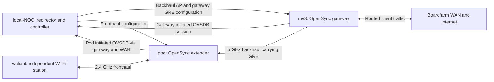
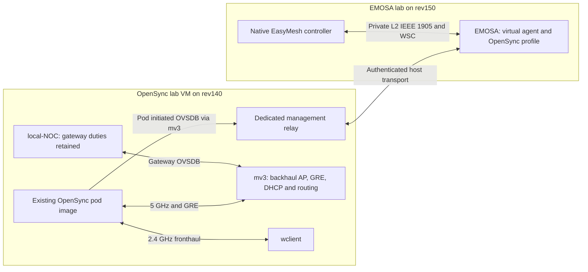

# Integrate the opensync-lab extender with EMOSA

**Status: evaluation and plan only, 2026-09-23. No integration has been executed.**

Recommendation: first reuse the existing OpenSync pod **in the opensync-lab VM**,
keeping mv3 and wclient beside it. Let EMOSA reach its management interface through
a controlled connection. Preserve the working image and baseline before any
handover. Rebuilding or importing the pod into EMOSA's VM is a later reproducibility
option, not a prerequisite for proving the adapter against actual OpenSync managers.

This is a meaningful intermediate milestone: a native EasyMesh controller would
configure an extender running OpenSync's actual `cm`, `owm`, `nm` and OVSDB, rather
than EMOSA's independent simulated radio manager. The radios remain hwsim and the
pod image contains explicit lab adaptations. Success would prove a **containerized
OpenSync integration**, not unchanged physical-pod support or general EasyMesh
conformance.

## 1. Scope, evidence and how to use this plan

The evaluation inspected:

- EMOSA at `58763f3b1b570230d8f80d5e5f2139304801b851`, on rev150 in
  `/home/rev/git/emosa-lab`. Its 1,517 unit tests and all four GitHub CI jobs passed.
- `boardfarmdevs/opensync-lab` on **rev140**, at
  `/home/rev/yocto/opensync-lab`, HEAD
  `77318dc2e812319b5ddae41ef17491c34d2e6d3c`, **with uncommitted changes**.
- The running VM **`mvx-opensync-0922`**, its containers, selected non-secret OVSDB
  columns, schema, process names, image identity, binary hashes, association state
  and existing result files. These were read-only observations. No endpoint was
  redirected, configuration written, manager stopped, container rebuilt, test
  traffic generated or physical pod contacted by this evaluation.

The source tree is undergoing the `mvx-opensync` → `opensync-lab` rename. Its README
already uses newer names; the actual VM still used the old name during this review.
The working tree also changes default SSIDs/provider configuration, so a new build
is not automatically equivalent to the running image. Freeze a revision plus its
reviewed local changes before implementation; do not reset somebody else's checkout.

Source references below are paths relative to the **rev140 opensync-lab checkout**
unless prefixed with `EMOSA:`. The
[source repository](https://github.com/boardfarmdevs/opensync-lab) and its
[reviewed committed source lock](https://github.com/boardfarmdevs/opensync-lab/blob/77318dc2e812319b5ddae41ef17491c34d2e6d3c/pod/opensync/sources.lock)
provide the baseline. Working-tree observations are explicitly additional to that
commit. Private raw schema snapshots from this evaluation are in EMOSA's ignored
`.lab/opensync-integration-review-20260923/`; they are not a published integration
acceptance corpus.

**Execution boundary:** sections 6–9 instruct a future coding agent. Nothing there
has been implemented or run as part of this planning task. Future commands must
use the then-current VM name and a named, isolated experiment. Existing deployment
scripts are not harmless discovery commands: some delete and recreate containers.

## 2. What opensync-lab offers today

### 2.1 Components and observed state

| Component | Role and current evidence |
| --- | --- |
| rev140 host | Builds images and hosts the nested-LXD VM. Keep its Yocto caches, source worktrees and other VMs intact. |
| VM `mvx-opensync-0922` | Linux `6.8.0-139-generic`; hosts the common hwsim medium, LXD containers and Docker WAN/NOC infrastructure. Treat the VM name as configuration, not identity. |
| `mv3` | Containerized RDK-B gateway, reporting OpenSync **4.4.0.0**, model `F5685LGE`, node ID `mv3`. Its local-NOC controller session was connected. It supplies backhaul AP, LAN DHCP and routing. It is not the native prplMesh controller currently used by EMOSA. |
| `pod` | `HWSIM_POD`, reporting **`6.6.1.0-0-g1dad64-mods-mvx-local`**. Actual OpenSync managers, OVSDB 2.8.7, hostapd and wpa_supplicant run inside it. Node ID/serial was `MVXPOD0252535FA3A0`. |
| Pod radios | `phy2` / `home-ap-24`: 2.4 GHz, channel 6, HT20, BSSID `82:00:00:00:02:00`. `phy6` / `bhaul-sta-50`: connected to mv3 on channel 44. PHY names come from the shared VM pool and can change after recreation. |
| Pod management/data path | `bhaul-sta-50` had `169.254.1.12/25`; pod GRE `g-bhaul-sta-50` reached mv3 `169.254.1.1`. `br-home` had `192.168.0.157/24` through GRE. The pod has no wired management NIC; its `eth0` is a dummy identity interface. |
| `wclient` | Alpine 3.22 with one hwsim radio and wpa_supplicant. Read-only inspection showed WPA2/CCMP association to the pod's BSSID and `192.168.0.253`, default route via mv3 `192.168.0.1`. |
| `local-noc` | Running Docker service on `10.101.0.40`, redirector TCP 6640 and controller TCP 6641. It terminates OVSDB JSON-RPC, records exchanges, maintains database mirrors and orchestrates the mesh. It is not a telemetry/data-lake service. |
| WAN infrastructure | Boardfarm Docker containers `dhcp-cpe1`, `wan-cpe1` and `lan-cpe1`; tagged mv3 WAN, DHCP, NAT and test access. These dependencies must survive a pod control-plane handover. |
| Other lab resources | `mv3-002` was also running. It belongs to an earlier mesh experiment; this plan neither needs nor authorizes deleting it. |

The existing `/var/lib/mvx-opensync/pod.status` recorded PASS at
`2026-09-23T15:12:35Z`; `client.status` recorded PASS at `15:13:20Z` for association,
DHCP, gateway lease, ICMP, DNS and HTTP. The evaluation read those results and
confirmed current association/control connectivity; it did **not** rerun the
internet tests or independently audit their original packet captures.

Newer scripts use `/opt/opensync-lab` and `/var/lib/opensync-lab`; the running
baseline still exposes old paths. Discover actual staging/state locations rather
than assuming a source rename migrated the VM. `local-noc` is a Docker container;
an inactive `systemctl is-active local-noc` is not proof it is down. Likewise,
pod hostapd/OVSDB are started by OpenSync hooks, not necessarily separate active
systemd `wpad`/`openvswitch` units. Verify processes, sockets and behavior.

### 2.2 Current flows



The pod is the OVSDB **server**, even though it initiates the TCP connection. The
NOC or EMOSA acts as the OVSDB **client** on that accepted connection: it asks for
the schema, monitors tables and submits transactions. The redirector first reads
`AWLAN_Node` and writes `manager_addr`; the connection manager then connects to
the controller endpoint. Merely accepting a TCP connection is not onboarding.

`local-noc/noc.py` performs this redirector/controller exchange and answers echo
requests. `local-noc/mesh.py` performs additional essential work:

1. Configures mv3's backhaul AP, currently `wl1.1`.
2. Observes backhaul clients/leases/neighbors and creates mv3's GRE endpoint and
   bridge membership for each pod. The pod's own `cm` creates its end.
3. Creates a pod fronthaul VIF, its radio reference and `Wifi_Inet_Config` if absent;
   chooses the radio's channel and mode.

Do not stop all of local-NOC to eliminate a competing pod writer: cold/reconnected
backhaul can depend on its **gateway** reconciliation. Its current code has no
per-pod exclusion option and redirects every node to the same controller address.
Those are explicit integration work items. The pod path creates missing fronthaul
rows; it does not continuously repair every field on an existing VIF. This still
constitutes competing authority on reboot/recreation and radio changes.

Both node sessions were seen by NOC behind the same WAN NAT address. Source IP
alone cannot distinguish mv3 from the pod. The pod's actual connected socket was
owned by `ovsdb-server` and pointed to `10.101.0.40:6641`. In one live read its
`Manager.target` was empty while the socket and `is_connected` were live. Use
correlated identity, socket and NOC observations rather than that field alone.

## 3. Exact versions, patches and image provenance

### 3.1 Pod source composition

| Repository | Pinned commit | Observed local Git tag |
| --- | --- | --- |
| `plume-design/opensync` | `1dad64e97fa014616ec383ce9499369e50c9eb7f` | `V_6.6.1.0` |
| `plume-design/opensync-platform-cfg80211` | `8d84c5eed29eeea5c02e8ba9681ce59ba20f9d7c` | `V_6.6.1.0` |
| `plume-design/opensync-vendor-openwrt-template` | `c8057e54a1a2c9248ffb1cb502cce677a1ec00c5` | `V_6.6.1.0` |
| `plume-design/opensync-service-provider-local` | `c6940b6e588fc0465738d3f569d32349d311b403` | `V_5.4.0.0` |

The lock file describes the composition as release 6.6.1.0, but the provider
repository's pinned object has the older tag above. Record the four exact commits;
do not assert that every constituent repository has a 6.6.1.0 tag. The build uses
the lab's separate **`mvx-local` provider overlay**, not just the upstream local
provider unchanged.

Other material inputs:

- Target `HWSIM_POD`, deployment profile `mvx-local`, native x86 build on Ubuntu
  20.04 rather than an OpenWrt SDK. The rootfs is exported into an LXD system image.
- Open vSwitch/OVSDB **2.8.7**. The pod uses its database server and Linux networking;
  the image does not run `ovs-vswitchd`. mv3's `brlan0` is an OVS bridge. Do not use
  the same bridge-management assumptions on both nodes.
- hostap base **`d9d5e55c5484b7a206efb7958b5b3ed72ef8a47a`**, with two local patches
  described below; hostapd and wpa_supplicant are built together.
- c-ares package **1.18.1-1ubuntu0.22.04.3**, native libraries and compiler inputs
  from the build/runtime Dockerfiles. Ubuntu image tags, apt contents and several
  pip dependencies are not fully pinned by content digest. Source commit pinning
  alone therefore does not establish a bit-for-bit reproducible image.

### 3.2 Patch and adaptation register

These are part of the evaluated platform, not optional implementation details.
Preserve them and record exact digests when moving or rebuilding the pod.

| Input | Change and relevance | Required regression |
| --- | --- | --- |
| `pod/opensync/patches/core/0001-osw-nl80211-per-phy-band-filter.patch` | Adds `OSW_DRV_NL80211_PHY_BAND_<phy>` filtering in `osw_drv_nl80211.c`. hwsim exposes several bands per PHY; OpenSync's one-band model otherwise produces duplicate channel values. This changes reported capabilities/channel inventory. | Each assigned radio exposes the intended band; no duplicate-channel insert failure; no claim that the filter measures RF capability. |
| `build-pod.sh::patch_owm_prep()` | Rewrites `52_owm_prep.sh` in the image staging context to name bands by PHY position. This is a generated-file modification outside the core Git diff. | VIF names and band filters agree after relaunch with different PHY allocations. |
| `pod/build/hostap-patches/990-ovs-bridge-support.patch` | Adds OVS bridge handling to hostap's Linux bridge helpers; retained from the OpenSync SDK overlay. Pod Linux-bridge operation and gateway OVS operation are distinct. | Hostap starts/attaches the intended BSS without incorrect OVS calls; review error paths when reusing elsewhere. |
| `pod/build/hostap-patches/991-nl_cmd_frame-event-gen.patch` | Forwards management/disconnect events to hostap control sockets for OpenSync's backend. Adapted for the pinned hostap without OpenWrt ubus context. | Association/deauth/disassoc events carry the actual station/reason; presence of this patch does not establish final EasyMesh statistics delivery. |
| `pod/opensync/vendor-overlay/build/HWSIM_POD.mk` and `build/compat/hwsim_pod_compat.h` | Native compiler/include/link settings, glibc `strlcpy` compatibility and `_GNU_SOURCE`; avoids duplicate hostap objects. | Record compiler, dependency and output hashes; all required dynamic libraries resolve. |
| `pod/opensync/vendor-overlay/kconfig/targets/HWSIM_POD` | Systemd paths, bootstrap backhaul STA list and MTU, dummy identity Ethernet. Enables an MTK helper build dependency but selects null IGMP/MLD/UPnP backends. | Confirm generic nl80211 operation; scope initial acceptance to demonstrated IPv4 unicast behavior, not multicast/UPnP or MTK hardware. |
| `pod/opensync/service-provider/mvx-local/` | Local-NOC destination and bootstrap Wi-Fi credentials. Unquoted bootstrap values are intentional for this build. Defaults are currently being renamed. | Bootstrap SSID/key and gateway backhaul match; keep populated secrets private and record only references in manifests. |
| `pod/image/files/mvx-pod-prep`, `mvx-pod-bootstrap` | Removes inherited netdevs, derives dummy `eth0` identity from container name, binds radio rows to real PHY names, limits backhaul STA to 5 GHz and writes band filters. | Stable identity for the same named unit; unique identities for copies; selected fronthaul operations leave backhaul rows untouched. |
| `pod/image/files/{opensync.init,openvswitch.init,wpad.init}` and image Dockerfile | OpenWrt-style lifecycle on Ubuntu, BusyBox shell, global hostap control sockets, OVSDB bootstrap and PSM restore. OVSDB startup copies `conf.db.bck` into a new runtime DB. | Reconnect/restart and cold-start semantics; distinguish persisted settings from values restored by another writer. |
| `meta-mvx/.../hal-wifi-hwsim/0001-*` | Gateway HAL reports actual VAP security/state and avoids restarting an already running BSS during repeated apply. | No periodic backhaul drop when mv3's Wi-Fi manager re-applies configuration. |
| `meta-mvx/.../hal-wifi-hwsim/0002-*` | Gateway HAL forgets stations on deauth/disassoc and re-authentication. | Pod disconnect/rejoin completes the four-way handshake. These HAL patches belong to mv3, not the pod's cfg80211 implementation. |
| `guest/50-opensync.sh`, `guest/common.sh` | Gateway certificate selection, IPv4/IPv6 connection-manager workaround and `dnsmasq` bind-dynamic repair. | Gateway management and LAN DHCP survive the selected recovery tests. Keep gateway OpenSync 4.4 behavior separate from pod 6.6 behavior. |
| `boardfarm/patches/0001-*`, `0002-*`, rebuild hook | WAN build-source and route fixes; lab IPv6 rejection assists IPv4 fallback. | Independent IPv4 traffic succeeds over the intended WAN; failure is not misattributed to EMOSA. |
| `doc/proposed/0001-mv3-*.patch` | Proposed upstream certificate/DHCP fix, documented as untested. | Do not describe it as an applied image patch. Runtime workarounds are the observed path. |

The gateway's retained source pins include OpenSync core
`ab9ba94e7cbba71ea7e226f1fc0413e61964a588`, platform
`71fdde5065a3930ba295ccadf998cd71ce661fcc`, vendor
`79cd82776100b83faf748189bf135b893c576f59` and provider
`c6940b6e588fc0465738d3f569d32349d311b403`. Its HAL pin is
`9f5a5c441e0e208a47bdfd64c02c35f7e283bfbd` plus the two lab patches. These are
recorded build inputs, not a complete independent reproduction of the running
gateway image. mv3's reported 4.4.0.0 must not be confused with the pod version.

### 3.3 Running artifact anchor

The live pod's LXD `volatile.base_image` was
`68f3f495fb9306c9896b35ad7b11db7c9f2ccd80b7ea9492ad27010203ce8f51`.
Its alias was `mvx-pod-f9545d744f3f`, description dated `20260923012050`.
The retained rootfs and metadata are under `/home/rev/yocto/mvx-pod-work/out/`:

| Artifact | SHA-256 |
| --- | --- |
| `mvx-pod-20260923012050.rootfs.tar.gz` | `f9545d744f3ffae707db0bd3f28151de4d4b3110f47c53ad85574770de868160` |
| `mvx-pod-20260923012050.metadata.tar.gz` | `62c723b7c4653611e68b74f31ee2f1c1ae8463d0fc9fabb1f501750fda65f49f` |
| Pod `/usr/opensync/bin/cm` | `8350485c0d034dd57b30b54488665aa2b4691dab4236ec7bacf74dc347c32c80` |
| Pod `/usr/opensync/bin/owm` | `dd0fb4260a4f40c412fe5956d2dc1479fb0da938422807afd8cfb3e7079a0a4d` |
| Pod `/usr/opensync/bin/nm` | `b8b7005d82eb10c884c81e1bc3cc7ec8f4f66e5639e324dbaef6d7d17ce1da15` |

Those three running executable hashes matched the current retained build-rootfs
files. This is partial provenance, not a whole-image or shared-library identity
proof. A newer `20260923094606` image also exists; do not choose it merely because
it is newest. Live startup-helper hashes differ from some current source files,
and `52_owm_prep.sh` is intentionally changed after rootfs assembly. Include image
overlays/generated files and loaded libraries in the future complete manifest.

Selected working-tree patch digests at review time:

| Patch | SHA-256 |
| --- | --- |
| Pod core band filter `0001` | `871dcf5845adb5d09c6f5d687c6ec5921a5ba6bd952aa4e9a12c348b202bc099` |
| Hostap OVS `990` | `22b39ef17829f86ed0d02a72a927534a51cc7d27ed21954769c7ad7601903c9c` |
| Hostap events `991` | `75abb2c0d35315af6cdcabaf0ce74855f90b16c7961b01451f8d2e6d73a8ceef` |
| Gateway HAL state `0001` | `7b2c79d33e3eb250f110c9b7207015d13b9a9fec771e3dd5c9ae1ebdb99cc817` |
| Gateway HAL station lifecycle `0002` | `ec7620b4c16ab1770dec0c73f238a65da15ebcc6eb683e1ef2e549779cb0aa80` |

These identify reviewed patch files, not proof that the dirty working tree is the
exact source of every running object. Preserve the applied-source diff and build
record as well; comment-only rename changes can alter a patch's digest.

## 4. Compatibility with EMOSA: findings and required changes

| Area | Finding | Integration consequence |
| --- | --- | --- |
| OVSDB protocol | Pod OVSDB 2.8.7; EMOSA uses upstream Python OVS 4.0.0 with basic monitor. | Exercise actual echo, schema, monitor updates, transactions, timeouts and reconnect against this server version. Shared JSON-RPC does not prove full compatibility. |
| Schema | Pod source/live schema **7.11.414**, 135 tables; EMOSA reference **7.11.413**, 135 tables, core commit `78d8a7194d5e77635877cc456231e7be5cf03d68`. | Preserve the existing simulation reference. Add an explicit new profile; do not replace the old fixture globally. |
| Normalized schema differences | Source-to-source difference is added `beacon_protection` in VIF Config/State. Live get-schema omits the explicit maximum-int bound on `Wifi_Speedtest_Status.DL_bytes/UL_bytes`; unrelated to selected Wi-Fi columns. | EMOSA's current selected-column structural comparison passes on the live schema. That is useful compatibility evidence, not permission to write or whole-schema equivalence. |
| Backend admission | `EMOSA:src/emosa/config.py` rejects `hardware`/`opensync-native`; `OpenSyncBackend` accepts only `ovsdb-sim`. | Introduce a named, explicitly gated OpenSync-container profile with truthful evidence labels. Do not label the pod as the existing simulated-manager backend to bypass admission. |
| Security representation | Local-NOC creates `wpa_key_mgmt=wpa-psk`, `wpa_psks` slot `key--1`, RSN CCMP. EMOSA expects `wpa2-psk` and slot `key`. Config optional booleans may be unset while State reports false. | Qualify semantic mapping from actual manager behavior; preserve the selected PSK slot and other entries. Do not rename the actual fields to make the existing fixture pass. The live client's WPA2/CCMP result supports, but does not complete, this qualification. |
| Resource scope | Two radios; 2.4 GHz fronthaul separate from 5 GHz STA/GRE uplink. `multi_ap` is absent on the selected AP. Both AP and backhaul State can reference associated-client rows. | Bind the complete selected radio/BSS graph and explicitly preserve the other radio. Resolve absent role metadata from qualified profile facts, not a global missing-means-none rule. Filter clients by the selected BSS reference graph, not the whole table. |
| Native worker | `EMOSA:src/emosa/simulation/native_onboarding.py` hardcodes identities, radio assumptions, local run paths, fixture capabilities and source helpers. | Build a dedicated configurable integration runner/projection using reusable protocol and operation components. Do not run the old staging/runner over this VM. |
| Northbound topology | The virtual agent has a real controller-side L2 adjacency; the pod uplink is Wi-Fi/GRE through an OpenSync gateway. | Keep those identities/links distinct. Do not describe the SSH tunnel, WAN NAT or GRE path as the previous calibrated Ethernet neighbor profile. |
| State application | Native `owm`/`nm` publish actual State. Existing engine needs a qualified freshness/observation contract. | Establish actual Config→State→hostap/client causality, stale-State withdrawal and manager failure behavior. Do not insert EMOSA's simulated manager beside OpenSync. |
| Statistics format | Pod source `opensync_stats.proto` exactly matches EMOSA's pinned file, SHA-256 `0bf534da0d677d7bb41a4f591fcb1ad0b25a9f1c9eedf3abc5b69ed16ef9a6cd`. | Reuse format decoding after qualification; do not infer matching sampling, completeness, clock, epoch or units. |
| Statistics delivery | Live pod had no `Wifi_Stats_Config` rows, and empty MQTT settings/topics/headers. | Configure and qualify a private native telemetry path as an integration phase. Existing NOC JSON-RPC records are not a stream of OpenSync statistics reports. |
| Hardware metrics | The new managers still run on the same hwsim kernel family with known dummy survey values. | Actual OpenSync does not automatically solve noise, airtime, retry or ESP qualification. Retain the BBF/source-accounting limitations. |

Raw artifact digests: retrieved live schema
`3e3cc16799d2d53e8bdf4eb1d6e66d722d74441d2429b7094307ea4bd5d84c8e`;
pod source schema
`c9c997bb3b65adef77c808096d76d976f62026ae7541d8a6203d7a700bbf1fd8`.
These are hashes of different serialized artifacts, not a claim that formatting
differences alter column semantics. The comparison above normalized both with
the upstream OVS schema parser before comparing definitions.

## 5. Deployment choice and target architecture

### 5.1 Keep the pod in opensync-lab first

| Option | Benefits | Work and limits | Recommendation |
| --- | --- | --- | --- |
| EMOSA reaches the current pod from its existing VM | Preserves the working OpenSync image, gateway, RF medium and client; separates adapter bugs from rebuild differences. | Needs controlled management transport, explicit ownership handover and a dedicated EMOSA runner/profile. | **First integration.** |
| Run an EMOSA worker and native controller in a separate namespace/container inside the OpenSync VM | Keeps southbound transport local and avoids a cross-host forwarding path. | Stage Python/native dependencies and a private IEEE 1905 segment without touching the hwsim pool or WAN. | Useful fallback if remote transport dominates the experiment. |
| Import the pod image into EMOSA's current VM | Reuses an immutable artifact and puts orchestration under EMOSA. | The image has no wired uplink; mv3/backhaul services and wclient must move or be recreated in the same kernel's RF medium. Existing EMOSA lab has ownership/resource assumptions. | Later isolated reproduction; do not import only the pod and expect it to hear rev140's mv3. |
| Rebuild the pod from an EMOSA-owned recipe | Could package the evaluation into one project. | Risks a divergent OpenSync fork, dependency drift and duplicate fixes. Requires all source/patch/provider/image pins and a new baseline. | Prefer consuming a pinned opensync-lab artifact/build interface rather than copying its implementation. |

hwsim radios in different VMs do not share a medium by virtue of IP connectivity.
Cross-VM Wi-Fi simulation would require an explicitly designed medium transport,
which neither lab currently qualifies. Keep **mv3 + pod + wclient in one VM**.

### 5.2 Proposed first layout



This is an evaluation topology. The gateway and reference EasyMesh controller
are separate lab components; later deployment can place the controller/adapter
on a router. The initial experiment does not require installing prplMesh in mv3.
IEEE 1905 stays on the controller/adapter L2 segment. It is not carried by an SSH
TCP forward, and the pod does not become a native IEEE 1905 participant.

Telemetry is a separate flow: native pod statistics → a private MQTT receiver →
qualified EMOSA measurements → EasyMesh reports to the controller. An optional
export can also carry the retained telemetry to ODH, the network-center data lake.
Its ingestion interface is still to be selected; neither OVSDB connectivity nor
the existing local-NOC supplies that interface. A complete ODH deployment is not
required for the first onboarding demonstration.

Use two southbound access stages:

1. **Read-only qualification:** an authenticated host/container-bound connection
   to the pod's existing Unix OVSDB socket. A relay/tunnel may expose it only to
   EMOSA's local endpoint. This adds no second configuration writer and requires
   no pod cloud redirection. Use `qualify-pod` after the private connection file
   and relay are prepared; the evaluation's direct read-only queries do not
   replace its formal profile output.
2. **Pod-initiated managed session:** after ownership and routing are prepared,
   direct only this pod's controller assignment to a dedicated relay endpoint on
   the existing reachable WAN segment. Carry the stream to an EMOSA loopback
   listener through authenticated host transport. Retain the gateway's original
   NOC destination and the private IEEE 1905 link.

The relay/tunnel configuration is **to be implemented and tested**, not an
existing feature or a command supplied by this plan. EMOSA currently rejects
arbitrary remote plaintext endpoints. Do not remove that guard. An SSH tunnel
authenticates hosts, not the pod's self-reported serial: bind the experiment to
the authorized LXD instance, isolated relay, observed route and expected node
identity, and test rejection of an unexpected node. Neither NAT IP nor
`AWLAN_Node.id` is a production authentication credential. Future non-isolated
or physical deployments need separately qualified endpoint trust, such as mutual
TLS. Private credentials and populated connection files remain outside Git.

### 5.3 Ownership split

| Resource | Owner during the first managed experiment |
| --- | --- |
| mv3 backhaul AP, DHCP/WAN, gateway GRE and bridge membership | Existing OpenSync gateway managers plus local-NOC's gateway-only reconciliation |
| Pod backhaul credentials, 5 GHz STA, connection-manager/GRE operation | Frozen bootstrap/profile and native OpenSync managers; outside EMOSA's first write scope |
| Selected pod 2.4 GHz fronthaul SSID/PSK and allowed BSS configuration | EMOSA, driven by authenticated controller WSC |
| Pod radio/VIF/inet **State** | Native OpenSync managers; EMOSA observes, never fabricates State |
| NOC redirector assignment | Per-node routing policy with an explicit selected-pod destination and gateway unchanged |
| Client test configuration and probes | Independent experiment observer, bound to the pod BSSID |
| Telemetry sampling/destination | One declared owner under the experiment's profile, after native publisher qualification |

Implement per-node NOC redirect assignment and writer exclusion before enabling
EMOSA writes. Verify the exclusion persists through both NOC and pod reconnects.
Keep console recovery available if management over backhaul fails. A broad NOC
shutdown, a permissive transaction proxy or a second cloud writing the same pod
does not satisfy this split.

## 6. Step-by-step implementation handoff

### Phase 0 — Freeze an identifiable baseline

**Where:** rev140 host, read-only discovery first; EMOSA checkout for the manifest.

1. Resolve the current VM name without renaming it as part of the experiment.
   Useful existing read-only commands, with the current name substituted, are:

   ```bash
   ssh rev140 'git -C /home/rev/yocto/opensync-lab status --short'
   ssh rev140 'git -C /home/rev/yocto/opensync-lab rev-parse HEAD'
   ssh rev140 'lxc list --format csv -c ns'
   ssh rev140 'lxc exec mvx-opensync-0922 -- lxc list --format csv -c ns4'
   ssh rev140 'lxc exec mvx-opensync-0922 -- docker exec local-noc noc-ctl nodes'
   ```

2. Agree a reviewed opensync-lab source snapshot, preserving current uncommitted
   work. Record commit, dirty diff digest if applicable, all four OpenSync source
   revisions, overlays, patch hashes, Docker inputs, rootfs/metadata hashes,
   expanded LXD profiles, VM kernel/module versions and actual running binaries.
   Include hostap, shared libraries and image-time startup modifications.
3. Record NOC/provider settings through private references. Keep the original
   cloud/bootstrap destination, PSK slot, persistence behavior and recovery path.
   Record actual selected RUID/BSSID, container identity and PHY allocations.
4. Preserve existing baseline evidence. Before disruptive later tests, select a
   disposable copy of the complete VM or a scheduled exclusive owned lab. A VM
   copy must have isolated networks/identities before it can run beside the original.
5. Retain the original EMOSA simulator and green native baseline independently.
   Resolve the optional native controller build from its existing provenance,
   including onboarding, lifetime and sparse-ESP fixes; do not silently switch peers.

**Expected result:** an unambiguous experiment manifest, restorable baseline and
source/image distinction. **Stop** if an active other experiment or unresolved
rename makes the target ambiguous. Do not use `build-pod.sh all` to investigate:
its `sources` stage deletes/recreates source directories under `MVX_POD_WORK`.

### Phase 1 — Formal read-only pod qualification

**Where:** EMOSA host/worker and an authorized rev140/VM access endpoint.

1. Establish the authenticated, narrowly scoped read-only transport to the
   pod socket. Keep its existing NOC connection in place. Validate endpoint
   direction and container identity independently of the OVSDB-reported serial.
2. Populate an existing credentials-free qualification example locally. Use
   absolute secret/reference paths supported by the loader. Only the populated
   file's absolute path is supplied to the coding agent.
3. Run the existing collector against a **new** output directory:

   ```bash
   uv run emosa qualify-pod \
     --connection /absolute/private/pod-connection.json \
     --output /absolute/private/qualification/opensync-lab-pod-01
   ```

   The collector is existing software; the preceding access setup is planned
   work. See [pod qualification](../guides/pod-qualification.md) for the loader
   contract. This command must remain read-only.
4. Compare actual schema types, optional cardinalities and radio/VIF references
   with the profile. Separately review security layout through a restricted
   private observation: the public qualification collector intentionally omits
   PSK/security maps. Retain names/shape/fingerprints, not key material in public
   evidence.
5. Verify a second schema/inventory read after a benign connection loss. Record
   the new transport generation and stable device/resource identity.

**Expected result:** actual schema and draft profile with `writable=false`;
complete two-radio inventory and explicit credential/source qualification gaps.
Negative checks: wrong expected identity, unavailable endpoint, unknown schema
column and changed resource references must not enable writes. No dependency on
the WFA spreadsheet or full AP metrics is needed for this phase.

### Phase 2 — Prepare ownership and connection lifecycle

**Where:** isolated opensync-lab experiment and EMOSA listener/relay configuration.

1. Add per-node redirector targets and pod writer exclusion to local-NOC, or an
   equivalently scoped external bootstrap component. These controls do not exist
   as CLI flags today. Keep gateway AP/GRE reconciliation active.
2. Design the warm handover with the current fronthaul already present. Observe
   every potential writer: NOC, OpenSync bootstrap/PSM, connection manager and any
   other cloud. Limit exclusion to the selected pod/resources rather than disabling
   the pod's native managers, which are required to apply EMOSA's requests.
3. Prepare and test the dedicated relay, listener and return route before assigning
   the pod to it. Preserve credentials/bootstrap that keep the 5 GHz uplink alive.
4. Transfer the selected pod's manager assignment through the planned bootstrap
   mechanism. Use actual OpenSync connection-manager transitions; do not assume
   editing `Manager.target` alone will survive `cm` reconciliation.
5. Observe pod-initiated connection, database identity, schema, monitor, echo and
   reconnect. Initially keep EMOSA transactions read-only even after handover.

**Expected result:** one trusted experiment session in EMOSA, gateway still under
NOC, pod and client traffic path preserved, zero EMOSA Config writes. Exercise
wrong-node admission, listener unavailable, tunnel interruption and NOC reconnect;
there must be no automatic competing fronthaul writes or false connected verdict.

### Phase 3 — Implement and qualify the container mapping

**Where:** EMOSA code and isolated pod experiment; retain OpenSync image unchanged.

First add deterministic mapping tests using sanitized examples from the actual
schema and row graph. Exercise guarded transactions against a disposable OVSDB
instance using that schema before enabling writes to the native pod. Cover both
PSK representations, unset/false normalization, unrelated backhaul preservation,
wrong identity, schema/reference drift and conflicting updates. Keep the existing
simulation profile and its test suite passing; actual manager/application tests
below establish behavior that a database-only test cannot prove.

1. Add a named profile, suggested identifier `opensync-lab-hwsim-6.6.1-v1`, with
   explicit target artifact, schema, trust, resource scope and proof classification.
   This identifier and backend admission are **proposed**, not accepted settings
   in the current loader. Keep physical/hardware gates separate.
2. Implement semantic normalization for the actual `wpa-psk`/RSN-CCMP layout and
   `key--1` slot. Establish optional/unset Config-field meaning from the selected
   manager, not a universal default. Preserve unrelated PSKs and configuration.
3. Bind the selected radio's entire BSS graph, allowing the observed separate
   backhaul radio to remain present and unchanged. Qualify absent `multi_ap`
   metadata explicitly. Refuse additional/shared BSSs until their scope is reviewed.
4. Reuse the durable engine, guarded transactions, operation journal and secret
   store. Retain expected row/version/reference guards, identity binding and
   idempotency. No global removal of the existing safety/admission checks.
5. Qualify native State: compare Config transaction, actual `owm` behavior, fresh
   VIF/radio State, hostapd/nl80211 and the independent station. A stale State row
   after a manager failure must not count as freshly applied configuration.
6. Exercise a semantic SSID/PSK change on **home-ap-24 only**, then restore it
   through a new guarded operation. Test duplicate intent, lost reply, concurrent
   writer conflict and manager failure in the isolated experiment.

**Expected result:** actual OpenSync applies the requested fronthaul configuration,
the independent client observes it, and backhaul/GRE stay intact. A withheld or
failed apply stays committed/unobserved or failed; it never becomes applied from
Config alone. Retain this as semantic integration evidence, not EasyMesh onboarding.

### Phase 4 — Connect the native EasyMesh controller

**Where:** dedicated EMOSA integration runner; controller and adapter share a private
L2 segment. The OpenSync RF/data plane remains in its current VM.

1. Factor/reuse the tested discovery, WSC, reporting and operation components,
   while replacing the fixture-specific worker/projection. Supply actual inventory,
   stable virtual AL identity, reviewed RUID/BSSID binding and capability evidence.
2. Define the represented scope honestly. Start with the supported 2.4 GHz
   fronthaul procedure and preserve the 5 GHz OpenSync underlay. Decide which
   underlay facts the selected topology requires; do not invent a direct physical
   Ethernet link or a fully manageable two-radio EasyMesh agent. If that scope
   cannot satisfy mandatory selected reports, stop and extend the profile first.
3. Configure the desired SSID/key **only at the native controller**, using its
   established management API. EMOSA must learn them from authenticated WSC M2.
   The operation must bind to this pod rather than a fixture serial or MAC.
4. Capture IEEE 1905 independently, retain the causal operation/OVSDB/State trace,
   and inspect native controller radio/BSS inventory. Unknown client age or
   membership remains unknown, not an invented empty client list.
5. Run independent client authentication and traffic checks while the adapter
   remains active. Pin BSSID, verify no wired client bypass, use a local endpoint
   with fresh nonces for deterministic forwarding proof; internet probes are
   supplementary. Capture the actual GRE/data path separately from control traffic.

**Expected result:** native discovery → authenticated M2 → EMOSA operation → actual
OpenSync Config/application → observed State → controller radio/BSS inventory →
independent client traffic. An AL-only entry, successful OVSDB transaction or
already-working client does not pass. Label this first result **warm container-pod
onboarding**, with reporting/underlay limitations explicit.

### Phase 5 — Cold bootstrap, telemetry and recovery

1. Investigate what survives a pod restart. `openvswitch.init` copies the bootstrap
   database, `mvx-pod-bootstrap` recreates radio/backhaul rows, and PSM subsequently
   restores selected configuration. Verify actual behavior; do not assume the
   NOC-created fronthaul or redirected manager destination survives.
2. Implement a reviewed cold-start path. If fronthaul rows are absent, either prove
   a separately declared neutral resource bootstrap or implement guarded creation
   of the BSS/inet/reference graph from the authenticated controller operation.
   Do not have NOC secretly supply the target fronthaul SSID/key and attribute
   its work to EMOSA. The existing mapping only patches an existing BSS.
3. Configure a native telemetry path using OpenSync's supported settings. Confirm
   enabled managers/libraries, reporting configuration, MQTT endpoint/topic and
   actual produced Protobuf reports. The current empty configuration is a starting
   gap, not proof that a publisher already exists. Use private broker credentials.
4. Qualify complete per-BSS client membership/association age and counter epochs,
   timestamp freshness, connection offsets and final-session behavior. EMOSA's
   existing `StationSource` assumes one complete channel-6 snapshot within two
   seconds; actual native reports must satisfy a reviewed contract or require a
   different qualified decoder/collector. Backhaul clients must not become
   fronthaul clients through whole-table aggregation.
5. Complete AP/STA and final-session reporting using qualified native sources and
   the [BBF definitions](../protocol/bbf-data-elements.md). Determine what hwsim
   cannot measure. Do not fill gaps with dummy survey values or synthetic MQTT
   records while claiming native OpenSync telemetry. Preserve explicit gaps if
   additional source/estimator work is needed.
6. Test transport loss separately from actual Wi-Fi backhaul loss; then adapter
   process restart, OpenSync manager/database restart and a separately scheduled
   cold pod restart. Observe bootstrap destination, fresh monitor generations,
   lost-outcome recovery and absence of duplicate effects.

**Expected result:** genuine cold/bootstrap behavior has its own evidence; complete
native reporting, membership and counters have independent checks. A tunnel reset
does not prove recovery after the management-carrying backhaul disappears. The
existing calibrated EMOSA Ethernet peer-metric profile cannot be reused for GRE
or Wi-Fi without new media/source qualification.

### Phase 6 — Run the agreed 15-minute recovery acceptance

Use the [sustained acceptance criteria](../protocol/sustained-operation.md), now
bound to the actual OpenSync-container profile. Keep the adapter active for at
least **900 seconds** after initial onboarding; repeat client joins/leaves and
continuous independent traffic, with deliberate OVSDB transport loss and adapter
process restart. Add separately identified backhaul/cold-pod tests; do not fold
their gaps into unrelated acceptable outages.

Pass requires fulfilled selected mandatory controller procedures, complete
qualified AP/STA/final reporting, measured recovery, bounded resources and verified
restoration. Until reporting is complete, an operational/recovery pass must remain
distinct from full sustained acceptance. Do not weaken the original criteria just
because this is a newer backend.

### Phase 7 — Package a reproducible EMOSA-owned lab, if useful

Only after the remote integration passes should reproduction move into a new VM
owned by EMOSA. Prefer a pinned opensync-lab artifact/build interface and manifest;
keep its canonical OpenSync build/patch maintenance upstream in opensync-lab.

If a rebuild is selected, use a new `MVX_POD_WORK` and output directory, frozen
source inputs, all image-time transformations and explicit provider values. The
existing `build-pod.sh` subcommands are usable build tools, but `all` is destructive
to its selected source work area and `guest/70-pod.sh` / `80-client.sh` recreate
their named containers. Review each script before using it on a new owned lab.
The gateway also requires the pinned RDK source/cache access; importing the pod
alone does not supply mv3. Do not copy Yocto caches or existing VMs unnecessarily.

Keep mv3, pod and wclient on the same hwsim kernel. Use fresh isolated identities
and networks, retain artifact hashes, and repeat the baseline, warm/cold onboarding
and recovery tests. A rebuilt image is a new evaluated artifact even if all
OpenSync source commits are unchanged.

## 7. Test matrix and expected results

These are planned acceptance tests. Existing opensync-lab PASS files establish its
own baseline only; they do not count as EMOSA test results.

| Test | Required observation | Failure condition |
| --- | --- | --- |
| Baseline provenance | Correct VM/container/image, actual processes, schema and reviewed patches; current client BSSID/route | Latest source file or image alias substituted for running provenance |
| Read-only qualification | Actual schema/draft, no write transactions, NOC baseline unaffected | Any configuration change or writable profile inferred from schema alone |
| OVSDB 2.8.7 compatibility | Correct monitor snapshot/updates, echo, row encoding, guarded transaction and reconnect behavior | Silent protocol fallback, lost updates or wrong optional/map decoding |
| Endpoint/identity negative cases | Wrong node, wrong trust binding and schema/resource mismatch rejected before writes | NAT source IP or claimed serial alone grants authority |
| Writer ownership | Only designated EMOSA Config changes on pod; NOC still manages gateway GRE; exclusion survives reconnect/reboot | NOC/PSM/bootstrap races overwrite the result or satisfy it instead of EMOSA |
| Fronthaul semantic apply | Native manager State and independently read hostap/client match requested SSID/security | Config equality alone reported as applied |
| Untouched underlay | Backhaul credentials/STA/radio/GRE resources unchanged by fronthaul operation | Loss or alteration caused by an incorrectly broad transaction |
| Lost reply / duplicate M2 | One logical operation/effect; uncertain result reconciled from fresh observations | Duplicate reconfiguration, journal loss or invented success |
| Manager stalled / stale State | Dependent observation becomes unavailable; timeout/failure explicit | Old State continually refreshed by reading the same stale row |
| Native controller onboarding | Correlated real Search/Response/Early/M1/M2, causal operation, actual radio/BSS inventory | Device-list entry only, manual payload injection, packet rewriting or NOC-provisioned target credited to EMOSA |
| Wrong client key / correct key | Wrong key fails; correct key joins the intended BSSID and passes nonce traffic | Association to mv3/another AP or an alternate wired path satisfies the check |
| Fronthaul and backhaul membership | Only correct BSS members reported, with qualified association age | Upstream backhaul peer appears as a fronthaul client; unknown becomes empty/zero |
| Native telemetry | Real publisher fields, presence, units, epochs and clocks match independent observations | Matching `.proto` digest treated as measurement qualification |
| Final-session report | Same-session final counters and real disconnect reason; controller receipt/Ack observed | Last periodic sample or absent fields substituted for final values |
| OVSDB interruption / adapter restart | Fresh authority and transcript, no duplicate effects, independently timed recovery | Reuse of stale monitor/capability context or hidden manual repair |
| Wi-Fi backhaul loss | Both management and data outages attributed and recovered; mv3 GRE remains correctly orchestrated | A TCP relay-only test described as radio-path recovery |
| Cold pod start | Bootstrap destination/resource creation/persistence understood; genuine controller provisioning causal | Warm takeover presented as first-boot onboarding |
| Fifteen-minute acceptance | All original sustained criteria, required reports, traffic and recovery satisfied | Duration-only PASS with outstanding mandatory reports |
| Restoration | Correct node destination/writer ownership restored, baseline client path independently healthy | Blind whole-database rollback, copied stale credentials, lost changes to other resources |

Choose deadlines explicitly in the profile/test manifest before execution. The
existing bootstrap scripts allow minutes for first cloud/backhaul establishment;
that is not an EasyMesh response-time allowance. Keep protocol deadlines separate
from lab setup and physical/backhaul recovery budgets, and retain failures under
their original run labels.

## 8. Evidence and restoration contract

Each attempt needs a new run directory containing:

- Source/build/runtime manifest for both repos, VM/kernel, native controller,
  OpenSync image/libraries, NOC version, profiles and the declared procedure scope.
- Before/after complete relevant Config/State reference graphs; protected secret
  references/fingerprints; ownership and manager-assignment records.
- Independent IEEE 1905, southbound JSON-RPC, radio and GRE/data observations,
  including capture-loss counters and synchronized timing/error bounds.
- EMOSA operation journal, actual transaction outcomes, native manager observations
  and native controller inventory. Bind each to the same run and control context.
- Client authentication/BSSID/route and fresh-nonce traffic results; native
  telemetry records and independent decoded comparisons where claimed.
- Fault timestamps, reconnect generations, process exits/resource samples, cleanup
  actions and independently observed restoration. Record every manual intervention.

The NOC records every table/column and JSON-RPC message, potentially including
Wi-Fi credentials. Raw sessions, packet captures, database dumps and populated
private profiles must stay outside Git. Publish only a reviewed, sanitized
allowlist, preserving original hashes privately. Do not copy NOC captures into
public Pages simply because the current lab uses demonstration credentials.

Restoration is scoped: stop new EMOSA operations, reconcile unknown transactions,
return the selected pod to its prior manager destination, verify reconnection,
then return its NOC ownership and restore only owned changed fields under fresh
guards. Confirm fronthaul/client and gateway/GRE baseline independently. Do not
restore an old whole database over a live native manager. If management fails,
use the prearranged console recovery on the named isolated instance. VM/module
reloads must not be routine cleanup of a shared hwsim pool.

## 9. Work to finish before taking this on

**No large independent implementation milestone needs to finish before phases
0–1.** The current engine, read-only collector, bounded protocol components and
green tests are enough to start qualification when integration is authorized.
The new pod may provide the most useful actual source for the reporting work, so
finishing a complete synthetic telemetry publisher first would duplicate effort.

Small preparation worth finishing first:

1. **Consolidate current status references.** Some older onboarding/roadmap sections
   still describe historical KiB advertising and already-superseded gaps. Add a
   clear current-status entry point while preserving historical evidence. Use the
   current Profile-1 byte-unit rule and actual current native candidate.
2. **Record the baseline and acceptance tiers.** Pin the last green EMOSA revision
   and candidate artifacts, and distinguish read-only qualification, semantic
   OpenSync apply, warm wire onboarding, cold start and full sustained acceptance.
   This plan provides those tiers; implementation should turn them into run
   manifests/verdicts, not a single ambiguous PASS flag.
3. **Keep unresolved protocol decisions explicit.** Carry forward ESP byte
   conversion, AP unsolicited-delivery interpretation, remaining BBF width/source
   issues and exact WFA-package comparison. They matter before complete reporting;
   they do not block a read-only inventory or a separately bounded warm apply test.

The **essential pre-write work** is part of the integration itself: freeze the
OpenSync artifact, implement/test writer exclusion and bootstrap routing, qualify
the container mapping, and replace fixture assumptions in the runner. These are
real code changes; an endpoint edit or globally relaxed validation is insufficient.

Do not require router C/Rust porting, a complete ODH deployment, every optional
EasyMesh feature, multi-pod wire operation or a physical extender before this
experiment. Do not mark those objectives complete afterward either. The eventual
physical acceptance remains **real EasyMesh messages → EMOSA → unchanged physical
OpenSync pod → independently observed behavior**.

## 10. Code and document navigation for the implementing agent

| Repository | Start here |
| --- | --- |
| opensync-lab | `README.md`, `doc/PLAN.md`, `pod/opensync/sources.lock`, `build-pod.sh`, pod Dockerfiles, target/provider overlays and patches |
| opensync-lab bootstrap/ownership | `local-noc/noc.py`, `local-noc/mesh.py`, `guest/25-local-noc.sh`, `guest/50-opensync.sh`, `guest/70-pod.sh`, pod image lifecycle files |
| opensync-lab observers | `guest/80-client.sh`, existing status/session files, Boardfarm tests; note that deployment helpers recreate resources and opt-in OpenSync suites can alter SON/datapath |
| EMOSA admission and mapping | [config.py](../../src/emosa/config.py), [mapping.py](../../src/emosa/opensync/mapping.py), [radio_scope.py](../../src/emosa/opensync/radio_scope.py), [session.py](../../src/emosa/opensync/session.py), [qualification.py](../../src/emosa/qualification.py) |
| EMOSA native integration | [fixture worker to refactor](../../src/emosa/simulation/native_onboarding.py), [onboarding lifecycle](../../src/emosa/wire/onboarding.py), [operation bridge](../../src/emosa/wire/operation_bridge.py), [native experiment guide](../protocol/native-onboarding.md) |
| EMOSA reporting | [station decoder](../../src/emosa/telemetry/stations.py), [BBF bridge](../../src/emosa/wire/bbf_metrics.py), [AP reports](../protocol/ap-metric-reports.md), [final-session statistics](../protocol/final-session-statistics.md), [sustained criteria](../protocol/sustained-operation.md) |

Re-read applicable `AGENTS.md` instructions and both working-tree states before
implementation. Use rev140's canonical opensync-lab checkout for its changes and
the EMOSA checkout for adapter changes. Keep the first implementation reviewable
as a named profile/runner plus the narrow NOC ownership/routing changes, with
independent evidence at each phase.
