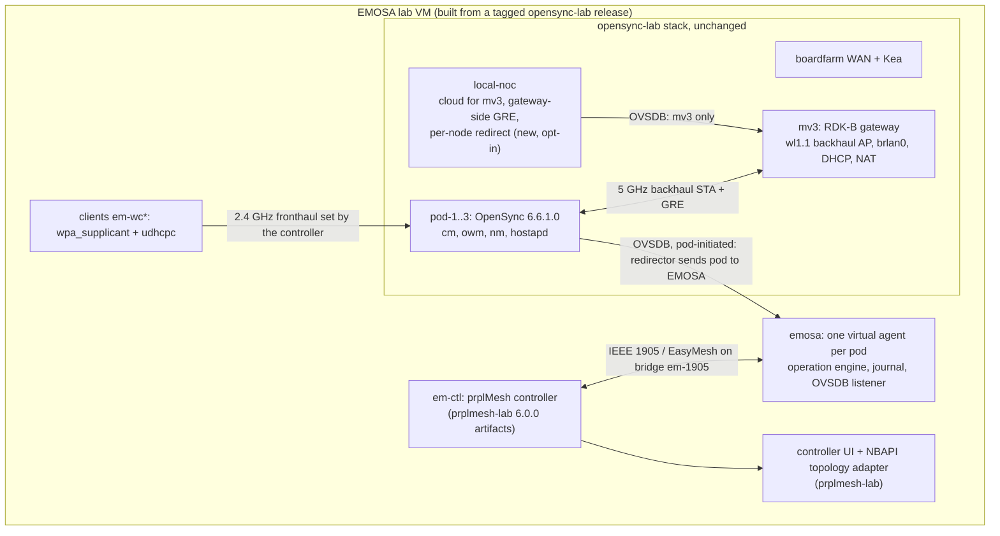

# Proof plan: an EasyMesh controller onboards OpenSync pods through EMOSA

Branch `claude/0923-clean`, proposed 2026-09-23.

## Status, 2026-09-24

**Proof v1 holds on the hwsim lab**
([run record](../evidence/opensync-lab-proof/README.md)):
- A prplMesh controller (EMOSA's candidate with its two patches) onboarded three
  unchanged OpenSync 6.6.1.0 pods as EasyMesh agents through EMOSA.
- The fronthaul came only from its M2, and each pod's own `owm` applied it.
- Six clients reached the internet.
- It held through an EMOSA restart, a pod restart (cold start) and a policy change.

| Milestone | Status |
| --- | --- |
| M0 baseline | New lab VM from opensync-lab `claude/emosa-hooks` and the current pod image; the old frozen baseline is not used |
| M1 read-only | Profile `opensync-lab-hwsim-6.6.1-v1` from the pod's source and live State (`src/emosa/opensync/pod_profile.py`) |
| M2 handover | Done: local-noc redirect ends the session, the pod's `cm` dials EMOSA; GRE stays with local-noc |
| M3 application | Done inside M4: guarded update, PSK slot replaced, State-confirmed, wrong key refused |
| M4 warm onboarding | Done: pod-1, controller DataElements + UI, client with internet |
| M5 three pods | Done: 3 virtual agents, 6 clients, policy change converges on all pods |
| M6 cold start | Done for "pod container restart": M2 creates the missing fronthaul; other cold definitions not run |
| M7 recovery | Done: 900 s workload m7-01 with client joins/leaves, adapter restart, transport cut, backhaul loss and controller restart, continuous traffic; passed |
| M8 reporting | Partial: channel procedures and Operating Channel Report (controller shows channel 6), policy config acknowledged; the pods' own statistics reach EMOSA over mutual-TLS MQTT with lab device certificates, but hwsim gives no survey data, so AP metrics cannot be qualified; station metrics are next |
| M9 | Second controller tried: the RDK-B unified-wifi-mesh controller finds EMOSA's agents (1905 discovery, topology queries) but rejects their EasyMesh 6.1 Profile-1 Search (it validates against 5.0 profile-gated rules); onboarding needs an R1 compatibility mode or Profile-2/3 in EMOSA. Physical pod, TLS transport, 5 GHz, EasyMesh backhaul not started |

Deviations from this plan, found by running it:
- `cm` ignores a new `manager_addr` while connected, so local-noc also ends
  the session (O1).
- Clients need `MVX_CLIENT_SSID/PSK`, because opensync-lab's `vm.env`
  overrides the environment.
- The agent must handle AP-Autoconfiguration Renew, or a policy change is never
  picked up.
- A cold pod needs M2-driven VIF creation (M6 moved into Proof v1).
- A restarted controller finds agents only through IEEE 1905.1 Topology Discovery,
  which EMOSA did not send; each agent now sends it every 60 s and starts a fresh
  attempt after 130 s without any message from its controller.

The plan below is unchanged from its review version.

## 1. The claim and what the proof looks like

**The claim:** an unmodified EasyMesh controller can discover, onboard and manage
unchanged OpenSync pods as EasyMesh agents, with EMOSA as the only new component.
The pods are then used by ordinary wireless clients.

**The demonstration:**
- The controller's own topology view shows an EasyMesh network.
  - The view is prplMesh NBAPI `Device.WiFi.DataElements`, rendered by the
    controller UI from prplmesh-lab.
  - It shows the controller, then `pod-1`, `pod-2` and `pod-3` as agents, then
    two wireless clients under each pod.
- The SSID and key come from the controller. Each pod's own OpenSync `owm`
  applies them.
- Clients join the pods and reach the internet.
- A policy change made on the controller reaches every pod.
- The network recovers from:
  - an EMOSA restart;
  - a transport cut;
  - a pod restart;
  - a backhaul loss.
- Every step can be checked against evidence that does not come from EMOSA:
  - wire captures;
  - OVSDB transcripts;
  - hostapd state;
  - client traffic;
  - the controller's own data model.

**What the proof is not:**
- It is not a physical-pod result.
- It is not a claim that every EasyMesh procedure is supported.
Both remain separate milestones (section 7, M9).

## 2. Starting point

- **EMOSA today.** Implemented, tested and well-guarded components:
  - 1517 unit and 59 OVSDB tests pass;
  - onboarding through a native prplMesh controller of a *simulated* OpenSync
    pod;
  - a 15-minute recovery run.
  No EasyMesh message has yet reached a real OpenSync manager stack. Every
  acceptance level against real OpenSync is `not_evaluated`. See
  [current status](current-status.md).
- **opensync-lab today** (`boardfarmdevs/opensync-lab` `53aadd9`):
  - an RDK-B gateway `mv3`;
  - three upstream OpenSync 6.6.1.0 pods, onboarding over a Wi-Fi backhaul with
    GRE;
  - six wireless clients;
  - `local-noc` as the cloud.
  Everything runs on mac80211_hwsim in one LXD VM and is rebuilt from pinned
  sources by stage scripts. Its
  [EMOSA evaluation](https://github.com/boardfarmdevs/opensync-lab/blob/main/docs/EMOSA-EVALUATION.md)
  found the pods suitable as EMOSA's target.
- **Known mismatches to resolve first:**
  - **Security encoding.** Real OpenSync 6.6 reports WPA2-PSK as `wpa-psk` with
    `rsn_pairwise_ccmp`, and PSK slots `key` / `key-N`. EMOSA's mapping and
    simulator assume `wpa2-psk`.
  - **Transport.** The pods use plain TCP through a redirector. EMOSA accepts
    plaintext only on loopback.
  - **Backhaul.** It is OpenSync GRE, not EasyMesh.
  - **Outdated baseline.** The frozen baseline `opensync-integration-20260923-01`
    pins an outdated pod image with the 180 s `owm` abort.
- **Sibling EasyMesh labs.** These are used as common setups only and are not
  modified:
  - **prplmesh-lab:** the prplMesh 6.0.0 artifacts that EMOSA's controller is
    already built from (`fcb0b97`), the NBAPI topology adapter and the
    controller UI.
  - **meta-cmf-bananapi-vcpe:** the RDK-B EasyMesh controller and agent images
    (unified-wifi-mesh, OneWifi) on hwsim, used as a second, independent
    controller later.

## 3. Principles

1. **opensync-lab stays intact.**
   - EMOSA consumes a tagged opensync-lab release. It builds its own VM with
     opensync-lab's own scripts under another name (`MVX_VM=emosa-osl-MMDD`).
   - The running `opensync-lab-0923` is never touched.
   - Every change EMOSA needs in opensync-lab is additive and off by default,
     and it is merged there by that project's owner.
   - A regression gate proves the default `deploy-mvx.sh mesh` and topology
     checks are unchanged.
2. **Pods stay unchanged.**
   - EMOSA adds no software, files or configuration to a pod.
   - It controls the pod only through the pod's own OVSDB session, which the
     pod initiates.
   - Reading pod facts from outside (hostapd, `ip`, `lxc exec`) is allowed for
     evidence only, and is labeled as such.
3. **Only real components on the proof path.** These are:
   - the prplMesh controller;
   - OpenSync `cm`/`owm`/`nm`;
   - hostapd/wpa_supplicant on hwsim;
   - real clients.
   The OVSDB simulator and the synthetic pod remain for unit and component tests
   only. They are no longer counted as progress toward the claim.
4. **Narrow first, then widen.**
   - One pod, one radio, one BSS, one client works end to end before a second
     pod.
   - A second pod works before reporting.
   - Reporting works before a second controller.
5. **Keep the evidence discipline, and make it cheaper to read.**
   - Each milestone ends with a run record and one line on the status page.
   - The hedging belongs in the evidence, not in every document.

## 4. Target architecture



### Placement and paths

| Path | How |
| --- | --- |
| Controller ↔ EMOSA | Isolated Linux bridge `em-1905` in the VM. The controller has AL `02:00:00:e0:00:01`. Each virtual agent has its own AL MAC, derived from the pod serial and persisted in the journal |
| Pod ↔ EMOSA | The pod's `cm` connects to local-noc's redirector as it does today. For pods assigned to EMOSA, the redirector writes a `manager_addr` that reaches EMOSA. First a TCP relay into EMOSA's loopback `ptcp` listener; later `ssl:` with pod certificates |
| Pod backhaul | Unchanged: 5 GHz `bhaul-sta-50` to mv3 `wl1.1`, GRE into `brlan0`, DHCP from mv3. local-noc keeps the gateway end (`pgd*`) from its session with mv3 and needs no session with the pod |
| Clients | New clients `em-wc*` from opensync-lab's own client script, with the controller's SSID and key passed as environment. `MVX_MESH_HOME_SSID` and `MVX_MESH_HOME_PSK` already exist, so no opensync-lab change is needed. Each is pinned to its pod's BSSID |
| Observation | Controller: NBAPI → topology adapter → controller UI, on a host port. OpenSync side: local-noc's viewer (mv3) plus EMOSA's own view of each pod. Wire: captures on `em-1905`. Radio: hostapd and `iw` inside the pods, for evidence only |

### How the pod appears to the controller

- **Radios:** the pod's 2.4 GHz radio, which carries the fronthaul BSS. The
  5 GHz radio carries the backhaul STA and is not offered for fronthaul in the
  first milestones. This is declared scope.
- **Backhaul:**
  - The controller sees each virtual agent as an Ethernet neighbor on
    `em-1905`.
  - Physically, the pod is attached at layer 2 to mv3's LAN bridge through a
    GRE tunnel over Wi-Fi.
  - The representation is recorded as "Ethernet (GRE over Wi-Fi to the
    gateway)". Section 7, M9, explores a real EasyMesh Wi-Fi backhaul instead.
- **Stations:** the clients associated with each pod, from `Wifi_Associated_Clients`
  and VIF State, reported through the Topology Response and later the metrics
  procedures. They then appear under the pod in `DataElements`.

## 5. Decisions to take before building

| # | Decision | Recommendation | Why |
| --- | --- | --- | --- |
| D1 | Backhaul model | **(A) Keep OpenSync GRE backhaul** for the proof, with local-noc as the declared gateway-side backhaul helper. Evaluate **(B) Multi-AP 4-address backhaul** as a stretch (M9). OpenSync 6.6's schema has `multi_ap=backhaul_sta` and osw's wpa_supplicant config handles it | (A) is the working, unchanged pod path. (B) would remove GRE and the cloud from the pod path entirely, but must first be shown to work on unchanged OpenSync |
| D2 | Controller | prplMesh 6.0.0 from prplmesh-lab `fcb0b97` artifacts, with EMOSA's patch set named in every claim. Work toward dropping patch 0005 by advertising exactly what the controller then sends | Same artifact family as prplmesh-lab; the patch set is the main interop caveat |
| D3 | Lab | A new VM `emosa-osl-MMDD` built by opensync-lab `setup-vm.sh` / `deploy-mvx.sh` at a tag, with `MVX_HWSIM_POOL=32` and its own UI ports | Leaves `opensync-lab-0923` and the opensync-lab repo alone. The pool needs 3 (mv3) + 6 (pods) + 1–3 (controller) + up to 12 (clients) + 3 (optional native agent) |
| D4 | Transport | A plain TCP relay from the VM's WAN-side network to EMOSA's loopback `ptcp` listener. TLS (`pssl`, pod certificates in the image) is a later, separate item | Needs no image change; EMOSA's loopback-only plaintext rule still holds |
| D5 | Security mapping | A profile `opensync-lab-hwsim-6.6.1-v1` written from observation: `wpa=true`, `wpa_key_mgmt=[wpa-psk]`, `rsn_pairwise_ccmp=true`, PSK in `wpa_psks["key"]`. EMOSA replaces an existing `key--1` slot atomically when it takes over | Matches `ow_ovsdb.c` / `osw_drv_target.c` in 6.6.1.0. No opensync-lab change is required |
| D6 | Several pods | One EMOSA service, one virtual agent per pod. Each agent has its own AL MAC and its own interface (veth or macvlan) on `em-1905`. Fall back to one process per pod if a shared endpoint proves hard | Required for a recognizable multi-node topology; keeps per-pod ownership separate |
| D7 | Reporting source | OVSDB State first (VIF, radio, `Wifi_Associated_Clients`). OpenSync MQTT/protobuf stats later, through an opt-in telemetry stage in opensync-lab | Onboarding and topology need no MQTT; complete sustained reporting does |
| D8 | SSIDs | The initial fronthaul from local-noc is `opensync-lab-home`. The controller's policy uses a different SSID and key (`emosa-mesh`) that only the controller holds | Makes the warm onboarding causal and visible |

## 6. opensync-lab changes (additive, off by default)

| # | Change | Default | Regression gate |
| --- | --- | --- | --- |
| O1 | local-noc `--redirect SERIAL=TARGET` (repeatable; `MVX_NOC_REDIRECT` in `config/mvx.conf`, passed by `guest/25-local-noc.sh`). On a redirect change for an already connected node, local-noc updates that node's `AWLAN_Node.manager_addr` so `cm` reconnects to the new target | empty: every node goes to local-noc as today | `deploy-mvx.sh mesh` + `85-topology.sh` PASS unchanged |
| O2 | Fronthaul writer exclusion in `mesh.py` for redirected nodes: no `pod_step`. Gateway-side work (backhaul AP, `pgd*` GRE rows on mv3, OVS stats) continues | follows O1 | same, plus a check that a redirected pod keeps its GRE and LAN lease |
| O3 | A release tag, and the pod image with its sha256 kept with the release; no history rewrites after the tag | n/a | tag builds reproduce the image |
| O4 | Optional telemetry stage (for M8): Mosquitto in the VM and `Wifi_Stats_Config` from local-noc, so the pods' `sm` publishes stats | off | default run unchanged |
| O5 | Optional cleanup: local-noc writes `wpa_psks["key"]` instead of `key--1` | only after a pod test | topology PASS |

O1 and O2 are the only changes the proof requires. O4 is needed for complete
sustained reporting; O3 is housekeeping. All other lab needs are covered by the
existing knobs:
- `MVX_VM`
- `MVX_PODS`
- `MVX_POD_CLIENTS`
- `MVX_HWSIM_POOL`
- `MVX_NOC_UI_PORT`
- `MVX_MESH_HOME_SSID`/`_PSK` for clients

## 7. Milestones

Each milestone lists the EMOSA work, the opensync-lab work, and the exit
evidence. Sizes are relative: S is about a day, M a few days, L a week or more.

### M0 Reset the baseline (S)

- **EMOSA:**
  - Retire `opensync-integration-20260923-01` as the integration target, but keep
    it as history.
  - Freeze a new baseline on the opensync-lab tag (O3) and its pod image.
  - Add this plan and a single status table (claim, level, evidence) as the entry
    point.
  - Pin `cryptography` for WSC's finite-field DH, which is deprecated upstream.
  - Mark the synthetic OpenSync simulator "component test only".
- **opensync-lab:** O3.
- **Exit:** baseline manifest with hashes; status page lists M1–M9 as
  `not_evaluated`.

### M1 Lab and read-only qualification, level Q (M)

- **EMOSA:**
  - `deploy/opensync-lab/`: create the VM from the opensync-lab tag with
    `MVX_PODS=1`.
  - Add containers `em-ctl` (controller, idle) and `emosa`, the bridge
    `em-1905`, and the relay.
  - Run the existing read-only collector against pod-1 over a read-only
    Unix-socket relay. `qualification-unix` already exists.
  - Produce the profile draft `opensync-lab-hwsim-6.6.1-v1` with
    `writable=false`. It records:
    - the schema (7.11.414);
    - the radio graph;
    - the security representation (D5);
    - the VIF/Inet resources local-noc creates (`mesh.py pod_step`);
    - the `tx_chainmask` prohibition.
- **opensync-lab:** none.
- **Exit:**
  - The transcript contains no Config writes.
  - The profile draft is reviewed against the 6.6.1.0 source.

### M2 Ownership handover (M)

- **EMOSA:**
  - Accept the pod-initiated session through the relay, and monitor it read-only.
  - Keep the session healthy (echo, reconnect) for 15 minutes.
  - Verify that `cm` stays connected and does not fall back.
- **opensync-lab:** O1, O2, and their regression gate.
- **Exit:**
  - pod-1 `Manager.target` points to EMOSA with `is_connected=true`.
  - local-noc no longer writes to pod-1's fronthaul.
  - mv3 remains with local-noc.
  - pod-1's backhaul, GRE, LAN lease and existing clients are unaffected for 15
    minutes.
  - Handing the pod back to local-noc restores the old state.

### M3 Semantic application on real OpenSync, level A (M)

- **EMOSA:**
  - Implement the D5 mapping in `opensync/mapping.py` as a new profile, alongside
    the existing synthetic one.
  - Use a guarded SSID/PSK change on `home-ap-24`, driven from the CLI in
    semantic mode.
  - Run the negative cases:
    - wrong precondition;
    - lost reply;
    - competing writer (local-noc re-enabled);
    - withheld State.
  - Restore the pod afterwards.
- **opensync-lab:** none.
- **Exit:**
  - Fresh `Wifi_VIF_State` and the pod's hostapd agree on the new SSID.
  - A client with the new key joins pod-1's BSSID; a wrong key fails.
  - The 5 GHz backhaul and GRE are untouched.
  - One operation and one transaction appear in the journal.

### M4 Warm onboarding of one pod, level W: the first EasyMesh proof (L)

- **EMOSA:**
  - Move the native-onboarding wire path from the experiment runner into the
    `emosa` service as a long-running virtual agent bound to the pod-1 profile.
  - The agent performs, on the wire:
    - discovery and Search/Response;
    - the Early AP Capability report;
    - M1, built from pod-1's real radio facts from OVSDB;
    - authenticated M2 → operation → the M3 write → `owm` applies → State;
    - Topology Notification → Topology Response, with the observed BSS and
      associated clients.
  - Configure the controller's policy `emosa-mesh` only through the
    controller's API.
  - Install prplmesh-lab's topology adapter and controller UI on the VM, with a
    host port.
- **opensync-lab:** none. The client `em-wc1` uses the existing client script:
  `MVX_MESH_HOME_SSID=emosa-mesh ... deploy-mvx.sh client em-wc1 pod-1`.
- **Exit:**
  - Captures on `em-1905` show the whole exchange, and M2 is the only source of
    the SSID and key.
  - The controller's `DataElements` lists pod-1 as a Device, with its 2.4 GHz
    radio, the BSS `emosa-mesh`, and `em-wc1` as a STA.
  - `em-wc1` gets DHCP from mv3 through pod-1's GRE and reaches the internet
    (ICMP, DNS, HTTP with a fresh nonce).
  - The controller UI shows controller → pod-1 → em-wc1.

### M5 The recognizable topology: three pods (M)

- **EMOSA:**
  - Run three virtual agents (D6), each with its own AL MAC and interface.
  - Isolate per-pod operations.
  - Apply a controller-side policy change (new SSID/key) to all pods.
  - Report clients per pod.
- **opensync-lab:** O1 now redirects three serials.
- **Exit:**
  - The controller UI shows controller → pod-1, pod-2, pod-3 → two `em-wc*`
    under each pod.
  - A policy change on the controller converges on all three pods, and the
    clients re-join. The clients are relaunched with the new key; this is
    declared.
  - A fault in one pod does not stall operations on another.
- **Optional M5b, mixed mesh:**
  - Add a native prplMesh extender agent from EMOSA's peer baseline alongside the
    pods, with wireless backhaul to the controller's colocated agent.
  - The controller then shows a native EasyMesh agent and three OpenSync pods
    side by side.

**Proof v1 is complete at M5.** It needs a short recovery check: one EMOSA
restart and one pod restart with correct reconvergence.

### M6 Cold start, level C (M)

- **EMOSA:**
  - Define "cold" precisely: container restart, fresh launch, or loss of
    `conf.db`. Record what PSM restores.
  - With redirect configured before the pod launches, local-noc never
    provisions the fronthaul.
  - EMOSA creates the fronthaul resources itself under guards:
    - the `Wifi_VIF_Config` insert;
    - the radio `vif_configs` mutate and channel;
    - `Wifi_Inet_Config`.
    local-noc's `pod_step` is the reference.
- **opensync-lab:** none.
- **Exit:** the complete M4 evidence, from a declared cold state, for each
  cold definition tested.

### M7 Operation and recovery, level R (M)

- **EMOSA:** run the 900-second workload on three pods:
  - client joins and leaves;
  - continuous traffic;
  - scheduled faults: EMOSA process restart, relay cut, pod restart, controller
    restart;
  - the **backhaul-loss case**: mv3 `wl1.1` down, then up. It exercises GRE
    reconstruction by local-noc and `cm`.
- **opensync-lab:** none.
- **Exit:**
  - Outage and recovery timestamps are recorded, with no duplicate operations
    and bounded resources.
  - The controller's topology recovers in each case.
  - A report ledger lists which mandatory reports are missing.

### M8 Reporting and sustained operation, level S (L)

- **EMOSA:**
  - AP metrics, associated STA link and traffic stats, and neighbor/link
    metrics, from OVSDB first.
  - Then from OpenSync's MQTT/protobuf stats: an EMOSA subscriber to the lab
    broker, decoding `opensync_stats.proto`, which is already known to match.
  - Qualify counter meanings against the real source, and show that the
    controller receives the reports.
- **opensync-lab:** O4.
- **Exit:**
  - All selected mandatory reports are fulfilled during the M7 workload in one
    run.
  - No synthetic values are used to fill gaps.

### M9 Independence and extensions (L each, independent)

- **Unpatched controller:** drop patch 0005 by advertising only what the
  controller then sends; upstream 0004 or explain it.
- **Second controller:** the RDK-B unified-wifi-mesh controller from
  meta-cmf-bananapi-vcpe (`qemux86bpibroadband`, EasyMesh `with_alsap`), in
  place of prplMesh. It repeats M4–M5; its `em_cli` topology shows the pods.
- **EasyMesh backhaul (D1 option B):**
  - The pods' `bhaul-sta` joins a Multi-AP backhaul BSS of the controller's
    colocated agent (`multi_ap=backhaul_sta`, 4-address), without GRE.
  - First prove that unchanged OpenSync 6.6 does this at all.
- **5 GHz fronthaul:** represent the backhaul radio too, with a shared channel.
- **TLS transport:** pod certificates in the pod image, and `ssl:` to EMOSA's
  `pssl` listener.
- **Physical pod:** repeat M1–M4 against a real pod with a real client. This is
  EMOSA's final acceptance and stays separate from the hwsim result.

## 8. EMOSA work by area

| Area | Work | Milestone |
| --- | --- | --- |
| Profiles | Real OpenSync 6.6 profile from observation; synthetic profile kept for tests only | M1, M3 |
| Mapping | `wpa-psk` + RSN, `key` slot replacement, resource creation for cold start, no `tx_chainmask` | M3, M6 |
| Transport | Relay into loopback listener; later `pssl` with pod certificates | M2, M9 |
| Virtual agent service | Wire lifecycle inside `emosa`, one agent per pod, own AL and interface, persisted identity | M4, M5 |
| Reports | Topology Response with observed BSS and clients from `Wifi_Associated_Clients`; metrics later | M4, M8 |
| Telemetry | MQTT subscriber and protobuf decode behind a qualified-source gate | M8 |
| Lab | `deploy/opensync-lab/` builds the VM from the opensync-lab tag and adds `em-ctl`, `emosa`, `em-1905`, relay, controller UI | M1, M4 |
| Scenarios | One scenario file per milestone exit, runner output kept as evidence | all |
| Documents | This plan, one status table, one run record per milestone; older documents move under `history/` when superseded | M0 onward |

## 9. Risks

| Risk | Mitigation |
| --- | --- |
| `cm` behaves differently when its manager changes mid-session (fallback, restart, backhaul teardown) | M2 measures it for 15 minutes before any write; hand back to local-noc restores the old state |
| A partial VIF write makes osw confsync loop or abort `owm` (as `tx_chainmask` did) | The profile writes complete rows only; M3 includes a 10-minute watch after every write |
| prplMesh controller aborts at shutdown | Known and recorded; restart and recovery are measured, not assumed |
| Several ALs on one bridge confuse discovery or topology | M5 starts with two pods; D6 fallback is one process per pod |
| Clients depend on SSID/key from the controller, which they cannot receive through EasyMesh | Clients are relaunched with the policy key; declared, the same as a user typing the new key |
| hwsim pool too small for all roles | `MVX_HWSIM_POOL=32` in EMOSA's VM |
| `cryptography` drops FFDH needed by WSC | Pin in M0; track a fallback |
| Scope creep into further simulated components | Principle 4; new components only when a milestone exit needs them |

## 10. Order and definition of done

```
M0 -> M1 -> M2 -> M3 -> M4 -> M5  = Proof v1 (the recognizable topology)
                         |
                         +-> M6 -> M7 = Proof v2 (cold start, recovery)
                                    +-> M8 = sustained reporting
M9 items run independently once M5 passes
```

**Proof v1** is the answer to "can an EasyMesh to OpenSync adapter function". It
is done when all of the following hold:
- A real prplMesh controller's own data model and UI show three unchanged
  OpenSync 6.6 pods, onboarded through EMOSA, with their clients.
- The fronthaul policy is set only on the controller.
- It is applied by each pod's own `owm`.
- It is used by real clients to reach the internet.
- Each step is backed by independent evidence.
- opensync-lab's default lab still passes unchanged.
