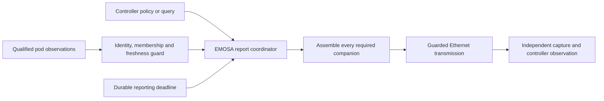

# Assemble AP, radio and client reports without inventing measurements

**The selected report builder and periodic dispatcher are implemented. Live AP
measurement qualification and native AP-report delivery remain pending.** This
exercise explains the boundary between correctly encoding a value and proving
that the value describes the pod. Read [policy receipt](reporting-policy.md)
first, then follow the steps below on HOST.

## What the controller needs

An AP Metrics Response describes a BSS (the Wi-Fi network), optionally its radio,
and the associated clients requested by the controller's policy. The controller
can request a response immediately with an AP Metrics Query. Its reporting
policy can also require unsolicited periodic responses. Our native candidate
requests a report every 60 seconds with all three client inclusion flags enabled.



The native lab currently lacks the complete qualified observation input at `P`.
The diagram describes the intended connected path. The synthetic exercise
supplies explicit invented values to test `G`, `E`, `D`, `B` and the frame bytes;
it does not make a measurement claim or contact a controller.

| Report content | When included | What its publisher must supply |
| --- | --- | --- |
| AP Metrics `0x94` | Every selected response | BSSID, channel utilization, observed station count and at least best-effort ESP |
| AP Extended Metrics `0xC7` | Every selected response | Six correctly represented unicast/multicast/broadcast TX/RX byte counters |
| Radio Metrics `0xC6` | Periodic response, or query containing the selected Radio Identifier | Noise, transmit, receive-self and receive-other values in the referenced representation |
| STA Traffic Statistics `0xA2` | Traffic inclusion flag | Byte, packet, error and retransmission counters with qualified direction and session semantics |
| Associated STA Link Metrics `0x96` **and** Extended Link Metrics `0xC8` | Link inclusion flag | Measurement age, MAC rates, RCPI, last rates and receive/transmit utilization |
| Associated Wi-Fi 6 STA Status `0xB0` | Wi-Fi 6 status inclusion flag | Explicit known TID queue inventory and encoded queue sizes |

All three policy flags remain enabled. Missing one requested companion withholds
the entire message. Sending only the easy fields would create a plausible but
incomplete response. For the selected complete inventory, no associated clients
means no per-client TLVs; unknown membership cannot be represented that way.

## Understand the internal measurement handoff

`APMetricSource.publish()` accepts typed AP/radio/client records. It is an internal
Python handoff, not an unauthenticated JSON input or a new pod configuration API.
The current scope is one non-MLD radio, one BSS, byte counter units and at most
32 associated stations. The station budget is a local resource limit.

Every record must match the current control context, exact observed membership
revision, radio/BSS identifiers and advertised byte units. Counter epochs and
association identities must come from a qualified publisher. Merely supplying
a string does not establish their real-world meaning. A change or expired source
withdraws the sample; a duplicate cannot renew its lease. The selected lease is
at most two seconds. A physical publisher needs its own clock/error qualification.

The builder accepts ESP as three already encoded octets per access category and
Data Elements values in their already encoded representation. It validates the
outer layout and bounds; it does not infer airtime from a PHY rate or manufacture
radio noise. ESP entries follow BE, BK, VO, VI order, including sparse lists.
The IEEE-to-EasyMesh ESP subfield reordering still needs a reviewed conversion.

`None` means unavailable. An explicitly empty Wi-Fi 6 queue tuple means the
publisher has established that no TID queue sizes are known. It encodes a zero
TID count, which differs from asserting that every queue is empty. A numeric zero
in another field is an actual reported value and needs measurement support.

## Why the schedule is saved before sending

At each due time, EMOSA saves the next deadline and reserves the due period before
network I/O. It then attempts at most one current report. This ordering prevents
a process restart from replaying a burst of old reports or continually postponing
the deadline. Identical controller policy requests preserve the original schedule.

The dispatcher allows a local one-second send budget after the due time. This is
an implementation budget, not an additional normative periodic deadline. A query
response must satisfy the specification's original one-second response deadline
and use its MID. Each fragment rechecks source authority and expiry.

The durable attempt has one of three outcomes:

- `reserved_outcome_unknown`: the reservation survived, but the send outcome was
  not committed. A crash after transmission can conservatively leave one missing
  report. Recovery must not claim it was received or resend the reserved period.
- `unavailable_or_send_incomplete`: required inputs or the complete transmission
  were unavailable. The missing-period count remains visible.
- `transmitted_controller_receipt_unverified`: the complete guarded send returned.
  This is not independent evidence that the controller received or used it.

The selected sender has no AP periodic receipt/Ack tracker. Review the applicable
§15.1 reliability classification and native receipt behavior before claiming
complete unsolicited delivery. Threshold-triggered reports, multiple radios/BSSs,
MLD companions and general QoS/steering actuation also remain outside this step.

## Step 1 — replay independently checked frame examples on HOST

Install the basic development environment from [manual chapter 3](../guides/team-manual.md#3-set-up-a-developer-checkout)
and the lab's selected tshark package. No VM or root privileges are needed here:

```bash
python3 scripts/check-ap-metrics-reference.py doc/evidence/ap-reporting/vectors
```

The checker imports no adapter code. It compares literal Ethernet/TLV bytes and
uses tshark to independently decode every reported scalar. Expect three complete
responses: a query response with radio information, one periodic response, and
a query response without a Radio Identifier but with explicitly no known TID
queues. A query with a missing required link companion receives no response.
The result keeps measurement, native-delivery and sustained-acceptance flags false.

Older tshark 3.6 labels the RCPI field `rssi`; 4.2 labels it `rcpi`. The checker
recognizes those names while checking the same RCPI octet. It does not interpret
RCPI as an RSSI value. Tshark treats the ESP octets as opaque; this check therefore
does not validate ESP's internal semantic conversion.

## Step 2 — generate a new synthetic example

Use a fresh output directory; the command refuses to overwrite one:

```bash
uv run python -m emosa.simulation.ap_metrics .lab/ap-metrics-learning-01
python3 scripts/check-ap-metrics-reference.py .lab/ap-metrics-learning-01
uv run pytest -q tests/test_ap_metrics.py tests/test_reporting_policy.py
```

Open `result.json` and `synthetic-ap-metrics.pcap`. Times 10, 70 and 130 are a
fake clock, so the exercise runs quickly. Find MID 71's response, the periodic
response, and unanswered MID 72. Compare `reports_transmitted` with
`periods_due_without_report`: one due report was sent, and the next was withheld
because its requested link data was missing. Reopening the durable store emits
no duplicate. That last check is a same-process coordinator restart, not SIGKILL.

## Step 3 — inspect the native schedule and actual recovery

Replay the retained owned-lab experiment:

```bash
python3 scripts/check-native-ap-withholding.py \
  doc/evidence/ap-reporting/native-ap-report-02
python3 scripts/check-native-recovery.py \
  doc/evidence/ap-reporting/native-ap-report-02 --minimum-seconds 210
```

The first check requires all policy flags, the same deadline origin through
both faults, three observed unfulfilled periods, an unavailable AP source and
**no AP Metrics Response frames**. That is the correct outcome while measurements
remain unqualified. The second checks independent traffic, actual OVSDB loss,
SIGKILL, new onboarding and absence of duplicate Config writes.

For a fresh live reproduction, complete [native peer setup](native-peer-metrics.md)
and its staging instructions. Run its native command with a new label and
`--active-seconds 210 --recovery-checks`, retaining the same optional peer-path
flags. Collect with `scripts/collect-native-review.py`, then run these checks on
that directory. Do not call the 210-second regression a 15-minute result.
The [evidence notes](../evidence/ap-reporting/README.md) retain the first failed
peer-query attempt and its bounded-wait fix as well as the subsequent result.

## Specification references and work before the complete soak

| Selected reference | Rule or remaining input |
| --- | --- |
| EasyMesh 6.1 §10.2.1, printed pp.82–84 | Query timing, periodic reporting, required client companions and estimated-service meaning |
| §17.1.16–17, pp.113–114 | Query/response message composition |
| Tables 44/45, pp.138–140 | BSSID query and AP Metrics layout, ESP order/presence |
| Table 47, pp.140–141; Table 58, p.147 | STA link and traffic statistics |
| Tables 83/84, p.164; Table 85, p.165 | Radio, AP Extended and STA Extended metrics; referenced Data Elements definitions |
| Table 96, pp.170–171 | TID queue inventory and encoded queue sizes |
| IEEE 802.11-2024 §9.4.2.172, Figure 9-740/Tables 9-332–334 | ESP subfields; conversion and estimator qualification remain pending |
| Wi-Fi Data Elements 3.0 package, including `TR-181-2-17_DEr3.xlsx` | Authorized local access still pending; acquire through the [consolidated checklist](specification-acquisition.md) |

Next qualify each actual observation and conversion, including mandatory BE ESP,
then connect the publisher and verify the native controller's received values.
Complete final-session statistics and resolve native shutdown before the full
integrated 15-minute acceptance. Preserve the ultimate physical boundary:
**real EasyMesh messages → EMOSA → unchanged OpenSync pod → independently observed
behavior**. Synthetic frame correctness cannot complete that demonstration.
