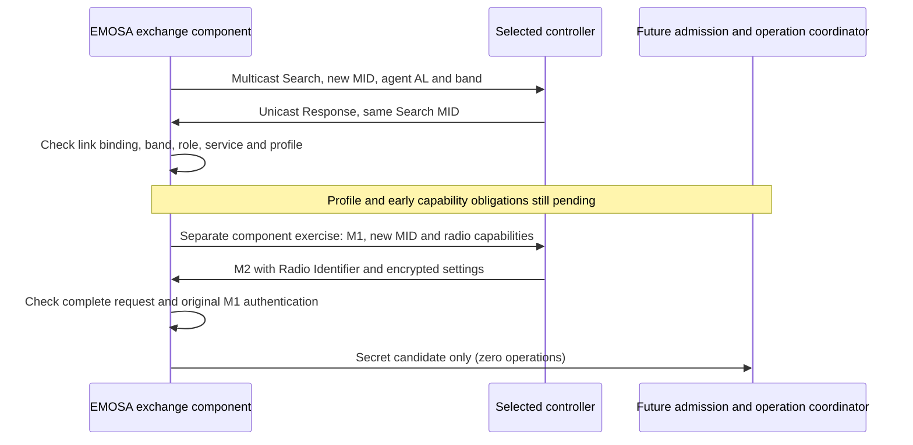

# Controller discovery and radio-bound WSC exchanges

This is the next implemented component after the [IEEE envelope](ieee1905-envelope.md).
It constructs Search and M1 messages and checks a controller's Response and M2
against a bounded exchange. **It is not yet a running EasyMesh agent or a pod
provisioning command.** The operation engine's wire gate stays closed.

## 1. Understand the two conversations

Discovery asks, “Which controller can configure this band?” Configuration asks,
“What complete BSS configuration does that controller request for this radio?”
They use different message identifiers and different evidence of correctness.



The diagram shows the intended composition and the current gap. The tests exercise
discovery and WSC separately. They do not use a deficient discovery response to
automatically start M1. A controller's capability advertisement can require an
Early AP Capability Report before BSS configuration; that intervening procedure
and its complete contents must be implemented before connecting this path.

An **AL MAC** identifies the represented 1905 device. A **RUID** identifies its
radio. An Ethernet source may instead be one of the controller's interface MACs.
`PeerBinding` therefore contains the controller AL and an explicit permitted
source-address set. A **generation** distinguishes the current binding from an
older connection or radio assignment. Messages from another interface, generation,
source or destination cannot consume the active exchange.

These fields provide correlation, not authentication. A MAC allowlist cannot stop
spoofing on an untrusted Ethernet link. The future coordinator must establish the
trusted network/link and controller relationship required by IEEE §10.1, and
invalidate the exchange when that relationship or the pod/radio binding changes.
WSC verifies transcript integrity and possession of derived keys; by itself it
does not prove the sender is the authorized controller.

## 2. Inspect a real retained discovery on HOST

Run from the checkout after the normal `uv sync --frozen` installation. You need
neither root, LXD, a radio, nor a physical pod. The input is the repository's
reviewed native-controller/native-agent capture.

```bash
mkdir -p .cache/autoconfiguration-learning
uv run emosa-lab wire-inspect \
  --capture doc/evidence/peer-baseline/samples/wired/ethernet.pcap \
  > .cache/autoconfiguration-learning/inspection.json
uv run python - <<'PY'
import json
from pathlib import Path
report = json.loads(Path(".cache/autoconfiguration-learning/inspection.json").read_text())
print(json.dumps(report["autoconfiguration_pairs"], indent=2))
print("Operations:", report["operations_created"])
print("Onboarding proven:", report["onboarding_proven"])
PY
```

Find the pair at frames **1 and 2**, MID **1**. The agent advertises Profile **2**;
the controller responds with Profile **1**. `profile_matches` is therefore false.
The bands match, which does not repair the profile mismatch. Pairing is explicitly
`capture_addresses_and_mid_only`: the capture does not supply a trusted-link
qualification or prove that a response arrived within an admissible live window.
The inspector retains at most 4096 Search keys for this correlation.

The captured Controller Capability value is **`0x40`**. Under the selected
EasyMesh 6.1 Table 117 definition, bit 7 (KiB/MiB support) is unset; the report
therefore includes `kib_mib_support_absent`. The security capability TLV is absent
and its applicability remains a separate review. Table 117 labels bit 6 as Early
AP Capability but also includes it in the reserved range; that published overlap
remains recorded rather than silently corrected. The inspector preserves the
raw field internally and reports the pending early-capability procedure/review.
Older implementation behavior is a compatibility observation, not authority to
change the selected specification.

Expect 59 frames, 58 completed messages, no rejected/incomplete frames, zero
operations and `onboarding_proven: false`. A successful inspector exit means
these supported structural/field checks completed. It does not mean every
message in the capture satisfies a complete profile. No SSID, network key,
WSC payload or credential-derived digest is printed.

## 3. Reproduce the exchange tests

```bash
uv run pytest tests/test_autoconfiguration.py tests/test_ieee1905.py -q
python3 scripts/check-ieee1905-reference.py
python3 scripts/check-wsc-reference.py --fixture wsc-messages
```

The first command tests complete encoded/reassembled Ethernet inputs, exact
required fields, the retained native discovery and independently built hostap
M1/M2 payloads. The latter commands require `tshark`, or a C compiler and OpenSSL
development headers respectively. The WSC checker obtains a pinned official
hostap archive; see the [payload fixture instructions](../../tests/fixtures/protocol/wsc-messages/README.md)
for an existing local archive option. Neither reference implementation replaces
the normative IEEE/WFA sources.

The independent WSC fixture contains public test credentials and deterministic
entropy. Only tests install that entropy. `WscExchange` normally creates fresh DH
and nonce material; do not send the retained deterministic fixture to a live peer.
The tests release a secret `ExistingBssCandidate` only after checking the entire
supported request. That Python value carries no write authority or qualified
pod/radio mapping.

Read the outcomes in this order:

1. Search responses must match an outstanding Search MID, requested band,
   Registrar/controller roles and the selected profile's receiver rules.
   A missing capability is reported as pending, never invented as supported.
2. M1 includes Radio Basic, WSC, Profile-2 AP and Radio Advanced capability TLVs.
   Its MAC attribute is the represented AL; its capability RUIDs agree.
3. M2 binds to the permitted controller/link generation and initiating RUID.
   Its MID need not equal M1's: IEEE §10.1.2 assigns a new WSC MID.
4. Every WSC occurrence is authenticated before a candidate is released. A
   second BSS, M8, teardown, unsupported role/security or a configuration companion
   cannot be reduced to a partial existing-BSS update. Known configuration
   companions `0xB5`, `0xB6`, `0xE0`, `0xE1`, `0xEB`, `0xEC` are rejected.
   DPP MIC/encryption envelopes require their own unimplemented processing.
   Unrelated unknown TLVs are ignored under the base reception rule.
5. A retransmission keeps the M1 transcript and uses a new MID. An identical
   accepted M2, including one using a new MID, returns the same candidate marked
   `duplicate`. If the controller re-encrypts M2 with a fresh nonce/IV, the
   component authenticates it again and compares the entire decoded configuration
   before treating it as a duplicate. A changed configuration cannot replace the
   accepted one. A new exchange's fresh transcript rejects a captured older M2.
6. The default exchange lifetime is **five seconds**, with **three transmissions**.
   These are local component budgets, not a claim about normative retry timers.
   Retries and duplicates never extend the deadline. Timeout or explicit close
   drops private-key/candidate references; Python does not promise memory erasure.
   Failed authenticated-configuration processing closes that transcript and
   requires a fresh discovery cycle, consistent with IEEE §10.1.2.

The future coordinator still needs durable operation idempotency across process
restarts. In-memory duplicate detection does not provide it. A peer-binding
change must call `close()` and create a new exchange; a restart cannot recover an
old transcript by trusting a recorded MID.

## 4. Review the selected normative contract

References use printed page numbers; document hashes and access records remain
in the [matrix](protocol-matrix.json) and [envelope guide](ieee1905-envelope.md).

| Rule | Source | Implemented scope |
| --- | --- | --- |
| Search/Response/WSC contents, transmission types and base role/band/WSC values | IEEE 1905.1-2013 §6.2 Table 6-4 p.30; §§6.3.7–9 p.32; §§6.4.13–18 pp.42–43 | Selected complete Search/M1 encoders and Response/M2 field checks |
| Reserved fields and base TLV reception | Base §6.2 p.28 and amendment §7.9 p.18 | Ignore unrelated TLVs; aggregate base fixed-size values; preserve separate WSC occurrences |
| Trusted link, Search MID echo, new WSC MID, failed configuration restarts discovery | Base §§10.1–10.1.2 pp.56–57 and §7.8 p.46 | Explicit external binding and bounded exchange lifecycle; link authentication not implemented |
| Periodic registrar detection | Amendment §10.1.4 p.24 | Pending scheduler/coordinator work |
| Roles, services, profile response and early capability requirements | EasyMesh 6.1 §6.1 pp.62–63; §5.2.2 p.28; §§17.1.1–2 p.111; §17.2.94 Table 117 p.182 | Selected field checks with unresolved obligations reported |
| Per-radio M1, M2 count/RUID, complete BSS set and conditional companions | EasyMesh §7.1 pp.67–69 and §17.1.3 p.111; WPS 2.0.10 §§7.2–3, 7.5, 8.3.9 | Existing authenticated payload components composed with radio/exchange checks |
| Retried requests may use new MIDs | EasyMesh §15.1 p.104 | New transport MID, unchanged active M1 transcript, bounded duplicate result |

The WFA WSC pointer to IEEE §6.3.8 is resolved using the supplied base: WSC is
§6.3.9 and Response is §6.3.8. Do not reopen the IEEE document-access blocker.
The [acquisition checklist](specification-acquisition.md) consolidates other
missing dependencies.

## 5. What follows this component

Implement the complete controller-facing coordinator: qualified feature/profile
intersection, required early/AP capability reports, topology and controller
inventory visibility, trusted-link lifecycle, and fresh complete radio admission.
Then connect an admitted WSC candidate directly to the guarded operation engine
with durable exchange-to-operation correlation. An extra semantic request must
not supply the actual Config change in that experiment.

Run that causal path with the existing OVSDB/hwsim manager and independent
wpa_supplicant client, including duplicate/fault/restart cases. Then qualify and
substitute the unchanged physical pod under the [first experiment contract](../guides/first-wire-experiment.md).
No private physical connection has been supplied. The eventual proof remains
**real EasyMesh messages → EMOSA → unchanged physical pod → independent client**.
