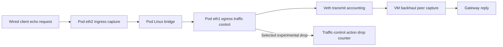

# Reconcile backhaul counters and expose missing loss accounting

A link identity answers **which interfaces the report describes**. A counter
audit answers **what the reported numbers count**. These are separate steps.
The [live discovery binding](neighbor-discovery-binding.md) establishes the first
for the owned lab. This exercise checks packet/byte intervals and demonstrates
why ordinary interface error counters alone cannot establish lost packets.

## Where a packet can disappear



An Ethernet bridge forwards the original client's source MAC. Filtering capture
only for frames sourced by the pod's own MAC would miss client transit traffic.
Likewise, a successful interface transmission counter is not a count of every
packet offered to its software egress path.

IEEE 1905.1-2013 Table 6-18 defines estimated transmitted/lost packets over a
common period and separately defines estimated maximum MAC throughput and link
availability. Table 6-20 pairs received/lost counts over a common period.
The transmitter measurements are at the 1905 interface level. A MAC-address
binding does not make a destination-address filter or an arbitrary Linux error
field the normative measurement. EasyMesh 6.1 §10.1 adds Wi-Fi-specific capacity,
airtime and RSSI clarifications; they do not supply a virtual-Ethernet estimator.

Linux distinguishes packet, error and drop fields; their meaning depends on the
driver and networking path. See the
[kernel statistics reference](https://www.kernel.org/doc/html/latest/networking/statistics.html).
The retained Ubuntu veth experiment, not that general description alone,
establishes the behavior of this lab.

## First exercise: check the existing native run — HOST

This command reads retained evidence; it does not start or alter the lab:

```bash
python3 scripts/check-backhaul-accounting.py \
  doc/evidence/neighbor-binding/native-link-binding-04
uv run pytest -q tests/test_backhaul_accounting.py
```

The audit first reruns the identity/capture checks. It then correlates each
non-overlapping raw `eth1` interval with the independent backhaul capture.
Counter reads have start/end bounds, rather than an invented exact sample
instant. Independently recorded station-event clock pairs relate monotonic
sample time to capture wall time. A fixed one-millisecond allowance covers the
selected audit's timing uncertainty; the checker does not widen it to make a
failure pass. Clock-offset variation must remain below one millisecond.

For each direction, packets strictly inside the narrow interval form a minimum;
packets inside the widest possible interval form a maximum. The measured packet
and byte deltas must lie between those bounds. At least 80% of directional
packet windows must have identical minimum and maximum, preventing very wide
bounds from producing a meaningless pass.

This Ethernet pcap has no direction metadata. Direction classification therefore
uses the isolated lab's pod/controller/adapter identities, the observed Wi-Fi
station address and the wired client's unique source MAC for its checked IPv4
address. Unknown source MACs fail the audit. This is not a general capture
classifier or proof against MAC spoofing. A broader topology requires explicit
direction metadata and a new qualification profile.

The retained result checks **325 intervals**; **602 of 650** directional packet
windows have exact count bounds. All packet and byte values fit the fixed
bounds, including Ethernet headers and transit/multicast traffic. This validates
consistency for those recorded intervals. It does not prove end-to-end delivery,
complete loss accounting, maximum capacity or an online metric publisher.

## Second exercise: inject a known loss — HOST starts an idle VM experiment

Use the existing owned `emosa-lab` VM and prepared containers. Complete the
[native lab setup](native-onboarding.md), then let its runner restore the idle
baseline. The wired client and gateway addresses/bridge path remain configured.
This experiment requires that path to pass a preliminary ping; it does not
create interfaces, configure addresses, start the AP or change native binaries.

The helper verifies VM/container ownership and idle services, takes both shared
experiment locks, and refuses any pre-existing traffic-control configuration
other than the expected `noqueue` root. It adds one temporary `clsact` qdisc
with one filter on the **owned simulated pod's** backhaul. It does not support
a physical-pod endpoint. Run from HOST with a new label:

```bash
lxc file push deploy/radio-manager/backhaul-loss.py emosa-lab/opt/emosa-radio-manager/
lxc exec emosa-lab -- python3 /opt/emosa-radio-manager/backhaul-loss.py loss-learning-01

mkdir -m 700 .lab/loss-learning-review
lxc file pull --recursive \
  emosa-lab/opt/emosa-radio-manager/counter-probes/loss-learning-01/ \
  .lab/loss-learning-review/
python3 scripts/check-backhaul-accounting.py --loss-probe \
  .lab/loss-learning-review/loss-learning-01
```

The helper runs three phases, each with 17 echo requests and a distinct ICMP
identifier:

1. **Normal:** requests and replies appear at pod ingress and the backhaul peer.
2. **Drop:** the filter drops only ICMP from `192.0.2.20` to `192.0.2.1`. Requests
   arrive at pod `eth2`; none reaches the backhaul capture. The action counter
   records all 17 drops. Read `eth1` error/drop deltas over the same phase.
3. **Restored:** the owned qdisc is removed and all 17 requests receive replies.

The helper retains before/after links, scheduler/action statistics, ping results,
capture logs and source hash. Cleanup checks the original traffic-control state.
On failure, preserve the run and inspect its recorded cleanup errors before
trying again. Only this helper's temporary qdisc is removed; no shared bridge or
container is deleted. Never run it concurrently with the sustained experiment.

The independent check requires exactly the expected request/reply sequences at
both capture points, matching captured/filter/file counts and zero capture
drops. It also requires the action counter to advance from zero to 17 and
successful restoration. The reviewed run demonstrates **17 real egress drops
while both `tx_errors` and `tx_dropped` remain zero**. Unrelated ARP traffic may
still increment ordinary packet counters; it is not evidence that a dropped
echo crossed the backhaul.

## Why the displayed veth speed does not solve capacity

The lab reports `10000` Mb/s from `eth1/speed`. Upstream Linux v6.8 assigns this
constant in `veth_get_link_ksettings()`; it is not a throughput measurement.
The same source separates successful transmit accounting from driver drops.
See [veth.c at v6.8](https://github.com/torvalds/linux/blob/v6.8/drivers/net/veth.c).
That source is a behavioral cross-check, not a claim that the Ubuntu module is
byte-identical; the retained run records its actual module hash and kernel build.

Pinned prplMesh's `ieee802_3_link_metrics_collector.cpp` estimates Ethernet MAC
capacity from reported speed and frame overhead, uses interface error counters,
and assumes 100% availability. Reusing those choices on this veth would import
unqualified assumptions. Open-source implementation is useful comparison, not
an override of IEEE field meanings or a substitute for this experiment.

## What this changes in the remaining work

The live packet/byte observations have passed a concrete independent interval
audit. The follow-on [egress source](egress-accounting-source.md) now observes the
selected action/driver loss path, rejects unsupported paths, and resets baselines
on configuration or connection changes. It accounts for all 17 controlled drops
and verifies the live OVSDB handoff. Receive-side loss and complete per-link
qualification remain open; adding every drop field together without checking
overlap would still be wrong.

Capacity and availability still need an explicit measured/estimated virtual-link
profile with calibration, freshness and stated limitations. Do not copy the
10-Gbit/s constant, use a short HTTP transfer as maximum capacity, or silently
substitute zero for unknown values. After those fields are qualified, connect
them to the existing guarded neighbor-response publisher and verify native
controller values. AP/STA reporting and final-session statistics remain parallel
requirements before the complete 15-minute recovery acceptance run.

The [evidence record](../evidence/backhaul-accounting/README.md) includes the
first capture-drain failure. This focused accounting experiment is not a new
15-minute result and does not qualify an unchanged physical OpenSync pod.
