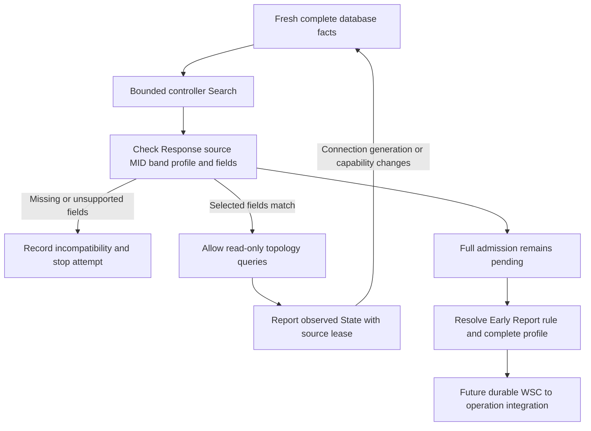

# Discover a controller before reporting a simulated pod

This exercise joins the existing Search/Response component to the real-database
report loop. It answers a specific question: **can EMOSA correlate a selected
controller's response, check its required fields, and keep topology reporting
tied to the current pod connection?** It also demonstrates when to stop.

It uses a synthetic controller exerciser and an owned OpenSync-schema database.
It does not start the native controller or contact a physical pod. The regular
`emosa serve` wire gate stays closed. **No automatic Early Report or M1 is sent,
and no configuration operation is created.**

## 1. Understand discovery, correlation and admission

A Search asks for a registrar/controller on a frequency band. Its MID identifies
the request. A Response must come from the explicitly selected controller link,
match a live Search MID and band, advertise the controller/registrar services,
and satisfy the selected profile-response rule. Those checks establish
**correlation**: this is a response to this attempt from the configured peer.
They do not authenticate an arbitrary Ethernet sender.

**Admission** is the larger decision to allow a configuration procedure. It
also needs qualified controller authority, complete applicable profile behavior,
pod/radio scope and a durable operation boundary. The separate
[owned WSC handoff](wsc-provisioning.md) now tests that boundary, but this discovery
lifecycle does not activate it. Matching a MAC address or
receiving a capability flag cannot supply those requirements.



The reusable Python component is
[discovery_session.py](../../src/emosa/wire/discovery_session.py). It wraps the
report coordinator, uses one MID sequence, and has no operation callback. The
only implemented source is the owned simulator. A restricted topology reply
does not claim that the selected profile is completely implemented.

## 2. Establish the prerequisites on HOST

Use your development or learning checkout, the selected Python/uv environment
from manual chapter 3, and the real OVSDB tools from chapter 5. Complete the
[report-coordinator exercise](report-coordinator.md) first so that Config, State
and source freshness are familiar. No root, radio or LXD is required here.

Run these commands from the checkout, choosing an unused output directory:

```bash
uv run python -m emosa.simulation.discovery --output .lab/discovery-demo-01
uv run emosa-lab wire-inspect --capture .lab/discovery-demo-01/messages.pcap
uv run pytest tests/test_discovery_session.py -q
uv run pytest tests/test_discovery_session_ovsdb.py -q
```

The runner starts and stops its own database and separate manager. The database
connects to EMOSA's read-only Unix-socket monitor. The Ethernet messages are
serialized and delivered in memory; `socket_io: false` describes that Ethernet
delivery, not the real database connection. Fixture administrator/manager writes
are explicitly separate from `adapter_config_writes: 0`.

## 3. Read the ten stages and explain the result

Open `result.json` and follow the stages in order:

| Stage | Expected result | Why it matters |
| --- | --- | --- |
| `before_discovery` | Query receives no response | Fresh pod facts alone do not establish this component's controller correlation |
| `incompatible_advertisement` | Missing KiB/MiB support and Security Capability are reported | The example reproduces the selected missing fields found in the retained native capture |
| `incompatible_query` | Query receives no response | An incompatible advertisement does not open reporting in this restricted experiment |
| `correlated_topology` | After explicit retry, a matching Response permits topology | The old Search MID is rejected even though the controller identity is unchanged |
| `config_only` | Report still contains the original SSID | Desired Config is not observed radio State |
| `observed_state_change` | Report contains the changed SSID | The separate manager has now updated State |
| `disconnected` | No response | Cached facts cannot represent a disconnected pod |
| `reconnected_before_discovery` | Still no response | Fresh database observations alone cannot restore the old controller context |
| `rediscovered_topology` | A new Search/Response permits current topology | Old discovery responses cannot restore the previous connection's context |
| `unsolicited_wsc` | `wsc_admission_blocked` | This running component has no configuration authority |

The Search MIDs are 1, 2 and 3 in this deterministic fixture. Queries use
700–707; only 702, 703, 704 and 707 receive Topology Responses. A positive
`passed` means these positive and negative checks behaved as expected. It does
not mean an EasyMesh controller admitted a managed agent.

**Checkpoint:** find a rejected old Response, the Config-only report and the
post-reconnect Query with no response. Explain why all three are necessary.

## 4. Repeat over Ethernet sockets inside the dedicated VM

Follow the source/schema staging instructions in the
[isolated endpoint runbook](../../deploy/wire/README.md), using `--discovery`.
The driver creates only owned private namespaces and a veth pair. It does not
attach them to the native baseline, an external bridge or any physical pod.

This version deliberately drops the first Search's response. Search MID 2 gets
the deficient advertisement; Query 710 receives no answer during an observation
of at least 1.1 seconds. The fixture explicitly requests a new attempt. Search
MID 3 gets the selected compatible fields. Queries 711/712/713 then produce
old/old/new SSID reports. After database disconnection, Query 714 receives no
answer for at least 1.1 seconds while the adapter worker remains alive.

Keep both worker JSON files, both receive-byte PCAPs, logs and driver output.
The PCAP timestamps are synthetic; elapsed-time claims come from the workers'
monotonic clocks. Readiness/fault marker files coordinate the lab stages and
are not an EasyMesh protocol. Inspect the retained runs independently:

```bash
python3 scripts/check-discovery-reference.py \
  --directory doc/evidence/discovery-session/run-01 \
  --directory doc/evidence/discovery-session/run-02
```

This command requires `tshark`. It imports no EMOSA code and checks actual
received Search/Response/Query/Response fields, MIDs, addresses, capability
values and BSS SSID ordering. No Early Report or M1 appears in those captures.
The [evidence collection](../evidence/discovery-session/README.md) distinguishes
this synthetic peer from the separately retained native controller capture.

## 5. Understand when a session must stop

| Condition | Behavior |
| --- | --- |
| No fresh complete source | Wait without sending Search or topology |
| Lost Search response | At most three transmissions, at least one second apart, within a fixed five-second local attempt |
| Attempt expires or send fails | Stop; require an explicit local restart or a changed source context |
| Required Response field missing/malformed or algorithm reserved | Record the issue and stop this attempt |
| Source disappears, lease lapses, database generation changes, or capability facts change | Drop reassembly and report correlation; require discovery again |
| Ordinary database revision changes operational facts | Keep controller correlation; build each response from the current complete snapshot |
| Local restart or repeatedly flapping source | Preserve the MID sequence and one-second Search spacing |
| Wrong ingress, link generation or source address | Reject before allocating reassembly state |
| WSC arrives | Record the blocked admission; create no operation |

The retry counts, spacing and five-second attempt are local bounded policies.
They are not claimed as complete normative discovery scheduling. In particular,
the periodic registrar detection required by the amendment remains pending.
Topology Response MID echo and the one-second response limit come from IEEE
1905.1-2013 §8.2.2.2. Report leases remain database-observation freshness bounds,
not physical radio measurement timestamps.

The lease also expires if no caller polls during the gap: publication after
that gap creates a new context. Renewing the same revision before its lease
ends does not force a new discovery. `tick()` must still run during idle periods
to handle retry and expiry work. Restarting the process creates a new session;
this component does not persist controller correlation.

## 6. Read the specification boundary correctly

The implementation uses the obtained IEEE 1905.1-2013 §10.1–10.1.2 and EasyMesh
6.1 §6.1 p.63 for selected Search/Response correlation and field requirements.
EasyMesh §17.1.2 p.111 requires the Security Capability TLV; §17.2.67 Table 90
p.167 defines its three octets. Only the defined zero code in each octet is
recognized. A missing value, wrong length or reserved algorithm is not replaced
with a default. Recognizing this advertisement does not implement DPP security.

EasyMesh §6.1 requires KiB/MiB support and requires the Early Report indication
for this Search, which contains no DPP Chirp. The diagnostic checks the named
bits in §17.2.94 Table 117 p.182. That table also lists bit 6 in its reserved
range, overlapping its named Early Report bit. We expose the received bit and
retain the conflict; **automatic Early Report initiation remains blocked**.
The earlier standalone report exercise can still test report encoding and Ack
handling without claiming this admission decision is resolved.

The existing native capture has `0xDD=40`, lacks `0xA9`, and also has a Profile-2
Search/Profile-1 Response mismatch. The new unit test feeds that actual
Response's TLVs into a controlled matching Profile-1 exchange to isolate its
capability gaps. It does not rewrite or repair the historical capture, and it
does not claim a new live native-controller run.

Next are a compatible native peer/profile, the remaining complete AP Capability
requirements and specification clarifications, automatic Early Report ordering,
and durable WSC-to-operation admission. Preserve the native controller's own
inventory when that integration runs. Then reproduce a real-message-driven
change through OVSDB/hwsim and an independent client before substituting an
unchanged qualified physical pod. The acceptance path is still **real EasyMesh
messages → EMOSA → unchanged physical pod → independently observed behavior**.
