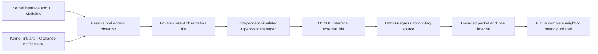

# Carry measured egress losses through OVSDB

The [backhaul audit](backhaul-counter-accounting.md) found a real gap: a Linux
egress action dropped 17 packets without incrementing the interface's ordinary
error/drop counters. The new source reads both relevant accounting stages and
carries them through the simulated pod's existing OVSDB connection.

It supplies successful TX packet/byte deltas and selected egress-loss deltas.
It **does not yet supply complete IEEE 1905 link metrics**. The follow-on
[receive source](receive-counter-accounting.md) adds selected ingress-loss
accounting and common Tx/Rx reads. Complete per-link loss, media/capacity/
availability qualification and native metric delivery remain open.

## Follow the measurement path



The observer runs only in the owned hwsim pod container. It uses read-only
`ip`/`tc` dumps and a route-netlink multicast socket; it does not install a filter,
change a qdisc, transmit traffic or configure a radio. Only the separate optional
loss experiment installs a temporary rule. Neither helper is supported for an
unchanged physical pod.

The collector records a UUID, run label, boot ID, namespace inode, interface
index/MAC, configuration epoch, read bounds, heartbeat and source hash. The
manager publishes that raw object as simulation metadata in the pinned OpenSync
`Interface.external_ids` map. No schema column is added. Actual firmware is not
assumed to export this convention.

EMOSA checks the collector identity against its independently read forwarding
port and the current OVSDB generation. Data older than two seconds is unavailable.
The complete counter read must take at most 250 ms. The two reads defining an
interval must be ordered, disjoint and less than two seconds apart.

## Which loss paths are supported

The initial source recognizes the observed veth path with a `noqueue` root and
no XDP program. It also recognizes the exact owned experiment's optional
`clsact` egress rule: one software-only, deterministic, unshared `gact drop`
action for the selected wired-client ICMP flow. Root/ingress filters, shared
blocks/actions, hardware offload, random actions, other schedulers and changed
interface identities make the source unavailable.

This deliberately explicit parser is a qualification boundary. It is not a
generic `tc` configuration parser. Additional paths need their own accounting
review and controlled tests before being admitted.

For this path, the output preserves four separate deltas:

| Field | Meaning in this source |
| --- | --- |
| `successful_packets` | Change in observed veth TX packet counter |
| `successful_bytes` | Change in observed veth TX byte counter |
| `driver_drops` | Change in the veth driver's TX drop counter |
| `action_drops` | Change in the selected egress drop action counter |

`egress_losses` adds the last two. The action drops packets before veth transmit
processing, so those counted action losses do not also reach the driver as
successful transmits or driver drops. The parent `clsact` qdisc also counts the
action losses: adding its drops again would double count them. The source keeps
the raw parent statistics for review but does not add them.

This is an egress accounting result for the selected interface path. It does not
measure packets lost elsewhere in the network, packets discarded before this
egress path, receiver loss or general physical-media errors. Mapping the complete
qualified link measurement into IEEE 1905 fields remains a later integration.

## Why configuration epochs are necessary

Polling only the rule shape is insufficient. A filter can be deleted and
recreated with the same identifiers while its counters start a new lifetime.
The observer subscribes to link/TC change notifications **before** the first
dump. Any received configuration change advances its epoch and withdraws its
current observation. A change during a dump discards that dump.

The initial listener conservatively tracks all link/TC changes in the pod
namespace. An unrelated interface change can therefore cost a baseline; it
cannot silently extend an interval across a possible reset. A future optimization
may narrow the event scope only after proving it retains all relevant changes.

Netlink truncation, overrun, socket errors and exhausted event budgets stop the
collector with an error. Source replay watermarks survive invalidation. Counter
decreases, changed collector/configuration epochs, actual OVSDB reconnect and
adapter restart require a new baseline, never subtraction across lifetimes.
The socket's kernel sender address establishes notification provenance. A
notification's `nlmsg_pid` can retain the original requester's ID; rejecting it
as a userspace sender would be incorrect. See the Linux v6.8
[qdisc notification implementation](https://github.com/torvalds/linux/blob/v6.8/net/sched/sch_api.c)
and [filter notifications](https://github.com/torvalds/linux/blob/v6.8/net/sched/cls_api.c).

## Reproduce the component and controlled-loss checks — HOST

```bash
uv run pytest -q tests/test_egress_accounting.py

lxc file push deploy/radio-manager/egress-observer.py \
  deploy/radio-manager/backhaul-loss.py emosa-lab/opt/emosa-radio-manager/
lxc exec emosa-lab -- python3 /opt/emosa-radio-manager/backhaul-loss.py \
  egress-learning-01 --observe-egress

mkdir -m 700 .lab/egress-learning-review
lxc file pull --recursive \
  emosa-lab/opt/emosa-radio-manager/counter-probes/egress-learning-01/ \
  .lab/egress-learning-review/
uv run python scripts/replay-egress-accounting.py \
  .lab/egress-learning-review/egress-learning-01 \
  > .lab/egress-learning-review/egress-learning-01/egress-projection.json
python3 scripts/check-egress-accounting.py .lab/egress-learning-review/egress-learning-01
```

Use the existing idle owned lab and a new label. The controlled probe waits for
fresh observer snapshots before and after each traffic phase. It retains the
collector log, final health, source digest and rule/restoration evidence. Read
the prerequisite and cleanup instructions in the
[loss-probe guide](backhaul-counter-accounting.md).

The replay command runs the production source against retained collector data
with its recorded clock. It is explicitly component replay, not a live native
controller result. The independent checker imports no adapter code: it compares
raw counter differences, epoch boundaries, action counts and complete captures.
The real-OVSDB test independently exercises publication and reconnection.

## Reproduce the live OVSDB/native recovery check — HOST

Follow the [sustained-operation setup](sustained-operation.md). Include both
passive observers when staging:

```bash
tar -C src -cf - emosa | lxc exec emosa-lab -- tar -C /opt/emosa-radio-manager/source -xf -
lxc file push deploy/radio-manager/node.py deploy/radio-manager/manager.py \
  deploy/radio-manager/neighbor-observer.py deploy/radio-manager/egress-observer.py \
  emosa-lab/opt/emosa-radio-manager/
lxc file push deploy/peer-baseline/native-onboarding.py emosa-lab/opt/emosa-baseline/
lxc exec emosa-lab -- env PYTHONPATH=/opt/emosa-radio-manager/source \
  EMOSA_OVS_BIN=/opt/emosa-radio-manager/ovsdb \
  /opt/emosa/.venv/bin/python /opt/emosa-baseline/native-onboarding.py \
  --build /opt/emosa-baseline/candidate-onboarding-01 --label egress-native-learning \
  --active-seconds 210 --recovery-checks --observe-station-removal \
  --telemetry-gap-check --neighbor-gap-check
python3 scripts/collect-native-review.py egress-native-learning .lab/egress-native-learning
python3 scripts/check-egress-accounting.py --native .lab/egress-native-learning
python3 scripts/check-native-recovery.py .lab/egress-native-learning --minimum-seconds 210
```

This normal native run does not inject client-packet drops. Its role is to verify
the live collector → manager → OVSDB → adapter handoff, counter baselines across
recovery, and continued onboarding/client behavior. The separate controlled-loss
experiment qualifies the selected loss case. Neither result alone proves an
integrated 15-minute metric-reporting acceptance run.

Read [the retained evidence](../evidence/egress-accounting/README.md), then follow
the [receive-accounting exercise](receive-counter-accounting.md). Qualify the
remaining measurement fields, join them to the observed neighbor binding,
and verify the complete native response and controller values. AP/STA reporting
and final-session statistics remain required for sustained acceptance.
