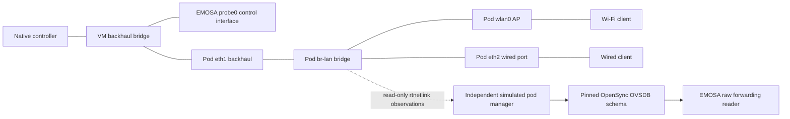

# Observe the pod's forwarding interfaces through OVSDB

This step acquires real interface observations in the **owned simulator**. It
publishes them through the pinned OpenSync schema and reads them back in EMOSA.
It does not yet enable native IEEE 1905 neighbor metric responses. The missing
work is per-neighbor attribution, media qualification and qualified
capacity/availability estimates.
The follow-on [live discovery binding](neighbor-discovery-binding.md) now joins
these port identities to controller discovery observed at the pod and uses them
in native topology reports. The media values remain explicit simulator fixtures.

## Understand the path before counting packets

The native controller sees a virtual agent represented by EMOSA. The clients use
the simulated pod's AP and bridge. These are separate paths:



The packet address on a bridged client frame may still be the client's address.
Filtering for the pod's own Ethernet MAC would omit that transit traffic.
Likewise, measuring `probe0` would count EMOSA's control endpoint rather than the
pod's forwarding interface. The capture now runs at the VM end of the actual
pod `eth1` veth pair and includes all traffic at that observation point.

IEEE 1905.1-2013 §8.1, printed pp.46–47, distinguishes the neighbor's AL MAC from
its sending-interface MAC. The controller's Topology Discovery advertises those
in separate TLVs. The independent checker compares that advertisement with the
observed controller `eth1` identity. This establishes a useful lab observation;
the adapter still needs a runtime discovery/expiry binding before using it as
measurement authority. Bridge detection also has the standard's LLDP/topology
discovery rules. A static VM inventory is not a general discovery implementation.

## What the simulator publishes

The independent manager reads `ip -j -d -s link show` inside the owned AP
container. A second read checks that bridge membership and interface identities
did not change during the counter read. Missing ports, an extra bridge port,
blocked/down ports, duplicate identities, incomplete counters or a read lasting
over one second withdraw the observation. No counter is inferred from Config.

The pinned `interfaces/opensync.ovsschema` at OpenSync commit
`78d8a7194d5e77635877cc456231e7be5cf03d68` already has these tables. No schema
extension is introduced:

| Table | Purpose in this explicit simulation profile |
| --- | --- |
| `Open_vSwitch` | Roots the disposable bridge graph so referenced rows remain present |
| `Bridge` | Represents the observed `br-lan` membership through Port UUIDs |
| `Port` | Associates each named port with its Interface UUID |
| `Interface` | Carries observed MAC, ifindex, MTU, link/admin state and eight raw counters |

These OVSDB rows describe a **Linux bridge** in this simulation; their presence
does not mean that an OVS datapath is running. The seeded graph has no positive
observation until the independent read succeeds. Updates and withdrawals use a
single guarded transaction. A competing row/graph change aborts publication.
Stable UUIDs keep regular observation updates from changing the configuration
binding or authorizing an extra onboarding operation.

`Interface.statistics` contains `rx_packets`, `rx_bytes`, `rx_errors`,
`rx_dropped` and the four corresponding `tx_*` counters. Their source is Linux
`rtnl_link_stats64`. Linux distinguishes successfully received packets, transmit
submission, errors and drops; these definitions do not automatically establish
the IEEE per-link meanings. See the
[Linux kernel interface-statistics documentation](https://www.kernel.org/doc/html/latest/networking/statistics.html).
The code preserves the raw values instead of combining errors/drops or treating
an absent field as zero.

The `external_ids` timestamp, boot and namespace conventions are **specific to
this owned simulator**. They use the VM's shared monotonic clock, observed read
start/end bounds, boot ID, network namespace inode and veth peer ifindex.
A physical pod is not assumed to provide this convention. Qualifying its existing
publisher remains a separate task; do not install this manager on a physical pod.

## Read a sample and an interval

A **sample** is one bounded read of cumulative interface counters. An **interval**
is the difference between two samples with the same database generation and
interface lifetime. A lone cumulative value has no measured interval.

The reader follows the graph's UUID edges, validates the selected schema columns,
and checks consistency across all three ports. It accepts a sample only while
the oldest possible reading is less than two seconds old. Reading the same
OVSDB row again does not extend that deadline.

An interval requires two nonoverlapping read windows less than two seconds apart.
Reconnect, boot/namespace/interface/MTU changes, a missing sample or decreasing
counters require a new baseline. Counter decreases are not silently treated as
wraparound. A timestamp watermark survives invalidation, preventing an old
sample from being reused after an outage. Adapter process restart creates a new
reader and cannot compare its first sample with the old process's sample.

The public diagnostic is `forwarding_observation` in `native-session.json`.
Changed observations are retained in `forwarding-samples.jsonl`:

| Field | How to interpret it |
| --- | --- |
| `available` | A current complete raw observation exists |
| `reason` | Distinguishes first sample, usable raw interval, reset, gap or unavailable source |
| `sample.interfaces.eth1` | Actual pod backhaul identity and cumulative counters |
| `window.first_read_ns` / `last_read_ns` | Bounds on the two endpoint reads; not an invented instantaneous measurement |
| `window.deltas` | Raw changes per whole interface, when an interval is valid |
| `measurement_source_qualified` | Remains false: these fields are not yet a complete neighbor-metric source |

An absent interval does not mean zero traffic. A counter increment does not prove
which neighboring device carried it. An available raw observation does not make
the existing topology fixture a qualified mapping. Those distinctions are why
the IEEE metric handler still records `neighbor_measurement_unavailable`.

## Inspect retained evidence — HOST

Start in the installed development/learning checkout. No VM or root privileges
are required for this inspection:

```bash
python3 scripts/check-forwarding-observations.py \
  doc/evidence/forwarding/native-forwarding-01
python3 scripts/check-native-recovery.py \
  doc/evidence/forwarding/native-forwarding-01 --minimum-seconds 210
python3 scripts/check-telemetry-gap.py \
  doc/evidence/forwarding/native-forwarding-01
python3 scripts/check-neighbor-metrics.py --native-directory \
  doc/evidence/forwarding/native-forwarding-01
uv run pytest -q tests/test_forwarding.py
```

Read the [result and limitations](../evidence/forwarding/README.md). The independent
forwarding checker imports no adapter code. It compares manager publications
with EMOSA's received values, recomputes intervals, checks actual connection and
worker boundaries, verifies capture completeness and locates client transit
traffic plus the controller's sending-interface advertisement. This checks
transport and identity observations. It does not reconcile every counter against
per-neighbor packets or validate a throughput estimator.

## Reproduce with real recovery faults — HOST starts the VM experiment

Complete the [sustained-operation prerequisites](sustained-operation.md) first.
Stage the updated source, `deploy/radio-manager/node.py`, `manager.py`, `neighbor-observer.py`, and
`deploy/peer-baseline/native-onboarding.py` using that guide's commands. The
harness copies the guarded node helper into the owned AP container itself.

Choose new run and collection names; preserve failed runs:

```bash
lxc exec emosa-lab -- env \
  PYTHONPATH=/opt/emosa-radio-manager/source \
  EMOSA_OVS_BIN=/opt/emosa-radio-manager/ovsdb \
  /opt/emosa/.venv/bin/python /opt/emosa-baseline/native-onboarding.py \
  --build /opt/emosa-baseline/candidate-onboarding-01 \
  --label forwarding-learning-01 --active-seconds 210 --recovery-checks \
  --observe-station-removal --telemetry-gap-check
python3 scripts/collect-native-review.py forwarding-learning-01 \
  .lab/forwarding-learning-01-review
python3 scripts/check-forwarding-observations.py .lab/forwarding-learning-01-review
```

Expect current raw samples through the telemetry-only pause, withdrawal on the
actual OVSDB outage and fresh baselines after reconnect and worker restart.
Independent traffic must survive both management faults. Apply the recovery,
freshness, policy and unavailable-neighbor checks to the new directory as well.
This short development regression does not replace the requested 15-minute
acceptance run.

## Next qualification step

The [live identity binding](neighbor-discovery-binding.md) now maps observed
forwarding ports and native discovery into runtime topology. Qualify the medium
representation beyond the explicit simulator fixture.
Then reconcile interval counters against independent traffic at both endpoints,
including transit/broadcast/control traffic and dropped/error categories.
Qualify capacity and availability separately. Only then feed the guarded IEEE
metric publisher and verify the controller's decoded reports. AP/STA reporting
and final-session statistics are also still required before complete sustained
acceptance. The physical objective remains real EasyMesh messages → EMOSA →
unchanged physical OpenSync pod → independently observed behavior.
