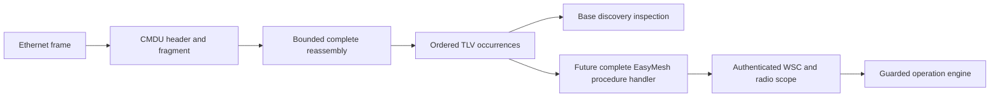

# IEEE 1905 envelope implementation and learning exercise

The operator supplied both required IEEE PDFs on **2026-09-22**. Their titles,
editions and complete file hashes were checked locally. This removes the access
blocker for the IEEE base/amendment; it does not complete the full EasyMesh
procedure audit or connect the operation engine to a controller.

| Private source, outside Git | Pages / bytes | SHA-256 |
| --- | --- | --- |
| `/home/rev/19051-2013.pdf` — IEEE Std 1905.1-2013 | 93 / 1,164,726 | `60c627535e51709ea0312f20764a029dad4805a4f5a193f7f471d5abf6e04378` |
| `/home/rev/19051a-2014.pdf` — IEEE Std 1905.1a-2014 | 52 / 2,725,558 | `ca12c819be35f519ccd0fe073ea3c47ac7395797c7c063b099f1a12df3fba609` |

Only references, our implementation and test results are published. The PDFs,
extracted text and page images remain outside tracked files. Amendment edits
were checked visually where extracted text mixed deleted and inserted wording.
On the review date the [IEEE base record](https://standards.ieee.org/ieee/1905.1/4995/)
and [amendment record](https://standards.ieee.org/ieee/1905.1a/5820/) listed those
editions; no separate correction document was identified on the inspected records
or targeted publisher search. This is a dated check, not proof that no correction
exists. The acquisition checklist retains further dependency review.

## 1. Understand the three layers before running anything

A **frame** is one Ethernet transmission. Its header identifies source,
destination and protocol. A **CMDU** is the IEEE 1905 control message carried
inside one or more frames. A **TLV** is a typed, counted piece of that message.
WSC M1/M2 bytes are inside WSC TLVs; the Ethernet header does not authenticate
their sender or authorize a pod change.



The [subsequent exchange component](autoconfiguration.md) now constructs Search/M1
and checks selected Response/M2 fields, peer/radio correlation and replay lifetime.
The live coordinator still needs complete required/conditional procedures,
trusted peer admission and durable operation idempotency. A parser accepting bytes
does not mean those bytes describe a valid, supported or authorized procedure.

## 2. Review the exact rules implemented

References below use **printed** page numbers. The complete machine-readable
record is in [protocol-matrix.json](protocol-matrix.json).

| Rule / implementation consequence | Source |
| --- | --- |
| Ethernet II EtherType `0x893a`; source may be AL or interface MAC; unicast normally addresses recipient AL | Base §6.2.1 Table 6-2, p.29 |
| Eight-octet CMDU header; big-endian type/MID; FID; final bit 7 and relay bit 6 | Base §6.2/Table 6-3, pp.28–29; amendment Table 6-3 p.6 |
| TLV header is one-octet type and two-octet length; high two length bits are reserved, low 14 count value bytes; EOM is type zero/length zero | Base §6.4/§6.4.1 p.33; amendment §6.4 p.8 |
| Set reserved fields to zero on transmit; ignore reserved fields on receive. Reserved **values** have different behavior; unsupported versions are never dispatched here | Amended §7.9 p.18, visually reviewed |
| Base fragmentation uses TLV boundaries, constant MID, increasing FID from zero, maximum CMDU 1500 octets; dispatch only after all fragments arrive | Base §§7.1.1–2 p.44 |
| Multi-AP EOM belongs only in the final fragment | EasyMesh 6.1 §17 p.107 |
| Octet-boundary splitting is conditional on DPP support and the specified unicast procedure; multicast retains TLV boundaries | EasyMesh 6.1 §15.2 pp.104–105 |
| New MIDs increment modulo 65536; a response copies a request MID only when its procedure says so | Base §7.8 p.46; §§8.2.2.2, 10.1.1 pp.48,56 |
| Base reception ignores unspecified TLVs; missing required TLVs invalidate the message; repeated base values aggregate by type | Base §6.2 p.28 |
| Topology Discovery needs AL and transmitting-interface MAC TLVs, neighbor multicast and relay zero | Base §6.3.1 p.31, §§6.4.3–4 p.34, Table 6-4 p.30 |
| General reception/relaying and duplicate identity require the originating device, which can differ from the Ethernet source | Base §§7.5–7.7 p.45 |

The low-level reassembler preserves repeated TLVs in order. The base discovery
interpreter aggregates only its two fixed-size identity values. In particular,
multiple EasyMesh WSC M2 TLVs must remain separate for complete-radio validation;
the transport does not concatenate them into one WSC payload.

The review also resolves a WFA cross-reference: the IEEE WSC message is
**§6.3.9**, its TLV is **§6.4.18**, and the AP configuration procedure is
**§10.1.2**. Section 6.3.8 is the Search Response. The base WSC procedure assigns
a new MID; do not generalize Search/Response MID copying to WSC. The complete
EasyMesh-specific [bounded exchange component](autoconfiguration.md) now composes
the payload authentication with selected peer/radio checks; endpoint integration
and complete profile admission remain pending.

## 3. Inspect native traffic on HOST

From the repository root after `uv sync --frozen`:

```bash
uv run emosa-lab wire-inspect \
  --capture doc/evidence/peer-baseline/samples/wired/ethernet.pcap
uv run pytest tests/test_ieee1905.py -q
python3 scripts/check-ieee1905-reference.py
```

The first command does **not** need root, LXD, a pod or either licensed PDF at
runtime. It opens the already reviewed synthetic capture. Expect 59 frames,
58 completed messages, zero rejected frames and no incomplete assemblies. Frame
6 supplies the first fragment; frame 7 completes the same WSC message. Discovery
frame 4 has different AL and interface MAC addresses. That is valid and explains
why a future peer tracker cannot equate every Ethernet source with an AL address.

Each output item includes message type, MID, fragment count and TLV types/lengths.
`procedure_validation` normally says `not_performed`; base Topology Discovery and
selected Search/Response fields get additional checks. The
`autoconfiguration_pairs` summary exposes the native discovery profile mismatch
and pending controller capabilities. `operations_created` stays zero and
`onboarding_proven` stays false. No WSC values, decrypted settings or credentials
are printed. The second command covers malformed input, reserved fields, fragment
reordering/conflicts, limits, expiration, MID rollover and independent vectors.

The third command requires `tshark`. It uses that separate implementation to
rederive all header and TLV-boundary projections, without importing EMOSA, and
compares them with the retained fixture. Both the HOST and Ubuntu VM versions
have been checked. A dissector match supports encoding/decoding confidence; it
does not certify the rest of a captured message's semantics.

To inspect a single raw Ethernet frame, use `wire-inspect --frame /absolute/file`.
The file starts at destination MAC and excludes FCS. A non-final fragment alone
returns an incomplete-input error; use a capture containing its other fragments.
The reader supports classic Ethernet PCAP, both endian forms and micro/nanosecond
timestamps. Convert PCAPNG explicitly with a capture tool first. VLAN-tagged
traffic is counted as unsupported; it is not silently interpreted as untagged.
Exit 1 means rejection, incomplete/expired assembly or unsupported tagged input;
exit 0 means the supported inspection completed, **not** that onboarding passed.

## 4. Understand local limits and fault behavior

Defaults are 64 simultaneous reassembly contexts, 64 fragments per message,
64 KiB of TLVs per message, 2 MiB total retained TLVs and 256 TLVs per message.
The reassembly deadline is five seconds from the first observed fragment; this
is an implementation choice allowed by §7.1.2, not a normative five-second timer.
Duplicates never extend it. Conflicting duplicates/headers clear the buffered
data and quarantine that context until its original deadline. Resource exhaustion
does not evict another incomplete message to accept a new one.

Transmit fragmentation reserves final-EOM space when packing each fragment;
with the default MTU it accepts an individual value up to 1486 bytes. Larger
values require a future negotiated fragmentation path. The sender caps 64
fragments; the receiver's configurable ceiling cannot exceed the 256 FID values.
Legacy non-final EOMs are rejected in this strict Multi-AP component; no implicit
compatibility mode is selected from EasyMesh's informative legacy discussion.

The separate duplicate window uses an already validated originating AL/MID pair,
with a local 60-second/4096-entry limit. It is not yet connected to a live
procedure handler. Its expiry is not a WSC replay policy or a substitute for the
durable journal. Reserved-version frames are recognizable at the raw decoder but
are not dispatched; reserved-message relay policy belongs to the future relay
layer and is not implemented by this inspection command.

## 5. Exercise the actual packet endpoint in isolation

Use the [VM endpoint runbook](../../deploy/wire/README.md). It creates a fresh
pair of private network namespaces joined only to each other, sends empty
Topology Query messages in both directions and removes those namespaces. No
physical interface, native peer, hwsim radio, pod or cloud connection participates.
The endpoint checks the actual interface MAC, receives only IEEE 1905 EtherType,
ignores outgoing copies and checks destination. It does not enable promiscuous
mode or change an existing interface. Socket ownership includes multicast
membership cleanup.

The two retained original endpoint runs establish actual AF_PACKET delivery. Their PCAP
files are written from received bytes, with synthetic timestamps; they are not
an independent sniffer's timing evidence. Empty reverse-direction queries are
transport probes, not Topology Responses. The default mode does not advertise an EasyMesh profile. Its newer `--reports`
mode also sends restricted Early/Topology reports from synthetic facts; see the
[report walkthrough](reports.md). That mode still does not run a native controller
or qualify a profile.

## 6. Continue toward onboarding

Next connect these components to a reviewed single-interface virtual-agent
procedure: bridge/topology discovery, controller Search/Response, complete
capability inclusion, WSC exchange/radio binding, and the guarded operation
engine. Base discovery also requires accompanying LLDP (§6.1/§8.2.1.2); its cited
IEEE 802.1AB-2009 dependency is now on the consolidated checklist. Inspect the
remaining WFA report/security dependencies and native profile mismatch together.

Then run real controller → EMOSA → simulated pod → independent hwsim client,
with controller inventory, capture, Config/State and operation evidence in one
run. Repeat fault/replay controls and clean-environment reproduction. Physical
acceptance still requires substituting a qualified **unchanged physical pod**
and an independent physical client; its private connection remains unsupplied.
