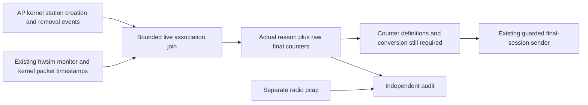

# Join a real disconnect reason to the final station sample while running

The owned hwsim lab can now correlate an actual radio disconnect reason with
the kernel's removal-time counters **during the experiment**. This is an input
to final-session reporting. It does not yet convert those counters or send a
Client Disassociation Stats message; the selected counter definitions and
publisher conversion remain unqualified.

Read [station removal](station-removal-observations.md),
[counter accounting](station-counter-accounting.md) and the
[final-session sender](final-session-statistics.md) first. The
[retained evidence](../evidence/session-reasons/README.md) records live results
and their limits. The existing [15-minute recovery result](native-lifecycle.md)
is retained separately; the new observer also runs for the full 15 minutes.

## Why the reason needs its own observation

The kernel's `DEL_STATION` event supplies counters at station removal but no
disconnect reason in our selected build. A disappeared OVSDB row also says
nothing about the reason. Previously, a human or offline checker could find a
deauthentication frame in the completed packet capture. An online reporting
path needs that information before its freshness deadline, while preserving
which association the counters belong to.



The collector runs in VM and reads the existing `hwsim0` monitor. It creates no
monitor interface, changes no radio configuration and sends no packet. It also
reads the append-only station-event log in the owned AP container. The native
controller, EMOSA worker and simulated pod manager remain separate processes.

This is an explicitly owned simulation observer, not a new requirement to
install software on physical OpenSync pods. A physical pod must supply its
existing qualified telemetry. The pinned OpenSync Protobuf schema's
band-steering disconnect-reason field is a candidate representation, not proof
of its session semantics or delivery completeness on a particular firmware.

## How the join avoids guessing

The profile selects the lab's sole station and BSSID, unprotected disconnect
frames and the two observed hwsim radiotap layouts. It reads the actual
little-endian reason from a deauthentication or disassociation body using
IEEE 802.11-2024 §9.3.3.4/12 and validates its assigned value against
§9.4.1.7/Table 9-79. Unfamiliar layouts, protected bodies or fragmented frames
are unavailable inputs, not reasons to invent a default.

Every final record includes the collector's unique epoch, station lifetime,
kernel association timestamp, interface, BSSID, actual radio frame and original
creation/removal events. The seven kernel counters keep their raw names and
values. They are deliberately not constructed as `TrafficCounters`.

The join permits either stream to arrive first. It waits at least 250 ms after
removal for the independently delivered inputs and must finish within one
second. The reason frame must fall within that station lifetime and within one
second before the kernel removal observation. Both clocks use the owned VM;
each wall read is bracketed by two monotonic reads. A bracket wider than 100 µs
is retried at most three times; continuing uncertainty fails separately from a
clock step. An offset discrepancy over 1 ms still invalidates the source. These are
selected implementation bounds, not new EasyMesh timing requirements.

Identical radio retries identify one event. Conflicting reason, direction,
subtype or sequence values invalidate the source. Reassociation before the join,
missing final fields, changed identities, replaced/truncated event history,
capture drops or interrupted collection also fail. A conflicting frame that
arrives after a join invalidates the collector; a delayed identical copy cannot
create a second record. Downstream work must respect the collector's current
health and freshness, not treat an old log row as permanent authority.

## 1. Learn the boundaries on HOST

Use the configured checkout and Python environment from manual chapter 3:

```bash
uv run pytest -q tests/test_session_reasons.py tests/test_station_events.py
python3 scripts/check-session-reasons.py \
  doc/evidence/session-reasons/native-reason-04
```

The unit tests exercise both delivery orders, AP/client directions, identical
retries, conflicting and missing reasons, deadline expiry, incomplete counters,
reassociation and replay. Native evidence separately establishes only the
observed station-initiated disconnect workload. Neither proves PMF handling,
multiple clients or behavior on a physical radio.

## 2. Stage the observer — HOST → VM

Prepare the current source/radio harness, the optional owned peer profile and
the lifecycle candidate using the [lifecycle guide](native-lifecycle.md).
Keep its candidate directory name or substitute your own consistently. While
the owned lab is idle, stage the new files:

```bash
lxc file push lab/src/emosa_lab/simulation/session_reasons.py \
  emosa-lab/opt/emosa-radio-manager/source/emosa/simulation/
lxc file push deploy/radio-manager/session-reasons.py \
  emosa-lab/opt/emosa-radio-manager/
lxc file push deploy/radio-manager/station-events.py \
  emosa-lab/opt/emosa-radio-manager/
lxc file push deploy/peer-baseline/native-onboarding.py \
  emosa-lab/opt/emosa-baseline/
```

Staging a file does not reload an already-running process. Finish and collect
the current run before starting one with new source bytes. Preserve each label
and source hash; do not replace evidence with the results of a later attempt.

## 3. Run the full recovery workload

This 900-second experiment tests the added input path with repeated client
cycles and both actual management recovery faults. Earlier 210-second pilots
are retained separately. Even the full-duration pass does not qualify the
remaining counter conversion or complete required reporting.

```bash
lxc exec emosa-lab -- env \
  PYTHONPATH=/opt/emosa-radio-manager/source \
  EMOSA_OVS_BIN=/opt/emosa-radio-manager/ovsdb \
  /opt/emosa/.venv/bin/python /opt/emosa-baseline/native-onboarding.py \
  --build /opt/emosa-baseline/candidate-lifecycle-learning-01 \
  --label session-reason-demo --active-seconds 900 --recovery-checks \
  --observe-station-removal --observe-session-reasons \
  --telemetry-gap-check --neighbor-gap-check \
  --virtual-link --neighbor-metrics --peer-path-gap-check
```

`--observe-session-reasons` requires `--observe-station-removal`: a radio reason
without the kernel association and final sample cannot satisfy this join.
Startup waits for the observer to become ready before clients are connected.
If the observer exits early, the run fails and still attempts normal cleanup.
Keep observing the same live process if a console wait times out.

## 4. Collect and inspect the result on HOST

```bash
python3 scripts/collect-native-review.py session-reason-demo \
  .lab/session-reason-demo-review --candidate candidate-lifecycle-learning-01
python3 scripts/observe-native-restoration.py session-reason-demo \
  .lab/session-reason-demo-review/post-restoration-observation.json
python3 scripts/check-native-recovery.py .lab/session-reason-demo-review \
  --minimum-seconds 900
python3 scripts/check-native-lifecycle.py .lab/session-reason-demo-review
python3 scripts/check-session-reasons.py .lab/session-reason-demo-review
python3 scripts/check-native-peer-metrics.py .lab/session-reason-demo-review
python3 scripts/check-native-ap-withholding.py .lab/session-reason-demo-review
python3 scripts/check-telemetry-gap.py .lab/session-reason-demo-review
```

`session-reasons.jsonl` contains live frame observations and joined raw finals.
`reason-observer.json` records identity, capture statistics and final health.
The independent checker imports no publisher or adapter code. It requires each
joined event to match the original kernel log, a unique frame in the separate
radio pcap, tshark's decoded reason and the corresponding EasyMesh client-leave
notification. It also checks the measured join deadline and capture health.

Read `final_counter_source_qualified: false` and
`native_final_statistics_delivery_proven: false` literally. A successful reason
join does not correct Linux byte, successful-packet, error or retry semantics.
The [public BBF review](bbf-data-elements.md) now establishes selected units,
types and unavailable values for independent implementation. Next qualify the
complete counter mapping, resolve remaining source ambiguities and connect a
current, session-bound source to the sender. The
native controller must then acknowledge the actual final report with values
checked independently before this reporting requirement can pass.
