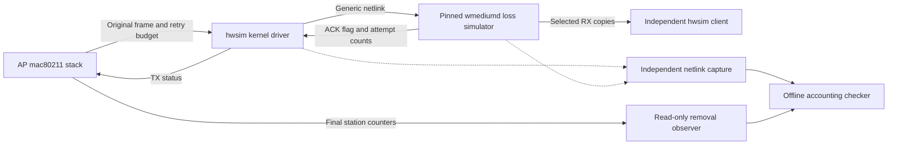

# Exercise station counters under simulated frame loss

This optional experiment adds a userspace medium between the owned hwsim radios.
Its purpose is to expose failed-transmission and retry bookkeeping before EMOSA
uses those counters in EasyMesh reports. It does not qualify radio airtime,
physical RF performance or a production telemetry source.

The [retained 216-second result](../evidence/medium-loss/README.md) reconciles
983 submissions and 195 failed transmissions. Its medium represents 2,405 retries
while the kernel reports 185; retry qualification remains unresolved.

Start with [normal-traffic counter accounting](station-counter-accounting.md).
That experiment has no failed transmissions. A zero error value in a successful
run tells us little about what the field counts when transmissions fail.

## Follow the observations



The separate native controller still discovers and provisions EMOSA. The
simulated OpenSync pod manager still drives hostapd, and the independent LXD
client still uses wpa_supplicant. Only the hwsim medium changes for this experiment.
There is no physical pod and no replacement of EMOSA's protocol implementation.

The upstream source is [bcopeland/wmediumd](https://github.com/bcopeland/wmediumd/tree/717e5d7fcc23eecbc8e32bd897a8fd4b1e3ba640),
commit `717e5d7fcc23eecbc8e32bd897a8fd4b1e3ba640`, built without patches.
Its `prob` model uses one random choice for all attempts of a unicast frame.
The selected AP-to-client loss probability is 0.20; the reverse direction is
0.0. These are requested simulation probabilities, not promised measured loss
percentages. A failed frame exhausts its selected retry budget. The simulator
does not emit a separate radio frame for every modeled attempt.

Consequently, a hwsim capture's retry bit cannot count those modeled attempts.
The additional `nlmon` capture records actual kernel submissions, medium status
messages and the kernel's acceptance/rejection replies. The checker joins by
hardware radio address and cookie, checks original MPDU bytes against the radio
capture, and compares complete station lifetimes with final kernel counters.
It checks capture totals and zero reported collector loss before accounting.
The netlink collector filters the dynamically resolved hwsim family, its control
lookup and kernel replies, uses a 32 MiB buffer and drains after medium shutdown.
An earlier 212-second attempt dropped two netlink records; it is retained as
failed accounting evidence, despite usable traffic and completed management faults.
It never equates a medium ACK flag with independent proof of successful delivery.
The existing nonce/HTTP observations separately establish usable client traffic.

## Prepare the optional build — VM

Use the existing owned `emosa-lab` VM and native onboarding candidate. Finish
[native onboarding](native-onboarding.md) and the normal-traffic exercise first.
Keep the development checkout on HOST. Do not run this on a production router.

On HOST, stage the current helpers while the owned lab is idle:

```bash
lxc file push deploy/radio-manager/build-medium.py \
  deploy/radio-manager/medium.py emosa-lab/opt/emosa-radio-manager/
lxc file push deploy/peer-baseline/native-onboarding.py \
  emosa-lab/opt/emosa-baseline/
lxc file push deploy/peer-baseline/node.py emosa-lab/opt/emosa-baseline/
lxc file push deploy/peer-baseline/compatibility/controller-candidate.py \
  deploy/peer-baseline/compatibility/lifecycle-observer.py \
  emosa-lab/opt/emosa-baseline/compatibility/
```

Inside VM, install the build dependencies if they are absent:

```bash
apt-get install --no-install-recommends build-essential pkg-config git \
  libnl-3-dev libnl-genl-3-dev libconfig-dev
```

The retained Ubuntu 24.04 build used libnl development packages
`3.7.0-0.3build1.1` and libconfig `1.5-0.4build2`. The build manifest records the
actual compiler, package versions, complete source hashes and binary hash.
Changed dependencies require a new reviewed build, not an assertion of identical
behavior.

For a new installation, still inside VM:

```bash
git clone https://github.com/bcopeland/wmediumd /opt/wmediumd
git -C /opt/wmediumd checkout --detach 717e5d7fcc23eecbc8e32bd897a8fd4b1e3ba640
/opt/emosa/.venv/bin/python /opt/emosa-radio-manager/build-medium.py \
  --source /opt/wmediumd \
  --output /opt/emosa-radio-manager/medium-717e5d7
```

The output must be new. Keep an existing build and its provenance; the current
owned VM already has this build. The script rejects a different commit or dirty
source. It compiles a private executable without installing a service or changing
the kernel. Upstream licensing remains GPL-2.0-or-later; binaries are not included
in this repository.

## Run and inspect — HOST

Choose a fresh label; the example below is intentionally different from retained
evidence. Allow several minutes for setup, the active period and cleanup.

```bash
lxc exec emosa-lab -- env \
  PYTHONPATH=/opt/emosa-radio-manager/source \
  EMOSA_OVS_BIN=/opt/emosa-radio-manager/ovsdb \
  /opt/emosa/.venv/bin/python /opt/emosa-baseline/native-onboarding.py \
  --build /opt/emosa-baseline/candidate-onboarding-01 \
  --label medium-learning-01 --active-seconds 210 \
  --recovery-checks --observe-station-removal --medium-loss

python3 scripts/collect-native-review.py medium-learning-01 .lab/medium-learning-01
python3 scripts/check-medium-accounting.py .lab/medium-learning-01
```

The runner refuses another wmediumd process or an existing `em-medium-nl`
interface. It creates that monitor exclusively, starts capture before medium
registration, and checks the medium throughout client activity. The transient
service has a duration cap. Normal cleanup stops the medium, collects capture
statistics and removes only its own monitor. Medium exit returns hwsim to its
kernel forwarding path. The native candidate wrapper restores the controller.
Keep all failed attempts, their logs and cleanup results.

The profile has three identities. The gateway's hardware identity receives
dynamic aliases for its multiple native BSSs. The sole pod AP and client use
their stable interface identities; wmediumd learns their hardware addresses
from actual transmissions. This matters because scan address add/remove events
do not constitute a complete persistent interface inventory. Do not reuse this
profile for additional radios, BSSs or pods without requalification.

Kernel rejection of an offered receive copy is retained as such. A broadcast
copy offered to an idle/off-channel radio can return `EINVAL`; this alone does
not establish its cause or delivery. Registration errors, transmit-status
rejections and unknown senders fail the experiment. Per-session accounting
requires a successful kernel reply for every selected TX completion.

Intentional medium loss also affects continuous Wi-Fi ping. The older
zero-loss management-recovery checker is not an acceptance test for this fault
profile. Do not disable its traffic checks or relabel lost packets as client
disconnects. Examine the loss experiment's separate observations and retain the
original successful 15-minute operational recovery evidence.

## What remains unqualified

- wmediumd's timing calculations use legacy rates and do not interpret the
  kernel's per-rate HT/VHT flags. Its delivered RX rate is fixed at index 1.
  Those values cannot substantiate this HT BSS's PHY rate or airtime.
- The default hwsim survey uses dummy values, including busy time derived as
  one-eighth of its time value. The global radiotap monitor also loses HT rate
  metadata. Neither supplies a qualified AP utilization or ESP measurement.
- Submission counts, accepted medium status, final kernel counters and
  independently observed delivery are different observations. Retry counter
  discrepancies must remain explicit; do not fill a missing value with zero.
  `tx_submission_and_failure_accounting_passed` and `retry_counter_reconciled`
  are separate checker results. Passing the former does not override a false
  retry result. In the reviewed kernel, `ieee80211_tx_get_rates()` also suppresses
  per-frame retry accounting for an A-MPDU submission without aggregate status.
  The hwsim userspace API does not export that original mac80211 control flag;
  this branch is a source-review lead, not a proven explanation for every delta.
- IEEE 1905 neighbor metrics, AP/radio/STA reporting and the qualified online
  final-session publisher remain required for complete sustained acceptance.
  The selected Wi-Fi Data Elements package remains in the
  [acquisition checklist](specification-acquisition.md).

RF-kill was also tried and rejected for this purpose: it removed the association,
then left the client interface down after unblocking. That failed attempt was
retained and the owned interface restored. It supplies no retry qualification.
Physical acceptance remains **real EasyMesh messages → EMOSA → unchanged physical
OpenSync pod → independently observed behavior**.
