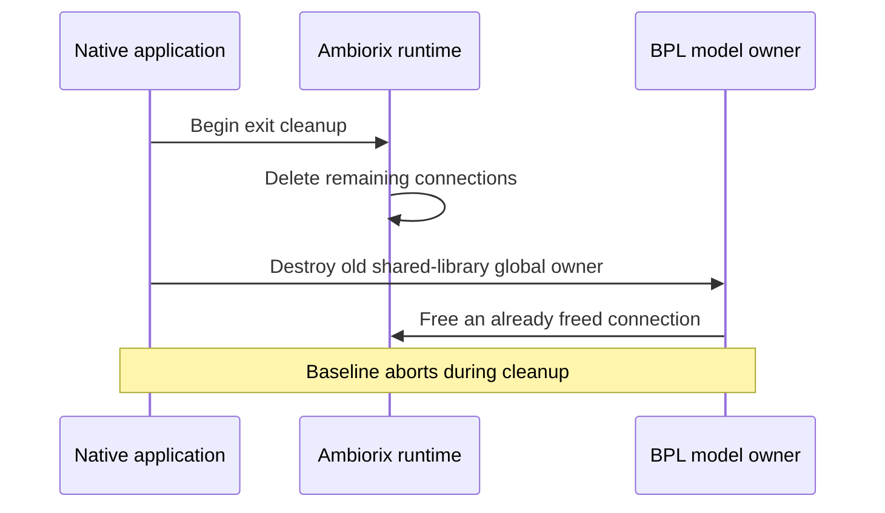

# Verify native shutdown after the 15-minute workload

The native controller and its colocated helper are C++ prplMesh components in
the evaluation lab. EMOSA is the separate EasyMesh-to-OpenSync adapter. This
exercise fixes and tests a cleanup defect in the controller container's selected
Linux BPL library. It does not install native software on an OpenSync pod.

Read [native onboarding](native-onboarding.md) and
[sustained operation](sustained-operation.md) first. The
[retained lifecycle evidence](../evidence/native-lifecycle/README.md) records
the library comparison, restoration fault and full-duration native experiment.
Qualified AP/STA and final-session reporting still precede complete sustained
acceptance; successful shutdown alone cannot close those reporting gaps.

## Why a successful demonstration can still crash on exit

The old controller and helper handled SIGTERM and reached cleanup, then aborted.
Their service records contain `Result: core-dump` and `ExecMainStatus: 6`.
That differs from a clean exit, where both services report `success` and status
`0`. Increasing a stop timeout or treating SIGABRT as success would conceal the
failure without correcting it.

Ambiorix is the native component's data-model runtime. Its connection list must
outlive the individual model objects that use those connections. A C++ shared
pointer in BPL kept the model alive too long:



Both native mains already have a static runtime lifetime guarantee. However,
the old BPL owner was initialized earlier, when its shared library loaded.
Reverse destruction order therefore released that owner after the guarantee.
The patch makes the owner a function-local static constructed on first use by
the application. It is then released before the runtime guarantee. Normal
model destruction still frees its connections; no cleanup is skipped.

`0006-bpl-model-lifetime.patch` changes the internal owner accessor and its BPL
call sites. The public setter's interface remains the same. The candidate
rebuilds `libbpl.so.6.0.0`; the helper executable and remaining installed native
libraries retain their selected bytes. The controller build retains the existing
counter-advertisement and configuration-scope patches.

This is the selected Linux/no-WHM lab profile. Other native platform profiles
need their own build and lifecycle qualification. The original baseline is
restored after each experiment and retains its recorded shutdown defect.

## 1. Understand the two kinds of evidence — HOST

The small C++ `emosa-model-lifetime` probe loads the real baseline or candidate
BPL library. Its model derives from the native dummy model interface. Printed
events expose actual C++ destruction order across the executable/shared-library
boundary. This is a component test; it does not create a real bus connection.

| Case | Expected event order |
| --- | --- |
| Baseline, implicit exit | Main returns → runtime destroyed → model destroyed: reproduces the bad order |
| Candidate, implicit exit | Main returns → model destroyed → runtime destroyed |
| Either library, explicit model clear | Model destroyed → main returns → runtime destroyed |

The live test supplies the other kind of evidence. It observes the actual
controller and helper processes loading the candidate library, completes the
15-minute workload, and inspects their real service exit results. The before/after
process observations retain executable/library hashes, mapping inodes, PIDs and
systemd stop policy. They do not collect process memory or credentials.

## 2. Build an isolated candidate — HOST

Prepare the three hash-pinned native input archives and build prerequisites in
the [controller candidate guide](../guides/controller-counter-candidate.md).
Then use a new directory:

```bash
uv run --with cmake==3.31.6 python \
  deploy/peer-baseline/compatibility/build-controller.py \
  --build "$PWD/.lab/controller-lifecycle-learning-01" \
  --artifacts .cache/native-controller-inputs --onboarding --lifecycle
```

`--onboarding` selects the existing configuration-scope fix. `--lifecycle` adds
the BPL lifetime patch and rebuild. Without that second option, the builder
retains the original shared libraries. The builder verifies archive/header pins,
applies patches without fuzz, compiles the native sources and runs both the
12 counter checks and baseline/candidate lifetime comparisons.

Inspect `candidate.json`, `lifetime-regression.json` and `build.log`. Check that
the baseline and candidate probe runs loaded different recorded BPL hashes and
produced the orders above. `stage/bin/beerocks_controller` and
`stage/lib/libbpl.so.6.0.0` are the experimental outputs. Building them installs
nothing in a running lab. Preserve failed build directories and use a fresh name
after correcting a failure.

## 3. Stage the candidate and current harness — HOST → VM

Use the existing owned VM and complete current source/radio staging from the
native onboarding guide. Stage only while the owned experiments are idle:

```bash
lxc exec emosa-lab -- mkdir -p \
  /opt/emosa-baseline/candidate-lifecycle-learning-01/stage/bin \
  /opt/emosa-baseline/candidate-lifecycle-learning-01/stage/lib \
  /opt/emosa-baseline/compatibility
lxc file push .lab/controller-lifecycle-learning-01/stage/bin/beerocks_controller \
  emosa-lab/opt/emosa-baseline/candidate-lifecycle-learning-01/stage/bin/
lxc file push .lab/controller-lifecycle-learning-01/stage/lib/libbpl.so.6.0.0 \
  emosa-lab/opt/emosa-baseline/candidate-lifecycle-learning-01/stage/lib/
lxc file push .lab/controller-lifecycle-learning-01/candidate.json \
  .lab/controller-lifecycle-learning-01/regression.json \
  .lab/controller-lifecycle-learning-01/lifetime-regression.json \
  emosa-lab/opt/emosa-baseline/candidate-lifecycle-learning-01/
lxc file push deploy/peer-baseline/patches/0006-bpl-model-lifetime.patch \
  deploy/peer-baseline/node.py deploy/peer-baseline/native-onboarding.py \
  deploy/peer-baseline/run.py deploy/peer-baseline/setup.py \
  emosa-lab/opt/emosa-baseline/
lxc file push deploy/peer-baseline/compatibility/controller-candidate.py \
  deploy/peer-baseline/compatibility/lifecycle-observer.py \
  emosa-lab/opt/emosa-baseline/compatibility/
```

The earlier guide stages patches 0004 and 0005 and the ordinary radio dependencies.
The new observer must accompany the new native harness even when reproducing a
baseline candidate. Staging a library in `candidate-.../stage/lib/` is not the
same as replacing the controller's active library. The wrapper performs the
temporary replacement under the owned experiment lock, after checking idleness
and preserving byte-exact compressed backups of both changed files.

## 4. Prove restoration before running the workload

Use another fresh label:

```bash
lxc exec emosa-lab -- env PYTHONPATH=/opt/emosa-radio-manager/source \
  /opt/emosa/.venv/bin/python \
  /opt/emosa-baseline/compatibility/controller-candidate.py \
  --build /opt/emosa-baseline/candidate-lifecycle-learning-01 \
  --label lifecycle-restore-demo --fail-after-install
```

This command intentionally fails after installing the candidate files. Inspect
the result under `/opt/emosa-baseline/controller-candidates/lifecycle-restore-demo/`.
It must say `failure_injection: true`, `status: failed`, `baseline_restored: true`
and a restored BPL hash equal to its baseline hash. No configuration operation
should be created. Also compare the actual restored files and references with
the recorded originals. A caught exception is insufficient evidence of restoration.

From HOST, retain an independent read of the actual restored files and idle state:

```bash
python3 scripts/observe-native-restoration.py lifecycle-restore-demo \
  .lab/lifecycle-restore-demo-observation.json
```

This read-only command verifies the installed controller, unchanged helper,
selected library and both reference copies against the trial's originals. It
fails if the lab is still active or any byte hash differs. The output path must
not already exist, so a later observation cannot erase an earlier one.

The wrapper retains backups if stopping or restoring fails. Resolve that recorded
failure before another experiment; do not overwrite a running library or reuse
an old label. Never change `SuccessExitStatus` to make an abort appear successful.

## 5. Run the full 15-minute workload with recovery

Complete the optional [owned peer profile](native-peer-metrics.md) staging too.
From HOST:

```bash
lxc exec emosa-lab -- env \
  PYTHONPATH=/opt/emosa-radio-manager/source \
  EMOSA_OVS_BIN=/opt/emosa-radio-manager/ovsdb \
  /opt/emosa/.venv/bin/python /opt/emosa-baseline/native-onboarding.py \
  --build /opt/emosa-baseline/candidate-lifecycle-learning-01 \
  --label lifecycle-soak-demo --active-seconds 900 --recovery-checks \
  --observe-station-removal --telemetry-gap-check --neighbor-gap-check \
  --virtual-link --neighbor-metrics --peer-path-gap-check
```

The 900 seconds measure active operation; startup and cleanup take additional
time. The two management faults occur about one-third and two-thirds through
the active phase. Independent wired/Wi-Fi probes continue during each fault,
while deliberate client disconnects have their own expected gaps. Do not restart
the command merely because an observation or remote console wait times out;
check the same live process until it reaches a terminal state.

After completion, collect the explicit allowlist on HOST:

```bash
python3 scripts/collect-native-review.py lifecycle-soak-demo \
  .lab/lifecycle-soak-demo-review --candidate candidate-lifecycle-learning-01
lxc file pull \
  emosa-lab/opt/emosa-baseline/controller-candidates/lifecycle-soak-demo/reference-candidate.json \
  .lab/lifecycle-soak-demo-review/reference-candidate.json
python3 scripts/observe-native-restoration.py lifecycle-soak-demo \
  .lab/lifecycle-soak-demo-review/post-restoration-observation.json
python3 scripts/check-native-recovery.py .lab/lifecycle-soak-demo-review
python3 scripts/check-native-lifecycle.py .lab/lifecycle-soak-demo-review
python3 scripts/check-native-peer-metrics.py .lab/lifecycle-soak-demo-review
python3 scripts/check-native-ap-withholding.py .lab/lifecycle-soak-demo-review
python3 scripts/check-telemetry-gap.py .lab/lifecycle-soak-demo-review
```

Read each result according to its scope. Recovery checks cover traffic, fresh
onboarding and no duplicate Config writes. Lifecycle checks cover actual
controller/helper main-process exits under the unchanged stop policy and restored
candidate files. Peer checks join measurements, wire replies and controller
statistics. AP withholding checks require honest missing-period accounting while
the qualified AP source is absent. Fifteen minutes of correctly recorded missing
AP reports still does not fulfil the controller's reporting policy.

**Learning checkpoint:** explain why a clean service stop, a correct C++ lifetime
probe, a successful reconnect and complete controller reporting are separate
claims. The full viability path remains real EasyMesh messages through EMOSA to
an unchanged OpenSync pod, followed by independently observed behavior.
