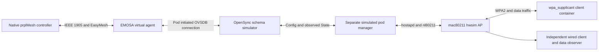

# Native controller onboarding of the simulated OpenSync pod

This experiment joins the previously separate discovery and WSC/radio paths.
Its target is one complete, causally connected run: the native controller sends
configuration, EMOSA authenticates and translates it, the simulated OpenSync
manager applies it, the controller learns the observed radio/BSS, and independent
clients demonstrate traffic. It remains a bounded lab experiment, not a qualified
physical-pod profile or a complete EasyMesh implementation.

## What each component does



EMOSA is the **EasyMesh to OpenSync adapter**. Its virtual agent is the
controller-facing representation of the pod, not a second native prplMesh agent
inside the extender. Only the gateway container runs the native controller and
its colocated helper. The simulated extender runs a separate radio manager.

The controller receives the lab SSID/key through its own BML management API.
The EMOSA worker receives neither as a command-line input. It obtains both from
the authenticated WSC M2 message, creates one durable operation and writes the
guarded Config transaction. The radio manager observes hostapd/nl80211 and
publishes State independently. Config alone cannot make the operation applied.

## Selected contract and specification decisions

| Subject | Selected behavior and reference |
| --- | --- |
| Editions | IEEE 1905.1-2013 plus 1905.1a-2014; EasyMesh 6.1; WSC 2.0.10, using the locally reviewed copies recorded in the protocol matrix |
| Scope | One owned simulated pod; wired management; one existing 2.4 GHz HT20 radio on channel 6; one pure fronthaul WPA2-PSK/CCMP BSS |
| Identity | Virtual AL `02:00:00:00:30:01`; radio/BSSID `02:00:00:ec:02:00`; explicit controller binding `02:00:00:e0:00:01` |
| Discovery | Profile-1 Search/Response and both required Controller Capability indications, EasyMesh §6.1, §17.1.1–2 |
| DPP | Unsupported. Apply §13.1 and §18's unsupported-feature omission rule to absent Security Capability; do not invent a zero-valued DPP capability. Malformed or reserved advertised algorithms remain rejected |
| Early reporting | Send the complete selected Early Report before M1, §5.2.2 and §17.1.62. Interpret the named Early bit as bit 6 in Table 117 for this lab; retain the overlapping reserved-range editorial ambiguity for full conformance review |
| Acknowledgement | Track Early acknowledgements/retries under §15.1. §5.2.2 requires Early transmission before M1, not waiting for an Ack. The native handler's missing Ack remains an explicit limitation |
| Counters | Advertise KiB after the corrected controller indication, §9.1/Table 71. This does not implement traffic telemetry |
| Topology Query | The query carries the **sender's highest profile**, §6.2. A Profile-2 query can receive our Profile-1 response. Discovery echo rules do not apply to this field |
| AP Capability | Report only supported features, §9.1 and §18; include Device Inventory. Do not fabricate scan, CAC, DPP or metric-collection capability |
| Provisioning | Authenticate/decrypt the complete sole-M2 request under IEEE §10 and WSC; reject additional BSSs, teardown, backhaul or unsupported configuration companions |
| Observations | Report current operational State, never the desired SSID while application is withheld. Changed observed topology triggers a notification and another native query |

The native peer candidate includes the existing counter flag patch and an
additional configuration-scope patch. The latter omits default VLAN settings for
agents advertising no traffic-separation support, and omits advanced-BSS TLVs
when no BSS has an advanced setting. Real advanced settings are not stripped.
These are explicit native source changes; no packet rewriter alters the capture.
The runner restores the original executable and references after every trial.

## Establish the lab — HOST and VM

Complete the [native controller candidate guide](../guides/controller-counter-candidate.md)
and [radio manager setup](../../deploy/radio-manager/README.md) first. Use the
existing owned VM and containers. Allow sufficient VM disk space for controller
backup/restoration, private journals and captures; the development VM was expanded
from 20 to 40 GiB while retaining existing evidence. After a VM reboot, restore
missing radios with the ownership-checked helper:

```bash
lxc exec emosa-lab -- env PYTHONPATH=/opt/emosa-radio-manager/source \
  /opt/emosa/.venv/bin/python /opt/emosa-radio-manager/restore.py --apply
```

The helper refuses an already loaded hwsim module. Use it only after its read-only
preflight (the same command without `--apply`) reports missing, owned radios.

Build the extended native candidate on HOST in a new private directory:

```bash
uv run --with cmake==3.31.6 python \
  deploy/peer-baseline/compatibility/build-controller.py \
  --build "$PWD/.lab/controller-onboarding-learning-01" \
  --artifacts .cache/native-controller-inputs --onboarding
```

From the HOST checkout, stage the new build and the changed code. These commands
assume the earlier radio/WSC staging is already complete:

```bash
lxc exec emosa-lab -- mkdir -p \
  /opt/emosa-baseline/candidate-onboarding-learning-01/stage/bin
lxc file push .lab/controller-onboarding-learning-01/stage/bin/beerocks_controller \
  emosa-lab/opt/emosa-baseline/candidate-onboarding-learning-01/stage/bin/
lxc file push .lab/controller-onboarding-learning-01/candidate.json \
  .lab/controller-onboarding-learning-01/regression.json \
  emosa-lab/opt/emosa-baseline/candidate-onboarding-learning-01/
lxc file push deploy/peer-baseline/patches/0004-controller-counter-capability.patch \
  deploy/peer-baseline/patches/0005-controller-configuration-scope.patch \
  deploy/peer-baseline/native-onboarding.py emosa-lab/opt/emosa-baseline/
lxc file push deploy/peer-baseline/compatibility/controller-candidate.py \
  emosa-lab/opt/emosa-baseline/compatibility/
python3 deploy/radio-manager/stage.py
```

Stage the complete current source and radio helpers together. The native runner
now requires both passive helpers, `neighbor-observer.py` and
`egress-observer.py`, plus live pod-side discovery before it starts the adapter.
Copying only the older onboarding modules can leave missing dependencies. See the
[neighbor-binding guide](neighbor-discovery-binding.md) for the observation flow
and focused recovery experiment, and the
[egress guide](egress-accounting-source.md) for the selected loss-accounting path.

## Run and read the boundaries

Use a new label for every attempt. Run this on HOST; `lxc exec` runs the process
inside VM. The explicit OVS binary location is required by this staging layout.

```bash
lxc exec emosa-lab -- env \
  PYTHONPATH=/opt/emosa-radio-manager/source \
  EMOSA_OVS_BIN=/opt/emosa-radio-manager/ovsdb \
  /opt/emosa/.venv/bin/python /opt/emosa-baseline/native-onboarding.py \
  --build /opt/emosa-baseline/candidate-onboarding-learning-01 \
  --label native-learning-01
```

The runner requires idle owned services and takes the shared experiment lock.
It starts a private real OVSDB server, the independent radio manager and native
controller. A temporary Ethernet namespace connects EMOSA to the owned backhaul
bridge. The database initiates its Unix-socket manager connection to EMOSA.

Read `/opt/emosa-radio-manager/runs/LABEL/` in this order:

1. `controller-before.json`: the virtual agent must initially be absent.
2. `ethernet.pcap` and `native-session.json`: correlated Search/Response, Early
   Report before M1, and the native M2. The session is not an inventory oracle.
3. `withheld-operation.json`: controller-supplied desired SSID in Config, old
   observed SSID in State, one operation, one transaction, `CONFIG_COMMITTED`.
   The runner intentionally withholds manager application to distinguish these.
4. `native-operation.json`: after release, independently derived State matches
   and the operation reaches `OBSERVED_APPLIED`.
5. `controller-after.json`: the native controller itself must report the exact
   represented radio, BSSID and provisioned SSID. An AL-only device is insufficient.
6. `clients-onboarded.json` and `radio.pcap`: separate wired/Wi-Fi clients and
   captured radio behavior establish usable traffic beyond a database result.
7. `result.json` and the candidate wrapper result under
   `/opt/emosa-baseline/controller-candidates/LABEL/`: inspect cleanup, native
   shutdown errors, and byte-exact baseline restoration.

`observed_pending_capture_review` deliberately does not declare proof: independent
packet review and correlation with the operation receipt must still pass. A
failure is retained under its original label; do not overwrite it with a rerun.

## Current limits and the next proof

The retained first experiment keeps the independent Wi-Fi client disconnected
during topology reporting, then ends the report worker before the client joins.
The subsequent [sustained-operation work](sustained-operation.md) adds measured
client membership/age and an active-worker pilot, including client join/leave
notifications and explicit capability-unavailable responses. Read its separate
evidence and limits; this does not retroactively extend the original proof.
Metrics/policy, channel procedures and integrated recovery still require work
before the sustained acceptance run. Unsupported requests are recorded, not
acknowledged as applied.

The initial native trial confirmed Early/M1/M2 exchange but rejected unsolicited
VLAN/advanced-BSS companions, and exposed EMOSA's overly strict topology-query
profile check. No operation was created in that trial. Its evidence is retained
under [the retained negative trial](../evidence/native-onboarding/README.md).
The extended candidate subsequently completed the bounded path. The selected
run includes AP Capability response, exact native radio/BSS inventory and
independent wired/Wi-Fi traffic. Recheck its capture/receipt correlation on HOST:

```bash
python3 scripts/check-native-onboarding.py doc/evidence/native-onboarding/run-05
```

This check imports no EMOSA implementation. It verifies captured M1 against the
durable receipt, source/destination and MID relationships, ordering, profile
fields, observed topology, native inventory, beacons, four-way handshake and
interface-bound client traffic. `independent-check.json` supplies the reviewed
bounded success verdict; original runner results retain their pre-review status.

The eventual acceptance path remains **real EasyMesh messages → EMOSA → unchanged
physical OpenSync pod → independently observed behavior**. This simulated run
reduces integration uncertainty; it cannot substitute for physical qualification.
