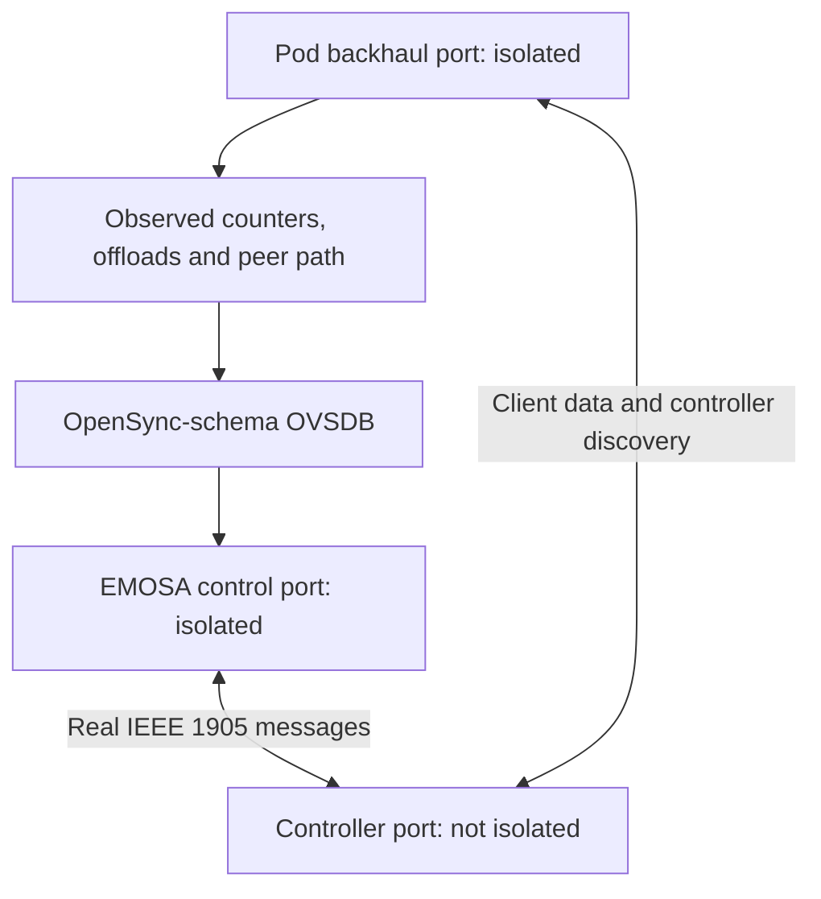

# Deliver measured neighbor metrics to the native controller

This opt-in exercise completes the **owned simulated Ethernet peer** reporting
path: observed pod counters and peer configuration travel through OpenSync-schema
OVSDB, EMOSA answers real IEEE 1905 queries, and the native controller updates
its represented interface statistics. It does not qualify a physical pod, a
physical PHY, AP/STA measurements or the complete 15-minute acceptance run.

Start with [combined service/loss accounting](shaped-backhaul-accounting.md).
The [retained experiments](../evidence/native-peer-metrics/README.md) explain
both the successful audit and earlier incomplete attempts.

The follow-on [AP reporting regression](ap-metric-reports.md) exposed a query
arriving shortly before a fresh peer interval was published. The coordinator now
retains at most four pending queries under their original one-second deadlines
and control/topology binding. Duplicates do not extend the wait; source or binding
loss, expiry and partial transmission withdraw pending work. Its retained repeat
answers three actual native queries, including one after a 337 ms bounded wait.
The original failed query and source files remain available in the
[AP reporting evidence](../evidence/ap-reporting/README.md).

## Why isolation is required

The controller-facing EMOSA interface and the pod's traffic-forwarding interface
are different ports on the VM's backhaul bridge. Previously, the adapter's own
multicast and IPv6 traffic could reach the pod and appear in its receive count.
Those frames cannot be attributed to the controller neighbor.



The two isolated ports cannot exchange frames with each other; each can exchange
frames with the non-isolated controller port. This follows Linux
[bridge port isolation](https://man7.org/linux/man-pages/man8/bridge.8.html).
The topology still includes the VM bridge, so the IEEE 1905 bridge-present flag
remains true. The experiment does not move client traffic onto EMOSA's socket.

`peer-path.py` verifies owned-lab identity and the three-port inventory, changes
the two isolation flags, and disables packet aggregation and VLAN offloads on
the measured pod/VM veth pair. Disabling aggregation gives the packet counters
and packet capture the same frame unit; Linux documents the distinction between
[segmentation and receive aggregation](https://www.kernel.org/doc/html/v6.8/networking/segmentation-offloads.html).
Original flags/features are recorded and restored. No physical-pod endpoint is
accepted by this helper.

The independent manager observes the live VM path before and after reading the
pod. It watches link, TC and address notifications, records configuration epochs,
requires untagged VLAN 1 and a bridge without an IP endpoint, and publishes the
raw path observations with the pod observations. EMOSA checks the complete port
set, isolation, identities, discovery binding, offloads and freshness. Unknown,
changed or stale inputs withdraw the source. A new path or connection lifetime
needs a whole measurement interval after the new baseline.

This is a controlled lab profile, not a detector for arbitrary external BPF,
firewall or firmware behavior. Independent capture and actual client delivery
remain part of qualifying each experiment. Broader paths require another profile.

## What EMOSA sends

`src/emosa/simulation/peer_metrics.py` joins the checked path to the current
`ShapedBackhaulSource` interval and the existing guarded `LinkMetricSource`.
`OnboardingSession` handles native queries only under its authenticated current
control context. The publisher does not write pod Config.

| IEEE 1905 field | Source in this owned profile |
| --- | --- |
| Local/neighbor interfaces | Actual pod port plus controller interface advertised in observed discovery |
| Bridge present | Observed intervening VM bridge |
| TX packets and errors | Same-period transmit count and disjoint action/root-scheduler/interface losses |
| RX packets and errors | Same-period arrivals and selected interface/ingress losses; arrivals are distinct from client delivery |
| MAC throughput capacity | Declared 100 Mb/s software service with framing; `floor(100 × 1500 / 1538) = 97 Mb/s` |
| Link availability | Whole-percent floor of estimated unused transmit service over the checked interval |
| PHY rate | `65535`, the amended unknown-rate value; no physical PHY rate is measured |
| RSSI | `255`, unspecified for this Ethernet link |

IEEE 1905.1-2013 §6.4.11/Table 6-18, §6.4.12/Table 6-20 and §11.1 define the
per-interface/neighbor fields and common measurement period. Annex A's link
metric data model (p.69) describes availability as an estimated idle-time
percentage. That supports the declared wired service estimator; EasyMesh 6.1
§10.1's Wi-Fi prediction under sufficient traffic is a different measurement.
The 1905.1a-2014 amendment supplies the updated unavailable PHY/RSSI rules.
These references are recorded in the [protocol matrix](protocol-matrix.json).

The existing Ethernet media code remains the explicitly declared simulated
1000BASE-T interface type. The optional 100 Mb/s service limits its modeled MAC
capacity; neither that type code nor the veth's speed constant proves a physical
Gigabit PHY. Changing the software profile is not permission to apply these
values to an actual pod.

Packet/error values describe a measurement interval, not lifetime totals. The
native controller exposes these as `Interface.*.Stats.PacketsSent`,
`PacketsReceived`, `ErrorsSent` and `ErrorsReceived`; its values may decrease
when the next reporting interval has less traffic. The independent audit checks
all fields on the wire and separately checks those exposed controller values.
It does not claim an external controller API exposes capacity/availability.

## Replay the retained result on HOST

```bash
python3 scripts/check-native-peer-metrics.py \
  doc/evidence/native-peer-metrics/native-peer-metrics-04
python3 scripts/check-native-recovery.py \
  doc/evidence/native-peer-metrics/native-peer-metrics-04 --minimum-seconds 210
```

The first checker imports no EMOSA implementation. It recomputes the combined
counter/service intervals, follows the manager's OVSDB publication, checks live
path observations and independently captured packets, decodes the reply bytes,
matches query IDs and deadlines, and compares controller inventories collected
after each reply. Read the two results together: the generic recovery checker's
remaining-metrics list is not the verdict of this separate peer-metric audit.

## Run the experiment in the owned lab

Use the existing [native lab setup](native-onboarding.md). Commands begin on HOST
in the checkout; `lxc exec emosa-lab` executes its payload inside VM `emosa-lab`.
The pod/AP, controller and clients remain separate LXD containers in that VM.
Keep other experiments stopped and use a fresh label.

The current baseline setup installs `ethtool` in the containers, and the VM
prerequisites include it. If upgrading an older lab, install it in the owned VM
and simulated pod first (HOST commands):

```bash
lxc exec emosa-lab -- apt-get install -y ethtool
lxc exec emosa-lab -- lxc exec em-baseline-agent -- apt-get install -y ethtool
```

The observers require its JSON feature listing. These commands target only the
owned simulation; no package is installed on a physical pod.

1. Stage the source and current helpers:

   ```bash
   tar -C src -cf - emosa | lxc exec emosa-lab -- tar -C /opt/emosa-radio-manager/source -xf -
   lxc file push deploy/radio-manager/peer-path.py deploy/radio-manager/manager.py \
     deploy/radio-manager/egress-observer.py deploy/radio-manager/virtual-link.py \
     emosa-lab/opt/emosa-radio-manager/
   lxc file push deploy/peer-baseline/native-onboarding.py emosa-lab/opt/emosa-baseline/
   lxc file push deploy/peer-baseline/node.py emosa-lab/opt/emosa-baseline/
   lxc file push deploy/peer-baseline/compatibility/controller-candidate.py \
     deploy/peer-baseline/compatibility/lifecycle-observer.py \
     emosa-lab/opt/emosa-baseline/compatibility/
   ```

2. Run with the declared service, peer reporting and the actual path fault:

   ```bash
   lxc exec emosa-lab -- env \
     PYTHONPATH=/opt/emosa-radio-manager/source EMOSA_OVS_BIN=/opt/emosa-radio-manager/ovsdb \
     /opt/emosa/.venv/bin/python /opt/emosa-baseline/native-onboarding.py \
     --build /opt/emosa-baseline/candidate-onboarding-01 \
     --label peer-learning-01 --active-seconds 210 --recovery-checks \
     --observe-station-removal --telemetry-gap-check --neighbor-gap-check \
     --virtual-link --neighbor-metrics --peer-path-gap-check
   ```

   `--neighbor-metrics` is deliberately opt-in and requires `--virtual-link`.
   Without it, the existing native experiment continues to withhold metrics.
   Startup and cleanup take additional time beyond the active 210 seconds.

3. Observe the different faults. A station-telemetry pause preserves the peer
   metric source. Pausing neighbor discovery withdraws its binding. The new
   path fault actually disables pod-port isolation, verifies metric withdrawal
   while control/client traffic remain healthy, restores isolation and waits
   for a fresh baseline. OVSDB disconnection and actual SIGKILL still require
   fresh authenticated onboarding with no additional Config writes.

4. Collect and review:

   ```bash
   python3 scripts/collect-native-review.py peer-learning-01 .lab/peer-learning-review
   python3 scripts/check-native-peer-metrics.py .lab/peer-learning-review
   python3 scripts/check-native-recovery.py .lab/peer-learning-review --minimum-seconds 210
   ```

   Confirm queue, isolation and offload restoration and an empty `cleanup_errors`
   list. Keep any failed attempt. The native controller/agent shutdown issue
   remains separately visible even when lab restoration succeeds.

## Interpret deliberate unavailability correctly

A query during an independently observed invalid path or confirmed pod
disconnection must not receive fabricated metrics or an invalid-neighbor claim.
The checker lists those fault-window queries separately. Healthy-path queries
must have timely, matching responses. A query after the worker has exited is
also listed separately, using explicit request/exit timestamps from
`worker-stop.json`; ambiguous boundary timing is rejected.

Discovery restoration also needs a whole new counter interval. The audit
separately lists queries before the first such interval could have been read,
using raw read bounds and the same fixed 1 ms clock allowance. It does not
excuse delayed replies after valid measurements become available.

The runner first waits for the required service/path baselines before pausing
telemetry. Starting that fault during initial warmup would not prove that an
existing metric source survived it. The earlier attempts retain that finding
and the missing teardown timestamp rather than being counted as complete passes.

Another retained attempt exposed an actual startup race: the controller asked
for channel information before the first fresh operating-radio sample. Those
live requests remained unanswered, so the recovery audit failed even though
peer reporting passed. The channel coordinator now holds at most four requests
within their original one-second deadlines and bound context. It validates and
answers when measurements arrive; duplicates cannot extend the deadline and
loss of authority discards the wait. Deterministic tests exercise that exact
sequence, expiration and context changes. The subsequent native run must still
pass the original strict channel-response audit.

Next complete AP/STA measurements and required final-session reporting, fix
native shutdown, and repeat the full integrated 15-minute acceptance run.
Physical acceptance remains real EasyMesh messages → EMOSA → unchanged physical
OpenSync pod → independently observed behavior.
