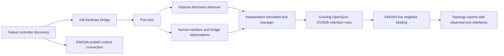

# Bind the virtual agent's topology to observed pod interfaces

This step connects the [raw forwarding observations](forwarding-observations.md)
to actual controller discovery received at the **simulated pod's backhaul port**.
The native topology report now uses observed pod interface MACs and bridge
membership, rather than substituting EMOSA's control-interface MAC. Metrics
remain unavailable until their counters and estimates are qualified.

## Why discovery must be observed at the pod

EMOSA and the simulated pod have separate connections to the VM bridge.
Receiving a controller message at EMOSA's `probe0` identifies the controller's
control path, but it does not establish which pod interface received discovery.
The new passive observer runs inside the owned pod container on `eth1`:



The observer does not transmit or actuate a radio. It joins the two discovery
multicast groups using socket-scoped memberships and writes private local lab
evidence. It retains only IEEE 1905 Topology Discovery and LLDP frames. It does
not collect WSC payloads or client traffic into its observation file.
This helper is for the owned simulator; it must not be installed on an unchanged
physical pod. A physical profile still needs its existing discovery observations
or a qualified external observation point.

## What a binding proves, and what it does not

IEEE 1905.1-2013 §6.3.1 and §8.1–8.2.1 distinguish two identities in Topology
Discovery: the device's **AL MAC** and the **sending-interface MAC**. The binding
uses the latter for the remote end of the observed link. It never copies the
controller AL address into that field merely because it is already known.

The receiver also processes the selected IEEE 1905 LLDP shape from §6.1:
MAC-address chassis ID, MAC-address port ID and a 180-second TTL. A matching
fresh LLDP/Topology Discovery pair indicates no intervening bridge under §8.1.
Topology Discovery without matching LLDP indicates an intervening bridge. The
component waits one second on initial discovery to allow the accompanying LLDP
to arrive. This settling interval is a local implementation choice, not a new
normative timeout. The native lab observes the bridged case; direct-link LLDP
behavior is covered by component tests only.

The owned profile accepts exactly one current controller/interface pair on
the selected `eth1` backhaul. A second peer or interface makes this source
ambiguous and unavailable; it is not silently dropped from a supposedly complete
inventory. Multi-neighbor discovery and physical link profiles remain separate
work. The component selects a conservative **65-second local discovery lease**,
allowing the standard's 60-second send period plus its one-second send window.
Refreshing the listener heartbeat does not renew an old received frame.

Before using the binding, EMOSA also checks:

- The collector's run label, capture epoch, boot ID and network namespace.
- Agreement with the current forwarding sample's local MAC and ifindex.
- A listener heartbeat and forwarding observation less than two seconds old,
  with no recorded packet-socket loss or collector error.
- Ordered received timestamps, bounded frame/capture-epoch inventories, valid
  message envelopes and the selected controller's advertised identities.
- No older heartbeat or changed payload under the same heartbeat. Invalidation
  preserves the replay watermark for that capture epoch.

The manager carries this evidence in a simulation-specific `external_ids` value
in the existing pinned OpenSync `Interface` table. No new OVSDB column or table is
required. The receiver checks it against the same observed port graph used for
counter intervals. It is a fixture publisher convention, not an assertion that
physical OpenSync firmware already exports it.

**Media remains an explicit simulation input.** The owned topology retains its
Ethernet media value `0x0001` for the virtual Ethernet ports and `0x0103` for the
hwsim AP. The MAC/bridge identities are observed; a physical 1000BASE-T PHY, line
rate, MAC throughput or availability has not been measured. Do not use this
identity result to derive those fields or claim physical media qualification.

## How the report changes

The virtual agent still has AL MAC `02:00:00:00:30:01`. Its Device Information
now lists the pod's observed `eth1`, `eth2` and `wlan0` interface MACs. The
Bridging Capability tuple joins those three interfaces. The 1905 Neighbor List
uses pod `eth1` as its local interface and the observed bridge-presence flag.
The remote sending-interface identity is retained for subsequent link metrics;
the Neighbor List itself contains the neighboring device's AL MAC.

These observations have a separate topology deadline. If discovery observation
stops, EMOSA marks topology incomplete and rejects replies prepared under the
expired stamp. Healthy OVSDB authority, radio telemetry and client traffic can
continue. Observation loss must not invent a leave, clear the client inventory,
or create another WSC configuration operation. Actual OVSDB loss and adapter
restart still require fresh authenticated onboarding as before.

## Reproduce the component checks — HOST

In the installed checkout:

```bash
uv run pytest -q tests/test_neighbor_binding.py tests/test_report_coordinator.py
python3 scripts/check-neighbor-binding.py doc/evidence/neighbor-binding/native-link-binding-04
python3 scripts/check-native-recovery.py \
  doc/evidence/neighbor-binding/native-link-binding-04 --minimum-seconds 210
```

The first command includes a disposable real-OVSDB integration test and needs
the existing simulator prerequisites. The retained native check only reads
reviewed files and runs independently of the adapter implementation. Read the
[evidence record](../evidence/neighbor-binding/README.md), including failed
attempts, before reproducing the VM run.

The independent check matches pod-observed discovery bytes/times to the separate
backhaul capture, using clock pairs from the kernel station observer. It also
checks every emitted topology response's literal interface/bridge/neighbor TLVs.
This is stronger than comparing two adapter-generated status fields. The native
controller's radio/BSS/client inventory and traffic checks remain separate gates.

## Reproduce the native recovery check — HOST starts the owned VM experiment

Complete the [sustained-operation setup](sustained-operation.md). Stage the source
and helpers while the lab is idle. The new helper must be included:

```bash
tar -C src -cf - emosa | lxc exec emosa-lab -- tar -C /opt/emosa-radio-manager/source -xf -
lxc file push deploy/radio-manager/node.py deploy/radio-manager/manager.py \
  deploy/radio-manager/neighbor-observer.py deploy/radio-manager/egress-observer.py \
  emosa-lab/opt/emosa-radio-manager/
lxc file push deploy/peer-baseline/native-onboarding.py emosa-lab/opt/emosa-baseline/

lxc exec emosa-lab -- env \
  PYTHONPATH=/opt/emosa-radio-manager/source \
  EMOSA_OVS_BIN=/opt/emosa-radio-manager/ovsdb \
  /opt/emosa/.venv/bin/python /opt/emosa-baseline/native-onboarding.py \
  --build /opt/emosa-baseline/candidate-onboarding-01 \
  --label binding-learning-01 --active-seconds 210 --recovery-checks \
  --observe-station-removal --telemetry-gap-check --neighbor-gap-check

python3 scripts/collect-native-review.py binding-learning-01 .lab/binding-learning-01
python3 scripts/check-neighbor-binding.py .lab/binding-learning-01
python3 scripts/check-native-recovery.py .lab/binding-learning-01 --minimum-seconds 210
python3 scripts/check-telemetry-gap.py .lab/binding-learning-01
python3 scripts/check-native-policy.py .lab/binding-learning-01
```

Use new labels/directories and preserve failed attempts. Startup may wait about
one minute for the controller candidate's first periodic discovery. The harness
allows 70 seconds for a real bound observation before starting the adapter.
It does not seed a neighbor or count this preparation as active duration.

`--neighbor-gap-check` stops the passive observer process with SIGSTOP for four
seconds, while the AP, OVSDB publisher and clients keep running. It checks traffic
while the observation is unavailable, then resumes that same observer with
SIGCONT. `neighbor-gap-check.json` records before/during/after state and operation
receipts. It is an observation fault, distinct from the later actual OVSDB loss
and adapter SIGKILL. The observer is stopped and its final health record collected
at cleanup; the physical-pod state is untouched.

## Why earlier attempts were retained

The first attempt's controller-inventory deadline expired without a binding.
The second waited explicitly for a binding and its independent capture exposed
a receive-hook problem: EtherType-specific sockets on the Linux bridge slave did
not receive those frames. The corrected listener uses `ETH_P_ALL` at the `eth1`
packet tap, filtering retained data to discovery/LLDP. This receives the frame at
the relevant interface before bridge processing redirects protocol delivery.
Socket behavior and packet/drop counters are described in the
[Linux packet-socket manual](https://man7.org/linux/man-pages/man7/packet.7.html).
The native capture, rather than a mocked receive function, establishes the fix.

A third run passed the runtime recovery checks but its initial discovery occurred
before the independent backhaul capture started. It cannot satisfy the complete
binding audit. The fourth run starts capture before controller startup, keeping
the requirement to independently match every discovery used by the binding.

## What remains for sustained acceptance

Use this live identity binding when qualifying per-neighbor counter attribution
and capacity/availability estimates. The existing metric publisher still rejects
missing measurements. AP/STA metrics, reporting obligations and final-session
statistics must also be completed before repeating the full requested 15-minute
acceptance run. Successful interface binding alone does not satisfy that goal
or the unchanged-physical-pod acceptance path.
