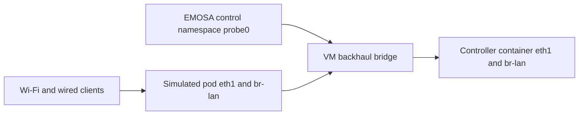

# Answer IEEE 1905 neighbor-link queries from qualified observations

The query/response component and guarded measurement handoff are implemented.
The native simulator now recognizes these queries and explicitly records missing
measurements. **A qualified native publisher and native metric delivery remain
pending.** Synthetic encoding checks are separate from measured behavior.

## Understand which link the controller is asking about

A client report describes a station associated with the pod's AP. A 1905 neighbor
report describes a connection to another 1905 device, commonly the backhaul to
the gateway. One neighboring device can connect over multiple interface pairs.
The response groups all those pairs under the reporting and neighboring AL MAC
addresses. An AL MAC identifies a device; it does not automatically identify
the interface carrying that device's data traffic.

The current owned lab makes this distinction particularly important:



The adapter emits real controller-facing frames through `probe0`. Client traffic
flows through the simulated pod's forwarding interfaces. Counting `probe0`
packets would measure the adapter's control endpoint, not the pod's backhaul.
The new `neighbor-link-observations.json` records these distinct MACs, interface
indices, veth peers, bridge membership and raw interface statistics during the
native experiment. It is read-only inventory evidence. Its single snapshot does
not establish a measurement interval or per-neighbor counter attribution.

The old bounded topology fixture's virtual interface and bridge assumptions are
not a qualified mapping to the pod's actual backhaul. Before enabling a publisher,
bind the observed pod/peer interface pair into the represented topology and
verify bridge presence. The source rejects measurements whose interface, media
or bridge fields disagree with that current topology.

## Rules and their source

The authorized PDFs remain outside Git; their hashes are recorded in the
[IEEE input record](ieee1905-envelope.md). References below use printed pages.
Amendment page 11 was inspected visually to distinguish inserted and deleted
text. Open-source behavior is a cross-check, not the source of these rules.

| Rule | Authoritative reference |
| --- | --- |
| One query TLV; request all neighbors or one named neighbor, and TX, RX or both | IEEE 1905.1-2013 §6.3.5, §6.4.10/Table 6-16 pp.31,38; amendment p.10 |
| Per-neighbor response contains every connected interface pair for each requested direction; use the request MID | Base §6.3.6/Table 6-5 p.32; §11.1 pp.59 |
| TX has 12 bytes of AL identities plus 29 bytes per pair; RX has 12 plus 23 per pair | Base §6.4.11–12/Tables 6-17–20 pp.39–41 |
| TX error/packet counts share a measurement period; capacity and availability require estimates with defined meanings | Base Table 6-18 p.40; EasyMesh 6.1 §10.1 p.82 |
| RX errors and packets share their measurement period; RSSI is a separate field | Base Table 6-20 p.41; amendment p.11; EasyMesh §10.1 |
| The amended PHY-rate and RSSI fields permit explicit unavailable sentinels, `0xffff` and `0xff` | Amendment Tables 6-18/20 p.11 |
| Reserved query values, bridge values and result codes require ignoring the affected TLV | Amendment pp.10–12 |
| Invalid-neighbor result is for a specifically requested device that is not a neighbor | Base §6.3.6 p.32; Table 6-21 p.41 |
| EasyMesh uses these 1905 message formats for backhaul metrics | EasyMesh 6.1 §10.1 and §17.1.73–74 pp.82,121 |

**Conditional query length:** Table 6-16 prints a length of eight but explicitly
omits the six-byte address when all neighbors are requested. This implementation
follows the conditional field description: two bytes for all neighbors, eight
for a specified neighbor. The native controller emits `00 02`, requesting both
directions for all neighbors. Pinned prplMesh's separate query classes and the
independent Wireshark decode cross-check that interpretation. Eight-byte
all-neighbor encodings are rejected rather than silently shifting a field.

The unavailable sentinels apply only to their named fields. They do not authorize
substituting zero capacity, zero packet errors or 100% availability. In
particular, EasyMesh's Wi-Fi availability estimate describes predicted airtime
under sufficient traffic; it is not simply the idle fraction from an arbitrary
interface sample. Capacity is also distinct from the application throughput of
one short HTTP transfer. Those estimators still require qualification.

## Run the encoding exercise — HOST

No VM, root privileges or physical pod is needed for the retained vectors.
Use the installed `tshark` from the protocol prerequisites.

```bash
python3 scripts/check-neighbor-metrics.py
uv run pytest -q tests/test_link_metrics.py tests/test_native_onboarding.py

# Generate a new explicitly synthetic corpus; preserve existing evidence.
uv run python -m emosa.simulation.link_metrics .lab/neighbor-vectors-01
python3 scripts/check-neighbor-metrics.py --directory .lab/neighbor-vectors-01
```

Expect ten frames: five queries and their responses. Compare TX-only, RX-only,
both directions, a specified valid neighbor and a specified invalid neighbor.
Each positive response includes two interface pairs. Values include a large
32-bit counter, explicit bridge flags in the synthetic fixture, and the amended
unavailable sentinels. All fixture numbers are invented for layout checks.
The checker uses Wireshark with literal expected fields and imports no EMOSA code.

## Understand the guarded publisher handoff

`LinkMetricSource.publish()` accepts a complete explicit neighbor/interface
inventory and any available complete directional reports. Every sample carries:

- The live control context, so a pre-reconnect sample cannot authorize a new
  session's response.
- A counter epoch identifying the publisher's boot/interface/reset lifetime.
- A common start/end time for the measurement window and a bounded freshness
  deadline, currently at most two seconds after observation.
- Explicit local/peer interface identities, media and bridge presence.

The publisher is responsible for proving that its inventory is complete and
that its values have the selected semantics. The handoff checks consistency; a
caller setting `inventory_complete=True` is not independent qualification.
Duplicate/out-of-order samples, changed topology, source loss and stale values
withdraw authority. The timestamp watermark survives explicit invalidation.
Client-telemetry expiry alone does not revoke a separately fresh neighbor sample.

When a query arrives after authenticated provisioning, EMOSA selects exactly the
requested neighbors and directions. If a required direction is unavailable, it
records `neighbor_measurement_unavailable` and sends no invented response.
For a genuinely absent specified neighbor, a fresh complete inventory permits
the standard invalid-neighbor result. A fresh complete empty inventory permits
an empty all-neighbor response. Neither case substitutes for missing data about
an existing neighbor.

Responses preserve MID, use the bound controller/link, and recheck authority
before and after each fragment. The local response budget is one second; sample
expiry can shorten it. A partial or late transmission does not count as success.
No configuration operation or controller Ack is created by this procedure.

## Inspect the native unavailable-source regression — HOST

The retained native run exercises the new handler through real controller
queries, client cycling, a telemetry-only gap, pod reconnect and adapter SIGKILL.
It deliberately leaves measurement qualification false. Reproduce with the
[freshness guide's setup and run commands](telemetry-freshness.md), using a new
label. The staged `src/emosa` and harness must include this change.

```bash
python3 scripts/check-neighbor-metrics.py --native-directory \
  doc/evidence/neighbor-metrics/native-neighbor-01
python3 scripts/check-native-recovery.py \
  doc/evidence/neighbor-metrics/native-neighbor-01 --minimum-seconds 210
python3 scripts/check-native-policy.py \
  doc/evidence/neighbor-metrics/native-neighbor-01
```

Read the [retained result](../evidence/neighbor-metrics/README.md). The native check
requires captured queries, explicit source-unavailable status and absence of
fabricated metric or invalid-neighbor responses. It also correlates the pod,
controller and adapter veth peers with the actual VM bridge. It cannot establish
successful native metric reporting while there is no qualified publisher.

## Next measurement work

The [forwarding-observation implementation](forwarding-observations.md) now
acquires raw pod port identities/counters through the pinned OVSDB schema,
checks intervals across reconnect/restart, and captures the actual backhaul
path independently. These are whole-interface observations. The represented
topology and per-neighbor metric source remain unqualified.

First bind the represented virtual interface to the pod's observed forwarding
interface and the controller's actual peer interface. Verify this through the
bridged path instead of assigning the controller AL MAC to every peer field.
Then acquire synchronized per-link counters with reset detection and qualify
capacity/availability estimates. Shared-interface traffic must be attributed
correctly, including transit client traffic. Feed those measurements through the
implemented handoff, verify the controller's decoded values independently, and
include this procedure in the complete 15-minute run alongside AP/STA reporting
and final-session statistics. The physical-pod path remains unchanged.
