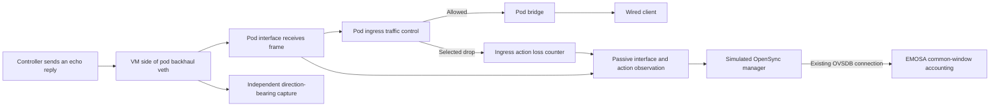

# Receive accounting and a common backhaul interval

The adapter now reads the selected transmit and receive accounting stages over
one bounded interval. This extends the [egress source](egress-accounting-source.md)
using the same passive collector and OVSDB publication; no new pod connection or
schema column is needed.

The result is **common-window interface accounting**, not complete native link
metrics. Per-neighbor attribution, all relevant loss paths, media and capacity/
availability qualification still precede the complete publisher. Physical pods
remain unchanged.

## Receiving a frame is different from delivering it to a client



In the selected kernel's ordinary veth path, receive packet/byte statistics
include the peer's successful transmit statistics. An ingress action runs later
in the receiving network stack. The controlled experiment confirms the
distinction: **17 echo replies arrive at the pod interface and are dropped by
the ingress action; none reaches the wired client**. The action counts all 17,
while ordinary `rx_errors` and `rx_dropped` do not increase for those drops.

The receive packet delta is therefore an interface-arrival count. Do not
subtract the ingress drops and rename the remainder `packetsReceived`, or call
the arrival count successful client delivery. Those are different observation
points. Unrelated ARP frames also count at the interface; a capture filtered to
only the selected ping cannot reconcile the whole interface's counters.

IEEE 1905.1-2013 §6.4.11–12, Tables 6-18 and 6-20, require packet/error fields to
describe the same measurement period. §11.1 binds reports to the interface pair
and neighbor. The amendment's unavailable PHY/RSSI values do not supply missing
packet counts, capacity or availability. This source provides a measurement
prerequisite, with that larger qualification boundary kept explicit.

## What the common source checks

`BackhaulAccountingSource` consumes the existing raw observation, whose historical
file/key names still say `egress`. That collector already reads both directions
of `stats64` and both ingress/egress filters. The new source shares the existing
identity, generation, freshness, replay and counter-lifetime checks.

Both directions use the same two counter dumps. Each dump has start/end bounds
and must finish within 250 ms; the source expires after two seconds. An interval
must not cross an observer/configuration/connection lifetime, counter decrease,
overlapping read or two-second gap. A fresh baseline is required after any such
boundary. Individual kernel dumps are not claimed to be atomic snapshots.

| Output | Selected meaning |
| --- | --- |
| `tx_packets`, `tx_bytes` | Observed veth transmit deltas |
| `rx_packets`, `rx_bytes` | Observed veth interface-arrival deltas |
| `tx_driver_drops`, `rx_interface_drops` | Separate raw interface drop deltas |
| `tx_action_drops`, `rx_action_drops` | Separate selected egress/ingress action deltas |
| `transmit_losses`, `receive_losses` | Direction-specific sum of the interface and disjoint selected action deltas |

The parser admits the owned noqueue veth path with no observed XDP attachment,
optionally the exact software-only, deterministic, unshared ICMP drop action in
each direction. It rejects wrong flow direction, shared action identities,
unrecognized filters/schedulers, inconsistent counters and unexpected veth
error values. Parent qdisc drop counts are retained but never added again.
The older egress-only source retains its previous contract and replay output.

The measured loss case covers TC ingress/egress actions. It does not qualify
every possible stack/driver failure, peer-side XDP/GRO, additional BPF/TCX hooks,
other schedulers or arbitrary changes by another privileged writer. Those
require additional observation and qualification before expanding this owned
profile. `measurement_source_qualified` and complete `rx_loss_qualified` remain
false; their scope is larger than the successfully tested selected action path.

## Why the independent capture uses Linux SLL2

The first two attempts used a direction selector on a normal Ethernet capture.
They recorded fewer file packets than tcpdump's filter total, despite zero
reported kernel drops. These attempts fail the existing completeness gate and
are preserved; the checker was not relaxed.

The successful command captures **both directions** on Linux's `any` interface,
with an `ifindex` filter restricting it to the actual VM peer of the pod's
backhaul. Linux SLL2 records carry interface index, hardware type and packet type.
An outgoing frame on that VM peer is incoming at the pod; the other admitted
packet types travel in the opposite direction. The independent parser validates
those fields and rejects unsupported media and VLAN protocols.

For the selected plain Ethernet path, SLL2 replaces the 14-byte Ethernet header
with a 20-byte capture header. The audit accounts for that six-byte difference
when comparing interface byte counters. This is capture-format conversion,
not Ethernet payload stripping or a guessed network overhead.

The successful capture has 107 complete records with matching capture/filter
totals and zero drops. Twelve common packet/byte intervals fit the fixed 1 ms
timing allowance; the measured wall/monotonic offset spread is 1,563 ns. The
source replay accounts for all 17 selected receive losses across 17 intervals.

## Reproduce the source review and selected loss case — HOST

The exact kernel source review uses the retained Ubuntu 6.8.0-139.139 archives,
reconstructs only selected veth/core/TC files and checks their digests. It changes
no running kernel. The first download needs about 239 MB; later runs reuse the
cache. Keep each source-review output under a new private directory.

```bash
python3 scripts/review-backhaul-kernel.py .lab/backhaul-source-learning-01
uv run pytest -q tests/test_receive_accounting.py tests/test_egress_accounting.py
```

Start from the established **idle** owned VM, following the
[loss-probe prerequisites](backhaul-counter-accounting.md). The probe takes the
existing ownership locks, verifies that it may install its rule, and restores
the previous traffic-control state. Only the owned simulator is supported.

```bash
lxc file push deploy/radio-manager/backhaul-loss.py \
  deploy/radio-manager/egress-observer.py emosa-lab/opt/emosa-radio-manager/
lxc exec emosa-lab -- python3 /opt/emosa-radio-manager/backhaul-loss.py \
  receive-learning-01 --direction ingress --observe-egress
mkdir -m 700 .lab/receive-learning-review
lxc file pull --recursive \
  emosa-lab/opt/emosa-radio-manager/counter-probes/receive-learning-01/ \
  .lab/receive-learning-review/
uv run python scripts/replay-egress-accounting.py --bidirectional \
  .lab/receive-learning-review/receive-learning-01 \
  > .lab/receive-learning-review/receive-learning-01/backhaul-projection.json
python3 scripts/check-receive-accounting.py \
  .lab/receive-learning-review/receive-learning-01
```

`--observe-egress` is the retained collector option name; its raw input contains
both directions. `--bidirectional` chooses the production common-window source
for replay. The replay is not a native-session claim. Inspect the result,
collector health and restoration before running anything else in the VM.

## Verify the live handoff and recovery — HOST

Use the staging and prerequisites in [sustained operation](sustained-operation.md).
Stage the complete updated `src/emosa`, the radio manager/node and both passive
observer helpers together. The existing native harness now records
`backhaul_accounting` in its session and forwarding samples.

```bash
lxc exec emosa-lab -- env PYTHONPATH=/opt/emosa-radio-manager/source \
  EMOSA_OVS_BIN=/opt/emosa-radio-manager/ovsdb \
  /opt/emosa/.venv/bin/python /opt/emosa-baseline/native-onboarding.py \
  --build /opt/emosa-baseline/candidate-onboarding-01 --label receive-native-learning \
  --active-seconds 210 --recovery-checks --observe-station-removal \
  --telemetry-gap-check --neighbor-gap-check
python3 scripts/collect-native-review.py receive-native-learning .lab/receive-native-learning
python3 scripts/check-receive-accounting.py --native .lab/receive-native-learning
python3 scripts/check-native-recovery.py .lab/receive-native-learning --minimum-seconds 210
```

This experiment uses normal client traffic. The independent audit follows raw
collector data through the live manager/OVSDB path and recomputes the adapter's
common intervals across both faults. It also reconciles the separate raw
forwarding intervals with backhaul capture. The short run supplies regression
evidence; complete metrics, AP/STA reporting, final-session statistics and the
integrated 15-minute acceptance run remain required.

See the [retained evidence and failures](../evidence/receive-accounting/README.md).
Primary implementation references are the
[Ubuntu kernel source package](https://archive.ubuntu.com/ubuntu/pool/main/l/linux/)
and [Linux interface-statistics documentation](https://www.kernel.org/doc/html/v6.8/networking/statistics.html).
The source review complements the IEEE requirements; it does not replace them.
