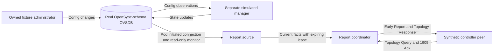

# Keep controller reports current: the read-only coordinator

This exercise connects the [report builders](reports.md) to a real disposable
OpenSync-schema database. A running coordinator answers Topology Queries and
tracks Early AP Capability Report acknowledgments and retries. It is the next
step from isolated encoders toward a controller-facing adapter.

**This is a restricted read-only component experiment.** Its peer is a synthetic
controller exerciser. The regular `emosa serve` application still has its wire
operation gate closed; no configuration switch promotes this exercise into a
qualified EasyMesh agent. Native controller discovery/inventory, full AP
Capability/profile admission and WSC-to-operation integration remain pending.

## 1. Understand the parts and their authority



The administrator and manager belong to the test fixture. Their writes simulate
outside changes and device application. The coordinator has no Config-write
operation and no operation-engine callback. Its OVSDB session refuses modifying
transactions and monitors only selected noncredential columns.

A **source** publishes one complete snapshot, identified by database connection
generation and revision. A **coordinator** uses that snapshot to build and send
reports for one explicit controller/pod binding. An **acknowledgment** confirms a
matching report's receipt at the protocol level. It does not confirm controller
inventory, acceptance of a whole profile, a WSC configuration or working Wi-Fi.

The database is real, but its radio capability declarations, virtual adjacency
and bridge mapping are explicit fixture inputs. Radio/VIF identity, operational
SSID, band/channel, role/security consistency and client absence are checked
against observed database rows. A simulation schema does not qualify a physical
pod. The fixture rejects clients because their required association age is not
available in the pinned table.

## 2. Run the database exercise on HOST

Start in the development or learning checkout after the normal installation and
[OVSDB build](../guides/team-manual.md#5-build-and-exercise-the-real-ovsdb-simulator).
No root, LXD or radio is needed for this first run. Choose a new output directory.

```bash
uv run python -m emosa.simulation.coordinator --output .lab/coordinator-demo-01
uv run emosa-lab wire-inspect --capture .lab/coordinator-demo-01/messages.pcap
uv run pytest tests/test_report_coordinator.py -q
uv run pytest tests/test_report_coordinator_ovsdb.py -q
```

The first command starts its own database, connects that database to a local
read-only listener, and starts a separate simulated manager. It constructs full
Ethernet messages and delivers them in memory. `socket_io: false` refers to the
Ethernet side; the OVSDB JSON-RPC connection is a real Unix-socket connection.
The final test command also starts disposable real databases.

Read the eight stages in `result.json`:

| Stage | What the exercise does | What to explain |
| --- | --- | --- |
| `lost_ack` | Drops the first receipt, retries the Early Report with a new MID and acknowledges the retry | A retry is another transmission, not a new pod operation |
| `initial_state` | Queries current topology and decodes the initial observed SSID | The wire response came from the source's current database facts |
| `config_only_keeps_observed_ssid` | Changes Config through the fixture administrator, leaves State unchanged, and queries again | Desired configuration cannot be reported as operational state |
| `independent_manager_state_change` | Asks the separate manager to publish State, then queries | The subsequent response now contains the newly observed SSID |
| `unknown_client_age_withdraws_report` | Adds an associated client without a qualified age source | Missing mandatory facts prevent the response; zero age is not invented |
| `complete_inventory_restored` | Removes that fixture client and observes a complete inventory again | A fresh source can resume reporting without replaying stale data |
| `database_disconnect_withdraws_report` | Stops the owned database and sends another Query | The coordinator sends no cached response from the disconnected pod |
| `database_reconnect_fresh_inventory` | Restarts the owned database and waits for a new connection generation | Reporting resumes only from a fresh complete observation |

Successful output has `adapter_config_writes: 0` and
`fixture_admin_and_manager_writes: true`. Those fields distinguish the reporting
component from the administrator that drives the demonstration. No Wi-Fi client
is connected and no radio behavior is established. PCAP timestamps are synthetic.

**Checkpoint:** identify the two different writers, explain why the Config-only
stage still reports the old SSID, and locate the stages that deliberately receive
no Topology Response.

## 3. Repeat over actual Ethernet sockets in the VM

Use the [isolated endpoint runbook](../../deploy/wire/README.md) and its
`--coordinator` mode. Unlike the earlier `--reports` exercise, this mode runs the
real database source and the coordinator loop. It still creates only owned
private namespaces and a veth pair; no external bridge or physical pod is used.

The synthetic peer sends Queries with MIDs **600, 601, 602 and 603**. The first
three receive matching Responses. The final Query is sent after database
disconnection and receives no report. The peer drops the first Early Report Ack;
the coordinator sends MIDs **1** and **2**, and the peer acknowledges **2**.

Keep `left.json`, `right.json`, both receive-byte PCAPs, driver output and worker
logs. Check that the driver removed its namespaces. Two executed runs are in the
[coordinator evidence collection](../evidence/coordinator/README.md).

Readiness/fault marker files coordinate the **lab fixture**: they tell the peer
when the Config-only, State-updated and disconnected stages are ready. These
files are not EasyMesh messages or a substitute management protocol. The packet
capture contains only the selected standard Query, Response, Early Report and
Ack message types. An independent dissector checks the received fields:

```bash
python3 scripts/check-report-reference.py \
  --coordinator-directory doc/evidence/coordinator/run-01 \
  --coordinator-directory doc/evidence/coordinator/run-02
```

That command needs `tshark`. It checks both directions, retry/Ack MIDs, BSS
identity, old/old/new SSID ordering and the absence of a captured response to the
last Query. The peer observes at least 1.1 seconds after that Query, with the
coordinator still running, covering the entire one-second response window. The
worker's source-withdrawal event supplies the corresponding
internal reason. Neither observation is native controller acceptance.

## 4. Learn the lifetime and retry rules

The selected normative rules are:

- IEEE 1905.1-2013 §7.7 p.45 processes previously unseen unicast messages;
  §7.8 p.46 increments newly allocated MIDs modulo 65536.
- IEEE §8.2.2.2 p.48 requires a Topology Response within one second and with the
  Query's MID.
- EasyMesh 6.1 §15.1 p.104 uses a generic 1905 Ack for a unicast notification
  without an expected information response. The Ack echoes the notification MID.
  A retransmission can use a new MID.
- EasyMesh §17.1.32 pp.115–116 defines Ack contents; §17.2.36 Table 59 p.148
  defines Error Code `0xA3`. This restricted early-report receipt path rejects
  error TLVs and unprocessed security envelopes. Unrelated unknown TLVs are
  ignored under the base reception rules.

The following are **local component limits**, not extra normative timers:

| Limit | Meaning |
| --- | --- |
| One pending Early Report | A second request gets `BUSY` while awaiting Ack |
| Three transmissions, at least 250 ms apart | A lost receipt can trigger bounded retries with new MIDs |
| One-second Ack budget | The transaction expires even if the source lease is renewed |
| One-second fixture source lease, maximum two seconds in the generic source | Stopping source updates cannot keep old facts available indefinitely |
| Eight-query burst, refill four per second | Bound repeated query work without an unbounded queue |
| Five-second query-MID retention, maximum 128 entries | Duplicate queries are not processed again; a new-MID retry is evaluated anew |
| 64 recent diagnostic events | Keep bounded metadata, without raw WSC or credential values |

An Ack for any fully sent attempt in the still-live notification can complete
that notification. An unrelated, expired or already completed Ack cannot. A
partial/late send is never registered as an acknowledgment-eligible success.
The coordinator must be ticked during idle periods to expire contexts and retry.

The source token distinguishes process instance, immutable pod/peer/input
context, source epoch and database revision. Invalidation changes the epoch even
if the same database revision later reappears. Changed facts under an unchanged
revision are rejected. A different pod, binding or input digest requires a new
source context. Renewing an unchanged snapshot does not extend an already
prepared message's original lifetime.

This lease bounds the age of the database observation. It does not establish
when a physical radio was last measured. An actual-pod profile must qualify the
existing manager's State freshness and failure behavior; the independent client
remains necessary to prove application.

An adapter restart creates a new coordinator and source; it does not recover a
pending notification. The default initial MID is randomized and then sequential.
That is not cryptographic replay protection. MAC/MID correlation does not
establish controller authority; the supplied peer binding still needs a qualified
trusted link. Durable WSC/operation recovery is a separate unfinished boundary.

## 5. Know what is and is not running

[coordinator.py](../../src/emosa/wire/coordinator.py) is the reusable Python report
loop and source-publication component. It dispatches only Topology Query and
1905 Ack. WSC and AP Capability Query are visible unsupported inputs; they cannot
create operations. A lease-available status is not a profile qualification.

[report_source.py](../../src/emosa/simulation/report_source.py) is the **owned
simulation source**, not an actual-pod adapter profile. It starts its own database
and uses explicit fixture capability/adjacency declarations. Its projection
reuses the complete OpenSync radio/VIF graph checks, validates current role and
security representation, and refuses unknown client age. It exposes no CLI for
supplying a physical endpoint or bypassing the application wire gate.

[coordinator_wire.py](../../src/emosa/simulation/coordinator_wire.py) runs that
component and a synthetic peer over actual AF_PACKET sockets in the dedicated
VM. It performs no discovery-profile admission and never starts M1 from an Ack.

Next, reconcile the selected native peer/profile and full AP Capability
requirements, connect discovery and report handling to the application lifecycle,
and retain the native controller's own inventory. Then implement durable
WSC-to-operation admission and reproduce the real-message-driven change through
OVSDB/hwsim with an independent wpa_supplicant client. The last substitution is
an unchanged, read-only-qualified physical pod. The acceptance path remains
**real EasyMesh messages → EMOSA → unchanged physical pod → independent behavior**.
