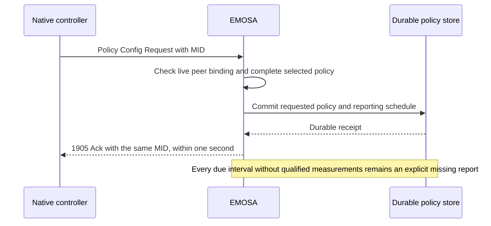

# Receive the controller's reporting policy without hiding missing reports

EMOSA now decodes and durably records the selected native controller's Multi-AP
Policy Config Request and sends its receipt Ack. **Live required metric reports are
still missing.** The [AP report builder](ap-metric-reports.md) now implements
selected message assembly and guarded periodic dispatch; its native measurement
source remains unqualified. Receiving a request, acknowledging receipt, applying a policy
and fulfilling its recurring reporting obligations are separate observations.

## What the controller asks for

The actual native request contains three policy TLVs:

| TLV | Observed request | What it requires next |
| --- | --- | --- |
| Metric Reporting Policy, `0x8A` | A 60-second interval, no threshold-triggered reports, all three STA inclusion bits enabled | Periodic AP/radio metrics plus the requested STA traffic, link and Wi-Fi 6 status information |
| Steering Policy, `0x89` | No disallowed-STA lists, agent-initiated steering disallowed | Preserve the controller's intent; this receipt component does not implement a steering actuator |
| QoS Management Policy, `0xDB` | Empty MSCS/SCS disallowed lists and the reserved field | Preserve the complete received policy; an empty list does not establish QoS feature support |

The simulator does not change that controller request to disable inconvenient
fields. In particular, the three STA inclusion bits remain enabled in the stored
policy and the independent evidence. Thresholds of zero disable those threshold
triggers; they do not disable the independently requested 60-second reports.

## Why send an Ack before metrics are available?

EasyMesh 6.1 §7.3 requires a 1905 Ack within one second of the Policy Config
Request. §15.1 binds it to the received message identifier, or **MID**. The Ack
provides transport-level receipt confirmation; it carries no blanket indication
that every requested operation or report has succeeded.

Earlier lab runs left this message unanswered along with the missing reports.
This implementation closes the receipt/Ack part. It does not close §10.2.1's
reporting requirements. EMOSA's status explicitly keeps
`policy_application_proven` and `required_reporting_proven` false. Full sustained
acceptance cannot pass merely because `unanswered_controller_requests["0x8003"]`
becomes empty.

## Follow the implemented path



The native worker has a private `reporting-policy.sqlite` alongside its other
owned state. Each selected request is fully decoded before replacement. Omitted
policy TLVs preserve their previous values. Reserved bit fields are ignored on
reception while original bytes remain in the receipt. Unsupported companions or
malformed lists cause rejection, not partial replacement and a misleading Ack.
Those rejected requests remain procedure gaps; this is not all-policy support.

Only the bound controller and current source context can use this path. A
database error, stale source or expired one-second deadline prevents the Ack.
The store can contain a receipt whose Ack failed to transmit; the independent
wire capture is needed to prove delivery. Identical repeated requests can be
acknowledged again. Conflicting reuse of a recent MID is rejected, and the bounded
recent-request cache expires entries after five seconds.

## Recovery must not keep postponing a report

A common timer bug is to restart the interval whenever the controller repeats
the same policy. Reconnecting just before each deadline could then prevent all
reports indefinitely. EMOSA persists the next deadline and the number of due
intervals that have no report. Receiving the same effective metrics policy with
a new MID preserves the deadline. A changed interval updates it; an interval of
zero disables the periodic schedule while preserving the remaining policy.

Pod reconnect and adapter process restart preserve the schedule. Monotonic times
remain meaningful across process restarts on the same OS boot. An actual OS boot
change is detected using its boot identity: intent survives, the schedule is
explicitly rebased, and `schedule_rebases` increases. The lab checks process
restart, not an actual VM reboot. Rebase behavior has a component test.

If the source disappears, the old coordinator stops active work. On recovery,
elapsed due periods are recorded without generating a burst of made-up reports.
`periods_due_without_report` is evidence of missing work, not a successful report
counter. RCPI/utilization threshold reporting and general QoS/steering actuation
remain unimplemented. Selected metric assembly and periodic dispatch
are now implemented in the [AP report guide](ap-metric-reports.md). The dispatcher
reserves each due period durably before sending, attempts one current report,
and keeps unavailable or crash-uncertain outcomes explicit. A successful send
still requires independent controller receipt evidence.

## Learn from retained evidence — HOST

Use the developer checkout, Python and tshark. This read-only exercise needs no
running VM:

```bash
python3 scripts/check-native-recovery.py \
  doc/evidence/reporting-policy/native-policy-receipt-01 --minimum-seconds 210
python3 scripts/check-native-policy.py \
  doc/evidence/reporting-policy/native-policy-receipt-01
uv run pytest tests/test_reporting_policy.py tests/test_native_onboarding.py
```

Read the [retained result](../evidence/reporting-policy/README.md) and
`native-session.json`. Find `reporting_policy.received_policy`, its interval,
inclusion flags, receipt count, `next_due` and `periods_due_without_report`.
Then locate each request and Ack in `ethernet.pcap`. The independent checker
compares the literal native request bytes with the saved policy and correlates
the same-MID Acks within one second. It separately checks that the schedule
origin survives both management faults and that missing reports remain explicit.

The general recovery check also verifies fresh authenticated onboarding,
independent client traffic, channel exchanges and one total Config write. Neither
checker calls the adapter implementation. A receipt pass must not be presented
as a metrics-report pass.

## Reproduce with the real controller and simulated pod

First complete the dependencies and staging in the
[sustained-operation guide](sustained-operation.md). From HOST, use a new label:

```bash
lxc exec emosa-lab -- env \
  PYTHONPATH=/opt/emosa-radio-manager/source \
  EMOSA_OVS_BIN=/opt/emosa-radio-manager/ovsdb \
  /opt/emosa/.venv/bin/python /opt/emosa-baseline/native-onboarding.py \
  --build /opt/emosa-baseline/candidate-onboarding-01 \
  --label policy-learning-01 --active-seconds 210 --recovery-checks
python3 scripts/collect-native-review.py policy-learning-01 .lab/policy-learning-review
python3 scripts/check-native-recovery.py .lab/policy-learning-review --minimum-seconds 210
python3 scripts/check-native-policy.py .lab/policy-learning-review
```

The 210-second active phase permits at least three 60-second reporting deadlines
and both recovery faults. It is a focused development run, not the full
15-minute acceptance run. The collector retains sanitized session/receipt
evidence, not the SQLite databases or private operation journal.

## Normative scope and next work

The selected rules come from the obtained EasyMesh 6.1 specification:

| Reference | Rule used |
| --- | --- |
| §7.3, printed p.71 | Policy request and one-second Ack obligation |
| §10.2.1, pp.82–84 | Periodic/threshold reports and STA inclusion obligations |
| §15.1, p.104 | Receipt reliability and same-MID Ack |
| §17.1.8, p.112; §17.1.32, pp.115–116 | Policy/Ack message composition |
| §17.2.11/Table 34, pp.131–132 | Steering lists and radio policy fields |
| §17.2.12/Table 35, pp.132–133 | Interval, thresholds and inclusion flags |
| §17.2.92/Table 115, pp.181–182 | MSCS/SCS policy lists and reserved bytes |

Next connect qualified AP airtime/ESP, radio and STA measurements to the
implemented report construction and scheduling. The [counter accounting findings](station-counter-accounting.md)
already rule out simple raw-counter passthrough. The selected AP Extended, Radio and requested STA companion composition is
recorded in the AP guide and protocol matrix. Their actual field conversions
still need qualification; historical Profile-1 TLV lists cannot replace the
selected EasyMesh 6.1 composition rules. Neighbor link metrics and final-session reporting remain separate
requirements. Only then repeat the full 15-minute acceptance with independent
capture and controller observations.
