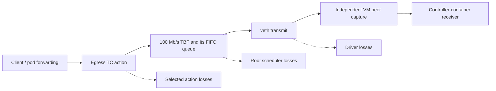

# Combine service measurements with actual packet loss

Start with [virtual-link calibration](virtual-link-capacity.md). That exercise
measures service work but its single-socket sender does not overflow the queue.
This exercise checks what happens when packets really are discarded, and brings
both directions, loss components and service work into one bounded observation.
See the [retained evidence](../evidence/shaped-backhaul/README.md).

## Follow a packet through the loss points



A packet dropped by the selected egress action never reaches the scheduler. A
packet dropped from the scheduler never reaches the veth transmit function.
These are separate stages, so their observed losses can be added for this
bounded path. The root TBF already includes its child FIFO's drops; adding both
parent and child would count the same packet twice. Token waits (`overlimits`)
mean delayed service, not discarded packets.

In the opposite direction, veth receive counters observe arrival before the
selected ingress action can discard the packet. Receive packet counts therefore
do not establish successful delivery to the client. Keep arrivals and receive
losses separate when reading a report.

The pinned Ubuntu kernel source explains these boundaries: `tbf_enqueue()` in
`net/sched/sch_tbf.c` increments the root drop statistic when its child rejects a
packet; `__dev_queue_xmit()` in `net/core/dev.c` returns from the queued path
without adding that loss to veth's driver drop count. See the existing
[scheduler source provenance](../evidence/virtual-capacity/source-provenance.json)
and [veth/TC source provenance](../evidence/receive-accounting/source-provenance.json).
This is a reviewed software path, not a general formula for arbitrary firmware.

## Read the combined observation

`ShapedBackhaulSource` in `lab/src/emosa_lab/simulation/shaped_backhaul.py` consumes the
same passive observations carried through OpenSync-schema OVSDB. It publishes
the diagnostic `shaped_backhaul` status in the native session and forwarding
log. It does not add a database table or a new physical-pod requirement.

Each valid interval contains 12 counter deltas: transmit and receive packets,
bytes, interface drops and selected action drops, plus scheduler service bytes,
service packets, queue drops and token waits. Its derived totals are:

```text
transmit_losses = tx_driver_drops + tx_action_drops + queue_drops
receive_losses  = rx_interface_drops + rx_action_drops
```

The source requires the exact observed 100 Mb/s TBF/framing configuration and
admits only the selected, unshared TC drop rules. Extra child queues, root
filters, shared action paths, changed media/MTU or unsupported configuration
withdraw the observation. A connection, process, collector or configuration
change needs a fresh counter baseline. No interval crosses those boundaries.
This retains the [service estimate's](virtual-link-capacity.md#understand-an-estimate)
framing, rate and read-time rules.

The source still says `measurement_source_qualified: false`. The tests establish
selected whole-interface arithmetic. Complete neighbor attribution, media and
normative availability semantics must be established before these values can
fill a native IEEE 1905 reply.

## Replay the results without a lab

Run on HOST from the checkout with `uv sync --frozen` already completed:

```bash
uv run python scripts/replay-egress-accounting.py --shaped-backhaul \
  doc/evidence/shaped-backhaul/shaped-queue-02 > /tmp/emosa-shaped-replay.json
cmp /tmp/emosa-shaped-replay.json \
  doc/evidence/shaped-backhaul/shaped-queue-02/shaped-projection.json
python3 scripts/check-shaped-backhaul.py doc/evidence/shaped-backhaul/shaped-queue-02
python3 scripts/check-shaped-backhaul.py doc/evidence/shaped-backhaul/shaped-ingress-01
python3 scripts/check-shaped-backhaul.py doc/evidence/shaped-backhaul/shaped-egress-02
python3 scripts/check-shaped-backhaul.py --native \
  doc/evidence/shaped-backhaul/native-shaped-01
python3 scripts/check-native-recovery.py \
  doc/evidence/shaped-backhaul/native-shaped-01 --minimum-seconds 210
```

The replay executes EMOSA's production source against retained observations.
The independent checker imports no EMOSA code: it recomputes raw counter
differences, packet sequences, delivered payloads and service work. For the
loss probes it also checks direction-bearing SLL2 captures; unrelated ARP stays
in the whole-interface counts. Captures must have matching file/captured/filter
totals and zero reported drops. Counter-read uncertainty uses the existing fixed
1 ms allowance; the checker does not widen that allowance when a test fails.

## Produce new loss evidence in the owned idle VM

Use the established [native lab](native-onboarding.md). These commands begin on
HOST; their `lxc exec` payloads run in VM `emosa-lab`. The helper verifies lab
ownership, takes the experiment locks and refuses pre-existing queue/filter
configuration. It restores the original queue afterward. Choose new labels.

1. Stage the current helpers:

   ```bash
   lxc file push deploy/radio-manager/virtual-link.py \
     deploy/radio-manager/link-traffic.py deploy/radio-manager/calibrate-link.py \
     deploy/radio-manager/backhaul-loss.py deploy/radio-manager/egress-observer.py \
     emosa-lab/opt/emosa-radio-manager/
   ```

2. Run the queue-loss probe:

   ```bash
   lxc exec emosa-lab -- python3 /opt/emosa-radio-manager/calibrate-link.py \
     queue-learning-01 --queue-loss
   ```

   The three four-second workloads still target 50, 160 and 5 Mb/s. Eight UDP
   sockets offer enough traffic to overflow the existing 512 KiB queue. One
   socket can block on its send buffer while its packets remain queued, so a
   requested rate above the shaper rate does not guarantee overflow. The helper
   records actual socket buffers and sent counts; it changes no kernel sysctl.
   Expect loss in the saturated phase and a drained queue before each phase
   ends. The precise drop count can vary between runs.

3. Separately exercise incoming and outgoing action losses:

   ```bash
   lxc exec emosa-lab -- python3 /opt/emosa-radio-manager/backhaul-loss.py \
     ingress-learning-01 --direction ingress --observe-egress --virtual-link
   lxc exec emosa-lab -- python3 /opt/emosa-radio-manager/backhaul-loss.py \
     egress-learning-01 --direction egress --observe-egress --virtual-link
   ```

   Each run sends 17 pings before, during and after the selected drop rule.
   The loss phase should fail all 17 pings; the surrounding phases should pass.
   Incoming loss removes replies after interface arrival. Outgoing loss removes
   requests before the scheduler. These are separate experiments, not both
   faults applied to the same packets.

4. Copy and audit each run. Queue results live in `link-calibration`; action
   results live in `counter-probes`. For example:

   ```bash
   mkdir -p .lab/queue-learning-review
   lxc file pull -r \
     emosa-lab/opt/emosa-radio-manager/link-calibration/queue-learning-01 \
     .lab/queue-learning-review/
   uv run python scripts/replay-egress-accounting.py --shaped-backhaul \
     .lab/queue-learning-review/queue-learning-01 \
     > .lab/queue-learning-review/queue-learning-01/shaped-projection.json
   python3 scripts/check-shaped-backhaul.py .lab/queue-learning-review/queue-learning-01
   ```

   Inspect `cleanup_errors` and `traffic_control_restored` before the next
   experiment. Preserve failed attempts. The independent checker rejects a
   queue test that did not actually exercise loss, even if every packet arrived.

5. Stage current adapter source and reproduce the native `--virtual-link` run
   using [the service guide](virtual-link-capacity.md#run-a-new-calibration-in-the-idle-owned-lab).
   The same run now records `shaped_backhaul` through the real OVSDB path. Use
   `check-shaped-backhaul.py --native` on its collected review directory, then
   `check-native-recovery.py --minimum-seconds 210`. Inspect both connection
   loss and actual SIGKILL recovery. A telemetry pause preserves this independent
   source; losing the pod connection revokes it.

## Next acceptance boundary

These checks combine selected losses with service work. They do not identify
every frame as belonging to a particular neighbor. The existing VM backhaul
also receives the adapter's own multicast traffic through its separate control
port. A complete per-neighbor publisher must resolve that attribution and the
selected media/availability contract, then verify actual controller values.
AP/STA metrics, final-session reporting and native shutdown behavior remain
separate work. Repeat the full 15-minute integrated acceptance only when those
required procedures are ready. No physical pod is modified or qualified here.
