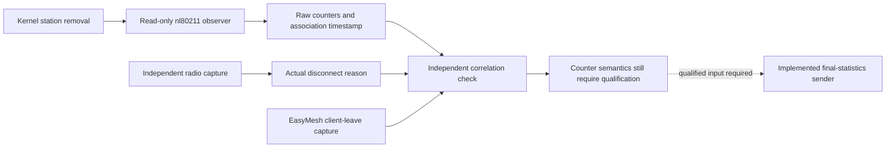

# Observe a station's removal before mapping its final counters

**Status: acquisition and independent event correlation verified in the owned
hwsim lab; EasyMesh counter mapping remains unqualified.** This experiment adds
a read-only kernel observer to the native controller run. It closes the question
of whether the simulator can obtain statistics at station removal, rather than
reusing the last periodic poll. It does not yet publish a final-statistics CMDU.

## What this step contributes

A station can transmit after the manager's last poll. Looking up the station
after hostapd removes it can instead return no data. Linux provides another
observation point: mac80211 gathers station information during removal and
cfg80211 emits an `NL80211_CMD_DEL_STATION` multicast notification. The observer
subscribes before the clients start and retains the fields actually present.



The retained 158.51-second run observes seven new station lifetimes and six
removals. Every removal has a distinct kernel association timestamp, explicit
byte/packet/error/retry fields, a matching captured client deauthentication with
reason 3, and a matching controller-facing leave notification. Kernel event
delivery follows the radio frame by 17.2–23.3 ms. No netlink loss or truncation
was reported. These bounds describe this run, not a general delivery guarantee.
See the [retained evidence](../evidence/station-removal/README.md).

## Why these are not yet EasyMesh counters

**Final timing and counter meaning are separate requirements.** Obtaining a
kernel record at removal does not establish that every field has the meaning
required by EasyMesh 6.1 Table 58 and its Wi-Fi Data Elements reference.

| Observation | What it establishes | Remaining mapping work |
| --- | --- | --- |
| `RX_BYTES64` / `TX_BYTES64` | Present 64-bit kernel counters at removal | Establish which headers and attempted/failed transmissions the byte counts include |
| `RX_PACKETS` / `TX_PACKETS` | Present kernel packet counts | Linux transmit bookkeeping increments before success is known; distinguish management/data packets and successful delivery |
| `TX_FAILED` | Explicit kernel failure-status counter, including observed zero | Establish coverage of failed, filtered, queued and discarded packets relative to EasyMesh |
| `RX_DROP_MISC` | Explicit miscellaneous receive-drop counter | Do not rename all drops as received-in-error packets without qualifying the causes |
| `TX_RETRIES` | Explicit accumulated kernel retry count | Establish the relation to packets sent with the retry flag; attempts and distinct packets are different quantities |
| `ASSOC_AT_BOOTTIME` | Distinct association timestamp for each observed lifetime | Bind a production source to its clock, restart epoch and association identity |
| Reason attribute absent | The removal event does not supply an 802.11 reason | The independent radio capture proves actual reasons in this experiment; an online publisher still needs a qualified reason join |

The collector retains raw nested station information, including per-TID fields,
for further review. It does not collapse missing attributes into zero, subtract
unqualified counters, or pass the records to `report_final_session()`.
`final_counter_source_qualified` remains false.

The pending **Wi-Fi Data Elements 3.0 package, including
TR-181-2-17_DEr3.xlsx**, is already in the
[single acquisition checklist](specification-acquisition.md). Its station-counter
definitions are relevant here as well as its collection-interval definition.
An open-source implementation is a cross-check, not a substitute for that input.

## Run it step by step

1. Complete the [native sustained-operation setup](sustained-operation.md). Use
   the existing owned `emosa-lab` VM, patched controller candidate, simulated
   pod, private broker and independent wired/Wi-Fi clients. The physical pod is
   outside this experiment. Verify the lab is idle before starting a new run.
2. On **HOST**, stage the two updated helpers from this checkout:

   ```bash
   lxc file push deploy/radio-manager/station-events.py emosa-lab/opt/emosa-radio-manager/
   lxc file push deploy/peer-baseline/native-onboarding.py emosa-lab/opt/emosa-baseline/
   ```

   The runner copies the observer into the owned AP container. Its guard checks
   the container identity, hwsim driver, isolated interfaces and pinned hostapd
   binaries. It does not configure the radio. Its only netlink request discovers
   the family/group identifiers; it then subscribes to notifications.
3. In the **VM root shell**, choose an unused run label:

   ```bash
   PYTHONPATH=/opt/emosa-radio-manager/source \
   EMOSA_OVS_BIN=/opt/emosa-radio-manager/ovsdb \
   /opt/emosa/.venv/bin/python /opt/emosa-baseline/native-onboarding.py \
     --build /opt/emosa-baseline/candidate-onboarding-01 \
     --label station-observation-02 --active-seconds 150 \
     --recovery-checks --observe-station-removal
   ```

   The flag enables observation; it does not enable final-statistics reporting.
   Wait for the command to finish and restore the controller. The observer is
   stopped and collected by cleanup. A failed/truncated/lost event stream remains
   a failure; a new run must use a new label. Source hashes and kernel identity
   are recorded with the result.
4. Back on **HOST**, collect a new private review directory and run both checks:

   ```bash
   python3 scripts/collect-native-review.py station-observation-02 .lab/station-review-02
   python3 scripts/check-native-recovery.py .lab/station-review-02 --minimum-seconds 150
   python3 scripts/check-station-removal.py .lab/station-review-02
   ```

   The first checker establishes onboarding, traffic and both recoveries. The
   second independently decodes the raw kernel integers and joins each removal
   to the captured radio reason and EasyMesh leave. Neither imports the observer
   or the adapter. Three or more correlated removals are required; partial event
   collection cannot pass as a complete observation experiment.
5. Read `station-events.jsonl`. Find `ready`, successive `new_station` and
   `del_station` entries, and `finished`. Compare `observed_fields` with the
   original `raw_station_info`. Look for absent reason information and explicit
   zero values. Explain why they are different. Review the seven semantic mapping
   questions above before enabling any conversion to EasyMesh counters.

The observer bounds the receive buffer, station inventory and event count. It
rejects malformed/duplicate attributes, non-kernel delivery, datagram truncation
and reported netlink overruns. Multicast can still lose events without a complete
end-to-end acknowledgment protocol; the packet correlation is therefore part of
this experiment's evidence, not an optional visual inspection.

## Source review and next implementation

The Linux v6.8 primary sources identify the relevant behavior:

- [`sta_info.c`](https://github.com/torvalds/linux/blob/v6.8/net/mac80211/sta_info.c#L1468-L1474): removal-time information and `sta_set_sinfo()` field population.
- [`nl80211.c`](https://github.com/torvalds/linux/blob/v6.8/net/wireless/nl80211.c#L18761-L18789): station-removal multicast emission, including the empty-information fallback.
- [`tx.c`](https://github.com/torvalds/linux/blob/v6.8/net/mac80211/tx.c#L1025-L1039) and [`status.c`](https://github.com/torvalds/linux/blob/v6.8/net/mac80211/status.c#L1151-L1163): transmit bookkeeping and subsequent status/retry accounting.

The executed kernel is Ubuntu `6.8.0-139-generic`; the upstream review locates
candidate mechanisms and does not qualify every distribution change. Next audit
the exact runtime implementation and referenced counter definitions, use the
retained per-TID information where appropriate, and exercise failed/retried/queued
traffic before selecting conversions. Join a qualified online reason source to
the same association, then connect the complete record to the implemented sender
and require live controller acknowledgments in full sustained acceptance.
AP/STA policy metrics and IEEE 1905 neighbor measurements remain separate work.
