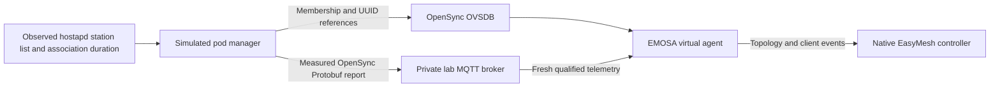

# Sustained operation after native onboarding

**Status: implementation and pilot validation in progress.** The retained bounded
onboarding result does not establish that EMOSA can maintain a virtual agent while
clients use its represented OpenSync pod. This work keeps the packet worker alive
through client activity and records the controller's subsequent requests.

## What must be demonstrated

The first sustained acceptance run is a 15-minute owned-lab experiment with the
same native controller candidate, real Ethernet messages, pod-initiated OVSDB,
separate simulated pod manager, hwsim AP and independent client containers.
Duration alone is insufficient. The evidence must establish all of the following:

1. Initial native discovery and authenticated provisioning still pass the
   [onboarding checks](native-onboarding.md). The adapter remains active during
   client traffic; a stopped worker cannot satisfy this experiment.
2. Repeated client joins and leaves produce observed membership, appropriate
   notifications and corresponding native controller inventory. Unknown or stale
   observations cannot masquerade as an empty inventory.
3. Recurring controller procedures receive the implemented specification-defined
   response or an explicit supported error outcome. Record policy, channel,
   capability and metrics requests. Unanswered mandatory requests remain gaps.
4. Independent Wi-Fi and wired probes establish usable traffic throughout each
   connected phase. Retain packet capture and timing around intentional outages.
5. Pod connection interruption and adapter restart recover under a fresh bound
   protocol context, without duplicate configuration effects or invented success.
   Record outage duration and any manual intervention.
6. Process samples show bounded memory, file descriptors and pending work. Retain
   exact source, native executable and runtime provenance, failures, cleanup and
   restoration of the original controller candidate inputs.

No current pilot is a substitute for this complete acceptance run. Final client
disassociation statistics, reporting policy, channel procedures and integrated
restart/reconnect recovery remain outstanding. Physical-pod acceptance remains
**real EasyMesh messages → EMOSA → unchanged physical OpenSync pod → independently
observed behavior**.

## Why client reporting needs two southbound inputs

The pinned OpenSync `Wifi_Associated_Clients` table and VIF references establish
client membership. They do not include the association duration required by
EasyMesh's Associated Clients TLV. The adapter must not guess duration from the
arrival time of an OVSDB update, especially after reconnect.



The simulation reads hostapd's control socket and checks the complete station
enumeration against AP status. It updates membership and VIF references in one
guarded OVSDB transaction, preserving UUIDs for unchanged clients. Client rows
are dynamic observations, not part of the stable configuration binding.

The separate telemetry message uses the exact upstream statistics schema from
OpenSync commit `78d8a7194d5e77635877cc456231e7be5cf03d68`. The lab binds a private
topic and `nodeID` to the sole radio/BSS. `ClientReport.timestamp_ms` identifies
the sample time and `Client.connect_offset_ms` carries hostapd's measured
association duration in milliseconds. EMOSA reports whole seconds, saturated at
65535 as specified. `duration_ms`, which can represent interval activity, is not
used as association age. This does not establish semantics for other publishers.

The receiver requires a complete, initialized Protobuf report, the bound pod and
radio, matching OVSDB membership and SSID, and a sample less than two seconds old.
It rejects retained, duplicate, late, out-of-order and future-dated samples.
Reconnect clears the sample but preserves the timestamp watermark. Missing
telemetry makes topology inventory unavailable; it does not fabricate zero age or
declare that all stations departed. The two-second limit assumes the owned VM's
shared clock. A physical deployment needs a qualified clock-error allowance.

The private broker uses a Unix socket within the owned run directory; no TCP
listener or host broker service is installed. This is a simulation transport
profile, not physical-pod authentication. A real pod must provide its existing
authorized MQTT publisher/topic, trust and report semantics under requirements
TEL-01–04. Installing this simulation publisher on a physical pod is not allowed.

## Wire behavior and remaining gaps

| Procedure | Reference | Current behavior |
| --- | --- | --- |
| Associated Clients | EasyMesh 6.1 §6.2, §17.2.5/Table 28 | Join complete OVSDB membership with measured telemetry age; refuse incomplete inventory |
| Client join/leave notification | §6.3, §17.1.5, §17.2.20/Table 43 | Send AL MAC and Client Association Event with observed STA/BSSID and join/leave bit; age updates alone are not joins |
| Client Capability Query | §9.2, §17.1.14–15, §17.2.18–19, §17.2.36 | Correlated failure report: reason 2 for an absent station, reason 3 for an associated station whose association frame is unavailable |
| Disassociation statistics | §6.3, §17.1.41 | Pending actual final session counters and reason; record `disassociation_statistics_unavailable`, never guessed values |
| Reporting policy and metrics | §7.3 and §10 | Pending measured field mappings and procedure implementation |
| Channel procedures | §8.1–2 | Pending preference, selection and measured operating-channel reporting |

## Establish and run the active pilot

Use the existing owned lab from [native onboarding](native-onboarding.md). Keep
the development checkout on HOST; execute the experiment inside VM `emosa-lab`.
Use a fresh label for every attempt. Preserve failed attempts.

1. On HOST, synchronize dependencies and stage the implementation:

   ```bash
   uv sync --locked
   tar -C src -cf - emosa | lxc exec emosa-lab -- tar -C /opt/emosa-radio-manager/source -xf -
   lxc file push deploy/radio-manager/node.py deploy/radio-manager/manager.py \
     emosa-lab/opt/emosa-radio-manager/
   lxc file push deploy/peer-baseline/native-onboarding.py emosa-lab/opt/emosa-baseline/
   ```

2. Install the pinned Python observation dependencies in the VM's EMOSA virtual
   environment using the locally installed `uv` executable:

   ```bash
   /opt/emosa-radio-manager/uv pip install --python /opt/emosa/.venv/bin/python \
     protobuf==6.33.5 paho-mqtt==2.1.0
   ```

   If this VM does not yet have that executable, copy the selected HOST `uv`
   binary into `/opt/emosa-radio-manager/uv` first, as in the earlier VM setup.

3. In the Ubuntu 24.04 VM, download and extract a private broker and its extra
   libraries. This does not install or start a system broker. Use the existing
   retained package directory on this lab; on a fresh reproduction:

   ```bash
   mkdir -p /opt/emosa-radio-manager/mqtt-inputs
   cd /opt/emosa-radio-manager/mqtt-inputs
   apt-get download mosquitto libmosquitto1 libcjson1 libdlt2 libwebsockets19t64 libwrap0
   for package in *.deb; do dpkg-deb -x "$package" stage; done
   ```

   The runner records binary and Debian-package hashes in `mqtt-provenance.json`.
   Reproduction of an exact run requires those retained versions; package indexes
   may change. The development lab's broker is Mosquitto 2.0.18.

4. From HOST, run the active pilot against the already staged native candidate:

   ```bash
   lxc exec emosa-lab -- env \
     PYTHONPATH=/opt/emosa-radio-manager/source \
     EMOSA_OVS_BIN=/opt/emosa-radio-manager/ovsdb \
     /opt/emosa/.venv/bin/python /opt/emosa-baseline/native-onboarding.py \
     --build /opt/emosa-baseline/candidate-onboarding-01 \
     --label native-active-learning-01 --active-seconds 90
   ```

   Replace the candidate path with your separately staged `--onboarding` build.
   Omitting `--active-seconds` reproduces the original bounded experiment.
   The pilot disconnects and reconnects the client about every 25 seconds,
   retaining a separate inventory and session snapshot after each deliberate
   four-second disconnection. Recovery of EMOSA and its pod connection remains
   separate work before the complete acceptance sequence.

5. Read `active-samples.json`, per-sample controller inventories, client probe
   files, `manager.jsonl`, `native-session.json`, `mqtt-provenance.json` and the
   Ethernet/radio captures under `/opt/emosa-radio-manager/runs/LABEL/`. Check
   worker PID, sample duration, report freshness and the STA's placement under
   the represented BSS. A MAC appearing anywhere in inventory is only a discovery
   aid, not independent proof of the correct association.

The runner leaves `sustained_operation_proven` false. Independent capture review
and the full acceptance criteria above must establish that result.

## Upstream references and reproducibility

The vendored `.proto` retains its upstream license. Its generated descriptor is
hashed before loading; regenerate it with `grpcio-tools==1.78.0`:

```bash
uv run --with grpcio-tools==1.78.0 python -m grpc_tools.protoc \
  -I src/emosa/telemetry/data \
  --descriptor_set_out=src/emosa/telemetry/data/opensync_stats.desc \
  src/emosa/telemetry/data/opensync_stats.proto
```

Source: [pinned OpenSync statistics schema](https://github.com/plume-design/opensync/blob/78d8a7194d5e77635877cc456231e7be5cf03d68/src/lib/protobuf/opensync_stats.proto).
Timestamp conversion is cross-checked against that revision's
`src/lib/datapipeline/src/dppline.c`; upstream code does not replace the EasyMesh
specification. Transport behavior follows the official
[Paho client documentation](https://eclipse.dev/paho/files/paho.mqtt.python/html/client.html)
and [Mosquitto listener documentation](https://mosquitto.org/man/mosquitto-conf-5.html).
