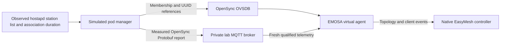

# Sustained operation after native onboarding

**Status: 15-minute operational recovery checks pass; complete sustained
acceptance remains pending.** The [retained 908-second run](../evidence/native-soak/README.md)
keeps the virtual agent active through client activity, channel exchanges,
pod-connection loss and an actual adapter process restart. It also records the
mandatory controller procedures that remain unanswered.

The later [901-second lifecycle run](native-lifecycle.md) adds all 15 measured
native neighbor replies, the same real recovery faults and normal native
controller/helper shutdown under an unchanged SIGTERM policy. The optional BPL
candidate fixes the selected Linux lifetime defect; original baseline files are
restored after the trial. Fifteen AP reporting periods remain explicitly
unfulfilled. This closes the candidate lifecycle gap, not complete reporting.

The [BBF metric review](bbf-data-elements.md) now supplies public definitions and
bounded representation conversions. It narrows the document-access gap without
qualifying live AP/STA measurements or completing the WFA DEr3 comparison.

For new OpenSync-container work, use the [acceptance levels](../project/integration-acceptance.md):
R is operational recovery; S adds complete required reporting and the reviewed
cold-start result. The [current status](../project/current-status.md) keeps older
runs and different native candidates separate. Existing evidence below is not
retroactively relabeled as an actual-OpenSync pass.

## What must be demonstrated

The first sustained acceptance run is a 15-minute owned-lab experiment with the
same native controller candidate, real Ethernet messages, pod-initiated OVSDB,
separate simulated pod manager, hwsim AP and independent client containers.
Duration alone is insufficient. The evidence must establish all of the following:

1. Initial native discovery and authenticated provisioning still pass the
   [onboarding checks](native-onboarding.md). The adapter remains active during
   client traffic; a stopped worker cannot satisfy this experiment.
2. Repeated client joins and leaves produce observed membership, appropriate
   notifications and corresponding native controller inventory. Unknown or stale
   observations cannot masquerade as an empty inventory.
3. Recurring controller procedures receive the implemented specification-defined
   response or an explicit supported error outcome. Record policy, channel,
   capability and metrics requests. Unanswered mandatory requests remain gaps.
4. Independent Wi-Fi and wired probes establish usable traffic throughout each
   connected phase. Retain packet capture and timing around intentional outages.
5. Pod connection interruption and adapter restart recover under a fresh bound
   protocol context, without duplicate configuration effects or invented success.
   Record outage duration and any manual intervention.
6. Process samples show bounded memory, file descriptors and pending work. Retain
   exact source, native executable and runtime provenance, failures, cleanup and
   restoration of the original controller candidate inputs.

The optional [medium-loss experiment](medium-loss-accounting.md) exercises
failure bookkeeping with an independent kernel/medium capture. It keeps retry
discrepancies and unqualified airtime explicit; it supplies no completed metrics
reporting or replacement sustained-acceptance result.

The [completion-flag trace](tx-status-accounting.md) now explains the kernel's
retry suppression in a separate loss experiment. That run also exposed an
unwanted onboarding restart during a telemetry gap. The
[freshness regression](telemetry-freshness.md) fixes and verifies this boundary:
stale telemetry withdraws dependent observations while current OVSDB authority
survives. A 213-second native run passes the explicit telemetry gap and both real
recovery faults with three operations and one total Config-write attempt.
This is regression evidence alongside the original 15-minute run; required
measurement/reporting work and integrated acceptance remain pending.

The [forwarding-observation step](forwarding-observations.md) adds the simulated
pod's actual bridge-port identities and raw interface intervals through OVSDB.
Its independent backhaul capture distinguishes client forwarding from the
adapter's control link. The [live binding](neighbor-discovery-binding.md) now ties
topology identities to actual pod-side discovery. The
[counter audit](backhaul-counter-accounting.md) reconciles packet/byte intervals
but demonstrates losses before veth accounting that ordinary interface error
counters miss. The [egress source](egress-accounting-source.md) now combines
selected action and driver losses without double counting, with observed
configuration epochs and live OVSDB recovery checks. The
[receive source](receive-counter-accounting.md) now adds selected ingress loss
and common transmit/receive read bounds. These inputs support the subsequent owned peer profile; they do not by
themselves qualify a complete native query.

The optional [virtual-link calibration](virtual-link-capacity.md) now tests a
declared 100 Mb/s software service with explicit Ethernet overhead and an
observed unused-service estimate. Its independent packet audit and native
OVSDB recovery regression are separate from complete per-neighbor publication.
The [combined source](shaped-backhaul-accounting.md) now checks selected action,
queue and driver loss components alongside service work through OVSDB recovery.
The optional [native peer publisher](native-peer-metrics.md) now adds observed
port isolation, disabled aggregation and the declared software media/service
contract. It answers native queries with independently checked values and
verifies their receipt in controller interface statistics. This qualifies only
that owned profile; it does not measure a physical PHY or change full acceptance
status.

No current pilot is a substitute for this complete acceptance run. Final client
disassociation statistics, reporting policy/metrics and complete integrated
acceptance remain outstanding. Policy receipt/Ack persists the controller's intent. The
[AP report builder and periodic dispatcher](ap-metric-reports.md) now assemble
the required companions from an explicit internal handoff and preserve deadlines
through recovery. Its native measurement source is still unqualified, so the lab
withholds AP reports and records the missing periods.
Selected channel procedures and the recovery
supervisor are implemented; their limits and reproduction steps follow below.
Physical-pod acceptance remains
**real EasyMesh messages → EMOSA → unchanged physical OpenSync pod → independently
observed behavior**.

## Why client reporting needs two southbound inputs

The pinned OpenSync `Wifi_Associated_Clients` table and VIF references establish
client membership. They do not include the association duration required by
EasyMesh's Associated Clients TLV. The adapter must not guess duration from the
arrival time of an OVSDB update, especially after reconnect.



The simulation reads hostapd's control socket and checks the complete station
enumeration against AP status. It updates membership and VIF references in one
guarded OVSDB transaction, preserving UUIDs for unchanged clients. Client rows
are dynamic observations, not part of the stable configuration binding.

The separate telemetry message uses the exact upstream statistics schema from
OpenSync commit `78d8a7194d5e77635877cc456231e7be5cf03d68`. The lab binds a private
topic and `nodeID` to the sole radio/BSS. `ClientReport.timestamp_ms` identifies
the sample time and `Client.connect_offset_ms` carries hostapd's measured
association duration in milliseconds. EMOSA reports whole seconds, saturated at
65535 as specified. `duration_ms`, which can represent interval activity, is not
used as association age. This does not establish semantics for other publishers.

The receiver requires a complete, initialized Protobuf report, the bound pod and
radio, matching OVSDB membership and SSID, and a sample less than two seconds old.
It rejects retained, duplicate, late, out-of-order and future-dated samples.
Reconnect clears the sample but preserves the timestamp watermark. Missing
telemetry makes topology inventory unavailable; it does not fabricate zero age or
declare that all stations departed. The two-second limit assumes the owned VM's
shared clock. A physical deployment needs a qualified clock-error allowance.

The private broker uses a Unix socket within the owned run directory; no TCP
listener or host broker service is installed. This is a simulation transport
profile, not physical-pod authentication. A real pod must provide its existing
authorized MQTT publisher/topic, trust and report semantics under requirements
TEL-01–04. Installing this simulation publisher on a physical pod is not allowed.

## Wire behavior and remaining gaps

| Procedure | Reference | Current behavior |
| --- | --- | --- |
| Associated Clients | EasyMesh 6.1 §6.2, §17.2.5/Table 28 | Join complete OVSDB membership with measured telemetry age; refuse incomplete inventory |
| Client join/leave notification | §6.3, §17.1.5, §17.2.20/Table 43 | Send AL MAC and Client Association Event with observed STA/BSSID and join/leave bit; age updates alone are not joins |
| Client Capability Query | §9.2, §17.1.14–15, §17.2.18–19, §17.2.36 | Correlated failure report: reason 2 for an absent station, reason 3 for an associated station whose association frame is unavailable |
| Disassociation statistics | §6.3, §17.1.41 | [Sender and guarded handoff implemented](final-session-statistics.md); [live reason/removal join](live-session-reasons.md) implemented; counter conversion and online delivery still unqualified, so native polling records the gap |
| Reporting policy and metrics | §7.3 and §10 | [Durable selected receipt/Ack](reporting-policy.md) and [AP report assembly/periodic dispatch](ap-metric-reports.md); measured field mappings and native AP delivery remain pending |
| Neighbor link metrics | IEEE 1905.1-2013 §6.3.5–6, §6.4.10–13, §11.1; amendment pp.10–12; EasyMesh §10.1 | [Query/response and guarded handoff implemented](neighbor-link-metrics.md); the optional [owned peer profile](native-peer-metrics.md) supplies measured native replies and controller receipt. The owned publisher also passes the 901-second recovery run; physical/multiple-peer qualification and complete reporting acceptance remain pending |
| Channel procedures | §8.1–2; §17.2.13–16/Tables 36, 38–40 | Sole advertised channel 6; durable preferences, acceptance of requests requiring no adjustment, measured operating power and correlated Ack/retry |

## Channel decisions in this bounded lab

The radio capability deliberately advertises class 81 with only channel 6
operable. This matches the sole-channel hwsim manager's actual contract. It is
not a claim that a real radio supports just one channel. A Channel Preference
Report can omit all preference TLVs: §8.1 assigns implicit preference 15 to the
advertised operable channels. The literal value 15 in a wire preference nibble
is reserved by Table 36; omission and a literal 15 have different meanings.
Non-DFS features omitted by this experiment follow the §18 feature conditions.

For a compatible Channel Selection Request, EMOSA validates every field,
persists the accepted preferences in its private `channel-policy.sqlite`, then
sends a correlated response within one second. If the radio already satisfies
the request, no Config write is necessary. An Operating Channel Report still
follows. Its signed power value comes from the independent manager's `iw dev
wlan0 info` observation, published through `Wifi_Radio_State.tx_power`; it is
never copied from the capability maximum or controller's requested limit.
The owned HT20 hwsim profile explicitly assumes zero antenna/cable gain. This
maps nominal reported power, and establishes no physical RF measurement.

An early request can arrive before the first fresh radio sample. The coordinator
retains at most four such requests under their original context and one-second
response deadlines. Duplicates cannot extend the wait. A current observation
allows validation and reply; expiration, disconnection or a changed context
withdraws the request without accepting configuration. The retained peer-metric
experiments include the startup race that required this behavior.

The report needs a fresh manager telemetry sample, the matching database
generation and the same measured operating parameters. Missing observations
withdraw report authority. Retries share a fixed one-second deadline, have new
message IDs and stop after three transmissions. A matching controller Ack ends
the pending report. The native channel pilot has exercised this exchange.

Requests that exclude the only operable channel, require lower transmit power,
refer to another radio or require unimplemented companions remain unsupported.
EMOSA does not acknowledge them as implemented or pretend to actuate the radio.
This restricted implementation therefore cannot satisfy arbitrary channel or
power policies. A physical profile requires actual supported actuation and its
independent observations. On virtual-agent reboot the stored preferences reset
explicitly, as §8.2 permits; a mere OVSDB reconnect retains the accepted policy.

## What the recovery checks prove

The recovery runner injects two faults, at roughly one-third and two-thirds of
the requested active duration:

1. It removes only the disposable pod's outgoing EMOSA OVSDB connection. The
   separate radio manager and AP continue running. EMOSA must close its previous
   protocol session, report that its source is unavailable and stop using that
   session's write authority. After four seconds without that authority, the
   runner restores the connection.
2. It kills the actual adapter worker with SIGKILL and starts a new process in
   the same owned packet namespace, retaining the private operation journal.
   The AP and native controller keep running. This is an adapter process fault,
   not a simulated exception or a physical pod reboot.

In each case the new live context must discover the controller again and send
a new Early Report and M1. An old M2 cannot authorize the recovered session.
The controller supplies a fresh authenticated M2, creating a new operation.
Because Config and independently observed State already match, that new
operation must complete as an observed no-op, with zero additional writes.
Expect **three operations but only one write attempt** after both faults.
The process-local `writes` field becomes zero after restart; use the durable
`journal_write_attempts` field and all operation receipts to assess the full run.

Bounded recovery history, source gating and retry backoff prevent a tight
reconnect loop. Unsupported/incompatible admission remains terminal. Recovery
does not make an unqualified endpoint usable or restore a saved WSC transcript.

The runner keeps timestamped continuous ICMP probes in both client containers,
in addition to the per-sample nonce/HTTP and route checks. Those probes must
continue through management faults. Intentional Wi-Fi client disconnections
are recorded separately in `client-outages.json`; they are expected traffic
outages, not adapter failures. `recovery-checks.json` records the actual PIDs,
fault times, before/after journals and fresh protocol receipts. The independent
checker also checks captured messages and native controller STA placement.
Every connected-phase sample must contain the STA under the represented BSS.
The initial operational checker limits sampled RSS spread to less than 32 MiB
and file descriptors to 32, across the two worker processes. It reports actual
ranges; a finite 15-minute result does not establish indefinite leak freedom or
production capacity. Recovery may take at most 60 seconds after management is
restored, and independent traffic must remain continuous during that recovery.

## Establish and run the active pilot

Use the existing owned lab from [native onboarding](native-onboarding.md). Keep
the development checkout on HOST; execute the experiment inside VM `emosa-lab`.
Use a fresh label for every attempt. Preserve failed attempts.

1. On HOST, synchronize dependencies and stage the implementation:

   ```bash
   uv sync --locked
   tar -C src -cf - emosa | lxc exec emosa-lab -- tar -C /opt/emosa-radio-manager/source -xf -
   lxc file push deploy/radio-manager/node.py deploy/radio-manager/manager.py \
     deploy/radio-manager/neighbor-observer.py deploy/radio-manager/egress-observer.py \
     emosa-lab/opt/emosa-radio-manager/
   lxc file push deploy/peer-baseline/native-onboarding.py emosa-lab/opt/emosa-baseline/
   lxc file push deploy/peer-baseline/node.py emosa-lab/opt/emosa-baseline/
   lxc file push deploy/peer-baseline/compatibility/controller-candidate.py \
     deploy/peer-baseline/compatibility/lifecycle-observer.py \
     emosa-lab/opt/emosa-baseline/compatibility/
   ```

2. Install the pinned Python observation dependencies in the VM's EMOSA virtual
   environment using the locally installed `uv` executable:

   ```bash
   /opt/emosa-radio-manager/uv pip install --python /opt/emosa/.venv/bin/python \
     protobuf==6.33.5 paho-mqtt==2.1.0
   ```

   If this VM does not yet have that executable, copy the selected HOST `uv`
   binary into `/opt/emosa-radio-manager/uv` first, as in the earlier VM setup.

3. In the Ubuntu 24.04 VM, download and extract a private broker and its extra
   libraries. This does not install or start a system broker. Use the existing
   retained package directory on this lab; on a fresh reproduction:

   ```bash
   mkdir -p /opt/emosa-radio-manager/mqtt-inputs
   cd /opt/emosa-radio-manager/mqtt-inputs
   apt-get download mosquitto libmosquitto1 libcjson1 libdlt2 libwebsockets19t64 libwrap0
   for package in *.deb; do dpkg-deb -x "$package" stage; done
   ```

   The runner records binary and Debian-package hashes in `mqtt-provenance.json`.
   Reproduction of an exact run requires those retained versions; package indexes
   may change. The development lab's broker is Mosquitto 2.0.18.

4. From HOST, run the active pilot against the already staged native candidate:

   ```bash
   lxc exec emosa-lab -- env \
     PYTHONPATH=/opt/emosa-radio-manager/source \
     EMOSA_OVS_BIN=/opt/emosa-radio-manager/ovsdb \
     /opt/emosa/.venv/bin/python /opt/emosa-baseline/native-onboarding.py \
     --build /opt/emosa-baseline/candidate-onboarding-01 \
     --label native-active-learning-01 --active-seconds 90
   ```

   Replace the candidate path with your separately staged `--onboarding` build.
   Omitting `--active-seconds` reproduces the original bounded experiment.
   The pilot disconnects and reconnects the client about every 25 seconds,
   retaining a separate inventory and session snapshot after each deliberate
   four-second disconnection. Add recovery checks as described below.

5. Read `active-samples.json`, per-sample controller inventories, client probe
   files, `manager.jsonl`, `native-session.json`, `mqtt-provenance.json` and the
   Ethernet/radio captures under `/opt/emosa-radio-manager/runs/LABEL/`. Check
   worker PID, sample duration, report freshness and the STA's placement under
   the represented BSS. A MAC appearing anywhere in inventory is only a discovery
   aid, not independent proof of the correct association.

The runner leaves `sustained_operation_proven` false. Independent capture review
and the full acceptance criteria above must establish that result.

Current native runs also start the read-only pod-side discovery and egress
observers and
wait for an actual controller/interface binding before onboarding. Allow about
one extra minute at startup for the candidate's periodic discovery; this is not
part of active duration. The [binding guide](neighbor-discovery-binding.md)
explains the observed topology identities and optional `--neighbor-gap-check`
fault. The [egress guide](egress-accounting-source.md) explains supported loss
paths and counter baselines. Complete per-link metric-source qualification
remains pending.

## Run the 15-minute operational soak with recovery

After staging the same files and establishing the dependencies above, run this
from HOST. Allocate additional time for native startup and cleanup; the 900
seconds measure the active client phase, not the entire command:

```bash
lxc exec emosa-lab -- env \
  PYTHONPATH=/opt/emosa-radio-manager/source \
  EMOSA_OVS_BIN=/opt/emosa-radio-manager/ovsdb \
  /opt/emosa/.venv/bin/python /opt/emosa-baseline/native-onboarding.py \
  --build /opt/emosa-baseline/candidate-onboarding-01 \
  --label native-soak-learning-01 --active-seconds 900 --recovery-checks
```

For a development check of the two recovery transitions, use a different label
and `--active-seconds 150`. That short run cannot meet the duration requirement.
Do not reuse a label, and preserve the failed run if any step fails.

Collect an explicitly selected, credentials-free copy for review on HOST. The
collector reads only its named synthetic evidence allowlist from the owned VM,
creates a new private local directory and refuses to overwrite an existing one.
It does not copy the private journal, secret store, native configurations or full
logs. Use `--candidate candidate-YOUR-BUILD` if your staged candidate has another
name; the default matches the command above.

New runs retain radio/Ethernet tcpdump statistics and require
[capture-health checks](station-counter-accounting.md): zero reported drops,
matching captured/filter/pcap totals, and complete packet records. Each capture
uses an 8 MiB buffer. Historical runs retain their original scoped checks; a
complete-counter claim cannot reuse a capture that dropped packets.

```bash
python3 scripts/collect-native-review.py native-soak-learning-01 .lab/native-soak-learning-review
python3 scripts/check-native-recovery.py .lab/native-soak-learning-review
```

The checker defaults to at least 900 seconds. For a short pilot only, pass
`--minimum-seconds 150`. Keep the three checker scripts together; the recovery
checker reuses the bounded onboarding and client checks. All use standard
Python and tshark, without importing the adapter implementation. Never publish
the private journal, secret store or native controller configuration/logs by
copying the entire run directory into Git.

`operational_recovery_checks_passed` means the scoped timing, traffic, channel,
fresh-onboarding and no-duplicate-write checks passed. It deliberately leaves
`sustained_operation_proven` false while required policy/metrics and final
disassociation statistics remain incomplete. Its `unanswered_controller_requests`
also records native policy and IEEE 1905 neighbor link-metric queries by capture
frame. A generic invalid-neighbor response cannot stand in for unavailable
measurements when the controller asks about valid neighbors. In this hwsim setup, an active
`iw dev wlan0 survey dump` produces no channel survey. Channel utilization and
estimated service parameters require qualified measurements/estimators; zero
values in native inventory are not measurements. Likewise a final polled station
counter is not automatically the final disassociation counter or reason.

## Measurement work still needed before complete acceptance

Keep the following work separate from duration and reconnect testing. The native
controller's requests are retained without disabling them to make the run pass.

| Input/procedure | Required next work | Evidence that cannot substitute for it |
| --- | --- | --- |
| Multi-AP reporting policy | Selected native request decoding, durable receipt, timely Ack and schedule recovery are implemented; qualify inputs and deliver every requested report | A receipt Ack or an empty unanswered-request list presented as fulfilled reporting |
| AP channel utilization and ESP | Qualify the measurement period, busy/active counters or a suitable simulated medium, and the BE estimated service parameters; map EasyMesh §17.2.22/Table 45 to the referenced 802.11 definitions | The controller's zero defaults, a configured hostapd test value, or assuming that no survey output means no airtime was used |
| STA link/traffic metrics | Qualify each requested source field, byte units, direction, success/error meaning, rollover, reset epoch and sample age | Interchanging link rates and application throughput, or treating absent errors/retries as zero |
| Final disassociation report | Capture the actual reason and complete final session counters before the station is removed; correlate the session across join/leave and reconnect; connect qualified records to the [implemented §6.3/§17.1.41 sender and Ack handling](final-session-statistics.md) | The preceding polling sample or an invented reason based on a membership disappearance |
| IEEE 1905 neighbor metrics | Query/response, actual pod/peer identity binding and common Tx/Rx accounting with selected ingress/egress losses are implemented; complete neighbor/loss attribution, media, capacity and availability qualification before enabling native responses | Adapter control-veth counters attributed to the pod, whole-interface counts attributed to an arbitrary neighbor, or an invalid-neighbor error for an existing neighbor |

The pinned hostap 2.10 source helps narrow the next implementation. In
`src/ap/sta_info.c`, `ap_sta_set_authorized()` emits `AP-STA-DISCONNECTED` with the
station identity but without final counters or the reason. In
`src/ap/accounting.c`, accounting-stop handling can read driver byte/packet
counters and encode RADIUS accounting attributes. That is a possible observation
hook to investigate in the owned simulator; the RADIUS termination cause is not
automatically the IEEE 802.11 reason code, and that code path does not supply all
EasyMesh traffic-error/retry fields. Do not change the physical pod to install
such an observation hook. Qualify its existing OpenSync telemetry instead.

The [live reason join](live-session-reasons.md) now removes one acquisition gap:
it correlates actual unprotected disconnect frames with the kernel's final
station sample during the run. It uses the existing hwsim monitor, preserves
association/collector identities and rejects ambiguous, stale or incomplete
inputs. The raw counters still require normative definitions and conversion;
this observation does not by itself enable final-statistics delivery.

Useful upstream OpenSync fields include `Survey` busy/duration values, `Client`
traffic counters, and band-steering event `disconnect_reason`/association IEs in
the pinned Protobuf schema. Their existence only identifies candidate inputs.
The publisher's actual units, reset/session semantics, missing-value behavior,
ordering and trust still need qualification under TEL-01–04. This source review
does not establish a measurement or authorize a guessed wire value.

The [station-removal observer](station-removal-observations.md) now verifies a
second acquisition path in the owned simulator: raw kernel removal records with
present counters and association timestamps. Six records independently correlate
with actual radio disconnect reasons and EasyMesh leaves. This narrows the gap to
counter semantics and an online reason join; it does not enable final-statistics
delivery or qualify an unchanged physical pod.

The follow-on [counter accounting audit](station-counter-accounting.md) now
reconciles six normal-traffic sessions against a loss-checked trace and the exact
Ubuntu source subset. It finds different TX/RX byte boundaries and duplicate RX
management-frame packet accounting. These explain why raw counters are not ready
for forwarding; failed/retried traffic, selected definitions and an online
conversion/reason source still need qualification.

## Upstream references and reproducibility

The vendored `.proto` retains its upstream license. Its generated descriptor is
hashed before loading; regenerate it with `grpcio-tools==1.78.0`:

```bash
uv run --with grpcio-tools==1.78.0 python -m grpc_tools.protoc \
  -I src/emosa/telemetry/data \
  --descriptor_set_out=src/emosa/telemetry/data/opensync_stats.desc \
  src/emosa/telemetry/data/opensync_stats.proto
```

Source: [pinned OpenSync statistics schema](https://github.com/plume-design/opensync/blob/78d8a7194d5e77635877cc456231e7be5cf03d68/src/lib/protobuf/opensync_stats.proto).
Timestamp conversion is cross-checked against that revision's
`src/lib/datapipeline/src/dppline.c`; upstream code does not replace the EasyMesh
specification. Transport behavior follows the official
[Paho client documentation](https://eclipse.dev/paho/files/paho.mqtt.python/html/client.html)
and [Mosquitto listener documentation](https://mosquitto.org/man/mosquitto-conf-5.html).
