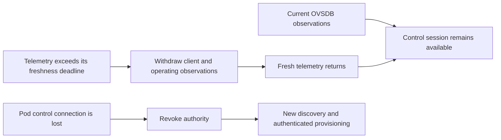

# Recover from missing telemetry without restarting onboarding

EMOSA receives two kinds of southbound information in this experiment. The pod's
OVSDB connection supplies current identity, configuration and observed membership.
The manager's MQTT reports supply measured association duration and operating
power. A report can become too old while the pod's control connection remains
healthy. Those are different failures and require different responses.

## What should happen



A missing report does not mean the client left. If EMOSA treated missing telemetry
as an empty station list, the controller could remove a working client. If it
continued using the old values, it would present stale information as current.
Instead it marks the inventory incomplete, withdraws dependent operating-radio
observations, and rejects prepared replies that relied on expired telemetry.
It retains the last known membership for event comparison; fresh identical
membership must not generate another join or a fabricated leave.

The OVSDB observation lease still expires after two seconds without refresh.
Actual disconnection, invalid input or a new connection generation still revokes
the old protocol context. The change separates the deadlines; it does not remove
freshness checking or extend stale information's lifetime.

This distinction became necessary during the
[kernel completion experiment](../evidence/tx-status/README.md). A short gap in
client statistics caused an unexpected fourth onboarding operation despite a
live OVSDB connection. That run retains its failed acceptance checks. The new
focused experiment deliberately reproduces a telemetry-only gap so the recovery
behavior can be verified independently.

## Prepare and run — HOST

Use the existing owned VM, candidate controller and prerequisites from the
[native onboarding guide](native-onboarding.md). Do not run another experiment
concurrently. The commands below update the lab's staged Python source while it
is idle; they do not install software on a physical pod.

```bash
lxc exec emosa-lab -- env PYTHONPATH=/opt/emosa-radio-manager/source \
  /opt/emosa/.venv/bin/python -c \
  'import sys,runpy; sys.path.insert(0,"/opt/emosa-baseline"); runpy.run_path("/opt/emosa-baseline/controller-trial.py")["idle"]()'
tar -C src -cf - emosa | \
  lxc exec emosa-lab -- tar -C /opt/emosa-radio-manager/source -xf -
lxc file push deploy/radio-manager/node.py deploy/radio-manager/manager.py \
  deploy/radio-manager/neighbor-observer.py emosa-lab/opt/emosa-radio-manager/
lxc file push deploy/peer-baseline/native-onboarding.py emosa-lab/opt/emosa-baseline/

lxc exec emosa-lab -- env PYTHONPATH=/opt/emosa-radio-manager/source \
  EMOSA_OVS_BIN=/opt/emosa-radio-manager/ovsdb \
  /opt/emosa/.venv/bin/python /opt/emosa-baseline/native-onboarding.py \
  --build /opt/emosa-baseline/candidate-onboarding-01 \
  --label freshness-learning-01 --active-seconds 210 --recovery-checks \
  --observe-station-removal --telemetry-gap-check

python3 scripts/collect-native-review.py \
  freshness-learning-01 .lab/freshness-learning-01
python3 scripts/check-telemetry-gap.py .lab/freshness-learning-01
python3 scripts/check-native-recovery.py \
  .lab/freshness-learning-01 --minimum-seconds 210
python3 scripts/check-native-policy.py .lab/freshness-learning-01
```

Choose a new run label and review directory. This focused regression uses ordinary
hwsim delivery, without intentional medium loss, so the usual zero-loss connected
traffic checks still apply. It does not need the optional kernel completion probe.

## Read the result

The harness first completes real controller discovery and provisioning, then
waits for a fresh report with the connected Wi-Fi client. It pauses only the
manager's MQTT publication for at least four seconds. The manager keeps observing
the AP and publishing OVSDB State; the clients keep sending traffic. Independent
ping and HTTP probes run while telemetry is still paused. The policy is restored
before the experiment continues, including on an ordinary failure exit.

Inspect `telemetry-gap-check.json` and the independent check:

1. Before the gap, inventory is complete and the operating-radio observation is
   available. Note the control context, worker identity and operation count.
2. During the gap, the control source remains available with the same context.
   The telemetry timestamp is absent, inventory is incomplete and no operating
   observation is offered. This means **unknown**, not a measured zero.
3. After publication resumes, fresh observations return under the same context.
   The durable operation is unchanged: no extra discovery, WSC exchange or Config
   write. The capture must contain no fabricated departure during the gap.
4. Later, an actual OVSDB interruption and adapter SIGKILL each require a fresh
   discovery/WSC exchange. Both complete as observed no-ops, retaining one total
   configuration-write attempt across three operations.

The independent checker also verifies continued manager observations, absence
of MQTT publication during the gap, resumed publication, complete captures and
client nonce responses. Run the recovery and policy checkers separately: a
freshness check alone does not prove the later faults recovered or that reporting
obligations were fulfilled.

This is a focused regression alongside the original 15-minute operational soak.
Required measured AP/radio/STA/neighbor reporting and online final-session
statistics still precede complete sustained acceptance. The physical-pod path
remains **real EasyMesh messages → EMOSA → unchanged physical pod → independently
observed behavior**.
