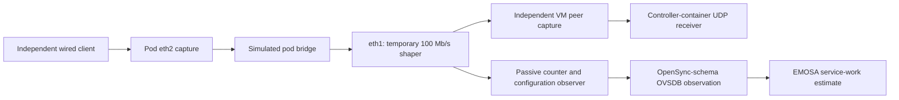

# Calibrate a simulated Ethernet service

This exercise gives the owned lab an explicit, measurable **egress service
model**. It does not measure a physical Ethernet PHY or enable complete native
neighbor metrics. Start with [common receive/transmit accounting](receive-counter-accounting.md).
Read the [retained evidence](../evidence/virtual-capacity/README.md) before running
new experiments.

## Why capacity needs its own experiment

Packet counts say how much traffic crossed an interface. They do not say how
much additional traffic the interface could carry. The lab's veth interface
reports a fixed speed value; copying that value into an IEEE 1905 report would
not establish usable capacity. A veth is a software connection, without the
physical serializer that makes Ethernet speed meaningful.

The optional shaper supplies a declared software service instead. Linux queues
outgoing pod traffic and budgets it at 100 million modeled wire bits per
second. We compare independently captured packets with that budget at several
loads. This makes the model's assumptions visible and testable.



The UDP receiver is a separate measurement endpoint in the controller container.
It is not an EasyMesh metrics recipient. During native experiments the real
controller continues sending its normal requests; this estimate is retained
as diagnostic evidence until a complete metric source can be admitted.

## Define the service before measuring it

The owned helper temporarily installs one root Token Bucket Filter (TBF), with
100 Mb/s rate, 65,536 bytes of burst credit and a 524,288-byte queue limit. It
refuses an existing configured queue/filter path and restores the original
`noqueue` configuration afterward. It runs only inside the owned isolated VM
and containers. It accepts no physical-pod endpoint.

A size table adds 24 modeled bytes, rounds the result up to an even byte count,
then applies an 84-byte minimum: `max(84, 2 × ceil((captured bytes + 24) / 2))`.
The additional 24 bytes cover FCS, preamble/start delimiter and inter-frame
spacing; the 84-byte floor includes minimum-frame padding. A
1,500-byte payload therefore consumes 1,538 modeled service bytes. The declared
maximum MTU-payload rate is `100 × 1500 / 1538`, approximately **97.529 Mb/s**.
This number excludes higher-layer headers and is not UDP application throughput.

Linux TBF allows bursts and shapes the average rate. The size table changes
scheduler accounting without adding those bytes to captured packets. These
properties follow the upstream [TBF manual](https://man7.org/linux/man-pages/man8/tc-tbf.8.html)
and [size-table manual](https://man7.org/linux/man-pages/man8/tc-stab.8.html).
The retained source review also reconstructs the actual Ubuntu 6.8.0-139.139
implementation: `sch_tbf.c` charges and accounts dequeued work;
`sch_generic.h` supplies `qdisc_pkt_len()` to byte statistics;
`sch_api.c` applies the size table. `overlimits` counts token waits, not dropped
packets. Child and parent drop statistics must not be added blindly.

The [exact iproute2 package review](../evidence/virtual-capacity/iproute-source-provenance.json)
explains the two-byte resolution: `tc_calc_size_table()` chooses `cell_log=1`
when both configured table MTU and entry count are 2,048. Odd adjusted frame
lengths consume one additional modeled octet. This quantization is a property
of the selected software model, not extra physical Ethernet framing. An early
native audit exposed this difference; the retained audit history explains the
corrected formula. No counter or capture tolerance was widened.

The production diagnostic source accepts the exact observed rate, framing,
MTU and queue shape. Missing detailed fields, added filters/queues, observed
XDP, requeues or changed identities withdraw the estimate. The passive
collector therefore uses `tc -j -d -s`: without `-d`, the framing configuration
is absent even when the shaper was configured correctly.

## Understand an estimate

`virtual_capacity` in the adapter's observation log contains a sample, a
counter window and, when both are valid, `service_estimate`.

- `service_bytes` is modeled wire work dequeued by the shaper, not application
  bytes or measured physical busy time.
- `service_work_ns` divides that work by the declared service rate.
- `available_percent` estimates unused modeled service over the interval.
  Read-time bounds also produce `available_percent_bounds`. Half-rate traffic
  should leave about 50%; saturated traffic about 0%.
- Burst credit can briefly exceed the average rate. The source rejects work
  beyond the configured rate-plus-burst budget instead of hiding it by clamping.
- A new connection, collector, configuration epoch or counter lifetime needs a
  fresh baseline. Repeated observations are not additional traffic.

The independent checker recomputes these quantities without importing EMOSA.
It also bounds every accepted service window with complete packet captures,
using a fixed 1 ms timing allowance and recorded wall/monotonic clock offsets.

## Reproduce retained evidence on HOST

No VM or root privileges are needed for replay. Compressed packet files are
losslessly expanded into a temporary directory under a fixed size limit.

```bash
uv run python scripts/replay-egress-accounting.py --virtual-service \
  doc/evidence/virtual-capacity/virtual-link-03 > /tmp/emosa-capacity-replay.json
cmp /tmp/emosa-capacity-replay.json \
  doc/evidence/virtual-capacity/virtual-link-03/virtual-capacity-projection.json
python3 scripts/check-virtual-capacity.py \
  doc/evidence/virtual-capacity/virtual-link-03
```

Component replay shows what the source computes from recorded data. The native
check additionally follows a real OVSDB handoff and two recovery transitions:

```bash
python3 scripts/check-virtual-capacity.py --native \
  doc/evidence/virtual-capacity/native-capacity-02
python3 scripts/check-native-recovery.py \
  doc/evidence/virtual-capacity/native-capacity-02 --minimum-seconds 210
```

## Run a new calibration in the idle owned lab

Use the established [radio/native lab](native-onboarding.md). Commands below
start on HOST; `lxc exec emosa-lab` runs their final command in the VM. Keep
other owned experiments stopped and choose a new label each time.

1. Stage the helpers, preserving the existing owned lab installation:

   ```bash
   lxc file push deploy/radio-manager/virtual-link.py \
     deploy/radio-manager/link-traffic.py deploy/radio-manager/calibrate-link.py \
     deploy/radio-manager/egress-observer.py emosa-lab/opt/emosa-radio-manager/
   ```

2. Run the short calibration:

   ```bash
   lxc exec emosa-lab -- python3 /opt/emosa-radio-manager/calibrate-link.py \
     virtual-learning-01
   ```

   The runner takes the owned lab locks, applies its temporary queue, captures
   both sides and sends three four-second UDP workloads: large frames at a
   requested 50 Mb/s, large frames at a requested 160 Mb/s, then small frames at
   5 Mb/s. Actual sent and received counts are retained; a requested send rate
   does not prove that rate was offered. Saturation is assessed from measured
   output, token waits and the independently counted workload.

3. Copy the synthetic result into a new private HOST directory:

   ```bash
   mkdir -p .lab/virtual-learning-review
   lxc file pull -r \
     emosa-lab/opt/emosa-radio-manager/link-calibration/virtual-learning-01/ \
     .lab/virtual-learning-review/
   uv run python scripts/replay-egress-accounting.py --virtual-service \
     .lab/virtual-learning-review/virtual-learning-01 \
     > .lab/virtual-learning-review/virtual-learning-01/virtual-capacity-projection.json
   python3 scripts/check-virtual-capacity.py \
     .lab/virtual-learning-review/virtual-learning-01
   ```

   Inspect `traffic_control_restored`, `cleanup_errors`, collector termination,
   packet/filter/file totals and the independent result. Preserve any failed
   attempt and investigate before starting another. Packet captures include
   unrelated local traffic, which must be counted at the relevant interface.

4. Stage current `src/emosa`, native harness and observer helpers using the
   [sustained-operation instructions](sustained-operation.md). Add the shaper
   helper from step 1, then run:

   ```bash
   lxc exec emosa-lab -- env \
     PYTHONPATH=/opt/emosa-radio-manager/source \
     EMOSA_OVS_BIN=/opt/emosa-radio-manager/ovsdb \
     /opt/emosa/.venv/bin/python /opt/emosa-baseline/native-onboarding.py \
     --build /opt/emosa-baseline/candidate-onboarding-01 \
     --label native-capacity-learning --active-seconds 210 --recovery-checks \
     --observe-station-removal --telemetry-gap-check --neighbor-gap-check \
     --virtual-link
   python3 scripts/collect-native-review.py \
     native-capacity-learning .lab/native-capacity-learning-review
   python3 scripts/check-virtual-capacity.py --native .lab/native-capacity-learning-review
   python3 scripts/check-native-recovery.py \
     .lab/native-capacity-learning-review --minimum-seconds 210
   ```

   Startup and cleanup take additional time. A 210-second regression does not
   meet the 900-second acceptance duration. The existing 15-minute operational
   evidence remains separate; the complete integrated acceptance run must wait
   for all required reporting inputs and procedures.

## What remains before native metric publication

IEEE 1905.1-2013 §6.4.11/Table 6-18 requires capacity and availability as part of
the per-link transmitter metric; §11.1 scopes metrics to interface/neighbor
pairs. This service experiment supplies a candidate simulation estimator, not
the entire contract. Complete per-peer attribution, other relevant loss paths,
offload/TCX/GSO behavior and the selected media representation still need
qualification. The existing topology media fixture is not changed or claimed
to be a measured 100BASE-T PHY by `--virtual-link`.

The diagnostic's unused-service fraction must also be checked against the
selected protocol meaning before publication. In particular, EasyMesh 6.1
§10.1's Wi-Fi prediction under sufficient traffic is not the idle fraction of
this Ethernet shaper. No code maps this diagnostic percentage to that field.

Continue with [combined shaped-backhaul accounting](shaped-backhaul-accounting.md)
to exercise actual queue overflow and selected action losses in a common interval.
Ordinary unshaped runs continue to use their existing common loss source.
That source deliberately rejects TBF; the optional shaped run instead records
the separate service estimate. Combining those two paths requires explicit
loss accounting and a complete profile before the guarded native publisher
can use them. AP/STA reports and final-session statistics also remain required
for full sustained acceptance. No physical pod is changed or qualified here.
