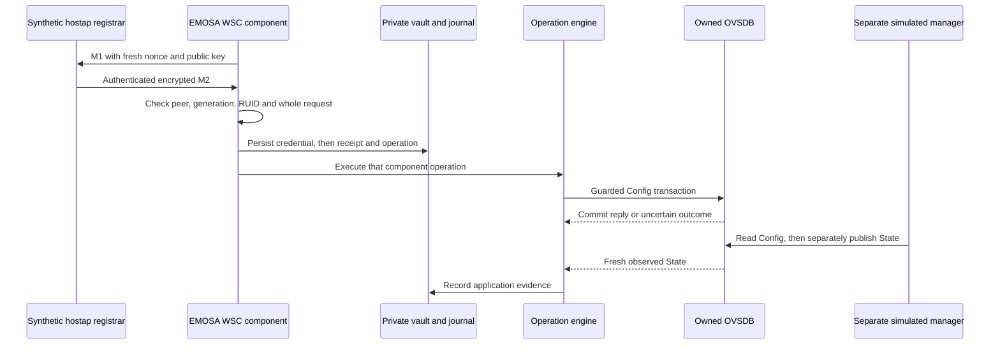

# From authenticated WSC input to an observed database change

This exercise closes one implementation gap: an authenticated, supported M2
now creates a durable EMOSA operation that changes an owned OpenSync-schema
simulator. A second semantic API request does not supply the change. The
operation records `initiating_interface: "wsc-component"` so its origin remains
visible.

**This is a component experiment, not the first complete viability proof.**
The registrar is a synthetic C payload exerciser using pinned hostap 2.11
helpers. Ethernet frames pass through the actual CMDU decoder in memory.
There is no native controller, Ethernet socket, radio or client in this command.
Discovery, Early Report and profile admission are deliberately separate; the
normal service and full-wire scenario remain blocked. Nothing contacts a pod.

## 1. Understand what is being joined

M1 starts an enrollee's credential exchange. M2 carries the registrar's encrypted
configuration, authenticated against that M1. A **candidate** is configuration
that passed payload and complete-message validation. An **operation** adds a
durable identity, a target resource, an execution attempt and an observed result.
Previously these components stopped at the candidate. The new bridge connects
them within a strictly owned simulation.



The last two arrows matter. A successful Config write does not establish
application. Only the separate simulated manager publishes State. Its State
establishes this simulation's application predicate; it cannot establish radio
association or client traffic.

## 2. Build the two independent native components — HOST

Use the development checkout, as your normal user, after the
[manual installation](../guides/team-manual.md#3-set-up-a-developer-checkout).
No LXD VM is required. On Ubuntu, install missing build prerequisites once:

```bash
sudo apt-get update
sudo apt-get install -y build-essential pkg-config libssl-dev curl
uv sync --frozen
bash scripts/build-ovsdb.sh
python3 scripts/build-wsc-registrar.py
```

The first build supplies real `ovsdb-server` and `ovsdb-tool`. The second downloads
hostapd 2.11 from the upstream release site, checks the pinned archive and source
hashes, and compiles [the small C harness](../../deploy/wire/component-registrar.c)
against unmodified hostap WPS functions. It does not build or start a full
controller, AP or hostapd daemon. Its executable, build log and provenance live
under `.cache/wsc-registrar/`. The C source contains an intentionally public
simulation SSID/key. It uses fresh entropy for each registrar exchange; EMOSA
also generates fresh M1 material. No ephemeral private key is exported.

If you already have the exact upstream archive, use:

```bash
python3 scripts/build-wsc-registrar.py --archive /absolute/path/to/hostapd-2.11.tar.gz
```

The archive hash is still verified. Source reuse cross-checks the normative
implementation; it does not replace the IEEE/WFA specifications.

## 3. Run all four cases — HOST

Choose a new output directory each time:

```bash
uv run python -m emosa.simulation.wsc_provisioning \
  --registrar .cache/wsc-registrar/component-registrar \
  --output .lab/wsc-provisioning-01
uv run pytest tests/test_wsc_operation_bridge.py tests/test_wsc_provisioning.py -q
```

The command creates and cleans its own databases, Unix sockets, simulated manager
processes, private credentials and SQLite journals. In the ordinary cases the
simulated pod initiates its southbound connection. The crash case uses a private
direct Unix connection so the parent can retain the owned database while killing
and replacing the adapter child. Neither direction qualifies physical access.
There is no endpoint option or mechanism for selecting a physical target.

The fixture declares one existing enabled BSS, one 2.4 GHz radio, one pure
fronthaul WPA2-PSK/CCMP configuration and explicit stable RUID/BSSID/serial values.
Those are known fixture inputs. We do not infer Max BSS from the number of rows
or treat the MAC inside encrypted M2 settings as target-binding authority.

Read `summary.json`, then each case JSON. The summary should say `passed: true`,
`cases: 4`, and `full_wire_gate: "blocked_P0"`. That combination is expected:
passing this component does not open the full procedure gate.

| File | Deliberate condition | Expected evidence |
| --- | --- | --- |
| `configure.json` | Valid M2, identical retry, fresh re-encryption and changed MID | One operation and one transaction; Config precedes State; final `OBSERVED_APPLIED` |
| `lost-reply.json` | Database commits but reply is discarded | Initially `INDETERMINATE`; later fresh State resolves application; commit attribution stays `unknown` |
| `identity-race.json` | BSSID changes after planning, immediately before transaction | Atomic guard aborts the transaction; `OWNERSHIP_CONFLICT`; original Config SSID remains |
| `crash-after-commit.json` | Real adapter child receives SIGKILL after database commitment, before recording the reply | Durable `SUBMITTED` recovers as `INDETERMINATE`; no resubmission; State resolves application; old M2 fails against fresh M1 |

In the first three cases, fresh negative exchanges precede the valid request:
invalid authentication, encrypted teardown, two M2 payloads, and an unsupported
configuration companion all create **zero operations, zero credential files and
zero transaction attempts**. Each failed exchange is closed; the next trial gets
a new M1. A different authenticated configuration after acceptance is also refused.

`transaction_attempts: 1` in the identity-race case counts a submitted transaction
that the database rejected atomically. It does not mean one successful Config
change. Compare `rows_before_manager_apply` with `rows_at_end`. All published row
observations contain only SSIDs; no key or credential fingerprint is exported.

## 4. Follow the durable handoff and its limits

[WscComponentBridge](../../src/emosa/wire/operation_bridge.py) requires an active
exchange, explicit peer/link context and a fresh supported database graph.
Before submission, the experiment pins schema, generation, row identities,
serial, radio identity and BSSID. Existing atomic transaction guards recheck
the selected Config/State graph and credential representation at commit.

The bridge first creates an exclusive mode-0600 credential file in the private
vault, flushes it and its directory, then inserts the operation, initial event
and [WSC receipt](../../schemas/wsc-receipt.schema.json) in one SQLite transaction.
The receipt records the exchange, initiating M1 digest, peer, radio and database
context. Complete-M2 correlation uses a keyed fingerprint retained only in the
private journal. Packet MIDs can change between retries; they are not durable
operation identities. No PSK is stored in the operation or public result.

The bridge registers process-local execution authority. A database reconnect,
expired/closed exchange or missing guard refuses an unsent operation. On restart,
unsent component operations are cancelled. Submitted operations become uncertain
and are reconciled from fresh observations without resending Config. Fresh
observations are allowed after reconnect; old exchange write authority is not.
Application evidence after an unknown commit explicitly says
`attribution: "current_condition_only"`.

This does **not** preserve cryptographic sessions across a crash or promise
exactly-once execution for arbitrarily repeated new enrolments. A new exchange
requires a fresh M1 and, in the complete implementation, fresh discovery/profile
admission. A crash between credential persistence and journal insertion may leave
an orphan private file; this disposable experiment removes its entire owned
temporary vault during cleanup. Production secret retention/garbage collection,
exchange resumption policy and admission are still separate work. An uncatchable
kill of the parent runner can leave its temporary processes/files for the lab
owner to inspect; never clean unrelated `/tmp` directories by pattern.

The regular `Engine.request` API still accepts only semantic initiation. The
component uses an internal handoff; it is not a public authorization token or a
physical-device enable flag. `emosa serve` does not activate this bridge.

## 5. Check the contract and continue toward viability

| Rule | Existing reviewed authority or explicit local policy |
| --- | --- |
| Trusted-link assumption, M1/M2 phase and failed-configuration restart | IEEE 1905.1-2013 §§10.1–10.1.2 pp.56–57; trust is provided by the owned fixture, not established by MAC matching |
| Per-radio RUID, complete BSS set, no partial unsupported configuration | EasyMesh 6.1 §7.1 pp.67–69 and §17.1.3 p.111 |
| Authenticated encrypted settings and PSK encoding | WPS 2.0.10 §§7.2–3, §7.5 and §8.3.9 Table 20; Network Key Table 40 |
| Retry can use a new MID | EasyMesh 6.1 §15.1 p.104 |
| Atomic receipt, private credential durability, one live bridge per exchange, 30-second component budget and restart cancellation | EMOSA local implementation policies; these are not additional IEEE requirements |

See the [protocol matrix](protocol-matrix.json),
[retained results](../evidence/wsc-provisioning/README.md) and
[complete experiment contract](../guides/first-wire-experiment.md).
The next integration needs a compatible native controller, admitted
discovery/Early/capability sequence and controller-owned inventory evidence.
Then route that controller's genuine provisioning through this handoff into
the existing hwsim manager and independent wpa_supplicant client. Finally,
qualify and substitute the unchanged physical pod. The acceptance path remains
**real EasyMesh controller → EMOSA → unchanged physical pod → independently
observed behavior**.
