# Drive an observed Wi-Fi change from Ethernet WSC input

This experiment joins **received IEEE 1905 WSC frames → EMOSA → real OVSDB →
independent hostapd/hwsim manager → separate clients** in one run. Configuration
comes from authenticated M2 settings; no semantic API request supplies the change.
It advances the [durable WSC handoff](wsc-provisioning.md) from in-memory frame
handling to actual Ethernet sockets and independently observed Wi-Fi behavior.

The peer is a **synthetic payload exerciser**, built with unmodified pinned
hostap 2.11 WPS helpers. It is not the native EasyMesh controller. The experiment
starts at an explicitly bound M1 exchange; discovery, Early Report and profile
admission are not exercised. The normal service and complete wire scenario
remain blocked. No physical pod is selected or changed.

## 1. Understand the experiment before running it

```mermaid
flowchart LR
    C[Synthetic hostap payload peer] <-->|M1 and M2 over isolated Ethernet| W[EMOSA bounded WSC receiver]
    W -->|Authenticated complete request| E[Durable operation engine]
    E -->|Guarded Config transaction| D[Owned OpenSync-schema OVSDB]
    D -->|Read Config| M[Separate radio manager]
    M -->|Apply configuration| A[hostapd and mac80211_hwsim]
    A -->|Read actual status via hostapd and nl80211| M
    M -->|Publish observed State| D
    D -->|Reconcile observation| E
    U[Separate wpa_supplicant client] <-->|Association and traffic| A
    A <-->|Wired bridge and backhaul| S[Independent application endpoint]
    L[Separate wired client] <-->|Interface bound traffic| S
```



The leftmost peer sends genuine serialized WSC content, including authenticated
encrypted settings. Its small C harness generates the payload; the Python peer
wraps it in CMDUs. Two fresh network namespaces connected by a private veth pair
carry these frames through `AF_PACKET`. The pair has no IP addresses and uses no
physical interfaces. Each side retains the bytes it actually received.

A **component operation** is the durable request created after complete M2
validation. The receipt connects its ID to the M1 digest, controller/agent AL
addresses, RUID, selected BSSID, link and database generations, and first accepted
MID. This is stronger evidence than issuing a local semantic request after
showing an unrelated packet. It still does not establish membership in a real
controller's managed-agent inventory.

The radio manager is a separate process. It must read the live hostapd and
nl80211 state before publishing positive `Wifi_VIF_State`. Clients run in
separate containers; the wireless station pins the AP BSSID and authenticates
using wpa_supplicant. Both clients bind traffic to their intended interfaces and
must obtain a fresh nonce from the application endpoint. The baseline controller
container hosts that endpoint here; its native controller process stays stopped.

## 2. Prepare the existing owned lab — HOST

Complete [manual §3](../guides/team-manual.md#3-set-up-a-developer-checkout), the
[baseline resource preparation](../../deploy/peer-baseline/README.md), and the
[radio-manager prerequisites](../../deploy/radio-manager/README.md#prepare-and-run).
The dedicated `emosa-lab` VM must already have:

- Four owned containers: `em-baseline-controller`, `em-baseline-agent`,
  `em-baseline-wired` and `em-baseline-wifi`, with setup Ethernet removed.
- Assigned mac80211_hwsim radios and the pinned hostapd/wpa_supplicant tools.
- Python 3.13.7 and locked dependencies at `/opt/emosa/.venv`, Open vSwitch 4.0.0
  database tools at `/opt/native-ovsdb-server` and `/opt/native-ovsdb-tool`,
  plus `ip`, `tcpdump` and `tshark`.
- Idle native and radio experiment services. Retain earlier results before
  stopping those services using their own runbook; do not run competing trials.

In the HOST checkout, build the small payload helper and stage the experiment:

```bash
uv sync --frozen
python3 scripts/build-wsc-registrar.py
python3 deploy/radio-manager/stage.py --wsc
```

The helper build requires a C compiler and OpenSSL development headers, as
explained in [the preceding exercise](wsc-provisioning.md#2-build-the-two-independent-native-components--host).
`--wsc` checks its binary and harness hashes, copies its provenance/license,
and includes the packet driver. Staging verifies VM/container ownership, tool
versions, idle services and experiment locks. It neither creates the VM nor
rebuilds the native controller. These commands run on HOST, as your normal user;
`lxc exec` below runs the selected process as root inside the isolated VM.

## 3. First run only the Ethernet-to-database path — HOST command, VM execution

Use a new directory name for every run:

```bash
lxc exec emosa-lab -- env \
  PYTHONPATH=/opt/emosa-radio-manager/source \
  EMOSA_OVS_BIN=/opt/emosa-radio-manager/ovsdb \
  /opt/emosa/.venv/bin/python /opt/emosa-radio-manager/wire-endpoint.py \
  --provisioning \
  --registrar /opt/emosa-radio-manager/registrar/component-registrar \
  --directory /opt/emosa-radio-manager/runs/learning-wsc-packet-01
```

This creates two packet workers and a disposable real database. The simulated
pod initiates its Unix-socket management connection to EMOSA. A separate simulated
manager publishes State after the test permits application. No radio is started
in this mode. Repeat with `--lost-reply` and a different directory to discard the
commit reply deliberately.

Inspect `left.json` (adapter), `right.json` (peer), and `wire-ready.json` (before
application). A successful driver prints `passed: true` and removed namespace
names. The detailed operation must show `initiating_interface: "wsc-component"`,
one attempt and final `OBSERVED_APPLIED`. The driver removes only its owned
namespaces and worker process groups, including after a caught interruption.
An uncatchable kill or VM failure still requires owner inspection; do not delete
other namespaces or run directories by a broad name pattern.

## 4. Repeat through the radio and clients — HOST command, VM execution

Choose two new labels, at most 24 lowercase letters, digits or hyphens:

```bash
lxc exec emosa-lab -- env \
  PYTHONPATH=/opt/emosa-radio-manager/source \
  EMOSA_OVS_BIN=/opt/emosa-radio-manager/ovsdb \
  /opt/emosa/.venv/bin/python /opt/emosa-radio-manager/run-wsc.py \
  --label learning-wsc-radio-01

lxc exec emosa-lab -- env \
  PYTHONPATH=/opt/emosa-radio-manager/source \
  EMOSA_OVS_BIN=/opt/emosa-radio-manager/ovsdb \
  /opt/emosa/.venv/bin/python /opt/emosa-radio-manager/run-wsc.py \
  --label learning-wsc-radio-02 --lost-reply
```

The runner sets up the owned wired topology and initial SSID, then confirms both
clients work. It withholds manager application while the packet exchange changes
Config. During this interval the old SSID and clients still work. Releasing the
manager applies the WSC configuration; the clients must then authenticate and
carry traffic on `EMOSA-WSC-component`. Finally, a wrong key must produce a fresh
`WRONG_KEY` event without a completed association; the correct key restores
traffic. The fixture keys are intentionally public synthetic values, unsuitable
for a real deployment.

Raw results remain at `/opt/emosa-radio-manager/runs/LABEL/`. The runner stops its
services/database/capture and removes the packet namespaces. It retains the
containers, hwsim assignments and wired topology. It does not resume a previous
native experiment automatically. Use that experiment's preparation procedure
before starting it again.

## 5. Read each control and distinguish the evidence

| Input or condition | Required observation |
| --- | --- |
| M2 MID 501 has invalid outer authentication | No operation, credential file or transaction; close exchange and send a fresh M1 |
| M1 restart | New nonce, DH public key and MID: 101 then 102 in this fixture |
| M2 MID 502 identifies the wrong RUID | Reject before creating an operation |
| MID 503 arrives last fragment first | No operation until both fragments are present; then authenticate the complete message |
| MID 504 repeats the same settings; 505 freshly encrypts them | Normal run reuses the same operation and one transaction across both retries |
| MID 506 changes authenticated configuration | No second operation or Config write |
| Manager application is withheld | New Config, old observed State, old SSID and successful old-network client probes |
| Manager applies the change | Fresh hostapd/nl80211-derived State, new beacons, successful separate client probes |
| Wrong client key | Fresh authentication failure; correct-key recovery works |
| Commit reply is discarded | Initially `INDETERMINATE`; reconnect invalidates old exchange write authority, so subsequent retries reject; fresh State may resolve application without another write |

In the lost-reply result, `commit_attribution` must remain `unknown`, even after
`OBSERVED_APPLIED`; application evidence says `current_condition_only`. This
means the current condition is known, without retroactively claiming that EMOSA
received proof of the original database commit.

Read `result.json` first, then `ethernet/left.json`, the four `clients-*.json`
files and `packet-observations.json`. The latter records independent tshark
observations of the old/new beacons and EAPOL messages 1–4. `radio.pcap` contains
the actual hwsim capture. Ethernet PCAPs preserve received frame bytes and order
with **synthetic timestamps**; do not use their times for latency or cross-capture
causality. Correlate them through the M1 digest and operation receipt instead.

On HOST, independently recheck the published examples without running the VM:

```bash
python3 scripts/check-wsc-wire-reference.py \
  --directory doc/evidence/wsc-wire/packet-normal \
  --directory doc/evidence/wsc-wire/packet-lost-reply \
  --directory doc/evidence/wsc-wire/radio-normal/ethernet \
  --directory doc/evidence/wsc-wire/radio-lost-reply/ethernet \
  --radio-directory doc/evidence/wsc-wire/radio-normal \
  --radio-directory doc/evidence/wsc-wire/radio-lost-reply
```

This requires tshark. It checks Ethernet/CMDU headers with the external dissector,
reassembles the retained TLV-boundary fragments independently, and compares nonce,
RUID, MID, payload and receipt correlations. It does not independently decrypt M2
or turn a synthetic peer into a native controller. The separate hostap helpers
and validators provide the payload cross-check.

For a new run, copy its folder to private local storage, then point the checker
at its `ethernet/` folder (or the packet-only folder). Raw runs include credential
files, hostapd/supplicant configuration, database and journal. Publish only a
reviewed allowlist: public results, client observations, source hashes and
synthetic captures. Never copy a whole raw run into `doc/evidence`.

## 6. Understand bounds, failures and the remaining goal

The receiver checks the configured peer, ingress and link generation before
allocating reassembly state. Its local limits are two contexts, eight fragments,
8 KiB per message, 16 KiB aggregate, five-second fragment expiry, a 32-frame
burst with 16 frames/second refill, no concurrent input waiter queue, and 32
retained diagnostic events. These are implementation budgets, not claims about
IEEE maximums or authenticated-link establishment. The owned packet fixture
allows a 30-second exchange lifetime and a 120-second operation deadline; packet, manager and
client phases have shorter bounded waits.

On failure, read `result.json`, `wire-driver.log` and `ethernet/left.log` /
`right.log`. A Config/State mismatch during withholding is expected; a mismatch
after release must not be reported as a successful radio change. A missing
`WRONG_KEY` event is a failed control, even when positive traffic already passed.
The retained development history includes exactly that check-path correction.

The [evidence collection](../evidence/wsc-wire/README.md) records the finite runs,
tool/source hashes, negative controls and cleanup check. This is one explicit
sole-BSS, WPA2-PSK/CCMP, channel-6 fixture, with wired management. It runs no
OpenSync firmware and establishes neither full-radio physical qualification nor
wireless-backhaul onboarding, roaming, production scale or full-profile support.

Next join compatible **native-controller** discovery/Early/profile/capability
admission to this tested path, and obtain the controller's own agent/radio/BSS
inventory. The native capture still lacks required controller fields, and the
Table 117/profile questions remain recorded in the [protocol matrix](protocol-matrix.json).
Then qualify and substitute the unchanged physical pod and an independent physical
client. The final acceptance path remains **real EasyMesh controller → EMOSA →
unchanged OpenSync pod → independently observed behavior**.
