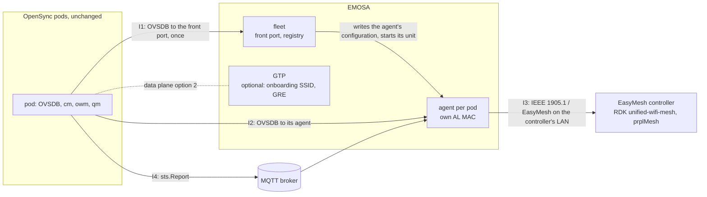

# Architecture

What EMOSA is and does is the specification ([spec/README.md](../../spec/README.md));
how it is built is the component design ([spec/design.md](../../spec/design.md)): its
context (§1), deployment units (§2), external interfaces I1 to I7 (§3), the agent's
layers and modules (§4), threads (§5), state and recovery (§6), state machines (§7),
timing (§8), budgets (§9), security (§10), observability (§11) and acceptance (§13).
This page is the map from that design to the C implementation and to where it runs.

## The system

- A pod is handed to the **fleet** (its redirector points `manager_addr` at the front
  port). The fleet admits it, gives it a port, an interface and an AL MAC derived from
  its serial (spec §2.2), writes the agent's configuration, enables and starts
  `emosa-agent@SERIAL`, and redirects the pod to its agent's port.
- The **agent** is an EasyMesh agent toward the controller and an OVSDB manager toward
  the pod: it onboards (Search, M1, M2), answers from a snapshot of the pod's rows, and
  writes the controller's M2 (and steering, telemetry, uplink settings) into the pod as
  guarded, journalled operations.
- The **GTP** (optional) serves the pods' onboarding SSID and ends their OpenSync GRE:
  data plane option 2 (spec §8.2). Option 1 is the pod on the EasyMesh backhaul itself
  (spec §8.3).

## The C implementation

Three programs over one static library (`c/src`, [modules.md](modules.md)):

| Program | Design | Loop |
| --- | --- | --- |
| `emosa-agent-c` | §4 (all of it) | one owner thread: `poll` over the pod's OVSDB connection, the 1905 packet socket and the broker; the pod's state refreshed every 0.5 s under a 1.5 s lease; no locks (§5.1) |
| `emosa-fleet-c` | §2, spec §4 | one thread: `poll` over the front port's connections, a state machine per pod with a 5 s budget, `systemctl` run as children and reaped in the loop (§5.2) |
| `emosa-gtp-c` | spec §8.2 | a command per invocation: `setup` from the unit, `lease` from dnsmasq's hook (§5.3) |

The library follows the design's layers: the wire (`cmdu.c`, `ethernet.c`,
`autoconf.c`, `wsc.c`, `lifecycle.c`, `early.c`, `control.c`, `reporting.c`,
`bhsteer.c`) never writes the pod; the model (`ovsdb.c`, `ovs.c`, `view.c`,
`stats.c`) turns rows and reports into the snapshot every answer is built from; the pod
scopes (`scope_*.c`, `southbound.c`, with `engine.c`, `journal.c`, `vault.c`) are the
only writers, each through guarded transactions journalled as operations and counted
applied only when the pod's state shows them.

It is the reference's twin, file for file where the two meet: the same configuration
(`schemas/agent-config.schema.json`), status file (`agent-status.schema.json`), state
directory (journal, secrets, policy stores) and fleet files, so either takes a pod or a
fleet over from the other.

## Where it runs

| Form | What | Used by |
| --- | --- | --- |
| The adapter kit (`deploy/adapter`) | a tarball that installs either implementation in `/opt/emosa-adapter` on a Linux host or container, with units and the agents' link helper | both labs' `emosa` containers |
| A distribution's package (`-DEMOSA_INSTALL_DATA=ON`) | the programs, data, units, `/etc/default/emosa` and the bill of materials in standard places | the Yocto recipe |
| The gateway image | meta-cmf-bananapi-vcpe's recipe `emosa`, opt-in (`EMOSA_ADAPTER = "1"`): logging through RDK's logger, the fleet enabled and inert until configured | the RDK lab's `gateway.sh` (plan 8.6) |

On a gateway the agents reach the controller through a veth pair into its LAN bridge
(`EMOSA_TRUNK=emlan`, `EMOSA_BRIDGE=brlan0`); each agent's macvlan on the trunk carries
its own AL MAC. The broker is the operator's; the agents subscribe to it
(`telemetry.subscribe`).

## What is not in the C

The controller-side and lab tools (`lab/src/emosa_lab`, `scripts`), the vector
generator and the evaluation tooling are Python only; none runs on a gateway. What the
specification leaves out is listed in its §9, the design's known limitations in its
§14.
