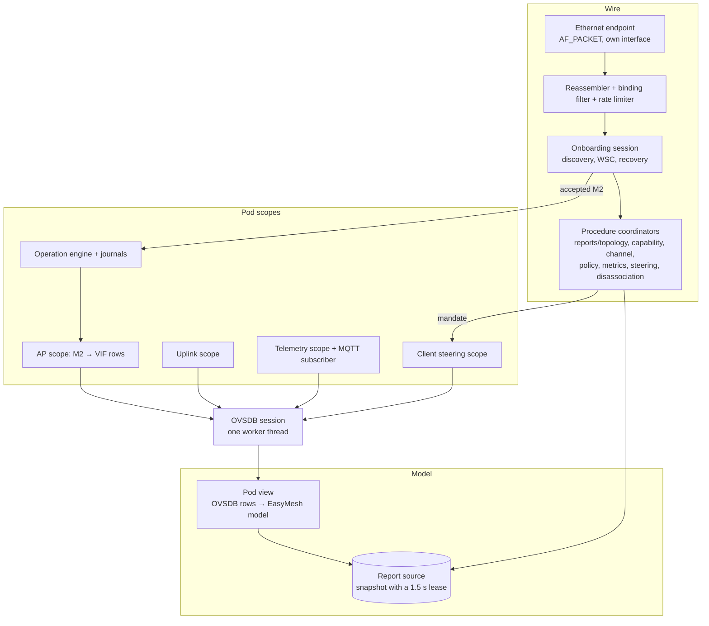

# EMOSA component design

The design of the EMOSA adapter: its processes, interfaces, internal modules,
thread model, state, timing and dependencies. It is written so that a team
that has not worked on EMOSA can build an interchangeable implementation.

The specification has four parts:

| Part | Says | Normative |
| --- | --- | --- |
| [spec/README.md](README.md) | **what** EMOSA does on each interface (MUST/SHOULD) | yes |
| [spec/conformance](conformance/README.md) | the exact outputs for recorded inputs | yes: an implementation conforms when its harness reproduces them |
| [schemas/](../schemas) | the files EMOSA reads and writes | yes |
| this document | **how** it is built: decomposition, concurrency, state, budgets | the interfaces (§3) and the timing and resource budgets (§8, §9) are normative. The internal decomposition (§4) is the reference's and is recommended, not required |

Where this document and the specification disagree, the specification wins.
Section numbers such as "spec §3.7" refer to [spec/README.md](README.md).

Two implementations exist: the Python reference (`src/emosa`, complete) and a
C lab prototype (`c/`, in progress, not production code).

## 1. Context

```mermaid
flowchart LR
  subgraph gw[Gateway / controller site]
    C[EasyMesh controller]
    LAN[(LAN bridge: brlan0)]
    B[(MQTT broker)]
    subgraph emosa[EMOSA]
      F[emosa-fleet]
      A1[emosa-agent@pod-1]
      A2[emosa-agent@pod-N]
      G[emosa-gtp]
    end
  end
  R[Operator redirector / cloud]
  P1[OpenSync pod 1]
  P2[OpenSync pod N]
  C <-->|IEEE 1905.1 / EasyMesh| LAN
  A1 <-->|1905 frames, own macvlan + AL MAC| LAN
  A2 <-->|1905 frames| LAN
  R -.->|hands cm to EMOSA| P1
  P1 -->|OVSDB: pod dials the front port| F
  F -->|writes manager_addr, starts agent| A1
  P1 <-->|OVSDB: pod dials its agent port| A1
  P2 <-->|OVSDB| A2
  P1 -->|sts.Report over MQTT| B
  B -->|subscription| A1
  P1 <-->|GRE over the pod-backhaul SSID| G
  G -->|gretap bridged| LAN
```

EMOSA makes each unchanged OpenSync pod appear to an EasyMesh controller as
one EasyMesh agent. Nothing is installed on the pod. EMOSA uses the pod's
existing management interface (OVSDB, RFC 7047), exactly as an OpenSync cloud
manager does, and its existing statistics path (MQTT, `sts.Report`).

In scope:
- one virtual agent per pod: onboarding, topology, capabilities, the control
  procedures of spec §2.4, client steering, statistics;
- the fleet front port that takes pods over and starts their agents;
- the GRE termination point (GTP) for the pods' client traffic (data plane
  option 2, spec §8).

Out of scope: the controller; the pod firmware; the operator cloud; the
EasyMesh backhaul radio itself (data plane option 1 uses the controller's
own backhaul BSS, spec §8.3).

## 2. Deployment units

| Unit | Count | Lifetime | Role |
| --- | --- | --- | --- |
| `emosa-fleet` | 1 per site | long-running service | the pods' manager front port; identifies pods, allocates agents, starts them, hands each pod over to its agent |
| `emosa-agent@<serial>` | 1 per pod | long-running service, restarted on failure | the virtual EasyMesh agent of one pod |
| `emosa-gtp` | 1 per site | `setup` at boot, then run by dnsmasq for every lease event | the GRE end of every pod's OpenSync uplink (spec §8.2) |
| MQTT broker | 0 or 1 | external service (mosquitto in the lab) | carries the pods' `sts.Report` to their agents; only with `telemetry.mode = mqtt` |

Process isolation is a requirement, not an optimization: a fault, restart or
resource exhaustion in one pod's agent MUST NOT affect another pod's agent.
The fleet never holds a pod's session after the handover.

Placement. The reference runs all units in one Linux container (the lab's
`emosa` container) with a trunk interface on the controller's LAN bridge. On a
product, the units run on the gateway itself and the trunk is the LAN bridge
(`brlan0`). Nothing in the design depends on the placement, except that the
agents need layer-2 access to the controller and IP reachability from the pods.

Service management (reference: systemd, `deploy/adapter/files`):
- `emosa-agent@.service` runs `emosa-agent-link <serial>` first, which creates
  the agent's macvlan on the trunk (`EMOSA_TRUNK`, default `emlan`) with the
  agent's AL MAC as its address, then the agent with `/etc/emosa/<serial>.json`;
- the fleet enables and starts `emosa-agent@<serial>`, and disables it on
  `forget`.

An implementation may use another supervisor; it MUST provide the same
per-pod isolation, restart on failure and start ordering (interface before
agent).

## 3. External interfaces

All interfaces are normative. Each has an owner process.

### 3.1 I1: the fleet front port (OVSDB, pod → EMOSA)

| | |
| --- | --- |
| Owner | `emosa-fleet` |
| Transport | TCP (`ptcp:`) or TLS (`pssl:`), `listen` in the fleet config |
| Direction | the pod's `ovsdb-server` connects (it is the pod's `manager_addr` or redirector target); EMOSA is the JSON-RPC **client** on the accepted connection |
| Protocol | RFC 7047 JSON-RPC: `get_schema`, `monitor`/`transact` on `Open_vSwitch` |
| Exchange | read `AWLAN_Node` (`id`, `serial_number`, `model`, `firmware_version`); admit by serial (`admit`); allocate or find the agent; write the agent config; start the agent; `update AWLAN_Node set manager_addr = "tcp:<advertise>:<port>"`; close |
| Budget | 5 s for the whole exchange per pod; at most `concurrency` (default 16) pods in flight |
| Errors | an unidentified or unadmitted pod: close without writing. A failed write: close; the pod retries through its own redirector cycle |
| Vectors | `fleet.json`, `al-mac.json` |

The AL MAC is derived from the serial (spec §2.2) so that it survives a lost
registry.

### 3.2 I2: the agent's OVSDB port (OVSDB, pod → agent)

| | |
| --- | --- |
| Owner | `emosa-agent@<serial>` |
| Transport | TCP listener on the agent's port (reference: `ptcp:<port>:127.0.0.1` behind a port proxy, or on the advertised address), or TLS with a pinned peer certificate (`pssl:` with `peer_certificate_sha256`) |
| Direction | the pod connects (its `manager_addr`); the agent is the JSON-RPC client |
| Session | on each connection: `get_schema`, qualify the schema against the pinned OpenSync schema, `monitor` the tables and columns the agent uses (§4.6), then transactions. A reconnect is a new **generation** |
| Reads | `AWLAN_Node`, `Wifi_Radio_Config/State`, `Wifi_VIF_Config/State`, `Wifi_Associated_Clients`, `Wifi_Inet_Config/State`, `Wifi_Credential_Config`, `Connection_Manager_Uplink`, `Wifi_Stats_Config`, `Band_Steering_Config`, `Band_Steering_Clients`, `Wifi_VIF_Neighbors` (exact columns: spec §3.2 and the scopes' `MONITOR`) |
| Writes | only guarded `transact` calls of the four scopes (§4.5): AP configuration, uplink, telemetry, client steering. Every write starts with `wait` guards on the rows it depends on (spec §3.2) |
| Budget | 2 s per request; decoded message ≤ 16 MiB; monitor cache ≤ 10 000 rows |
| Vectors | `translation-northbound.json`, `translation-southbound.json`, `uplink.json`, `steering.json` |

### 3.3 I3: the 1905 LAN (IEEE 1905.1 / EasyMesh, agent ↔ controller)

| | |
| --- | --- |
| Owner | `emosa-agent@<serial>` |
| Transport | raw Ethernet, EtherType `0x893A`, on the agent's own interface (a macvlan on the trunk, MAC = AL MAC). Multicast `01:80:c2:00:00:13` |
| Binding | the controller's AL MAC from the agent config. Every received message is checked: destination = own AL, source ∈ the controller's addresses. Others are dropped before any other processing and do not consume the rate budget (the LAN is shared with every native agent) |
| Input budget | 16 messages/s, burst 32 (token bucket) after the binding check |
| Envelope | spec §2.1: ≤ 1500 octets per CMDU fragment, ≤ 256 TLVs, TLV values ≤ `0x3FFF`, fragmentation at TLV boundaries only, reassembly with fixed 5 s deadlines |
| Message sets | `easymesh-6.1` or `r1` (spec §2.3), from the agent config |
| Messages | spec §2.4 |
| Vectors | `cmdu.json`, `onboarding.json`, `control.json` |

Capabilities needed: `CAP_NET_RAW` for the packet socket; `CAP_NET_ADMIN`
(link script only) to create the macvlan.

### 3.4 I4: the pod's statistics (MQTT, pod → broker → agent)

| | |
| --- | --- |
| Owner | `emosa-agent@<serial>` (the telemetry scope) |
| Enable | `telemetry.mode = mqtt` in the agent config |
| Southbound write | once per OpenSync start: `AWLAN_Node.mqtt_settings` (broker, port, topic `emosa/stats/<serial>`, QoS 0, no compression) and one raw client `Wifi_Stats_Config` row (spec §3.6) |
| Subscription | the agent subscribes to its pod's topic on `telemetry.subscribe` (default `127.0.0.1:1883`), QoS 0, clean session |
| Payload | protobuf `sts.Report` (the pinned `opensync_stats.proto`); retained, repeated, out-of-order and foreign-topic messages are refused |
| Vectors | `telemetry.json` |

The pod connects to the broker with its own device certificate (mutual TLS).
The broker's trust configuration is a deployment matter.

### 3.5 I5: files

| File | Writer | Readers | Schema | Rules |
| --- | --- | --- | --- | --- |
| fleet configuration (`/etc/emosa-fleet.json`) | operator | fleet | `fleet-config` | read at start |
| registry (`<state_root>/fleet-registry.json`) | fleet | fleet, `emosa-fleet list` | `fleet-registry` (per entry) | rewritten atomically (write + rename) on every change |
| agent configuration (`<config_dir>/<serial>.json`) | fleet | agent, link script | `agent-config` | written before the agent starts; the agent reads it once |
| agent status (`<state_dir>/status.json`) | agent | operators, lab tools | `agent-status` | rewritten atomically when its summary changes, at most once per second otherwise |
| operation journals (`<state_dir>/journal`, `uplink`, `telemetry`, `steering`: one store per scope) | agent | agent | `operation`, `event` (records) | SQLite, WAL, `synchronous=FULL`; the operation record is committed before its transaction is sent |
| channel and reporting policy (`channel-policy.sqlite`, `reporting-policy.sqlite`) | agent | agent | none | one record each |
| secrets (`<state_dir>/secrets/`) | agent | agent | none | directory 0700, files 0600; a passphrase never appears in a log, status, event or vector |
| GTP configuration and leases | operator, dnsmasq | `emosa-gtp` | `gtp-config` | spec §8.2 |

A second implementation MUST read and write these files in the same formats,
so that either agent can serve a pod from the same fleet and the same tools
read either one's status. The operation journal is internal to one
implementation: switching implementations for a pod starts a new journal.

### 3.6 I6: the GTP (data plane option 2)

| | |
| --- | --- |
| Underlay | `.1` of a link-local subnet on the interface where the pod-backhaul SSID lands; DHCP (dnsmasq) with the tunnel MTU (option 26), no router, no DNS |
| Tunnels | one gretap per leased pod, created on the lease event, bridged into the LAN bridge; removed when the lease ends or the pod's address changes |
| Rule | the underlay is never bridged into the LAN |
| Spec | §8.2; design in `doc/architecture/data-plane.md` |

### 3.7 I7: command line

| Command | Does |
| --- | --- |
| `emosa-fleet serve CONFIG` / `list` / `forget SERIAL` | run the front port; list the registry; retire a pod's agent |
| `emosa-agent CONFIG [-v]` | run one pod's agent |
| `emosa-gtp setup|lease|reconcile|list CONFIG ...` | see §3.6 |

## 4. The agent's internal architecture

The reference's decomposition. An implementation may structure itself
differently, but each responsibility below exists in some form, and the
boundaries between the wire, the translation and the pod scopes (§4.1) are the
ones the specification is written against.



### 4.1 Layers and their rules

1. **Wire** (`emosa.wire`): frames in, frames out. It never reads or writes
   the pod. It answers from the **report source** only.
2. **Model** (`emosa.opensync.easymesh_view`, `emosa.wire.coordinator`): one
   pure translation from the pod's decoded OVSDB rows to an EasyMesh model,
   published as an immutable snapshot with a lease. Every answer on the wire is
   built from one snapshot; a snapshot older than its lease is never used.
3. **Pod scopes** (`emosa.opensync.*`, `emosa.agent.*`): the only writers to
   the pod. Each scope owns a fixed set of tables and columns, writes only with
   guarded transactions, journals every write as an operation, and counts it
   applied only when the pod's State shows it.

### 4.2 Modules

| Module | Responsibility | Inputs → outputs | Reference | Vectors |
| --- | --- | --- | --- | --- |
| Envelope | encode, fragment, reassemble CMDUs | frames ↔ messages | `wire/cmdu.py` | `cmdu.json` |
| Ethernet endpoint | own interface, `0x893A` packet socket, 0.2 s receive timeout | socket ↔ frames | `wire/ethernet.py` | none |
| Onboarding session | Search (3 times, 1 s apart), Response admission, early AP capability report, M1, M2 → operation, Renew, recovery after source loss, controller silence (130 s) → fresh attempt | messages ↔ messages, operations | `wire/onboarding.py`, `wire/autoconfiguration.py` | `onboarding.json` |
| WSC | M1 build, M2 authentication and decryption, M2-set mapping | device facts, M2 → BSS settings | `wsc.py`, `wsc_messages.py`, `wsc_radio.py` | `onboarding.json`, hostap fixture |
| Report coordinator | Topology Discovery/Query/Response/Notification, AP Capability, Client Capability, Link Metric, Backhaul STA Capability, client join/leave announcements | snapshot → messages | `wire/coordinator.py`, `wire/reports.py` | `translation-northbound.json` |
| Channel coordinator | Channel Preference Query/Report, Channel Selection Request/Response (accept or decline), Operating Channel Report and its Ack, Channel Scan Request (Ack, then a not-supported Channel Scan Report) | messages, snapshot → messages, policy record | `wire/channel.py` | `control.json` |
| Policy coordinator | Multi-AP Policy Config: record and Ack | messages → Ack, policy record | `wire/reporting_policy.py` | `control.json` |
| AP metrics, link metrics | answer only with qualified measurements (spec §3.6) | snapshot, statistics → messages | `wire/ap_metrics.py`, `wire/link_metrics.py` | none |
| Steering coordinator | Client Steering Request: Ack with error codes, hand mandates to the steering scope, Steering Completed for opportunities | messages → Ack, mandates | `wire/steering.py` | `control.json` |
| Disassociation | Client Disassociation Stats after an observed departure | snapshot, statistics → messages | `wire/disassociation.py` | none |
| Pod view | decoded rows → device, radios, BSSes, stations, uplinks; capabilities, inventory, topology facts | rows → model | `opensync/easymesh_view.py` | `translation-northbound.json` |
| OVSDB session | connection, schema qualification, monitor cache, transactions | socket ↔ rows, results | `opensync/session.py`, `opensync/tls_listener.py` | none |
| AP scope | M2 intent → VIF, Inet and radio rows per profile; applied when State shows it | intent → transactions | `opensync/pod_profile.py`, `opensync/profiles.py` | `translation-southbound.json` |
| Uplink scope | data plane option 1 switch, pinned to the backhaul BSSID | intent → transaction | `opensync/uplink.py`, `agent/uplink.py` | `uplink.json` |
| Telemetry scope | MQTT settings, stats row; subscriber; per-station counters | rows, reports → status | `opensync/telemetry.py`, `opensync/stats.py`, `agent/telemetry.py` | `telemetry.json` |
| Steering scope | steering window open / kick / close | mandate → transactions | `opensync/steering.py`, `agent/steering.py` | `steering.json` |
| Operation engine | request, validate, submit, observe, time out; idempotency keys; one active operation per scope and pod; restart recovery | intents ↔ journal | `reconcile.py`, `operations.py`, `store.py` | `operation-transitions.json` |
| Agent runtime | configuration, main loop, status | none | `agent/pod.py` | live acceptance |

### 4.3 Data flow: northbound (pod → controller)

1. The runtime refreshes every 0.5 s: one OVSDB snapshot (the monitor cache,
   drained of queued updates), decoded with the schema.
2. The pod view translates it; the runtime publishes a report snapshot
   `(generation, revision, capabilities, topology, operating radios)` with a
   1.5 s lease.
3. Coordinators build replies and notifications from the current snapshot.
   Every send re-checks the snapshot's stamp and the reply deadline; a late or
   stale reply is not sent.
4. A change of the snapshot's context (a new OVSDB generation, a lapsed lease,
   a changed capability set) ends the controller session: the agent onboards
   again (spec §2.5). Implementations MUST keep refreshing on time (§5).

### 4.4 Data flow: southbound (controller → pod)

1. The onboarding session authenticates an M2 set and turns it into one
   **intent** (spec §3.4).
2. The engine journals an operation (idempotency key, deadline), validates the
   plan against a fresh snapshot, commits the record, then sends one guarded
   transaction.
3. The outcome is `CONFIG_COMMITTED`, `OWNERSHIP_CONFLICT` (a guard failed:
   another manager changed the rows), `FAILED`, or `INDETERMINATE` (the reply
   was lost).
4. On later refreshes the engine confirms `OBSERVED_APPLIED` from the pod's
   State, or `TIMED_OUT` at the deadline. An ownership conflict holds the
   scope until the pod is admitted again.

The client steering scope follows the same engine for the window's opening
and then runs its own short state machine (spec §3.7): opening → kicked →
closed, deleting exactly the rows it inserted.

### 4.5 Pod scopes: ownership

| Scope | Tables and columns written | Guarded by | Journal |
| --- | --- | --- | --- |
| AP | `Wifi_VIF_Config` of the profile's fronthaul and slot VIFs (SSID, security, enabled, bridge, `multi_ap`, `btm`, `rrm`, …), `Wifi_Inet_Config` of created VIFs, `Wifi_Radio_Config.vif_configs` | the bound serial, the radio row, the VIF rows as last seen | `journal` |
| Uplink | `Wifi_Credential_Config` (with `bssid`), the backhaul station's `Wifi_VIF_Config` | serial, station row | `uplink/` |
| Telemetry | `AWLAN_Node.mqtt_settings`, one `Wifi_Stats_Config` row | serial, current `mqtt_settings` | `telemetry/` |
| Client steering | one `Band_Steering_Clients` row per window; `Band_Steering_Config` and `Wifi_VIF_Neighbors` rows only when absent | serial, no existing row for the station | `steering/` |

A scope MUST NOT write outside its row set. Rows another manager created are
never modified or deleted (ownership rule, spec §3.2).

### 4.6 What the agent monitors

The union of the AP scope's `TABLES` (`emosa.opensync.schema`) and the other
scopes' `MONITOR` maps, plus `AWLAN_Node.id` and `Wifi_Radio_State.tx_power`.
Columns absent from the pod's schema are skipped; a table the pod lacks is not
monitored. The pinned schema is `tests/fixtures/opensync/opensync.ovsschema`
(OpenSync 6.6.1, version 7.11.413); representation differences (defaults, enum
order) are not schema differences.

## 5. Thread and concurrency model

### 5.1 Agent

One pod, one process, one **owner thread** that runs the event loop and owns
all agent state (sessions, snapshots, coordinators, journals, status). Other
threads never touch that state; they hand results to the loop.

| Thread | Does | Hands over by |
| --- | --- | --- |
| event loop (owner) | the main loop (below), all protocol logic, SQLite writes | none |
| OVSDB worker (exactly one) | every OVSDB call: connect, `get_schema`, `monitor`, draining updates, `transact`. Calls are serialized in submission order | the loop awaits a future per call |
| Ethernet receiver | one blocking `recv` with a 0.2 s timeout per loop iteration | the loop awaits it |
| MQTT network thread | the client library's own thread | `call_soon_threadsafe` of the decoded message onto the loop |

Main loop, one iteration:
1. if the refresh is due (every 0.5 s): refresh the pod state and publish the
   snapshot;
2. tick the onboarding session (timers, Search repetitions, retries);
3. every 60 s: Topology Discovery;
4. controller silence ≥ 130 s: a fresh onboarding attempt;
5. receive at most one frame (≤ 0.2 s) and dispatch it: binding filter, rate
   limit, reassembly, then the session and its coordinators;
6. on a refresh: reconcile the AP scope, then tick the uplink, telemetry and
   steering scopes;
7. write the status file when its summary changed, at most once a second.

Rules that follow:
- **No step may hold the loop for long.** The report lease (1.5 s) must be
  renewed by the refresh cadence (0.5 s); a step that blocks the loop for more
  than about 1 s lapses the lease and costs a full re-onboarding (§8). The
  reference logs every step slower than 0.5 s.
- A scope does its OVSDB work through the single OVSDB worker: an OVSDB call
  that waits (up to its 2 s timeout) delays the next refresh. Scopes therefore
  do not retry a failed call in the same tick, and skip work while the pod is
  unreachable.
- Replies with a one-second deadline (1905 Ack, Topology Response, Channel
  Selection Response) are built and sent in the same dispatch, from the
  current snapshot, before any pod I/O.

A C implementation may use an epoll loop with timers and a non-blocking OVSDB
client instead of a worker thread; the ordering guarantees above (one owner of
the state, serialized OVSDB calls, one-second replies from the snapshot) MUST
hold.

### 5.2 Fleet

One accept loop; each accepted pod connection is handled on its own thread,
at most `concurrency` at a time (a bounded semaphore); the registry is guarded
by one lock and rewritten atomically. Starting an agent is a call to the
supervisor (`systemctl`). The fleet keeps no state about a pod beyond the
registry entry and its agent configuration file.

### 5.3 GTP

No resident process: `setup` configures addresses, the bridge and dnsmasq;
dnsmasq runs `emosa-gtp lease` for each lease event; each run is short and
idempotent (`reconcile` makes the tunnels equal to the current leases).

## 6. State and recovery

| State | Where | Survives agent restart | On restart |
| --- | --- | --- | --- |
| operations | journals (SQLite) | yes | `SUBMITTED` becomes `INDETERMINATE` (outcome unknown, confirmed only by observation); `VALIDATED` and unsent WSC requests are cancelled; the steering scope closes windows a previous process left open, once the pod is reachable |
| channel and reporting policy | SQLite, one record each | yes | the channel policy resets on the first session of a process |
| secrets (passphrases by reference) | secret directory | yes | none |
| controller session, WSC transcript, snapshots | memory | no | a new onboarding (Search, M1) |
| statistics epochs | memory | no | a new counter epoch |
| registry | fleet file | yes | the same agent (AL MAC, port, interface) for a returning pod |

Recovery rules (spec §5, `doc/architecture/recovery.md`):
- idempotency keys make a repeated request return the existing operation;
- a lost transaction reply is never retried blindly: the operation stays
  `INDETERMINATE` until the pod's State confirms or its deadline passes;
- an OpenSync restart on the pod (new radio row UUIDs) is a new *start*: the
  uplink and telemetry scopes write again once per start.

## 7. State machines

Specified elsewhere; listed here so that nothing is missed:

| Machine | Where |
| --- | --- |
| onboarding session | spec §2.5 (states `waiting_source` … `closed`) |
| operation | spec §5; `operation-transitions.json` |
| fleet handover | §3.1 |
| uplink switch (option 1) | spec §8.3; `doc/architecture/data-plane.md` §5 |
| telemetry, once per start | spec §3.6 |
| steering window | spec §3.7 |
| reassembly context | spec §2.1; `cmdu.json` |

## 8. Timing (normative)

| Item | Value |
| --- | --- |
| 1905 Ack, Topology Response, Channel Selection Response, Channel Preference Report, Channel Scan Report | within 1 s of the complete request |
| pod state refresh | every 0.5 s |
| report snapshot lease | 1.5 s; a lapsed lease ends the controller session |
| OVSDB request timeout | 2 s |
| Topology Discovery | on start, then every 60 s |
| Search | up to 3, 1 s apart; discovery window 5 s |
| M1 window | 5 s, up to 3 transmissions |
| controller silence before a fresh attempt | 130 s |
| provisioned but serving no BSS before a fresh M1 | 60 s |
| reassembly deadline | 5 s from the first fragment |
| input rate | 16 messages/s, burst 32 |
| AP operation deadline | 120 s |
| uplink switch deadline | 90 s |
| telemetry write deadline | 30 s |
| steering window applied | within 10 s of the write |
| steering window | 15 to 120 s; a request without disassociation imminent closes 8 s after the kick |
| fleet exchange per pod | 5 s |

## 9. Resource budgets (normative upper bounds)

| Item | Bound |
| --- | --- |
| CMDU fragment | 1500 octets; ≤ 64 fragments per message |
| TLVs per message | 256 |
| reassembly | 64 contexts, 64 KiB per message, 2 MiB in total |
| OVSDB decoded message | 16 MiB |
| OVSDB monitor cache | 10 000 rows |
| M2 payloads per radio | min(`max_bss`, 16) |
| concurrent fleet handovers | `concurrency` (default 16) |
| agents per fleet | the configured port range |
| retained status events | 64 per session |

## 10. Security

- **Trust boundaries.** The 1905 LAN is not authenticated (as in EasyMesh
  itself); the agent accepts only the configured controller's addresses and
  never acts on a message that fails the binding check. WSC authenticates the
  M2 set against the agent's own M1 (not the controller's identity).
- **Pod management.** OVSDB over TCP is for isolated lab segments; TLS with a
  pinned peer certificate is the deployment form. Writes are limited to the
  scopes' rows and guarded (§4.5).
- **Secrets.** Passphrases arrive only in authenticated M2 sets, are stored by
  reference in the secret directory, are written to the pod only inside a
  transaction, and never appear in logs, status, events, errors or vectors.
  Ephemeral WSC keys are never persisted.
- **Privileges.** The agent needs `CAP_NET_RAW`; the link script needs
  `CAP_NET_ADMIN`; the fleet needs the right to start agents. Nothing needs
  root beyond that.
- **Input handling.** Every decoder is bounded (§9) and rejects rather than
  guesses; unknown TLVs are ignored where 1905.1 says so and refused where the
  specification says so.

## 11. Errors and observability

Reason codes (the same names in every implementation and in the vectors):
`INVALID_INPUT`, `UNSUPPORTED_OPERATION`, `BUSY`, `NOT_READY`,
`PRECONDITION_FAILED`, `OUTCOME_UNKNOWN`, `OWNERSHIP_CONFLICT`,
`APPLY_TIMEOUT`, `SCHEMA_MISMATCH`, `MISSING_PREREQUISITE`, `NOT_FOUND`.

The status file (`agent-status` schema) is the observation interface. It
carries, per agent: the pod facts, the session state and per-event counters
(for example `client_steering_started`, `channel_selection_declined`,
`foreign_frame`, `rate_limited`), each coordinator's counters, the operations
with their states and evidence, and the uplink, telemetry and steering scopes'
status. Counter names are part of the interface: tools compare them across
implementations.

Logs: one line per state change of the session and of each operation, the pod
facts when they change, warnings for failed scope ticks and slow loop steps.

## 12. Dependencies

| Dependency | Python reference | C prototype | Used for |
| --- | --- | --- | --- |
| Linux | packet sockets (`AF_PACKET`), macvlan, `iproute2` | same | I3 |
| supervisor | systemd | same | §2 |
| OVSDB client | `ovs` 4.0.0 (JSON-RPC, streams) | own JSON-RPC over cJSON | I1, I2 |
| JSON | stdlib, `jsonschema` 4.26 | cJSON 1.7 | files, OVSDB |
| cryptography | `cryptography` 50 (DH, AES, HMAC) | OpenSSL libcrypto 3 | WSC |
| MQTT | `paho-mqtt` 2.1 | libmosquitto (planned) | I4 |
| protobuf | `protobuf` 6 | protobuf-c (planned) | I4 |
| journal | SQLite 3 (stdlib) | SQLite 3 (planned) | §6 |
| GTP | dnsmasq, iproute2 (gretap, bridge) | same | I6 |

All C dependencies are in the RDK-B images (meta-cmf-bananapi-vcpe build).

External assumptions:
- **Pods:** OpenSync 6.6 with the pinned OVSDB schema, an `owm` that publishes
  `Wifi_VIF_State` and `Wifi_Associated_Clients`, and a `cm` that follows
  `manager_addr` handovers. Pod profiles (spec §3.5) capture per-model layout.
- **Controllers:** EasyMesh 6.1 or R1 message sets (spec §2.3). Run live with
  RDK-B `unified-wifi-mesh` (message set `r1`, shared M2 session; the RDK lab)
  and prplMesh 6.0 (message set `easymesh-6.1`; opensync-lab).

## 13. Conformance and acceptance

An implementation is conformant when:
1. its harness reproduces every file in `spec/conformance` (the reference's
   `tests/test_conformance.py`; the C prototype's `emosa-vectors`). Harnesses
   compare exact frames and exact transactions;
2. it passes the live acceptance in an RDK lab VM
   (`doc/architecture/rdk-lab.md` §5): an unchanged pod is onboarded by the
   RDK controller, appears in its topology, serves a client with internet, and
   is steered by the controller's `steer.sh`;
3. it reads the same configuration and writes the same status as §3.5, so the
   fleet can start it for any pod.

Timing (§8) is checked by the reference's tests and the live acceptance, not
yet by vectors.

## 14. Known limitations

- One represented radio per pod (the profile's fronthaul radio); the pod's
  other radios are not reported.
- No BTM Report: OpenSync 6.6 does not expose the station's BTM status
  (spec §3.7). Whether a station supports BTM is not known either.
- Channel and power are never changed on the pod; requests that need it are
  declined (spec §3.4).
- AP metrics are sent only when they can be built completely from the pod's
  statistics.
- The report lease makes a slow host visible as re-onboarding (§5.1).
